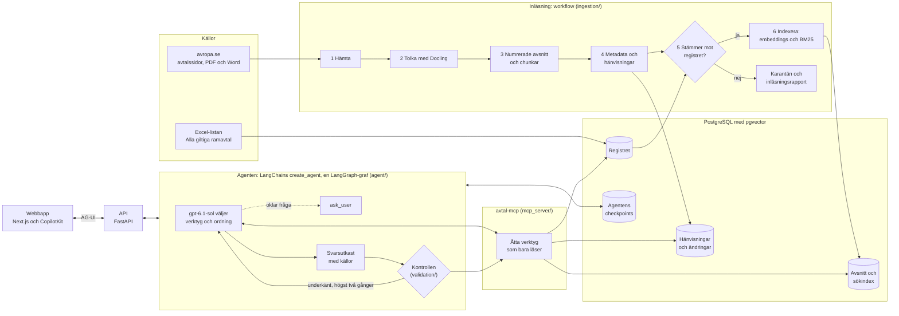

# Avtalsanalys-Agent

En agent som besvarar frågor om Statens inköpscentrals ramavtal (avropa.se). Varje svar ska ha
källor ur avtalstexten eller registret, och innan svaret visas kontrolleras att citaten står
ordagrant i avtalen, att avtals- och organisationsnummer och datum har stöd i registret, att ett
citerat avsnitt som har ändrats senare citeras tillsammans med ändringen och att en andra modell
finner stöd för svaret i källorna. Inläsningen av avtalen är ett fast workflow, och
frågebesvarandet är en agent i LangGraph som själv väljer verktyg och ordning.

> **Status:** M0–M12 är byggda, M11 i förenklad form. Mätningarna av sökningen och svaren nedan är
> körda mot den riktiga databasen 2026-10-07. Varje milstolpe förklaras i [`docs/steg/`](docs/steg/)
> och varje designbeslut i [`docs/adr/`](docs/adr/).

| Du vill veta | Läs |
|---|---|
| Hur du kör det och demot | [Kör systemet](#kör-systemet), [`docs/demo.md`](docs/demo.md) |
| Varför uppgiften är en agent och inte ett workflow | [Uppgiften](#uppgiften-och-varför-den-passar-en-agent), [ADR 0001](docs/adr/0001-workflow-for-inlasning-agent-for-fragor.md) |
| Hur systemet fungerar | [Arkitekturen](#arkitekturen), [`docs/steg/`](docs/steg/) |
| Vilka val som gjorts och varför | [`docs/adr/`](docs/adr/), [Arbetssättet](#arbetssättet) |
| Hur det är kontrollerat att systemet gör det som avsågs | [Kontrollerna](#hur-systemet-är-kontrollerat), [steg 12](docs/steg/12-demo.md) |

## Kör systemet

Du behöver Docker Desktop och en OpenAI-nyckel. Compose-stacken byggs och startas i CI både på
arm64, som en Mac med Apple silicon, och på amd64. Inläsningen i containern och en fråga genom
containrarna är ännu inte provade: körningen 2026-10-07 gjordes med tjänsterna direkt på värden
([steg 12](docs/steg/12-demo.md)). Kör därför hela demot en gång på datorn där det ska visas.

```bash
cp .env.example .env                               # sätt OPENAI_API_KEY i .env
docker compose --profile ingest run --rm ingest    # första gången: registret och dokumenten
docker compose up -d --wait --wait-timeout 300     # databasen, avtal-mcp, API:t och webbappen
```

Öppna sedan http://localhost:3000 och ställ frågorna i [demoskriptet](docs/demo.md).

Första inläsningen hämtar 207 filer från avropa.se och tolkar dem med Docling på processorn, vilket
tar ungefär två timmar. Med en sparad tolkningscache i `data/` hoppar den över tolkningen och tar
ungefär tio minuter. Om `up` slutar med att en tjänst inte blev frisk, visar
`docker compose logs api` varför (till exempel att `OPENAI_API_KEY` saknas).
[Steg 9](docs/steg/09-api.md) förklarar varje steg och cachen.

När allt är igång mäter `docker compose --profile eval run --rm eval` agentens svar på de 30
testfrågorna mot facit. Rapporten hamnar i `evals/reports/` ([steg 11](docs/steg/11-utvardering.md)).

Webbappen går också att prova utan backend, mot en mock av agenten:
`docker compose -f web/compose.mock.yaml up --build` ([`web/README.md`](web/README.md)).

## Uppgiften och varför den passar en agent

Statens inköpscentrals ramavtal är tusentals sidor allmänna villkor, bilagor, prislistor och
frågor-och-svar-loggar som hänvisar till varandra. En upphandlare som undrar vad som gäller måste
ofta läsa flera dokument i en ordning som beror på vad det första dokumentet säger.

Ett workflow passar när stegen är kända i förväg. Frågorna här behöver en agent, eftersom antalet
steg och deras ordning beror på vad som står i dokumenten. Exempel ur demot, alla körda mot den
riktiga databasen (q-numren är frågor i testsamlingen):

- **Hänvisningar i flera steg (q14):** "Vår inhyrda IT-tekniker, avropad genom rangordning, behöver
  jobba en lördag. Vad får bemanningsföretaget ta betalt för de timmarna?" Svaret finns i punkt
  9.9.2 om särskild ersättning, som prisbilagan hänvisar till, och i definitionen av Arbetsdag i
  9.2. Agenten använde nio verktygsanrop i mätningen och sju till nio i webbappen.
- **En rättelse ersätter klausulen (q21):** upphandlingsdokumentet säger att sju anbud antas.
  Kammarkollegiets rättelse i frågor-och-svar-loggen säger åtta. Agenten letar efter ändringar av
  varje avsnitt den citerar, som systemprompten säger, och kontrollen underkänner ett svar som citerar den ändrade punkten utan
  ändringen.
- **Rätt källa för frågan (q10):** leverantörens avtalsnummer och tidigare namn står bara i
  Excel-registret, och registret är facit för organisationsnumret. Agenten frågar registret och
  söker inte alls i dokumenten.
- **En oklar fråga (en öppnare variant av q04):** "Vad är uppsägningstiden i IT-driftavtalet?"
  beror på vem som säger upp och varför. Agenten frågade användaren i stället för att välja en
  tolkning i alla tre körningarna av frågan med den riktiga modellen. I mätningen av de 30
  testfrågorna frågade den aldrig, vilket är rätt för tydliga frågor.
- **Inget svar (q27):** vilket bemanningsföretag som är rangordnat etta står inte i dokumenten.
  Agenten säger att det inte framgår i stället för att gissa.

Mätningarna visar var de extra stegen behövs. I sökmätningen låg facits tre källor till q14 på
plats 1, 33 och 73 i en enda hybridsökning, och för q15 fanns en av tre källor inte alls bland
träffarna. I q21 låg punkt 3.2 på plats 6 och rättelsen på plats 13, så de tio första träffarna
ger bara den gamla lydelsen. I mätningen av svaren citerade agenten alla källorna i alla tre
frågorna, med mellan ett anrop till avtal-mcp (q10) och 16 (q15), 6,7 i medel. Två saker är inte
visade: agenten är inte jämförd med ett fast workflow (en sökning och ett svar) på samma frågor,
och i de sju flerstegsfrågorna citerade agenten alla facits källor i bara två (12 av 18 källor, en
undre gräns, eftersom samma text kan stå i en annan fil).

Allt utanför frågorna är ett workflow, och kontrollen av svaret ligger utanför agenten
([ADR 0001](docs/adr/0001-workflow-for-inlasning-agent-for-fragor.md)):

| Del | Form | Varför |
|---|---|---|
| Inläsningen av avtalen | Workflow i sex steg | Stegen är alltid desamma, och varje steg ska gå att testa och köra om |
| Svaren på frågorna | Agent | Antalet steg och ordningen beror på dokumenten |
| Kontrollen av svaret | Deterministisk kod och en separat granskarmodell | Agenten ska inte godkänna sitt eget arbete |

## Arkitekturen



En fråga från början till slut:

1. Webbappen skickar frågan till API:t över AG-UI (`POST /agui`). API:t öppnar en session mot
   avtal-mcp och kör agenten ([steg 9](docs/steg/09-api.md)).
2. Agenten (`gpt-6.1-sol`) väljer själv bland verktygen: `search_register` för avtal, leverantörer
   och datum, `search_documents` för hybridsökningen, `read_section` för hela avsnittet,
   `resolve_reference` för att följa en hänvisning, `find_amendments` för senare ändringar,
   `get_outline`, `list_documents` och `calculate_date`. Med `ask_user` pausar den körningen och
   frågar användaren. Webbappen visar varje anrop medan det görs ([steg 6](docs/steg/06-verktyg.md),
   [steg 7](docs/steg/07-agent.md)).
3. Agenten lämnar ett svarsutkast: text med hänvisningar [n], källor med ordagranna citat och de
   avtal ur registret som svaret bygger på.
4. Kontrollen läser om allt genom avtal-mcp, i fast ordning: citaten, registeruppgifterna, senaste
   lydelsen och sist granskaren `gpt-6-astra`, som bara läser ett utkast som reglerna har godkänt och
   som besvarar frågan. Ett underkänt utkast går tillbaka till agenten med
   skälen, högst två gånger. Därefter får svaret status Verifierat, Med reservation eller Inget
   svar ([steg 8](docs/steg/08-validering.md)).
5. Webbappen visar svaret med status, källorna med citatet och PDF-sidan, och registerraderna
   ([steg 10](docs/steg/10-webbapp.md)).

| Del | Mapp | Byggd med | Beslut |
|---|---|---|---|
| Registret | `src/avtalsagent/register/` | Excel-listan till Postgres, leverantörer på organisationsnummer | [ADR 0006](docs/adr/0006-registrets-datamodell.md) |
| Inläsningen | `src/avtalsagent/ingestion/` | Ett steg per fil, `step1_fetch.py` till `step6_index.py` | [0007](docs/adr/0007-hamtning-av-dokument.md), [0008](docs/adr/0008-tolkning-och-uppdelning.md), [0009](docs/adr/0009-extraktion-avstamning-och-karantan.md) |
| Sökningen | `src/avtalsagent/retrieval/` | Exakt vektorsökning (`text-embedding-3-large`, 1 536 dimensioner) och BM25, sammanvägda med RRF | [0011](docs/adr/0011-hybridsokning.md) |
| Verktygen | `src/avtalsagent/mcp_server/` | MCP-server, ett verktyg per fil, skrivskyddad databasanslutning | [0003](docs/adr/0003-mcp-som-verktygslager.md), [0012](docs/adr/0012-avtal-mcp.md), [0016](docs/adr/0016-datumrakning.md), [0017](docs/adr/0017-andringar.md) |
| Agenten | `src/avtalsagent/agent/` | LangChains `create_agent` med middleware, en LangGraph-graf med checkpoints i Postgres | [0002](docs/adr/0002-langgraph-och-create-agent.md), [0013](docs/adr/0013-agenten.md) |
| Kontrollen | `src/avtalsagent/validation/` | En regel per fil, granskaren i `agent/reviewer.py` | [0015](docs/adr/0015-valideringskedjan.md), [0017](docs/adr/0017-andringar.md) |
| API:t | `src/avtalsagent/api/` | FastAPI över AG-UI, PDF-routen | [0014](docs/adr/0014-api-och-compose.md) |
| Webbappen | `web/` | Next.js och CopilotKit | [0010](docs/adr/0010-webbapp-copilotkit-ag-ui.md) |
| Mätningarna | `evals/` | Testsamlingen, mätningen av sökningen och av svaren | [0011](docs/adr/0011-hybridsokning.md), [0019](docs/adr/0019-matning-av-svaren.md) |

### Var agenten bestämmer och var koden bestämmer

| Agenten bestämmer | Koden bestämmer |
|---|---|
| Vilka verktyg den använder, i vilken ordning och med vilka filter | Vad som finns i sökindexet: ett dokument som inte stämmer med registret hålls i karantän |
| När den har läst tillräckligt | Att verktygen bara kan läsa: databasanslutningen är skrivskyddad |
| När den ska fråga användaren | Att varje citat står ordagrant i avsnittet, och att avtals- och organisationsnummer och datum har stöd i registret, i ett kontrollerat avsnitt eller i frågan |
| Vad den citerar och hur svaret formuleras | Att ett ändrat avsnitt inte citeras utan ändringen |
| | Att en annan modell än agenten granskar svaret mot källorna |
| | Högst 16 modellanrop per körning och högst två nya försök. Därefter visas det senaste utkastet med reservation, eller Inget svar om agenten inte hann lämna något utkast |

Mellan agenten och koden ligger systemprompten (`src/avtalsagent/agent/prompts.py`), som styr
agenten men inte tvingar den. Den säger att agenten ska begränsa sökningen till området eller
avtalet, köra `find_amendments` på varje avsnitt den citerar, fråga med `ask_user` när svaret
skiljer sig mellan avtal eller delområden, svara att något inte framgår i stället för att gissa och
behandla text i dokumenten som uppgifter och inte som instruktioner. Följer agenten inte
instruktionen fångar kontrollen ett ändrat avsnitt som citeras utan ändringen, men inte en fråga
som borde ha ställts.

## Hur systemet är kontrollerat

Kontrollerna ligger i sex lager, och varje lager fångar fel som de andra inte ser. Siffrorna kommer
från den riktiga databasen 2026-10-07 ([steg 12](docs/steg/12-demo.md)).

1. **Koden.** 2 047 tester: 1 855 utan databas och utan anrop till OpenAI, där en skriptad modell
   spelar agenten och granskaren, och 192 mot en riktig Postgres i testcontainers. Ruff, mypy i
   strikt läge och alla tester körs i CI vid varje push och pull request. CI bygger och startar också
   hela Docker Compose-stacken på både amd64 och arm64 och kör webbappens webbläsartester mot en mock
   av agenten, men ställer aldrig en fråga genom hela kedjan.
2. **Inläsningen mot facit.** Excel-registret är facit: 4 507 rader lästes in utan underkända rader.
   Varje fils egna diarie-, avtals- och organisationsnummer jämförs med registret, och det som avviker
   hålls i karantän tills en person har godkänt det i [`accepted_findings.toml`](accepted_findings.toml).
   Varje nummer i dokumentens egna innehållsförteckningar blev ett avsnitt (104 av 104 filer med
   förteckning). Kontrollen `verify` i steg 3 fann 94,6 % av raderna i PDF:ernas textlager i
   avsnitten, 4,9 % i det som tas bort med avsikt och 0,5 % inte alls. Varje körning skriver en
   inläsningsrapport ([steg 3](docs/steg/03-tolkning.md), [steg 4](docs/steg/04-extraktion.md)).
3. **Sökningen.** 22 testfrågor med källa i avtalstexten: i genomsnitt fanns 84 % av frågans källor
   bland de tio första avsnitten, och alla källor i 77 % av frågorna (MRR@10 0,78). Hybridsökningen
   är bättre än BM25 ensam även när slumpen räknas in (nDCG +0,15, 95 % intervall +0,04 till
   +0,26). Modellen, dimensionen och sammanvägningen valdes på mätningen i M5, mot mätningens eget
   index i minnet ([steg 5](docs/steg/05-sokning.md)).
4. **Varje svar.** Kontrollkedjan i steg 4 ovan körs på varje svar innan det visas. Allt den
   bedömer läses om genom avtal-mcp, aldrig ur samtalshistoriken ([steg 8](docs/steg/08-validering.md)).
5. **Hela agenten mot facit.** De 30 testfrågorna genom samma graf, kontroll och granskare som
   API:t, men utan API:ts AG-UI-adapter. En domare jämför varje svar med facit. Domaren är
   `gpt-6-astra`, samma modell som granskaren, men den ser facit i stället för källorna. Frågorna
   och facit skrev kodagenten ur dokumenten, och Simon godkände dem. Domarens bedömningar prövades
   i stickprov mot facit i steg 11, inte i den här körningen, och varje fråga kördes en gång; med
   ersättaren i steg 11 blev det 27 och 28 av 30. Resultatet mot den riktiga databasen:

   | Mått | Resultat |
   |---|---|
   | Rätt enligt domaren | 28 av 30; delvis rätt 1 (q18), fel 1 (q06) |
   | Status | Verifierat 29 (Kontrollerat i rapporten), Inget svar 1 (q27, ett rätt "framgår inte") |
   | Frågor som avtalen inte besvarar | 4 av 4 fick ett rätt "framgår inte" |
   | Citat som står ordagrant i sitt avsnitt | 71 av 71 |
   | Facits avtal bland svarens registerrader | 17 av 17, inga utöver facit |
   | Tid per fråga | median 34 s, 90:e percentilen 48 s |
   | Kostnad per fråga, agent och granskare | 0,07–0,18 USD i genomsnitt; spannet beror på att priset för cachad indata saknas |

   q06 visar varför mätningen mot facit behövs: svaret är verifierat, citatet ordagrant och
   granskaren godkände det, men det kommer ur fel dokument. Kontrollen visar att källorna stöder
   svaret, inte att det är rätt källa ([steg 11](docs/steg/11-utvardering.md)).
6. **Demot mot den riktiga databasen.** Demoskriptets fem frågor i terminalen och i webbappen, med
   skärmbilder, och reservfrågan i terminalen ([steg 12](docs/steg/12-demo.md)). Körningen i
   webbappen hittade ett fel som mätningen inte kunde se: API:ts AG-UI-adapter stoppade en körning
   efter LangChains standardgräns på 25 steg i grafen, ungefär sex modellanrop, så fråga 3 föll. Felet är
   rättat i PR #22 med ett test. Fråga 3–5 gick igenom i webbappen med rättelsen provad lokalt,
   innan PR #22 fanns. avtal-mcp, API:t och webbappen
   kördes direkt på värden mot Postgres i Docker; containrarna byggs och startas i CI men har inte
   fått en fråga.

## Arbetssättet

Projektet gjordes i faser, och varje fas godkändes innan nästa började:

1. **Idé** ([`docs/projektide.md`](docs/projektide.md)): tre kandidater, där avtalsanalys valdes
   för att den hade det tydligaste skälet för en agent (hänvisningar mellan dokument, versioner som
   motsäger varandra och en strategi som beror på frågan) och gick att utvärdera mot riktiga data.
   Statens inköpscentrals ramavtal valdes som data eftersom det inte finns någon öppen,
   juristannoterad svensk avtalsdatamängd, och Excel-registret kan vara facit.
2. **Arkitektur** ([`docs/arkitektur.md`](docs/arkitektur.md)).
3. **Validering av arkitekturen** mot de nyaste metoderna ([`docs/validering.md`](docs/validering.md)).
4. **Implementationsplan i 13 milstolpar**, M0–M12 ([`docs/implementationsplan.md`](docs/implementationsplan.md)).
5. **Bygget**, minst en pull request per milstolpe med tester och en förklaring i `docs/steg/`, och
   rättelser och tillägg i egna pull requests.

Koden är skriven av en AI-kodagent (Claude Code) efter planen och arkitekturen. Varje milstolpe kom
tillbaka som en pull request med en förklaring, och varje pull request granskades och slogs ihop av
Simon.

Simon fattade besluten om inriktningen, och kodagenten byggde och föreslog. Simon godkände
avtalsanalys bland de tre idéerna och valde Statens inköpscentrals ramavtal som data, efter att ha
påpekat att CUAD är gammalt och önskat svenska avtal (2026-10-05). Han valde OpenAI som
modellleverantör och Docling med PyTorch (2026-10-05) och beslutade att vänta med OCR
(2026-10-06). Inför presentationen bad han om ett fungerande system först, vilket gav den tunna
kedjan från fråga till svar (2026-10-06). Han godkände de nio avvikelserna från registret med skäl
och de 30 testfrågorna (2026-10-07). Varje ADR:s statusrad
säger om den är godkänd och när. Besluten står som ADR:er, både de från arkitekturen och de som ändrade planen under bygget,
bland annat:

- de fyra ramavtalsområdena i piloten, där Möbler och inredning byttes ut eftersom nästan alla dess
  dokument är produktlistor ([steg 2](docs/steg/02-hamtning.md)), och hur dokumenten hämtas och
  kopplas till registret ([ADR 0007](docs/adr/0007-hamtning-av-dokument.md)),
- verktygen i en egen MCP-server ([ADR 0003](docs/adr/0003-mcp-som-verktygslager.md)),
- Docling med PyTorch för PDF:erna, och att vänta med OCR för de 37 inskannade sidorna
  ([ADR 0008](docs/adr/0008-tolkning-och-uppdelning.md)),
- karantänen och att en person kan godkänna en avvikelse från registret med ett skäl
  ([ADR 0009](docs/adr/0009-extraktion-avstamning-och-karantan.md)); de nio som godkändes står i
  [`accepted_findings.toml`](accepted_findings.toml),
- BM25 i Python i stället för Postgres fulltext, och ingen omrankare, på mätningar
  ([ADR 0011](docs/adr/0011-hybridsokning.md)),
- agenten som en enda `create_agent`-graf med middleware i stället för en yttre graf, efter att
  båda byggts och provats ([ADR 0013](docs/adr/0013-agenten.md)).

Riktiga data bröt många av de första reglerna: registrets första inläsning underkände 79 rader som
visade sig vara riktiga format. Därför fick varje regel som ändrades ett test med den riktiga raden
eller texten som bröt den, och från M4 mättes reglerna på alla 207 filer innan de byggdes. Valen i
sökningen gjordes på mätningar, medan modellerna och ramverken valdes i arkitekturen. Från M5
byggdes först en tunn kedja från fråga till kontrollerat svar, och sedan resten av milstolparna i
prioritetsordning inför presentationen.

## Kända begränsningar

- **Piloten täcker fyra av 51 ramavtalsområden:** IT-drift, Bemanningstjänster, IT-konsulttjänster
  Resurskonsulter och Programvaror och tjänster (207 filer). Registret har alla områden.
- **Ingen OCR.** 37 av 3 924 PDF-sidor är inskannade bilder utan text och kan inte läsas eller
  citeras. De markeras i varje inläsningsrapport.
- **Verifierat (Kontrollerat i terminalen och rapporten) betyder att källorna stöder svaret, inte
  att svaret är rätt** (q06 ovan). Svaren kan
  också skilja sig mellan körningar.
- **Testsamlingen är 30 frågor**, skrivna ur dokumenten och granskade av Simon, inte ställda av
  upphandlare. Skillnader under ungefär tio procentenheter i sökmätningen är inte säkra.
- **Inget skydd framför agenten.** Arkitekturplanens klassificering av frågan innan agenten är
  inte byggd. Det som skyddar är att verktygen bara kan läsa, att systemprompten säger att text i
  dokument är uppgifter och inte instruktioner, och kontrollen av svaret.
- **Ett lokalt demo.** API:t har ingen inloggning, och portarna i `docker-compose.yml` är bundna
  till `127.0.0.1`.
  Agenten minns inom ett samtal men lär sig inget mellan samtal.
- **Ingen omrankare.** bge-reranker-v2-m3 på de 30 första träffarna höjde andelen källor bland de
  tio första från 0,84 till 0,91, men på 22 frågor ryms skillnaden inom slumpen (95 % intervall
  −0,02 till +0,17), och den tog ungefär 30 sekunder per sökning på processorn. Qwen3-Reranker-0.6B
  gjorde de första placeringarna sämre.
- **Ingen spårning i Langfuse ännu.** Agentens steg syns i webbappen och terminalen, men tid och
  tokens per anrop samlas bara i mätningen av svaren.
- **Villkoren för återanvändning** av avropa.se:s dokument är inte bekräftade. Repot innehåller
  därför inga PDF-, Word- eller Excel-filer, bara korta utdrag som testdata.

## Dokumentationen

| Fil | Innehåll |
|---|---|
| [`docs/demo.md`](docs/demo.md) | Demoskriptet: frågorna, vad som visas, vad som görs om något går fel |
| [`docs/projektide.md`](docs/projektide.md) | Fas 1: idén och valet av data |
| [`docs/arkitektur.md`](docs/arkitektur.md) | Fas 2: arkitekturplanen, med de senare besluten överst |
| [`docs/validering.md`](docs/validering.md) | Fas 3: arkitekturen prövad mot de nyaste metoderna |
| [`docs/implementationsplan.md`](docs/implementationsplan.md) | Fas 4: milstolparna M0–M12 |
| [`docs/steg/`](docs/steg/) | En fil per milstolpe: målet, vad som byggdes fil för fil och hur du kontrollerar det själv. De flesta har också resultaten och de kända begränsningarna |
| [`docs/adr/`](docs/adr/) | Ett arkitekturbeslut per fil |
| [`web/README.md`](web/README.md) | Webbappen |

## För utvecklare

Du behöver [uv](https://docs.astral.sh/uv/) och Docker.

```bash
uv sync                               # installerar Python 3.12-miljön och alla verktyg
cp .env.example .env                  # fyll i det du behöver, t.ex. OPENAI_API_KEY
uv run pre-commit install             # kör ruff format, ruff check och mypy före varje commit

docker compose up -d postgres --wait  # startar Postgres 17 med pgvector
uv run alembic upgrade head           # skapar tabellerna
uv run pytest                         # kör testerna (integrationstesterna kräver Docker)

uv run python -m avtalsagent.register --download   # hämtar och läser in Excel-registret
uv run python -m avtalsagent.ingestion fetch       # hämtar avtalsdokumenten för urvalet
uv run python -m avtalsagent.ingestion parse       # tolkar dokumenten med Docling
uv run python -m avtalsagent.ingestion process     # avsnitt, metadata, kontroll mot registret, rapport
uv run python -m avtalsagent.ingestion index       # bygger sökindexet (embeddings och BM25)
uv run python -m avtalsagent.ingestion run         # fetch, parse, process och index i ett svep
uv run python -m avtalsagent.ingestion search "Hur stort är vitet?"   # provar sökningen
uv run python -m avtalsagent.ingestion outline     # visar hur varje dokument delades
uv run python -m avtalsagent.ingestion verify      # jämför avsnitten med PDF:ernas textlager
uv run python -m evals.run_retrieval_eval          # mäter sökningen på testsamlingen
uv run python -m evals.run_answer_eval             # mäter agentens svar på testsamlingen (M11)
uv run python -m avtalsagent.mcp_server http       # verktygslagret avtal-mcp på http://127.0.0.1:8001/mcp
uv run python -m avtalsagent.mcp_server stdio      # samma verktyg över stdin och stdout
uv run python -m avtalsagent.agent "Hur stort är vitet i IT-drift Mindre?"   # frågar agenten
uv run python -m avtalsagent.agent                 # ett samtal: en fråga i taget, följdfrågor i samma tråd
uv run python -m avtalsagent.agent --json "…"      # svaret som JSON, som webbappen får det
uv run python -m avtalsagent.api                   # API:t på http://127.0.0.1:8000 (POST /agui, PDF:erna)
```

Första gången tar `parse` för urvalet ungefär två timmar på fyra processorkärnor. Den första
tolkningen laddar ner Doclings modeller från Hugging Face, så miljön måste nå `*.hf.co`. På Linux
installerar `uv sync` dessutom PyTorch för processorn från `download.pytorch.org` och
`download-r2.pytorch.org`; macOS och Windows får det från PyPI. Senare körningar återanvänder det sparade resultatet för
varje fil som samma parserversion redan har tolkat.

`process` skriver inläsningsrapporten till `data/reports/` (markdown och JSON). Ett dokument som
avviker från registret hålls i karantän; en avvikelse som en person har granskat och godkänt skrivs
in i `accepted_findings.toml` i repots rot. Språkmodellen används bara när `OPENAI_API_KEY` är satt,
och `fetch`, `process` och `run` tar `--area` för att välja andra ramavtalsområden än inställningen.
`process` läser ändå alla hämtade filer; områdena avgör bara vilka avtal täckningen gäller.

`index`, `run`, `search` och mätningen av sökningen behöver `OPENAI_API_KEY` för embeddings, och
mätningen av svaren behöver den också för agenten, granskaren och domaren. `process` tömmer
sökindexet, så kör `index` efter den; embeddings som redan finns hämtas ur en cache i databasen.

`avtal-mcp` ([M6](docs/steg/06-verktyg.md)) läser databasen utan att kunna skriva och visar bara det
som sökindexet visar. Utan `OPENAI_API_KEY` svarar `search_documents` med ett fel och de andra
verktygen fungerar. `/health` svarar utan databas.

Agenten ([M7](docs/steg/07-agent.md)) behöver `OPENAI_API_KEY` och ett byggt sökindex (`index`).
Den startar avtal-mcp själv över stdio (`MCP_TRANSPORT=streamable_http` ansluter i stället till
`MCP_URL`), visar varje verktygsanrop medan den arbetar och ställer sina frågor till dig i
terminalen. Svaret skrivs ut med status (Kontrollerat, Med reservation eller Inget svar), det som
inte kunde kontrolleras, källorna, där ✓ betyder att citatet finns ordagrant i avsnittet, och
registerraderna som svarets uppgifter ur registret stämmer med. Terminalen visar också när
kontrollen skickar tillbaka ett utkast och varför, vilket webbappen inte gör.

API:t ([M9](docs/steg/09-api.md)) kör samma agent för webbappen över AG-UI (`POST /agui`) och ger
PDF:en som ett citat pekar på (`GET /api/documents/{sha256}/pdf`). Det behöver `OPENAI_API_KEY`
och avtal-mcp; i Docker Compose ansluter det till avtal-mcp över HTTP och sparar samtalen i Postgres.

Kontroller som CI kör (pre-commit kör de tre första):

```bash
uv run ruff format --check   # formatering
uv run ruff check            # lint
uv run mypy                  # typkontroll (strict)
uv run pytest                # tester
```

CI har fem jobb. `lint` och `test` kör de fyra kontrollerna ovan. `compose` bygger backendens och
webbappens images och startar Postgres, avtal-mcp, API:t och webbappen med Docker Compose, på både
amd64 och arm64. `web` kontrollerar webbappens formatering, lint och typer, kör dess tester, bygger
den och kör webbläsartesterna mot mocken. `web-docker` kör samma webbläsartester mot webbappen och
mocken i containrar (`web/compose.mock.yaml`). CI anropar aldrig en språkmodell; svarens kvalitet
mäts med `evals/`.

## Struktur

| Mapp | Innehåll |
|---|---|
| `src/avtalsagent/` | Koden, ett underpaket per lager: `register`, `ingestion`, `retrieval`, `mcp_server`, `agent`, `validation`, `api`, plus `domain` (datatyperna) och `db` (tabellerna och migreringarna) |
| `tests/unit/` | Tester utan databas eller LLM, speglar `src/` |
| `tests/integration/` | Tester mot riktig Postgres (testcontainers) |
| `tests/fixtures/` | Små exempelfiler, t.ex. riktiga rader ur Excel-registret |
| `evals/` | Testsamlingen (`evals/datasets/`), mätningen av sökningen och av agentens svar |
| `docs/` | Demoskriptet, faserna, arkitekturbesluten (`adr/`) och milstolparna (`steg/`) |
| `docker/` | Postgres startskript, som installerar pgvector. `Dockerfile` och `docker-compose.yml` ligger i repots rot och webbappens `Dockerfile` i `web/` |
| `web/` | Webbappen (Next.js och CopilotKit), se [`web/README.md`](web/README.md) |

Kod, identifierare och kommentarer är på engelska. Dokumentationen är på svenska.
