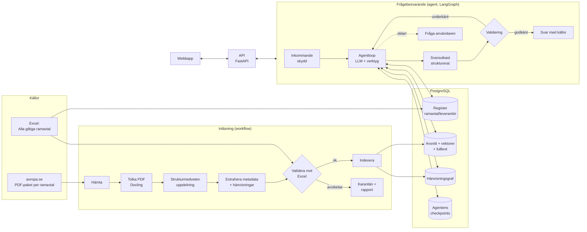
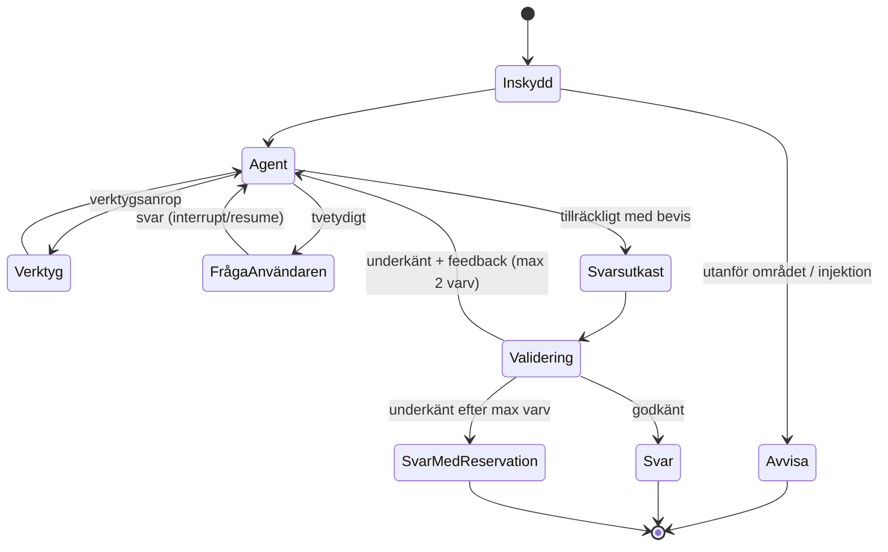
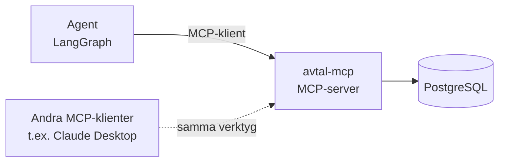

# Fas 2 – Arkitekturplan: Avtalsanalys-agent för statliga ramavtal

*Status: godkänd av Simon 2026-10-05 och uppdaterad efter fas 3 ([validering.md](validering.md)).*

> **Senare beslut:** planen står kvar som den godkändes. Där den skiljer sig från de här besluten
> gäller besluten:
>
> - [ADR 0006](adr/0006-registrets-datamodell.md): registrets tabeller har engelska namn,
>   upphandlingen har inget ramavtalsområde (området hör till delområdet), datumen hör till avtalet
>   i ett delområde och utländska organisationsnummer behålls som de står.
> - [ADR 0007](adr/0007-hamtning-av-dokument.md): dokumentkatalogen är tre tabeller (sidor,
>   dokument och kopplingen mellan dem), och ett dokument har sin URL som nyckel. Urvalet är fyra
>   ramavtalsområden, och Möbler och inredning valdes bort ([M2](steg/02-hamtning.md)).
> - [ADR 0008](adr/0008-tolkning-och-uppdelning.md): Docling körs med PyTorch på processorn, och
>   kontextrubriken byggs i steg 3. Simon beslutade 2026-10-06 att vänta med OCR (M3b). De 37
>   skannade sidorna i fyra filer markeras som att de behöver OCR, och OCR kan läggas till senare
>   bakom gränssnittet `DocumentParser`.
> - [ADR 0009](adr/0009-extraktion-avstamning-och-karantan.md): dokumenttypen sätts med regler
>   (14 typer i tre grupper i stället för fem), och språkmodellen väljer bara rubrik bland ett
>   dokuments egna rubriker. Ett dokument hålls i karantän när dess egen identitet strider mot
>   registret; andra avvikelser rapporteras eller noteras, och en person kan godkänna en
>   avvikelse i `accepted_findings.toml` ([M4](steg/04-extraktion.md)).

---

## 1. Sammanfattning

Systemet låter en användare ställa öppna frågor om Statens inköpscentrals ramavtal
(avropa.se) och får ett svar där **varje påstående har en verifierad källa**.

Arkitekturen har en medveten uppdelning:

| Del | Typ | Varför |
|---|---|---|
| **Inläsning** (hämta, tolka, dela upp, validera mot Excel) | **Workflow** | Stegen är alltid desamma. Förutsägbarhet och spårbarhet är viktigare än frihet. |
| **Frågebesvarande** | **Agent** | Antalet steg, vilka dokument och vilka verktyg beror på frågan och på vad dokumenten säger. |
| **Validering av svaret** | **Deterministisk kod + separat granskare** | Agenten ska inte få godkänna sitt eget arbete. |

Den här uppdelningen är ett av de viktigaste argumenten mot TokenTek: vi använder agent
där det tillför något och workflow där det inte gör det.

---

## 2. Översikt



---

## 3. Datamodell

### 3.1 Registret (från Excel)

*Ersatt av [ADR 0006](adr/0006-registrets-datamodell.md), som beskriver tabellerna som byggdes.*

Excel-listan har en rad per **leverantör × delområde**, inte per avtal. Den normaliseras till:

| Tabell | Nyckel | Innehåll |
|---|---|---|
| `upphandling` | diarienummer, t.ex. `23.3-14537-2023` | ramavtalsområde |
| `leverantor` | organisationsnummer (normaliserat `NNNNNN-NNNN`) | namn, tidigare namn ("f.d. …") |
| `avtal` | avtalsnummer, t.ex. `23.3-14537-2023-001` | upphandling, leverantör, giltig från/till, max förlängning |
| `delomrade` | id | hierarki ur " / "-strängen, t.ex. Bemanningstjänster → IT upp till 1000 h → Stockholm |
| `avtal_delomrade` | avtal + delområde | kopplingstabell |
| `register_version` | datum ur titelraden | vilken version av listan som gäller |

**Normaliseringsregler** (tester skrivs för varje): orgnr trimmas och får bindestreck;
namn matchas aldrig ensamma, alltid via orgnr; avtalsnumret delas i diarienummer + löpnummer.

### 3.2 Dokumenten

*`dokument` och `avsnitt` är ersatta av [ADR 0007](adr/0007-hamtning-av-dokument.md)
(dokumentkatalogen) och [ADR 0008](adr/0008-tolkning-och-uppdelning.md) (avsnitten). Hänvisningarna
läses i M4.*

| Tabell | Innehåll |
|---|---|
| `dokument` | diarienummer, dokumenttyp (huvuddokument, allmänna villkor, bilaga, ändring, avropsvägledning), versionsdatum, käll-URL, filhash |
| `avsnitt` | dokument, avsnittsnummer (t.ex. `12.3`), rubrikstig, sidor, text, embedding, fulltextvektor (svensk) |
| `hanvisning` | från avsnitt → till dokument/avsnitt, typ (`se bilaga`, `ersätter`, `enligt punkt`), upplöst ja/nej |

Hänvisningarna lagras som en **kanttabell i Postgres**, inte i en grafdatabas. Graferna är små
(hundratals noder per ramavtal) och en extra databas skulle bara öka driftkostnaden.

---

## 4. Inläsning (workflow)

Varje steg är en ren funktion med tydlig in- och utdata, så att varje steg kan testas och förklaras.

1. **Hämta.** Läs registret, gruppera på diarienummer, hämta PDF-paketet för varje upphandling.
   Filhash gör att oförändrade dokument hoppas över.
2. **Tolka.** Tolkningen ligger bakom ett utbytbart gränssnitt (`DocumentParser`) med två vägar:
   - **Digitala PDF:er med textlager** (sannolikt merparten av avropa.se-dokumenten, kontrolleras):
     Docling (se fas 3) läser textlagret direkt. Texten blir exakt, vilket citatkontrollen kräver,
     och den behöver ingen GPU.
   - **Skannade sidor utan textlager** (t.ex. undertecknade bilagor): OCR med en vision-språkmodell,
     förslag Baidu Unlimited-OCR (MIT, juni 2026, kan läsa dussintals sidor i ett anrop) (se fas 3).
     Den körs som en separat GPU-tjänst via vLLM med OpenAI-kompatibelt API, så att resten av
     systemet inte kräver GPU.
     *Ersatt: OCR väntar enligt Simons beslut 2026-10-06 (M3b, se
     [ADR 0008](adr/0008-tolkning-och-uppdelning.md)).*
   - Valet görs per sida utifrån om textlager finns. OCR-text märks i metadata så att
     citatkontrollen kan tillåta små teckenavvikelser just där.
   - Excel-avstämningen i steg 5 ger ett objektivt mått på tolkningens kvalitet, så båda vägarna
     kan jämföras med siffror i fas 3.
3. **Dela upp efter struktur.** Uppdelning sker per numrerat avsnitt, inte per fast antal tecken.
   Långa avsnitt delas med föräldra–barn-koppling: små bitar används för sökning, hela avsnittet för läsning.
4. **Extrahera metadata och hänvisningar.** Regex först (avtalsnummer, orgnr, "bilaga \d+",
   "punkt \d+(\.\d+)*"), sedan en billig LLM med strukturerad output för det regex missar.
   Hänvisningar som går att lösa upp kopplas direkt.
5. **Validera mot Excel (facit).**
   - Diarienumret i dokumentet finns i registret.
   - Leverantörer och orgnr som nämns i dokumentet finns på rätt avtal.
   - Giltighetstider i dokumentet stämmer med registret.
   - Varje avtal i registret har minst ett inläst huvuddokument (täckning).
   - Avvikelser hamnar i **karantän** med en rapport. De indexeras inte tyst.
6. **Indexera.** Varje avsnitt får en kontextrubrik (ramavtal › dokument › rubrikstig) innan det indexeras. Embeddings (Qwen3-Embedding som utgångsläge, väljs på svensk testsamling) och svensk fulltext i samma Postgres. Omrankning med Qwen3-Reranker.

**Resultat:** en inläsningsrapport per körning (antal dokument, avsnitt, upplösta hänvisningar,
avvikelser mot Excel). Den rapporten är ett bra granskningsunderlag för TokenTek.

---

## 5. Agenten (LangGraph)

### 5.1 Grafen



- **Agentnoden** byggs med LangChain v1 `create_agent` och middleware (gränser för anrop, human-in-the-loop, sammanfattning av lång kontext). Den är en LLM med verktyg i en loop. Modellen bestämmer själv vilka verktyg den
  anropar, i vilken ordning och när den har tillräckligt med bevis. Det är där friheten finns.
- **Ramar runt friheten:** max antal verktygsanrop, timeout per nod (LangGraph 1.2), max två
  valideringsvarv. Friheten är verklig men begränsad, vilket är det som gör systemet driftsäkert.
- **Parallella delagenter** (LangGraph `Send`) används när frågan gäller många avtal samtidigt,
  t.ex. "jämför ansvarsbegränsningen hos alla leverantörer i IT-drift". Varje delagent läser ett
  avtal i eget kontextfönster och returnerar strukturerade fynd till huvudagenten.
- **Checkpoints i Postgres** gör att en körning överlever omstart, kan pausas för en fråga till
  användaren och kan spelas upp igen vid felsökning.

### 5.2 Agentens tillstånd

| Fält | Innehåll |
|---|---|
| `fraga` | användarens fråga |
| `plan` | agentens egen att-göra-lista, som den själv uppdaterar |
| `bevis` | lista av `{avsnitt_id, citat, dokument, sida}` som samlats |
| `meddelanden` | konversation och verktygsanrop |
| `valideringsfeedback` | vad granskningen underkände, om något |
| `raknare` | verktygsanrop och valideringsvarv |

### 5.3 Verktyg – via MCP

Verktygen ligger i ett **eget verktygslager: en MCP-server** (`avtal-mcp`), byggd med det officiella
MCP Python SDK:t. Agenten är MCP-klient och laddar verktygen via `langchain-mcp-adapters`.
Agenten har alltså inga verktyg i sin egen kod, utan bara det som MCP-servern exponerar.



**Varför ett separat lager:**
- **Tydlig gräns.** Agenten kan bara göra det servern tillåter. Servern har bara läsbehörighet i databasen.
- **Testbart för sig.** Varje verktyg kan testas utan LLM.
- **Återanvändbart.** Samma verktyg kan användas av andra agenter och klienter.
- **Skalar separat.** Servern kan köras i flera instanser oberoende av agenten.

**Transport:** Streamable HTTP mellan containrar i drift och stdio i tester och lokal utveckling.
**Kostnad:** ett extra nätverkssteg per verktygsanrop (millisekunder), vilket är litet jämfört med LLM-anropen.

**Undantag:** `fraga_anvandaren` ligger kvar i grafen och inte i MCP, eftersom den styr grafens flöde
(pausar och återupptar körningen) och inte hämtar data.

Alla verktyg är **läsande**, har Pydantic-validerade argument och returnerar strukturerad data.
Agenten får aldrig skriva fri SQL.

| Verktyg | Gör | Varför agenten behöver det |
|---|---|---|
| `sok_register` | Filtrerad sökning i registret (leverantör, område, giltighet, orgnr) | Exakta fakta om avtal utan att gissa ur text |
| `sok_dokument` | Hybridsökning (vektor + fulltext + omrankning) med filter på avtal/dokumenttyp | Hitta relevanta avsnitt |
| `las_avsnitt` | Läs ett helt avsnitt eller en sida | Läsa i sitt sammanhang, inte bara en bit |
| `folj_hanvisning` | Lös upp "bilaga 3", "punkt 12.3" utifrån hänvisningsgrafen | Flerstegsresonemang |
| `lista_dokument` | Alla dokument i ett ramavtal med typ och versionsdatum | Planera vad som behöver läsas |
| `visa_innehall` | Ett dokuments innehållsförteckning (numrerade avsnitt) | Navigera som en jurist i stället för att bara söka |
| `hitta_andringar` | Ändringsdokument som påverkar ett visst avsnitt | Avgöra vilken lydelse som gäller |
| `berakna_datum` | Deterministisk datumräkning (uppsägningstid, förlängning) | LLM:er räknar dåligt |
| `fraga_anvandaren` *(i grafen, inte MCP)* | Pausar grafen och ställer en fråga (interrupt) | Människa i loopen vid tvetydighet |

### 5.4 Modeller (OpenAI, Simons val 2026-10-05)

- **Agent och svar:** `gpt-6.1-sol` (nära Astras nivå till lägre kostnad). `gpt-6-astra` prövas som agent i utvärderingen.
- **Granskare:** `gpt-6-astra`, alltså en annan och starkare modell än agenten. Den gör bara ett anrop per svar.
- **Metadataextraktion och inskydd:** `gpt-6-luna`.
- Anropas via `langchain-openai`. API-nyckeln läses från miljövariabeln `OPENAI_API_KEY` och finns aldrig i koden.
- Modellnamnen ligger i konfigurationen, så leverantör eller modell kan bytas utan kodändring.

---

## 6. Valideringar och skydd

Valideringen sker i fem lager. Varje lager kan förklaras och testas för sig.

| Lager | Vad | Hur |
|---|---|---|
| 1. Inläsning | PDF:en är rätt inläst | Avstämning mot Excel (avsnitt 4.5) |
| 2. Indata | Frågan är inom området och inte en attack | Snabb klassificering. Dokumenttext märks alltid som data, aldrig som instruktion. |
| 3. Verktyg | Argumenten är giltiga | Pydantic-scheman, endast läsande verktyg, gränser för antal anrop |
| 4. Svar: deterministiskt | Källorna finns | Varje påstående måste ha en källa. Citatet måste finnas i det angivna avsnittet (normaliserad textjämförelse). Registerfakta i svaret (datum, orgnr) jämförs mot registret. Senaste giltiga version måste vara använd när ändringar finns. |
| 5. Svar: granskare | Svaret följer av källorna och besvarar frågan | En separat LLM-granskare med strukturerad bedömning: stöds varje påstående, saknas något väsentligt? |

Om valideringen underkänner svaret går feedbacken tillbaka till agenten. Efter max antal varv
levereras svaret **med tydlig reservation** om vad som inte kunde verifieras, i stället för att
systemet gissar. "Jag hittar inget stöd för det i avtalen" är ett giltigt svar.

### Svarsformat (strukturerad output)

```json
{
  "sammanfattning": "…",
  "pastaenden": [
    {
      "text": "Leverantören får säga upp avtalet med tre månaders varsel.",
      "kallor": [{"avsnitt_id": "…", "dokument": "Allmänna villkor", "punkt": "14.2", "sida": 9, "citat": "…"}]
    }
  ],
  "osakerheter": ["…"],
  "registerfakta_anvanda": ["23.3-14537-2023-001"]
}
```

---

## 7. Tjänster och gränssnitt

- **API:** FastAPI som strömmar via protokollet **AG-UI**, så att användaren ser agentens steg live
  ("söker i Allmänna villkor…", "följer hänvisning till bilaga 3…").
- **Webbapp:** chatt till vänster och källpanel till höger, där ett klick på en källa öppnar
  PDF:en på rätt sida med citatet markerat. Next.js med CopilotKit (AG-UI).
- **Inläsningsjobb:** körs som separat process eller kö, skilt från API:t, så att tung PDF-tolkning
  inte påverkar svarstider.

---

## 8. Observerbarhet och utvärdering

- **Spårning:** varje körning loggas med alla verktygsanrop, tokens, kostnad och latens
  (Langfuse).
- **Utvärdering** med DeepEval i CI, körs automatiskt vid varje ändring:
  - *Svensk testsamling* (50–100 frågor över avropa.se-avtalen med facit och källor), i
    kategorier: enkel uppslagning, registerfråga, flerstegshänvisning, ändring ersätter klausul,
    jämförelse mellan leverantörer, fråga utan svar i avtalen.
  - *LegalBench-RAG mini* för sökprecision på engelska.
  - Mått: träffsäkerhet i sökningen (recall@k), källprecision, svarskorrekthet, andel korrekta
    "vet ej", antal verktygsanrop, kostnad och latens per fråga.

---

## 9. Skalbarhet och drift

- **Tillståndslösa API-instanser.** Allt tillstånd ligger i Postgres (checkpoints), så det går att köra fler instanser bakom en lastbalanserare.
- **En databas (Postgres + pgvector)** räcker för tiotusentals dokument. Om det växer kan vektorsökningen flyttas till en dedikerad vektordatabas bakom samma gränssnitt (se fas 3).
- **Promptcache** för systemprompt och verktygsbeskrivningar sänker kostnad och latens.
- **Docker Compose** lokalt. Samma containrar kan köras i Kubernetes eller en molntjänst.
- **Konfiguration** via miljövariabler och Pydantic Settings. Inga hemligheter i koden.

---

## 10. Säkerhet

- Avtalstexter behandlas som **opålitlig data**. De omsluts och märks i prompten, och agenten har bara läsande verktyg, så en injektion i ett dokument kan inte orsaka skada.
- Registret frågas bara via typade filter, aldrig med fri SQL.
- Begränsningar per användare (antal frågor och tokens).

---

## 11. Validering

Alla teknikval har prövats mot alternativen i [validering.md](validering.md).

---

## 12. Tidig skiss av filstrukturen (detaljeras i fas 4)

```
avtalsagent/
├── src/avtalsagent/
│   ├── config/          # inställningar
│   ├── ingestion/       # workflow: hamta, tolka, dela, extrahera, validera, indexera
│   ├── register/        # Excel → normaliserade tabeller
│   ├── retrieval/       # hybridsökning, omrankning
│   ├── agent/           # graf, tillstånd, noder, promptar
│   ├── mcp_server/      # verktygslagret: MCP-server, ett verktyg per fil
│   ├── validation/      # citat, registerfakta, granskare
│   ├── api/             # FastAPI
│   └── db/              # modeller och migreringar
├── web/                 # webbapp
├── evals/               # testsamling och utvärderingsskript
├── tests/               # enhets- och integrationstester
└── docs/                # arkitektur, beslut (ADR), förklaringar per steg
```
