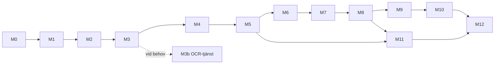

# Fas 4 – Implementationsplan

> Fas 4 så som den godkändes 2026-10-05, inlagd i repot i M12. Bara statusraden, länkarna till
> faserna 2 och 3 och avsnitt 7 (förutsättningarna i utvecklingsmiljön, som är utelämnat) skiljer
> sig från originalet. Planen ändrades under bygget: M5–M12 byggdes i en ny ordning med en tunn
> kedja från fråga till svar först (2026-10-06), sökningen blev BM25 och `text-embedding-3-large`
> utan omrankare ([ADR 0011](adr/0011-hybridsokning.md)), agenten en enda `create_agent`-graf
> ([ADR 0013](adr/0013-agenten.md)) och M11 förenklad ([ADR 0019](adr/0019-matning-av-svaren.md)).
> Skyddet framför agenten, delagenterna med `Send` och OCR-tjänsten är inte byggda, och spårningen i
> Langfuse görs i en egen pull request efter M12. Det som gäller står i [ADR:erna](adr/) och i [`docs/steg/`](steg/).

*Status: godkänd av Simon 2026-10-05. Bygger på [arkitektur.md](arkitektur.md) och [validering.md](validering.md).*

---

## 1. Principer för koden

TokenTek granskar all kod och Simon ska kunna förklara varje steg. Därför gäller:

1. **En modul gör en sak.** Ett verktyg per fil, ett inläsningssteg per fil, en valideringsregel per fil.
2. **Varje modul börjar med en docstring i tre delar:** *Vad* den gör, *Varför* den finns och *Hur* den hänger ihop med resten.
3. **Ren kärna, tunna kanter.** Logik i rena funktioner som går att testa utan databas eller LLM. Databas, nätverk och LLM ligger i tydligt avgränsade adaptrar.
4. **Typer överallt.** Pydantic-modeller för all data som går mellan lager. Typkontroll i CI.
5. **Ingen magi.** Inga dynamiska importer eller dolda register. Grafen, verktygen och promptarna går att läsa uppifrån och ner.
6. **Varje milstolpe är en egen pull request** med en förklaring i `docs/steg/NN-namn.md`: vad som byggdes, varför och hur det testas.
7. **Språk:** kod, identifierare och kommentarer på engelska (branschstandard och det TokenTek förväntar sig). Dokumentation och förklaringar på svenska. Domänord som saknar bra översättning behålls på svenska i data, t.ex. `ramavtalsomrade`.

### Verktygsnamn (svenska i planen → engelska i koden)

| Plan | Kod (MCP-verktyg) |
|---|---|
| `sok_register` | `search_register` |
| `sok_dokument` | `search_documents` |
| `las_avsnitt` | `read_section` |
| `visa_innehall` | `get_outline` |
| `folj_hanvisning` | `resolve_reference` |
| `lista_dokument` | `list_documents` |
| `hitta_andringar` | `find_amendments` |
| `berakna_datum` | `calculate_date` |
| `fraga_anvandaren` (i grafen) | `ask_user` |

---

## 2. Teknisk stack

| Del | Val |
|---|---|
| Språk och paket | Python 3.12, `uv` (pakethantering och låsfil) |
| Kodkvalitet | `ruff` (lint och format), `mypy --strict`, `pre-commit` |
| Test | `pytest`, `pytest-asyncio`, `testcontainers` (riktig Postgres i tester) |
| Databas | PostgreSQL 17 + pgvector, SQLAlchemy 2 + Alembic (migreringar) |
| Inläsning | `httpx`, `openpyxl`, Docling |
| Sökning | pgvector + Postgres fulltext (`swedish`), Qwen3-Embedding, Qwen3-Reranker (via `sentence-transformers`) |
| Verktygslager | MCP Python SDK (`avtal-mcp`), Streamable HTTP |
| Agent | LangGraph 1.2, LangChain v1 `create_agent` + middleware, `langchain-mcp-adapters`, `langchain-openai` |
| Modeller | `gpt-6.1-sol` (agent), `gpt-6-astra` (granskare), `gpt-6-luna` (extraktion och inskydd) |
| API | FastAPI + AG-UI |
| Webbapp | Next.js (TypeScript), CopilotKit, PDF-visning med `react-pdf` |
| Spårning | Langfuse (OpenTelemetry) |
| Utvärdering | DeepEval + egna mått |
| Drift | Docker Compose lokalt, GitHub Actions för CI |

---

## 3. Filstruktur

```
avtalsagent/
├── README.md                     # Starta systemet på 5 minuter + översikt
├── pyproject.toml                # Beroenden och verktygsinställningar
├── uv.lock
├── docker-compose.yml            # postgres, mcp-server, api, web, (ocr)
├── .env.example                  # Alla miljövariabler, utan värden
├── .github/workflows/ci.yml      # lint, typer, tester, utvärdering
│
├── docs/
│   ├── arkitektur.md             # Fas 2, uppdaterad
│   ├── validering.md             # Fas 3
│   ├── adr/                      # Ett beslut per fil (Architecture Decision Records)
│   │   ├── 0001-workflow-for-inlasning-agent-for-fragor.md
│   │   ├── 0002-langgraph-och-create-agent.md
│   │   ├── 0003-mcp-som-verktygslager.md
│   │   ├── 0004-postgres-som-enda-databas.md
│   │   └── 0005-openai-som-modellleverantor.md
│   └── steg/                     # En förklaring per milstolpe (M0–M12)
│
├── src/avtalsagent/
│   ├── config.py                 # Alla inställningar (Pydantic Settings)
│   │
│   ├── domain/                   # Rena datamodeller, inga beroenden
│   │   ├── register.py           # Agreement, Supplier, SubArea, Procurement
│   │   ├── documents.py          # Document, Section, Reference
│   │   ├── evidence.py           # Citation, Claim, Answer
│   │   └── identifiers.py        # Normalisering av orgnr, avtalsnummer, diarienummer
│   │
│   ├── db/
│   │   ├── models.py             # SQLAlchemy-tabeller
│   │   ├── session.py
│   │   └── migrations/           # Alembic
│   │
│   ├── register/                 # Excel → registertabeller
│   │   ├── read_excel.py         # Läser filen, hoppar över titelraden, tar ut versionsdatum
│   │   ├── normalize.py          # Rad → domänobjekt
│   │   └── load.py               # Skriver till databasen (idempotent)
│   │
│   ├── ingestion/                # Workflowet, ett steg per fil
│   │   ├── pipeline.py           # Kör stegen i ordning, loggar varje steg
│   │   ├── step1_fetch.py        # Hämtar PDF-paket från avropa.se
│   │   ├── step2_parse.py        # Väljer textlager eller OCR per sida
│   │   ├── step3_chunk.py        # Delar upp per numrerat avsnitt + kontextrubrik
│   │   ├── step4_extract.py      # Metadata och hänvisningar (regex först, sedan LLM)
│   │   ├── step5_validate.py     # Avstämning mot registret, karantän
│   │   ├── step6_index.py        # Embeddings + fulltext
│   │   ├── parsers/
│   │   │   ├── base.py           # DocumentParser-gränssnittet
│   │   │   ├── docling_parser.py
│   │   │   └── ocr_parser.py     # Klient mot OCR-tjänsten (vLLM, OpenAI-kompatibel)
│   │   └── report.py             # Inläsningsrapporten
│   │
│   ├── retrieval/
│   │   ├── embedder.py
│   │   ├── hybrid_search.py      # Vektor + fulltext, sammanslaget med RRF
│   │   └── reranker.py
│   │
│   ├── mcp_server/               # Verktygslagret
│   │   ├── server.py             # Registrerar verktygen, startar servern
│   │   └── tools/                # Ett verktyg per fil
│   │       ├── search_register.py
│   │       ├── search_documents.py
│   │       ├── read_section.py
│   │       ├── get_outline.py
│   │       ├── resolve_reference.py
│   │       ├── list_documents.py
│   │       ├── find_amendments.py
│   │       └── calculate_date.py
│   │
│   ├── agent/
│   │   ├── graph.py              # Hela grafen på ett ställe, läsbar uppifrån och ner
│   │   ├── state.py              # AgentState
│   │   ├── models.py             # Vilken LLM i vilken roll (från config)
│   │   ├── mcp_client.py         # Ansluter till avtal-mcp och laddar verktygen
│   │   ├── nodes/
│   │   │   ├── input_guard.py
│   │   │   ├── research_agent.py # create_agent + middleware
│   │   │   ├── draft_answer.py   # Strukturerat svar
│   │   │   ├── validate.py       # Kör valideringskedjan
│   │   │   └── finalize.py       # Svar eller svar med reservation
│   │   ├── subagents/
│   │   │   └── per_agreement.py  # Parallell läsning med Send
│   │   └── prompts/              # Promptar som egna textfiler, versionerade
│   │       ├── research_agent.md
│   │       ├── reviewer.md
│   │       └── input_guard.md
│   │
│   ├── validation/               # En regel per fil
│   │   ├── citation_exists.py    # Citatet finns i angivet avsnitt
│   │   ├── claims_have_sources.py
│   │   ├── register_facts.py     # Datum och orgnr i svaret stämmer med registret
│   │   ├── latest_version.py     # Senaste giltiga lydelse används
│   │   ├── llm_reviewer.py       # Granskaren (gpt-6-astra)
│   │   └── chain.py              # Kör reglerna i ordning, samlar feedback
│   │
│   ├── api/
│   │   ├── app.py                # FastAPI
│   │   ├── agui.py               # AG-UI-endpoint
│   │   └── documents.py          # Serverar PDF:er till källpanelen
│   │
│   └── observability/
│       └── tracing.py            # Langfuse
│
├── web/                          # Next.js + CopilotKit
│   └── src/
│       ├── app/
│       └── components/
│           ├── Chat.tsx
│           ├── AgentSteps.tsx    # Visar agentens steg live
│           ├── SourcePanel.tsx   # Citat + PDF på rätt sida
│           └── ClarifyDialog.tsx # När agenten frågar användaren
│
├── evals/
│   ├── datasets/
│   │   ├── gold_sv.jsonl         # Svensk testsamling med facit och källor
│   │   └── legalbench_rag_mini/  # Hämtas med skript, checkas inte in
│   ├── metrics.py                # recall@k, källprecision, korrekt "vet ej", kostnad
│   ├── run_retrieval_eval.py
│   ├── run_agent_eval.py
│   └── reports/                  # Resultat per körning
│
├── scripts/
│   ├── ingest.py                 # python -m scripts.ingest --area "IT-drift"
│   └── download_legalbench.py
│
└── tests/
    ├── unit/                     # Speglar src/, ingen databas eller LLM
    ├── integration/              # Riktig Postgres via testcontainers
    └── fixtures/                 # Små exempel-PDF:er och Excel-utdrag
```

---

## 4. Milstolpar

Varje milstolpe är en pull request med kod, tester och en förklaring i `docs/steg/`. Ordningen är vald så att **mätning finns tidigt** (M5): senare val görs på siffror och inte på känsla.

### M0 – Grund
- Repo, `pyproject.toml`, `uv`, ruff, mypy, pre-commit, CI, Docker Compose med Postgres + pgvector, `config.py`, `.env.example`.
- ADR 0001–0005.
- **Klart när:** `uv run pytest` och CI är gröna på ett tomt skelett, och `docker compose up postgres` startar.

### M1 – Registret (Excel)
- `register/` + `domain/identifiers.py` + tabeller och migrering.
- Hoppa över titelraden, ta ut versionsdatum, normalisera orgnr, dela avtalsnummer, bygg delområdeshierarkin.
- **Klart när:** hela Excel-filen (~4 500 rader) läses in. Tester täcker varje normaliseringsregel med riktiga exempelrader, till exempel `5563372381      ` → `556337-2381` och att ett orgnr kan ha flera leverantörsnamn.

### M2 – Hämtning från avropa.se
- `step1_fetch.py`: hitta PDF-paket per diarienummer, ladda ner, filhash, hoppa över oförändrade filer.
- Första urval: **3–5 ramavtalsområden** (t.ex. IT-drift, Bemanningstjänster, Möbler och inredning), så att hela kedjan fungerar innan vi skalar upp.
- **Klart när:** urvalet ligger lokalt med metadata, och en omkörning hämtar ingenting nytt.

### M3 – Tolkning och uppdelning
- `parsers/docling_parser.py`, `step2_parse.py` (textlager eller OCR per sida), `step3_chunk.py` (per numrerat avsnitt, föräldra–barn, kontextrubrik).
- Kontroll av hur stor andel av sidorna som saknar textlager. Bara om andelen är betydande byggs OCR-tjänsten (M3b) och modellerna jämförs.
- **Klart när:** varje dokument i urvalet har en korrekt innehållsförteckning och avsnittsnumren stämmer vid stickprov. Det finns tester med fixtur-PDF:er.

### M4 – Extraktion och avstämning mot Excel
- `step4_extract.py` (regex för avtalsnummer, orgnr och hänvisningar, sedan `gpt-6-luna` för resten), `step5_validate.py`, `report.py`.
- **Klart när:** inläsningsrapporten visar täckning och avvikelser, avvikande dokument ligger i karantän och andelen upplösta hänvisningar är mätt.

### M5 – Sökning och första mätning
- `step6_index.py`, `retrieval/`.
- **Svensk testsamling, version 1:** 30 frågor med facit och källor över urvalet, i kategorierna från arkitekturplanen. Simon granskar frågorna.
- Jämförelse av embeddings (Qwen3, BGE-M3, `text-embedding-3-large`) och omrankning på recall@k.
- **Klart när:** sökningens baslinje är mätt, valet av embedding och omrankare är gjort på siffror och dokumenterat i en ADR.

### M6 – Verktygslagret (`avtal-mcp`)
- Alla åtta verktyg, ett per fil, med Pydantic-scheman och läsbehörighet i databasen.
- **Klart när:** varje verktyg har enhetstester, servern startar i Docker Compose och verktygen går att anropa från MCP Inspector.

### M7 – Agenten
- `agent/graph.py`, `state.py`, `mcp_client.py`, noderna. Agentnoden med `create_agent` och middleware för gränser på modell- och verktygsanrop, human-in-the-loop (`ask_user`) och sammanfattning. De exakta middleware-namnen verifieras mot LangChains dokumentation när milstolpen påbörjas.
- Checkpoints i Postgres. Delagenter med `Send` för jämförelsefrågor.
- **Klart när:** agenten besvarar testsamlingens frågor från kommandoraden, en körning kan pausas för en fråga och återupptas, och varje körning syns i Langfuse.

### M8 – Validering
- `validation/`, med en regel per fil och `chain.py`. Återkoppling till agenten, max två varv, sedan svar med reservation.
- **Klart när:** varje regel har tester med både godkända och underkända exempel, och ett medvetet felaktigt svar (fel citat, fel datum) stoppas.

### M9 – API
- FastAPI med AG-UI-endpoint, PDF-endpoint och begränsning per användare.
- **Klart när:** en AG-UI-klient kan ställa en fråga och ta emot agentens steg och svaret strömmande.

### M10 – Webbapp
- Next.js + CopilotKit: chatt, agentens steg live, källpanel med PDF på rätt sida och markerat citat, dialog när agenten frågar.
- **Klart när:** hela flödet fungerar i webbläsaren, inklusive en fråga som kräver förtydligande.

### M11 – Utvärdering
- Testsamlingen utökas till 60–100 frågor. DeepEval i CI. LegalBench-RAG mini. Jämförelse `gpt-6.1-sol` mot `gpt-6-astra` som agent (kvalitet, kostnad, latens).
- **Klart när:** en utvärderingsrapport finns i `evals/reports/` och CI stoppar en ändring som sänker kvaliteten under en satt nivå.

### M12 – Färdigställande
- Hela stacken i Docker Compose, README, en genomgång av arkitekturen för presentation, demoskript med 5 frågor som visar agentens styrkor.
- **Klart när:** en ny utvecklare kan starta allt med `docker compose up` och köra demot.

---

## 5. Beroenden mellan milstolparna



---

## 6. Test och kvalitet

| Nivå | Vad | När |
|---|---|---|
| Enhetstester | Ren logik: normalisering, uppdelning, regex, valideringsregler, verktyg | Varje commit |
| Integrationstester | Mot riktig Postgres (testcontainers): inläsning, sökning, MCP-server | Varje PR |
| Agenttester | Graf med en fejkad LLM som ger förutbestämda svar, för att testa flödet utan kostnad | Varje PR |
| Utvärdering | Riktiga modeller på testsamlingen | PR mot `main` och manuellt |

Mål: hög täckning på `domain/`, `register/`, `ingestion/`, `validation/` och `mcp_server/`. Täckningsgrad i procent jagas inte på kod som bara kopplar ihop delar.

