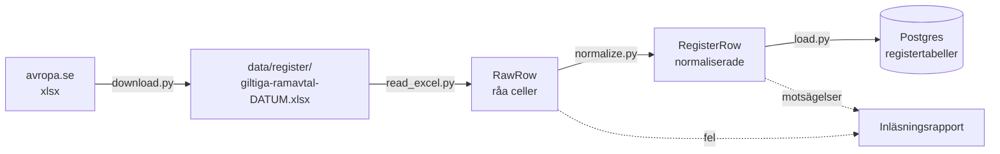
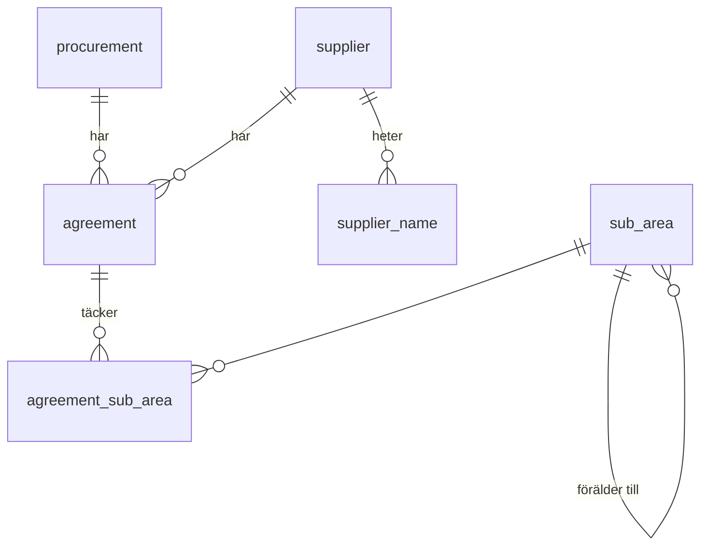

# M1 – Registret (Excel)

**Mål:** Excel-listan "Alla giltiga ramavtal" från avropa.se ska finnas i Postgres som normaliserade
tabeller. Registret är facit: agenten svarar på datum- och leverantörsfrågor ur det, och i M4
stäms varje PDF av mot det.

**Klart när:** hela Excel-filen (ca 4 500 rader) läses in, och tester täcker varje
normaliseringsregel med riktiga exempelrader.

> **Läge:** koden och testerna är klara och testade på 18 riktiga rader från listan
> (2026-10-05). Inläsningen av hela filen återstår, eftersom molnmiljön ännu inte når
> www.avropa.se. Resultatet läggs till här när den är gjord.

---

## Flödet



Ett steg per fil, i den ordningen. Hela kedjan körs med ett kommando:

```bash
uv run alembic upgrade head                       # skapar tabellerna
uv run python -m avtalsagent.register --download  # hämtar från avropa.se och läser in
uv run python -m avtalsagent.register --file sökväg/till/fil.xlsx   # eller en fil på disk
```

## Vad som byggdes, fil för fil

### 1. `domain/identifiers.py` – normaliseringsreglerna

Rena funktioner utan beroenden. Varje regel har egna tester i `tests/unit/domain/test_identifiers.py`.

| Regel | Exempel | Varför |
|---|---|---|
| Orgnr får bindestreck, mellanslag tas bort, exakt 10 siffror krävs | `5563372381      ` → `556337-2381` | Excel och PDF skriver olika. Matchning sker alltid på orgnr. |
| Avtalsnumret delas i diarienummer och löpnummer | `23.3-14537-2023-001` → `23.3-14537-2023` + `001` | Diarienumret är upphandlingen och finns i avropa.se:s PDF-sökvägar. |
| Tidigare namn bryts ut | `AB HOLMRIS B8 (f.d. Addentity Interiör AB)` → namn + tidigare namn | Samma leverantör ska kunna hittas under båda namnen. |
| Delområdet delas på ` / ` | `Gävleborgs län / Gävle / Gävle zon 1 - Longstay` → 3 nivåer | Ger en hierarki. Bindestreck inne i en nivå är inte en avgränsare. |

En ogiltig identifierare ger `IdentifierError` med ett meddelande som säger vad som var fel.

### 2. `domain/register.py` – en normaliserad rad

`RegisterRow` är en rad ur listan efter normalisering, med Excel-radnumret kvar så att varje
fel kan spåras tillbaka till filen. Radnyckeln är avtalsnummer + orgnr + delområde.

### 3. `register/download.py` – hämta filen

Ett HTTP-anrop med httpx. Svaret kontrolleras (en xlsx-fil börjar alltid med zip-signaturen
`PK`), så att en felsida aldrig sparas som Excel. Filen skrivs först till ett tillfälligt namn
och byter sedan namn, så att ett avbrott aldrig lämnar en halv fil. Testerna använder en fejkad
server och behöver inget nätverk.

### 4. `register/read_excel.py` – läsa filens layout

- Rad 1 är en titel, t.ex. "Giltiga ramavtal 2026-10-05". Datumet blir listans version.
- Rad 2 måste ha exakt de åtta förväntade rubrikerna. Annars stoppar inläsningen med ett tydligt
  fel, eftersom en ändrad layout annars kan ge fel data utan att någon märker det.
- Övriga rader läses som de är, utan tolkning. Tomma rader hoppas över.

### 5. `register/normalize.py` – tolka raderna

- Varje rad blir en `RegisterRow`, eller ett **fynd** med radnummer och orsak. En felaktig rad
  stoppar inte inläsningen men försvinner inte heller tyst.
- Datum godtas både som Excel-datum och som text (`2026-07-01`). "Max förl. till" får vara tomt.
- `find_conflicts` hittar rader som motsäger varandra: samma avtal med olika orgnr eller datum,
  eller samma upphandling i två ramavtalsområden.

### 6. `db/models.py` och migreringen – tabellerna



| Tabell | Nyckel | Innehåll |
|---|---|---|
| `register_version` | listans datum | titel, när den lästes in, antal rader och felaktiga rader |
| `procurement` | diarienummer | ramavtalsområde |
| `supplier` | orgnr | – |
| `supplier_name` | orgnr + namn | tidigare namn |
| `agreement` | avtalsnummer | upphandling, leverantör, giltig från/till, max förlängning |
| `sub_area` | id | ramavtalsområde, hela sökvägen, namn, nivå, förälder |
| `agreement_sub_area` | avtal + delområde | en rad per Excel-rad |

Tabellerna skapas med Alembic (`uv run alembic upgrade head`). Migreringen är genererad från
modellerna och granskad för hand. Varför modellen ser ut så här står i
[ADR 0006](../adr/0006-registrets-datamodell.md).

### 7. `register/load.py` – skriva till databasen

1. `build_tables` grupperar raderna till en lista per tabell. Det är en ren funktion som testas
   utan databas. Exempel ur testfilen: 18 Excel-rader blir 9 avtal, eftersom A Hub Group har 8
   rader för samma avtal.
2. `load_register` tar bort de gamla raderna (barn före föräldrar) och skriver in de nya
   (föräldrar före barn) i **en transaktion**. Samma fil två gånger ger samma tabeller, och en
   misslyckad inläsning lämnar den förra utgåvan orörd.
3. Inläsningen loggas i `register_version` och en rapport skrivs ut med antal per tabell,
   felaktiga rader och motsägelser.

### 8. `register/__main__.py` – kommandot

Kör kedjan nedladdning → läsning → normalisering → inläsning och skriver ut rapporten.

## Tester

| Fil | Vad den visar |
|---|---|
| `tests/unit/domain/test_identifiers.py` | Varje normaliseringsregel, med godkända och underkända värden |
| `tests/unit/register/test_read_excel.py` | Titelrad, rubrikkontroll, radnummer, tomma rader |
| `tests/unit/register/test_normalize.py` | Normalisering, datumformat, felaktiga rader, motsägelser, ett orgnr med flera namn |
| `tests/unit/register/test_load_tables.py` | Grupperingen till tabeller och delområdeshierarkin |
| `tests/unit/register/test_download.py` | Nedladdning, felsida i stället för xlsx, HTTP-fel |
| `tests/integration/test_register_load.py` | Migrering och inläsning mot riktig Postgres, och att två inläsningar ger samma resultat |

Testdatan i `tests/fixtures/register_sample.tsv` är 18 riktiga rader ur listan från 2026-10-05.
Den ligger som text så att den går att läsa i granskningen. Testerna gör om den till en
xlsx-fil med samma layout som originalet.

Integrationstestet startar en egen Postgres-container med testcontainers och kräver Docker.
CI kör det i jobbet `test`.

## Så verifierar du M1 själv

```bash
uv run pytest                                   # alla tester, inklusive integrationstestet
docker compose up -d postgres --wait
uv run alembic upgrade head
uv run python -m avtalsagent.register --download
docker compose exec postgres psql -U avtalsagent -c "SELECT count(*) FROM agreement"
```
