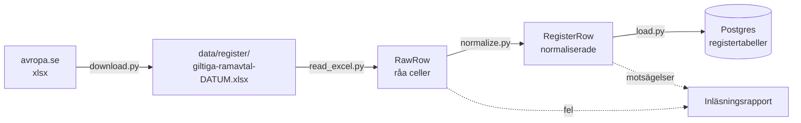
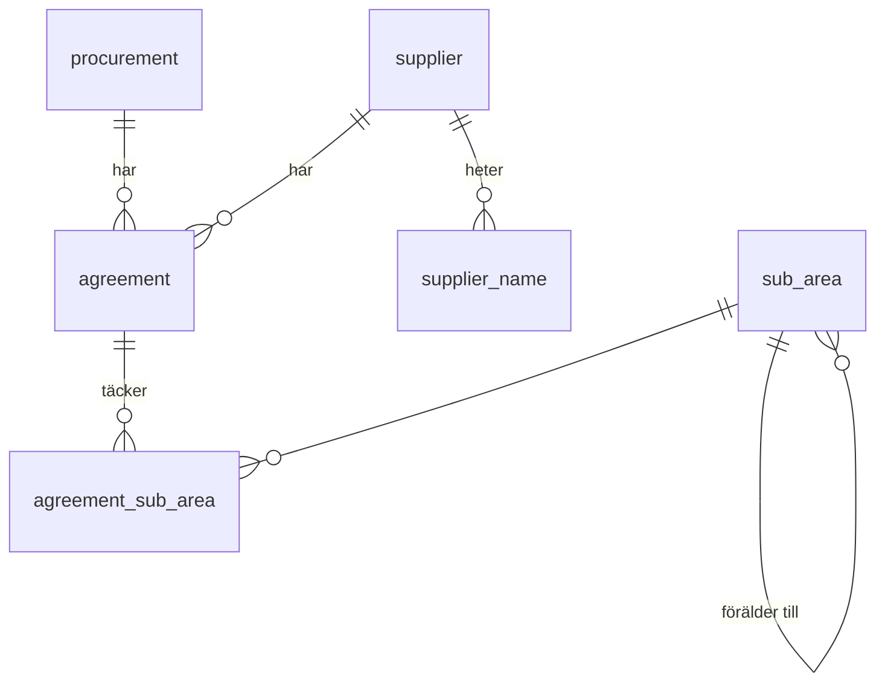

# M1 – Registret (Excel)

**Mål:** Excel-listan "Alla giltiga ramavtal" från avropa.se ska finnas i Postgres som normaliserade
tabeller. Registret är facit: agenten svarar på datum- och leverantörsfrågor ur det, och i M4
stäms varje PDF av mot det.

**Klart när:** hela Excel-filen (4 507 rader) läses in, och tester täcker varje
normaliseringsregel med riktiga exempelrader.

> **Läge (2026-10-05):** klart. Hela listan hämtades direkt från avropa.se och lästes in.

## Resultat på hela listan

Listan "Giltiga ramavtal 2026-10-05", hämtad med `--download`:

| | Antal |
|---|---|
| Excel-rader | 4 507 |
| Inlästa rader | 4 507 |
| Avtal | 2 361 |
| Leverantörer (orgnr) | 802, varav 6 utländska |
| Leverantörsnamn | 1 098 |
| Upphandlingar (diarienummer) | 79 |
| Ramavtalsområden | 51 |
| Delområden (noder i hierarkin) | 3 311 |
| Underkända rader | 0 |
| Motsägelser | 0 |

Listan ändras när avtal löper ut, tillkommer eller byter leverantör. Listan från 2026-10-07 har
samma 4 507 rader och 2 361 avtal, men 797 leverantörer (varav 6 utländska) i stället för 802.

### Vad den riktiga filen lärde oss

Första körningen, med reglerna som byggts på de 18 exempelraderna, underkände 79 rader och
rapporterade 27 motsägelser. Alla visade sig vara riktiga format i listan, inte fel i den.
Reglerna ändrades därför, var och en med ett test som använder den riktiga raden:

| Fynd | Exempel (Excel-rad) | Ändring |
|---|---|---|
| Utländska leverantörer har inte svenskt orgnr | `FI01148912` Martela Oyj (2358), `CVR:37120928` Stibo Complete (3994), `965920358` Norwegian Air Shuttle (2485), `FC16134` EBSCO (994) | Utländska nummer behålls som de står. De listas i rapporten så att ett felskrivet svenskt nummer inte slinker igenom. |
| Äldre avtalsnummer med kolon och tvåsiffrigt år | `23.3-2965-20:001` AB Svenska Pass (24) | Godkänns: diarienummer `23.3-2965-20`, löpnummer `001`. |
| Bokstavsvariant av ett avtal | `23.3-4613-2023-003-A` Azets (325) | Löpnummer `003-A`. |
| Avtal med bara diarienummer | `23.5-3718-2024` Microsoft (2380), `6765/05` IBM (2015) | Diarienumret är hela numret, löpnummer saknas. |
| Samma avtal har olika datum i olika delområden | `23.3-14537-2023-004` Bemannia börjar 2025-04-03 i ett delområde och 2025-04-22 i ett annat (334, 341) | Datumen flyttades från avtalet till kopplingen avtal–delområde. 8 avtal har sådana skillnader. |
| En upphandling spänner över två ramavtalsområden | `23.3-2965-20` i två "Identifiering och behörighet"-områden | Ramavtalsområdet togs bort från upphandlingen. Det nås via delområdet. |

Ett fynd att känna till: rad 3926 har avtalsnumret `23.3-1200020-20:005` (Språkpoolen).
Samma leverantör har avtal `23.3-12000-2020-005` i samma område, så det är troligen ett
skrivfel i listan. Numret följer ett giltigt format och läses in som det står, som en egen
upphandling. Koden rättar inte data på egen hand.

---

## Flödet



Ett steg per fil, i den ordningen. Hela kedjan körs med ett kommando:

```bash
uv run alembic upgrade head                       # skapar tabellerna
uv run python -m avtalsagent.register --download  # hämtar från avropa.se och läser in
uv run python -m avtalsagent.register --file sökväg/till/fil.xlsx   # eller en fil på disk
```

## Vad som byggdes, fil för fil

### 1. `domain/identifiers.py` – normaliseringsreglerna

Rena funktioner utan beroenden. Varje regel har egna tester i `tests/unit/domain/test_identifiers.py`.

| Regel | Exempel | Varför |
|---|---|---|
| Svenskt orgnr (10 siffror) får bindestreck, mellanslag tas bort | `5563372381      ` → `556337-2381` | Excel och PDF skriver olika. Matchning sker alltid på orgnr. |
| Utländskt orgnr behålls som det står, utan mellanslag | `FI01148912      ` → `FI01148912` | Varje land har sitt format. Annat än svenskt eller känt utländskt format underkänns. |
| Avtalsnumret delas i diarienummer och löpnummer | `23.3-14537-2023-001` → `23.3-14537-2023` + `001`, `23.3-2965-20:001` → `23.3-2965-20` + `001` | Diarienumret är upphandlingen och finns i avropa.se:s PDF-sökvägar. Fyra format finns i listan, se tabellen ovan. |
| Tidigare namn bryts ut | `AB HOLMRIS B8 (f.d. Addentity Interiör AB)` → namn + tidigare namn | Samma leverantör ska kunna hittas under båda namnen. |
| Delområdet delas på ` / ` | `Gävleborgs län / Gävle / Gävle zon 1 - Longstay` → 3 nivåer | Ger en hierarki. Bindestreck inne i en nivå är inte en avgränsare. |

En ogiltig identifierare ger `IdentifierError` med ett meddelande som säger vad som var fel.

### 2. `domain/register.py` – en normaliserad rad

`RegisterRow` är en rad ur listan efter normalisering, med Excel-radnumret kvar så att varje
fel kan spåras tillbaka till filen. Radnyckeln är avtalsnummer + orgnr + ramavtalsområde +
delområde, eftersom delområdena är en hierarki per ramavtalsområde och samma delområde kan finnas i
flera områden. "Gävleborgs län" finns i Hotelltjänster, Hotelltjänster Longstay och Konferenser
och möten.

Planens domäntyper `Agreement`, `Supplier`, `SubArea` och `Procurement` finns som
databastabeller i `db/models.py`. Registret läses i dag med frågor mot dem, och typade
läsmodeller för dem kommer när M4 och M6 behöver dem.

### 3. `register/download.py` – hämta filen

Ett HTTP-anrop med httpx. Svaret kontrolleras (en xlsx-fil börjar alltid med zip-signaturen
`PK`), så att en felsida aldrig sparas som Excel. Filen skrivs först till ett tillfälligt namn
och byter sedan namn, så att ett avbrott aldrig lämnar en halv fil. Testerna använder en fejkad
server och behöver inget nätverk.

### 4. `register/read_excel.py` – läsa filens layout

- Rad 1 är en titel, t.ex. "Giltiga ramavtal 2026-10-05". Datumet blir listans version.
- Rad 2 måste ha exakt de åtta förväntade rubrikerna. Annars stoppar inläsningen med ett tydligt
  fel, eftersom en ändrad layout annars kan ge fel data utan att någon märker det.
- Övriga rader läses som de är, utan tolkning. Tomma rader hoppas över.

### 5. `register/normalize.py` – tolka raderna

- Varje rad blir en `RegisterRow`, eller ett **fynd** med radnummer och orsak. En felaktig rad
  stoppar inte inläsningen men försvinner inte heller tyst.
- Datum godtas både som Excel-datum och som text. I den riktiga filen är varje cell text, så
  datumen står som `2026-07-01`. "Max förl. till" får vara tomt, och i filen är ett tomt fält
  tom text.
- `find_conflicts` hittar rader som motsäger varandra: samma avtal med olika orgnr, eller samma
  avtal och delområde två gånger. Olika datum per delområde är inte en motsägelse.
- `find_foreign_org_numbers` listar varje utländskt orgnr en gång, så att det kan kontrolleras.

### 6. `db/models.py` och migreringen – tabellerna



| Tabell | Nyckel | Innehåll |
|---|---|---|
| `register_version` | listans datum | titel, när den lästes in, antal rader och felaktiga rader |
| `procurement` | diarienummer | – (en upphandling kan täcka flera ramavtalsområden) |
| `supplier` | orgnr | – |
| `supplier_name` | orgnr + namn | tidigare namn |
| `agreement` | avtalsnummer | upphandling, löpnummer, leverantör |
| `sub_area` | id | ramavtalsområde, hela sökvägen, namn, nivå, förälder |
| `agreement_sub_area` | avtal + delområde | giltig från/till, max förlängning; en rad per Excel-rad |

Tabellerna skapas med Alembic (`uv run alembic upgrade head`). Migreringen är genererad från
modellerna och granskad för hand. Varför modellen ser ut så här står i
[ADR 0006](../adr/0006-registrets-datamodell.md).

### 7. `register/load.py` – skriva till databasen

1. `build_tables` grupperar raderna till en lista per tabell. Det är en ren funktion som testas
   utan databas. Exempel ur testfilen: 23 Excel-rader blir 11 avtal, eftersom ett avtal kan stå på
   flera rader (A Hub Group har 8 rader för samma avtal).
2. `load_register` tar bort de gamla raderna (barn före föräldrar) och skriver in de nya
   (föräldrar före barn) i **en transaktion**. Samma fil två gånger ger samma tabeller, och en
   misslyckad inläsning lämnar den förra utgåvan orörd.
3. Inläsningen loggas i `register_version` och en rapport skrivs ut med antal per tabell,
   felaktiga rader, motsägelser och utländska orgnr.

### 8. `register/__main__.py` – kommandot

Kör kedjan nedladdning → läsning → normalisering → inläsning och skriver ut rapporten.

## Tester

| Fil | Vad den visar |
|---|---|
| `tests/unit/domain/test_identifiers.py` | Varje normaliseringsregel, med godkända och underkända värden |
| `tests/unit/register/test_read_excel.py` | Titelrad, rubrikkontroll, radnummer, tomma rader |
| `tests/unit/register/test_normalize.py` | Normalisering, datumformat, felaktiga rader, motsägelser, ett orgnr med flera namn |
| `tests/unit/register/test_load_tables.py` | Grupperingen till tabeller och delområdeshierarkin |
| `tests/unit/register/test_download.py` | Nedladdning, felsida i stället för xlsx, HTTP-fel |
| `tests/integration/test_register_load.py` | Migrering och inläsning mot riktig Postgres, och att två inläsningar ger samma resultat |

Testdatan i `tests/fixtures/register_sample.tsv` är listans första 23 rader (Excel-rad 3–25)
från 2026-10-05, så radnumren är desamma som i den riktiga filen. Bland dem finns AB Svenska Pass
(rad 24 och 25), med ifyllt "Max förl. till" och ett avtal i två ramavtalsområden. Testdatan
ligger som text så att den går att läsa i granskningen. Testerna gör om den till en xlsx-fil med
samma layout och samma celltyper som originalet: varje cell är text, och en tom cell är tom text.

Integrationstestet startar en egen Postgres-container med testcontainers och kräver Docker.
CI kör det i jobbet `test`.

## Så verifierar du M1 själv

```bash
uv run pytest                                   # alla tester, inklusive integrationstestet
docker compose up -d postgres --wait
uv run alembic upgrade head
uv run python -m avtalsagent.register --download
docker compose exec postgres psql -U avtalsagent -c "SELECT count(*) FROM agreement"
```
