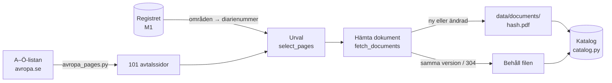

# M2 – Hämtning från avropa.se

**Mål:** avtalsdokumenten för ett första urval av ramavtalsområden ska ligga lokalt, med
metadata som säger varifrån varje fil kommer och vilket avtal den hör till. Det är steg 1 i
inläsningens workflow. M3 tolkar filerna.

**Klart när:** urvalet ligger lokalt med metadata, och en omkörning hämtar ingenting nytt.

> **Läge (2026-10-05):** klart. Urvalet är hämtat och en omkörning laddade inte ner någon fil.

## Resultat

Fyra ramavtalsområden, valda i inställningen `fetch_areas`:

| Ramavtalsområde | Sidor | Dokument |
|---|---|---|
| IT-drift | 2 | 36 |
| Bemanningstjänster | 4 | 20 |
| IT-konsulttjänster Resurskonsulter | 5 | 77 |
| Programvaror och tjänster | 6 | 93 |
| **Totalt (utan dubbletter)** | **17** | **217** |

- 217 dokument (180 PDF, 37 Word) blev 207 unika filer på 133 MB, eftersom samma fil kan ligga på
  flera adresser.
- Dokumenten är listade under "Stöddokument och länkar" (158 länkar), "Avtal" (101) och
  "Upphandling" (39). 25 är leverantörers egna ramavtal från leverantörskorten, och alla 25
  avtalsnummer finns i registret, även de äldre som `23.3-2940-20:010`.
- 11 länkar till Excel-filer (prislistor och svarsmallar) hämtades inte, eftersom bara PDF och Word
  är valda.
- Ingen hämtning misslyckades.

**Omkörningen** läste alla 101 sidor igen men laddade inte ner någon fil: 182 dokument hade samma
version som förra gången och 35 svarade "304 Not Modified" på sin ETag.

**Varför de här fyra områdena:** planen föreslog IT-drift, Bemanningstjänster och Möbler och
inredning. Möbler och inredning har 1 365 leverantörsdokument, och 1 310 av dem är produktlistor,
inte avtalstext. Det området byttes mot IT-konsulttjänster Resurskonsulter och Programvaror och
tjänster. De två har leverantörernas egna ramavtal, äldre avtalsnummer och volymavtal som ligger på
en annan sökväg, så hela kedjan testas på de svåra fallen. Fler områden läggs till med `--area`.

---

## Flödet



```bash
uv run alembic upgrade head                     # skapar dokumenttabellerna
uv run python -m avtalsagent.register --download # registret måste finnas (M1)
uv run python -m avtalsagent.ingestion fetch     # hämtar områdena i fetch_areas
uv run python -m avtalsagent.ingestion fetch --area "IT-drift" --area "Möbler och inredning"
```

## Så ser avropa.se ut

Varje ramavtalsområde har en sida, och A–Ö-listan (`/ramavtal/ramavtal-a-o/`) länkar till alla.
En sida har tre delar som koden läser:

| Del | Exempel | Används till |
|---|---|---|
| Faktarutan | "Ramavtalsnummer 23.3-5890-2023", "Avtalsperiod 2024-11-14 - 2028-11-13" | Koppla sidan till registret via diarienumret |
| Dokumentlistan | Rubriken "Avtal" med "Ramavtalets huvuddokument", "Allmänna villkor" | Dokument för hela området, med kategori |
| Leverantörskorten | "Avtal: 23.3-2940-20:010" med länken "Ramavtal" | Leverantörens eget avtal, med avtalsnummer |

Fem sidor har inget diarienummer (t.ex. Hotelltjänster och Konferenser och möten). De är
ingångssidor som länkar vidare och väljs aldrig. Microsofts och IBM:s volymavtal har inget
"Ramavtalsnummer" i faktarutan, men numret står i leverantörskortet.

## Vad som byggdes, fil för fil

### 1. `domain/documents.py` – sidor och länkar

`AgreementPage` är en avtalssida: titel, diarienummer, avtalsperiod och dokumentlänkar.
`DocumentLink` är en länk: adress utan `?v=`, versionen för sig, titel, kategori eller
avtalsnummer, filtyp och "Senast uppdaterad". Rena Pydantic-modeller utan beroenden.

### 2. `ingestion/avropa_pages.py` – läsa sidorna

Rena funktioner som tar HTML och ger objekten ovan. All kunskap om sajtens HTML finns här, så en
ändring på avropa.se rättas i en fil.

- `parse_index` hittar alla länkar under `/ramavtal/ramavtalsomraden/` i A–Ö-listan.
- `parse_agreement_page` läser `h1`, faktarutan (`h2.fakta-rubrik`) och dokumentraderna
  (`div.tbl-row`). En rad i ett leverantörskort (`li.contact-card`) får kortets avtalsnummer. En
  annan rad får närmaste rubrik (`div.tbl-label`) som kategori.
- Bara länkar till uppladdade filer (`/globalassets/` och `/contentassets/`) räknas som dokument.
  Länkar till andra sidor, nyheter och e-post hoppas över.
- Avtalsnumren i leverantörskorten tolkas med samma regler som registret
  (`domain/identifiers.py`), så de äldre formaten från M1 fungerar här också.

### 3. `ingestion/step1_fetch.py` – hämta filerna

| Funktion | Vad den gör |
|---|---|
| `PoliteClient` | Väntar `fetch_delay_seconds` (0,5 s) mellan förfrågningar och anger `User-Agent` |
| `discover_pages` | Läser A–Ö-listan och alla sidor. En sida som inte går att läsa rapporteras |
| `select_pages` | Behåller sidorna vars diarienummer hör till de valda områdena |
| `fetch_documents` | Hämtar varje unik länk och ger ett resultat med status |

Varje dokument får en av sju statusar:

| Status | Betyder | Förfrågan? |
|---|---|---|
| `new` | Hämtad, fanns inte förut | Ja |
| `updated` | Ny version med nytt innehåll. Den gamla filen ligger kvar | Ja |
| `unchanged` | Ny version eller saknad fil, men samma innehåll som förut | Ja |
| `same version` | Samma `?v=` som förra gången och filen finns | Nej |
| `not modified` | Länk utan version. Sajten svarade 304 på förra ETagen | Ja, utan fil |
| `excluded` | Filtypen är inte vald (`fetch_file_types`, standard PDF och Word) | Nej |
| `failed` | Fel vid hämtning, eller svaret var inte en PDF eller Word-fil | Ja |

Filen sparas som `data/documents/<sha256>.<typ>`. Den skrivs först till ett tillfälligt namn och
byter sedan namn, så ett avbrott lämnar aldrig en halv fil. Varför filerna sparas under sin hash
står i [ADR 0007](../adr/0007-hamtning-av-dokument.md).

### 4. `db/models.py` och migreringen `0002` – katalogen

| Tabell | Nyckel | Innehåll |
|---|---|---|
| `agreement_page` | sidans URL | titel, diarienummer (lista), avtalsperiod, senast läst |
| `source_document` | dokumentets URL | version, ETag, filtyp, SHA-256, storlek, sökväg på disken |
| `agreement_page_document` | sida + dokument | länktext, kategori, avtalsnummer, "Senast uppdaterad" |

Tabellerna har inga främmande nycklar till registret, eftersom registret ersätts vid varje
inläsning medan dokumenten ligger kvar. De kopplas på diarienummer och avtalsnummer.

### 5. `ingestion/catalog.py` – skriva katalogen

- `procurements_for_areas` gör om områdesnamn till diarienummer via registret. Ett namn som inte
  finns ger ett fel som listar de namn som finns.
- `load_stored_documents` läser vad tidigare körningar sparat, så att `fetch_documents` vet vad
  som kan hoppas över.
- `save_fetch` uppdaterar sidor och dokument (insert eller update på samma URL) och ersätter
  länkarna för de sidor som lästes. En länk som försvunnit från en sida försvinner ur katalogen,
  men filen ligger kvar.

### 6. `ingestion/__main__.py` – kommandot

`fetch` kör stegen i ordning och skriver ut en rapport: antal sidor, diarienummer per område
(och diarienummer utan sida), antal dokument per status och varje misslyckad hämtning.
Nedladdningen sker innan databastransaktionen öppnas, så en lång hämtning håller aldrig en
transaktion öppen.

### 7. `config.py` – nya inställningar

`agreement_index_url`, `fetch_areas`, `fetch_file_types` och `fetch_delay_seconds`. Alla finns i
`.env.example`. Listor skrivs som JSON, t.ex. `FETCH_AREAS=["IT-drift"]`.

## Tester

| Fil | Vad den visar |
|---|---|
| `tests/unit/ingestion/test_avropa_pages.py` | Läsning av A–Ö-listan och en riktig avtalssida: fakta, kategorier, leverantörsavtal med avtalsnummer, att sidlänkar inte blir dokument, diarienummer bara från kortet |
| `tests/unit/ingestion/test_step1_fetch.py` | Varje status, att samma version inte ger någon förfrågan, ETag och 304, felsida i stället för PDF, samma fil på två sidor, urvalet och pausen mellan förfrågningar |
| `tests/integration/test_document_catalog.py` | Katalogen mot riktig Postgres: två sparningar ger inga dubbletter, en borttagen länk försvinner, ett misslyckat dokument länkas inte, områden blir diarienummer |
| `tests/unit/test_config.py` | `FETCH_AREAS` läses som en JSON-lista |

Sidorna i `tests/fixtures/avropa/` är riktiga sidor från avropa.se (2026-10-05). De är förkortade,
och kontaktuppgifter är borttagna. Testerna av hämtningen använder en fejkad server och behöver
inget nätverk.

## Så verifierar du M2 själv

```bash
uv run pytest
docker compose up -d postgres --wait
uv run alembic upgrade head
uv run python -m avtalsagent.register --download
uv run python -m avtalsagent.ingestion fetch    # första gången: "new: 217"
uv run python -m avtalsagent.ingestion fetch    # omkörning: "new: 0"
docker compose exec postgres psql -U avtalsagent -c \
  "SELECT agreement_number, title FROM agreement_page_document WHERE agreement_number IS NOT NULL"
```
