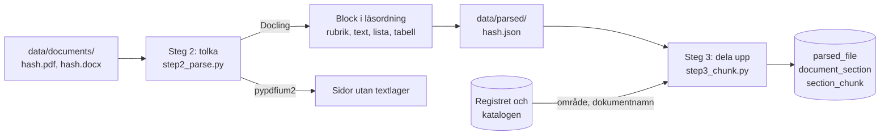

# M3 – Tolkning och uppdelning

**Mål:** varje hämtat dokument ska delas i avsnitt med rätt nummer, rubrik och plats i
hierarkin, och långa avsnitt ska delas i sökbara bitar med en kontextrubrik. Det är steg 2 och 3 i
inläsningens workflow. M4 läser avtalsnummer, organisationsnummer och hänvisningar ur avsnitten.

**Klart när:** varje dokument i urvalet har en korrekt innehållsförteckning och avsnittsnumren
stämmer vid stickprov. Det finns tester med fixtur-PDF:er.

> **Läge (2026-10-05):** koden och testerna är klara. Körningen med Docling på alla 207 filer
> återstår. Den kräver att miljön når PyTorchs paketindex och Hugging Face filservrar (se
> [ADR 0008](../adr/0008-tolkning-och-uppdelning.md)). Siffrorna nedan kommer från PDF:ernas
> textlager och ersätts med Doclings när körningen är gjord.

## Resultat hittills

**Textlagret.** 37 av 3 924 PDF-sidor (0,9 %) är skannade bilder utan text. De finns i fyra filer:

| Fil | Sidor utan text |
|---|---|
| Volymavtal, IBM (10 sidor) | alla 10 |
| Volymavtal, IBM (1 sida) | 1 |
| Allmänna villkor, Systemutveckling (31 sidor) | 22 |
| Kravkatalog, Systemutveckling (11 sidor) | 4 |

Ingen OCR-tjänst byggs nu (M3b), eftersom andelen är liten. Men två av filerna är avtalstext som
agenten inte kan läsa förrän OCR finns. Om det räcker är Simons beslut.

**Avsnitten på textlagret** (alla 207 filer, utan Docling):

| Hur avsnitten hittades | Filer |
|---|---|
| Numrerade rubriker | 169 |
| Frågor och svar, en fråga per avsnitt | 13 |
| Inga rubriker, hela dokumentet ett avsnitt | 25 |

Det blev 11 442 avsnitt och 12 800 bitar. 80 PDF:er har en egen innehållsförteckning, och i 76 av
dem hittades exakt de numrerade rubriker som förteckningen listar. De 25 dokumenten utan avsnitt är
prisbilagor, checklistor, kartor, korta leverantörsbilagor och Microsofts produktvillkor, som
saknar numrerade rubriker. Med Docling delas de vid rubrikerna som layoutmodellen hittar.

**Genomgången av dokumenten.** Alla 207 filer lästes igenom för att se hur de numrerar sina
avsnitt och vad som ser ut som en rubrik utan att vara det. Det finns sex sätt att numrera
(TendSign, Kammarkollegiets Word-mallar, Microsofts och IBM:s villkor, bokstavsmärkta tillägg,
frågor och svar, och dokument utan nummer). De svåra raderna från genomgången finns som tester.

---

## Flödet



```bash
uv run alembic upgrade head                       # skapar tabellerna för avsnitten
uv run python -m avtalsagent.ingestion parse      # steg 2: tolkar alla hämtade filer
uv run python -m avtalsagent.ingestion chunk      # steg 3: avsnitt och bitar
uv run python -m avtalsagent.ingestion outline    # lista över filerna och hur de delades
uv run python -m avtalsagent.ingestion outline 434b92193cab   # en fils innehållsförteckning
```

## Vad som byggdes, fil för fil

### 1. `domain/parsed.py` – block, avsnitt och bitar

| Modell | Vad den är |
|---|---|
| `Block` | En del av dokumentet i läsordning: typ (rubrik, text, listpunkt, tabell, innehållsförteckning, sidhuvud, sidfot), text, sida och, för Word, rubriknivå |
| `PageInfo` | En PDF-sida: antal tecken i textlagret och om den behöver OCR |
| `ParsedDocument` | Resultatet av steg 2 för en fil: blocken, sidorna och parserns namn |
| `Section` | Ett avsnitt: nummer (`6.21.9`), rubrik, nivå, förälder, rubrikstig, sidor och text |
| `Chunk` | En bit av ett avsnitt, med kontextrubrik |

### 2. `ingestion/parsers/` – läsa filerna

`base.py` definierar gränssnittet `DocumentParser`: ett namn och `parse(path) -> list[Block]`.
Allt annat i inläsningen ser bara block, så parsern kan bytas utan att resten ändras.

`docling_parser.py` läser PDF och Word med Docling:

- **PDF:** layoutmodellen hittar rubriker, listor, tabeller, sidhuvuden och sidfötter. Texten
  kommer ur PDF:ens textlager, så den är exakt. OCR är avstängd. En tabell blir en rad per
  tabellrad med cellerna åtskilda av ` | `.
- **Word:** Doclings Word-läsare behöver ingen modell. Den behåller rubriknivåerna (Rubrik 1, 2,
  …) och rubriknumren.
- Blocken i en tabells celler läggs inte till en gång till, och en listpunkt får sin markör
  (`1.`, `a)`) före texten.

### 3. `ingestion/step2_parse.py` – steg 2

| Funktion | Vad den gör |
|---|---|
| `inspect_pages` | Räknar tecknen i textlagret på varje sida. En sida med färre än 50 tecken där bilder täcker minst halva sidan behöver OCR |
| `parse_files` | Tolkar varje fil, eller läser det sparade resultatet om samma parser redan tolkat den |

Resultatet sparas som `data/parsed/<sha256>.json`, först under ett tillfälligt namn. En fil som
inte går att läsa rapporteras och sparas inte. Byts parsern eller dess version tolkas filerna om.

### 4. `ingestion/headings.py` – de numrerade rubrikerna

Det svåra i M3. Numrerade listor (`1. FN:s barnkonvention`), innehållsförteckningar
(`6.6.1 Dokumentation 8`), klockslag (`17.00. Såvida …`), belopp och citerade punkter börjar
också med siffror. En regel per rad räcker inte, så rubrikerna väljs som en helhet:

1. **Innehållsförteckningen hittas:** rader med punktlinje eller tabb före sidnumret, och rader
   som slutar med ett sidnummer och står bland andra sådana rader. Numren i förteckningen ger
   bonus, eftersom de nästan säkert är rubriker.
2. **Kandidater:** varje block som börjar med ett nummer följt av en titel. Titeln ska börja med
   stor bokstav, ha minst två bokstäver och inte sluta med komma eller semikolon. Ingen del av
   numret får vara 0 eller över 200. Står numret ensamt på sin rad tas titeln från nästa block.
3. **Poäng:** en kandidat får poäng, mer om Docling kallar blocket rubrik och om titeln är kort.
4. **Den bästa kedjan:** dynamisk programmering väljer den följd av kandidater med högst poäng där
   varje nummer får följa det förra: första barnet (`6.6` → `6.6.1`) eller nästa nummer på samma
   eller högre nivå (`6.6.8` → `6.6.9`, `6.7`, `7`). Saknade nummer och hoppade nivåer kostar
   poäng men är tillåtna, eftersom Word ibland tappar en nivås nummer (`1` → `1.2.1`). Numreringen
   får inte börja om, eftersom en omstart nästan alltid är en numrerad lista.

En numrerad lista inuti ett avsnitt förlorar alltså mot de riktiga rubrikerna: den börjar om på 1,
och dess nummer passar inte in i kedjan.

### 5. `ingestion/step3_chunk.py` – steg 3

1. `clean_blocks` tar bort sidnummer (`Sida 2/30`, `Sid 2 (7)`, `Utskrivet: … Sida 5 av 111`),
   rader som återkommer på minst 30 % av sidorna och innehållsförteckningen. Sidhuvuden och
   sidfötter tas bort om de står på mer än en sida eller innehåller ett sidnummer. Ett sidhuvud
   som bara står på en sida behålls som text, eftersom layoutmodellen ibland kallar första raden
   på en sida för sidhuvud fast den är avtalstext.
2. `split_sections` väljer hur dokumentet delas:
   - **Frågor och svar** från TendSign delas per fråga (`12 Publik fråga` i textlagret,
     `Publik fråga 12` i Doclings läsordning). Frågorna citerar upphandlingens rubriker, så
     numren används inte.
   - **Numrerade rubriker** används om det finns minst två och den första kommer före halva
     texten. Word-delar utan nummer på högsta nivån läggs till (t.ex. "Instruktion till
     Personuppgiftsbiträdesavtalet" efter "16 Tvistelösning").
   - **Doclings rubriker utan nummer** används annars, och utan rubriker blir dokumentet ett
     avsnitt.

   Text före första rubriken blir ett eget avsnitt på nivå 0. Varje avsnitt får förälder och
   rubrikstig (`6 Allmänna villkor › 6.21 Avtalsbrott och påföljder › 6.21.1 Ansvar vid
   Försening`).
3. `chunk_sections` delar ett avsnitt längre än 1 500 tecken mellan stycken, och ett mycket långt
   stycke mellan meningar. Ett avsnitt som bara är en kort rubrik får ingen bit, eftersom dess
   text finns i underavsnitten.
4. `document_context` och `context_header` bygger kontextrubriken utan språkmodell, t.ex.
   `Programvaror och tjänster (23.3-2649-2022) › Ramavtal 23.3-2649-2022-006 (Pulsen AB) ›
   1 Ramavtalets Huvuddokument › 1.3 Parter och Avropsberättigade › 1.3.1 Parter`. Området
   kommer från registret och dokumentnamnet från länktexten på avropa.se.

### 6. `ingestion/section_store.py`, `db/models.py` och migreringen `0003`

| Tabell | Nyckel | Innehåll |
|---|---|---|
| `parsed_file` | filens hash | parser, antal sidor, sidor utan textlager, hur avsnitten hittades, antal avsnitt och bitar |
| `document_section` | hash + position | nummer, rubrik, nivå, förälder, rubrikstig, sidor, text |
| `section_chunk` | hash + avsnitt + position | kontextrubrik och text |

Steg 3 ersätter alla avsnitt i en transaktion, så tabellerna alltid motsvarar en hel körning.

### 7. `ingestion/__main__.py` – kommandona

`parse` tolkar alla hämtade filer och rapporterar sidor utan textlager. `chunk` delar upp de
tolkade filerna och sparar dem. `outline` listar filerna, eller skriver ut en fils
innehållsförteckning med sidor, så att den kan jämföras med PDF:en.

## Tester

| Fil | Vad den visar |
|---|---|
| `tests/unit/ingestion/test_headings.py` | Rubriker och falska rubriker med rader från dokumenten: listor, klockslag, sidfötter med diarienummer, versionstabeller, sidnummer; kedjan med listor inuti avsnitt, start på kapitel 6 och saknade nivåer |
| `tests/unit/ingestion/test_step3_chunk.py` | Rensning av sidhuvuden och innehållsförteckning, frågor och svar, avsnitt med nivå, förälder och rubrikstig, uppdelning i bitar, kontextrubriker |
| `tests/unit/ingestion/test_step2_parse.py` | En PDF med en skannad sida (gjord med reportlab), sparade resultat, ny parserversion, fel som inte sparas |
| `tests/unit/ingestion/test_docling_parser.py` | Word: rubriker med nivåer, tabell, listpunkt. PDF: text och sidor ur textlagret, sidnummer som sidfot, en pristabell med celler. PDF-testerna kräver modellerna och måste köras i CI |
| `tests/integration/test_section_store.py` | Filer och länkar mot riktig Postgres, och att en ny körning ersätter avsnitten |

## Så verifierar du M3 själv

```bash
uv run pytest
docker compose up -d postgres --wait
uv run alembic upgrade head
uv run python -m avtalsagent.ingestion parse
uv run python -m avtalsagent.ingestion chunk
uv run python -m avtalsagent.ingestion outline                # alla filer
uv run python -m avtalsagent.ingestion outline 434b92193cab   # jämför med PDF:ens innehåll
```
