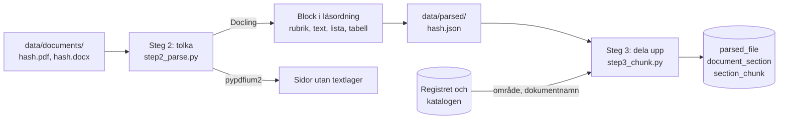

# M3 – Tolkning och uppdelning

**Mål:** varje hämtat dokument ska delas i avsnitt med rätt nummer, rubrik och plats i
hierarkin, och långa avsnitt ska delas i sökbara bitar med en kontextrubrik. Det är steg 2 och 3 i
inläsningens workflow. M4 läser avtalsnummer, organisationsnummer och hänvisningar ur avsnitten.

**Klart när:** varje dokument i urvalet har en korrekt innehållsförteckning och avsnittsnumren
stämmer vid stickprov. Det finns tester med fixtur-PDF:er.

## Resultat

Körningen 2026-10-05 på alla 207 filer i urvalet: 176 PDF med 3 924 sidor och 31 Word-filer.
Docling 2.133 läste PDF:erna på processorn på ungefär två timmar med fyra kärnor. En omkörning
läser bara nya filer och filer som en äldre parserversion läst. Siffrorna nedan är från steg 3
efter självkontrollen 2026-10-06 (se Stickprov).

| Hur avsnitten hittades | PDF | Word | Avsnitt |
|---|---|---|---|
| Numrerade rubriker | 136 | 28 | 9 962 |
| Frågor och svar, en fråga per avsnitt | 13 | | 1 474 |
| Rubriker utan nummer | 25 | 2 | 1 738 |
| Inga rubriker: hela filen ett avsnitt, eller inget alls i en skannad fil | 2 | 1 | 1 |

Det blev 13 175 avsnitt och 13 992 bitar. Ett avsnitt är i mitten 512 tecken långt och en bit
högst 1 500. Dokumenten med rubriker utan nummer är främst Microsofts och IBM:s villkor,
prisbilagor och blanketter. Microsofts produktvillkor (222 sidor, 1 505 avsnitt) får nivåer ur sin
innehållsförteckning, så `Användningsrättigheter` hamnar under sin produkt.

**Kontrollerna på hela urvalet:**

| Kontroll | Kommando | Resultat |
|---|---|---|
| Varje nummer i dokumentets egen innehållsförteckning är ett avsnitt | `chunk` | 104 av 104 filer med förteckning (78 PDF, 26 Word) |
| Varje fråga i en fråge- och svarslogg är ett eget avsnitt | `verify` | 1 462 av 1 463 frågor |
| Raderna i PDF:ernas textlager (minst 25 bokstäver eller siffror) finns i avsnitten | `verify` | 95,1 % av 119 159 rader; 4,4 % finns bara i sidhuvuden, sidfötter och innehållsförteckningar som steg 3 tar bort; 0,5 % saknas |
| Ingen numrerad rad i textlagret passar mellan två avsnitt utan att själv vara ett | `verify` | 3 rader i 3 filer, se nedan |

Kontrollen mot innehållsförteckningen täcker hälften av filerna. De andra 103 är 58 numrerade
PDF, 2 numrerade Word-filer, 13 frågeloggar och 30 filer utan numrerade rubriker. `verify`
kontrollerar alla 176 PDF:er mot textlagret, alltså också de 98 PDF:erna utan förteckning. De fem
Word-filerna utan förteckning har inget textlager och gicks igenom för hand i självkontrollen. De tre numrerade raderna som inte blev avsnitt är 2.2.2 i mallen för
hållbarhetskrav (se Kända begränsningar) och två nummer som inte är dokumentets egna avsnitt:
`1.1.1 Exempelprogramvara Konsultkompetens`, ett exempel på kravnumrering i ett
upphandlingsdokument, och `10.3 Suppliers and Program Developers` i IBM:s landsspecifika tillägg,
som skriver om avsnitt 10 i samma avtal för vissa länder.

Den fråga som saknas (fråga 29 i en logg) har sitt nummer i ett sidhuvud som layoutmodellen
slagit ihop med annan text. Av de 582 rader som inte hittas är 500 sidfötter med adresser,
sidnummer, TendSigns symbolförklaring på första sidan och kontaktuppgifter på försättsblad. Resten
är nästan alltid samma ord i en annan ordning eller uppdelning. Bara ett värde saknas helt: en
cell i en pristabell (se Kända begränsningar).

**Stickprov.** Granskare jämförde avsnitten med PDF:erna i två omgångar: först 16 dokument,
sedan 8 (fyra från första omgången och fyra nya). Varje granskare jämförde avsnitten med
dokumentets innehållsförteckning och rubrikerna i textlagret, och minst sex avsnitts text ord för
ord. Felen från första omgången rättades i parsern och i steg 3. I andra omgången hade fyra
dokument bara små fel. Fyra hade fel i avsnitten: i villkoren för IT-drift saknades 6.21
Avtalsbrott och påföljder med 17 underavsnitt, en prislista togs bort som om den var en
innehållsförteckning, 4.1–4.4 saknades i en vägledning och Microsofts produktvillkor hade alla
rubriker på samma nivå. De fyra är rättade och har tester. Kvar är 2.2.2 i en mall för
hållbarhetskrav, där Docling läser rubriken efter nästa avsnitt (se nedan).

| Omgång | Filer (början av hashen) |
|---|---|
| 1 | 264aff0ce61a, e04bad6a0ced, b9881478f6d6, 434b92193cab, db9d59a42562, 4b6c2a533fae, b05ab2924ae9, 93bd3b2bfeae, a73e377f660b, 66b60a8f74a0, 0ba5ca07759e, 005469cd3990, 96f94a0bb585, 124261dc2ad4, 0486216326ec, 386122e82b7b |
| 2 | db9d59a42562, b9881478f6d6, 0ba5ca07759e, 4b6c2a533fae, 11db2f3d1852, 18309f4961d3, 1d58dc2e8387, 5ff547269162 |

**Självkontrollen 2026-10-06** gick igenom filerna utan egen innehållsförteckning, som kontrollen
i `chunk` inte når, och hittade fel i tio av dem. De är rättade och har tester:

- I IBM:s Passport Advantage-avtal (f6398c125ffb) hade layoutmodellen kört ihop rubrikerna 1.7,
  1.8, 1.9 och 1.11 med stycket före, och rubriken `4. Hårdvarukomponenter` var delad så att
  numret stod före slutet av 3.9 och titeln efter. Nu finns alla fyra avsnitten, och 4 har rätt
  titel.
- I tre IBM-dokument och tre av Microsofts registreringar hamnade en del utan nummer efter sista
  punkten (landsspecifika villkor, registreringsblanketten) under den punkten. Delen är 17–42 %
  av dokumentets text. Nu är delen ett eget avsnitt.
- Två Word-mallar för kontraktstecknande delades efter uppräkningen av kontraktets handlingar
  (1–10) i stället för efter sina rubriker.
- I två av Microsofts registreringar i Word blev meningar mitt i dokumentet (`Välj språk för
  meddelanden.`) egna delar, eftersom Word kallar dem rubriker. Nu läggs Word-delar utan nummer
  bara till efter sista numrerade rubriken.
- Korta numrerade klausuler utan punkt på slutet blev inga bitar, så de gick inte att söka fram.
  Det gällde bland annat hela tillägget i Bilaga 6 för Microsofts volymavtal.

En fil till har nu sin förteckning kontrollerad (104 i stället för 103): den hade sina rader i en
tabell, och numren lästes inte när raderna började med cellavgränsaren.

**Skannade sidor.** 37 av 3 924 PDF-sidor (0,9 %) är bilder utan text. De finns i fyra filer:

| Fil | Sidor utan text |
|---|---|
| Volymavtal, IBM (10 sidor) | alla 10 |
| Volymavtal, IBM (1 sida) | 1 |
| Allmänna villkor, Systemutveckling (31 sidor) | 22 |
| Kravkatalog, Systemutveckling (11 sidor) | 4 |

Ingen OCR-tjänst byggs nu (M3b), eftersom andelen är liten. Två av filerna är avtalstext som
agenten inte kan läsa förrän OCR finns. Simon beslutade 2026-10-06 att vänta med OCR. Sidorna
förblir markerade, och OCR kan läggas till senare som en parser bakom `DocumentParser`.

**Kända begränsningar:**

- Docling ersätter typografiska citattecken och tankstreck med raka tecken (`”` blir `"`), så
  citatkontrollen i M8 måste jämföra normaliserad text.
- I Allmänna villkor för Systemutveckling (e04bad6a0ced) är 22 av 31 sidor skannade. Den läsbara
  texten efter de skannade sidorna hamnar i avsnittet före dem: i texten före första rubriken
  (s. 2–14, bland annat definitionerna), i 7.16 och i 7.25, eftersom rubrikerna däremellan saknas. M4 sätter sådana avsnitt i karantän tills OCR finns.
- En rubrik som layoutmodellen kört ihop med stycket före får ett eget avsnitt, men titeln
  fortsätter in i texten, eftersom gränsen mellan rubrik och text inte syns i blocket (`1.7
  Gällande lagar och geografisk omfattning Varje part är …`). Titeln kortas till 120 tecken.
- En del utan nummer efter sista punkten blir ett avsnitt från den första rubriken som börjar en
  sida. I IBM:s licensavtal (96f94a0bb585) heter delen därför `AMERICAS COUNTRY AMENDMENTS`,
  fast den också har tilläggen för Asien och Europa, var och en under sin landsrubrik i texten.
- TendSigns etiketter i marginalen (`Generella krav`, `Kravspecifikati...`, `European Sing...`)
  hamnar ibland i nästa stycke, någon gång mitt i en mening (`anges i Kontorstjänster samband
  med Avropet`). Inga ord försvinner, men ett citat över den platsen stämmer inte ordagrant.
- Doclings läsordning är ibland fel. Ett stycke som fortsätter på nästa sida blir två stycken,
  försättsblad med två spalter läses spalt för spalt, och i mallen för hållbarhetskrav inom
  IT-säkerhet läses rubriken 2.2.2 efter avsnitt 2.3.1. Där blir 2.2.2 inget avsnitt, och dess
  text hamnar i 2.2.1 och 2.3.1.
- I dokument utan nummer bestämmer layoutmodellen vad som är en rubrik. I Microsofts
  produktvillkor saknas 3 av ungefär 1 480 rubriker, och ett tiotal tabellceller blir rubriker.
- Tabellmodellen kan göra fel. I en pristabell för Informationsförsörjning saknas den sista
  cellen (`999 kr` för Redpill Linpro), i vägledningen för Programvaror och tjänster läses en
  prislista utan tabellinjer som en tabell där leverantörsnamnen hamnar på fel rad, och i
  Microsofts produktvillkor blandas raderna i tabeller med sammanslagna celler (s. 94 och 131).
  Uppgifter ur tabeller bör därför kontrolleras mot källan innan agenten använder dem.
- Tillägg som märker sina punkter med bokstäver (A–G) delas inte per punkt, och i tabellceller
  kan en listmarkör stå efter sin punkt (`Tillhandahålls över internet; a.`).

Genomgången av dokumenten före bygget (alla 207 filer, för att se hur de numrerar sina avsnitt
och vad som ser ut som en rubrik utan att vara det) gav sex sätt att numrera: TendSign,
Kammarkollegiets Word-mallar, Microsofts och IBM:s villkor, bokstavsmärkta tillägg, frågor och
svar, och dokument utan nummer. De svåra raderna finns som tester.

## Flödet



```bash
uv run alembic upgrade head                       # skapar tabellerna för avsnitten
uv run python -m avtalsagent.ingestion parse      # steg 2: tolkar alla hämtade filer
uv run python -m avtalsagent.ingestion chunk      # steg 3: avsnitt och bitar
uv run python -m avtalsagent.ingestion outline    # lista över filerna och hur de delades
uv run python -m avtalsagent.ingestion outline 434b92193cab   # en fils innehållsförteckning
uv run python -m avtalsagent.ingestion verify     # avsnitten mot varje PDF:s textlager
```

## Vad som byggdes, fil för fil

### 1. `domain/parsed.py` – block, avsnitt och bitar

| Modell | Vad den är |
|---|---|
| `Block` | En del av dokumentet i läsordning: typ (rubrik, text, listpunkt, tabell, innehållsförteckning, sidhuvud, sidfot), text, sida och, för Word, rubriknivå |
| `PageInfo` | En PDF-sida: antal tecken i textlagret och om den behöver OCR |
| `ParsedDocument` | Resultatet av steg 2 för en fil: blocken, sidorna och parserns namn |
| `Section` | Ett avsnitt: nummer (`6.21.9`), rubrik, nivå, förälder, rubrikstig, sidor och text |
| `Chunk` | En bit av ett avsnitt, med kontextrubrik |

### 2. `ingestion/parsers/` – läsa filerna

`base.py` definierar gränssnittet `DocumentParser`: ett namn och `parse(path) -> list[Block]`.
Allt annat i inläsningen ser bara block, så parsern kan bytas utan att resten ändras.

`docling_parser.py` läser PDF och Word med Docling:

- **PDF:** layoutmodellen hittar rubriker, listor, tabeller, sidhuvuden och sidfötter. Texten
  kommer ur PDF:ens textlager. OCR är avstängd. En tabell blir en rad per tabellrad med cellerna
  åtskilda av ` | `. Tomma celler behålls, så att varje värde står i sin kolumn (`Ja |  | Ja`).
- **Tre ändringar mot Doclings standard**, alla hittade vid stickproven:
  - Ett bindestreck i slutet av en rad behålls. Docling tar bort det för att laga avstavade ord,
    men i avtalen är det nästan alltid en del av texten: `2025-` + `08-19` blev `202508-19` och
    `nivå 1-` + `4` blev `14`. Det görs i en liten underklass till Doclings PDF-flöde.
  - Text i en ruta som layoutmodellen kallar bild läses också. TendSign ritar sina frågerutor
    (`Accepterar anbudsgivaren villkoren? Ja/Nej. Ja krävs`) som grafik.
  - En tabells fotnoter behålls (`*Aktuell omfattning beskrivs i granskningsrapporten …`).
- **Word:** Doclings Word-läsare behöver ingen modell. Den behåller rubriknivåerna (Rubrik 1, 2,
  …) och räknar fram rubriknumren (steg 3 rättar dem när de skiljer sig från Words egna).
  Word-filens egna sidhuvuden och sidfötter blir sidhuvuden.
- Blocken i en tabells celler läggs inte till en gång till, och en listpunkt får sin markör
  (`1.`, `a)`) före texten.

### 3. `ingestion/step2_parse.py` – steg 2

| Funktion | Vad den gör |
|---|---|
| `inspect_pages` | Räknar tecknen i textlagret på varje sida. En sida med färre än 50 tecken där bilder täcker minst halva sidan behöver OCR |
| `parse_files` | Tolkar varje fil, eller läser det sparade resultatet om samma parser redan tolkat den |

Resultatet sparas som `data/parsed/<sha256>.json`, först under ett tillfälligt namn. En fil som
inte går att läsa rapporteras och sparas inte. Byts parsern eller dess version tolkas filerna om.

### 4. `ingestion/headings.py` – de numrerade rubrikerna

Det svåra i M3. Numrerade listor (`1. FN:s barnkonvention`), innehållsförteckningar
(`6.6.1 Dokumentation 8`), klockslag (`17.00. Såvida …`), belopp och citerade punkter börjar
också med siffror. En regel per rad räcker inte, så rubrikerna väljs som en helhet:

1. **Innehållsförteckningen hittas:** block som Docling kallar innehållsförteckning, rader med
   punktlinje eller tabb före sidnumret, och rader som slutar med ett sidnummer och står bland
   andra sådana rader. Sidnumret måste peka framåt: `1. Lösningsarkitekt, kompetensnivå 4` på
   sidan 11 är en lista, inte en rad för sidan 4. Numren i förteckningen ger bonus, eftersom de
   nästan säkert är rubriker.
2. **Kandidater:** varje block som börjar med ett nummer följt av en titel. Titeln ska börja med
   stor bokstav, ha minst två bokstäver och inte sluta med komma eller semikolon. Ingen del av
   numret får vara 0 eller över 200. Står numret ensamt på sin rad tas titeln från nästa block.
3. **Poäng:** en kandidat får poäng, mer om Docling kallar blocket rubrik och om titeln är kort.
4. **Den bästa kedjan:** dynamisk programmering väljer den följd av kandidater med högst poäng där
   varje nummer får följa det förra: första barnet (`6.6` → `6.6.1`) eller nästa nummer på samma
   eller högre nivå (`6.6.8` → `6.6.9`, `6.7`, `7`). Saknade nummer och hoppade nivåer kostar
   poäng men är tillåtna, eftersom Word ibland tappar en nivås nummer (`1` → `1.2.1`). En ny nivå
   börjar på 1, utom när numret står i dokumentets innehållsförteckning: en mall med strukna
   avsnitt kan gå från `1.3` till `2.4`. Numreringen får inte börja om, eftersom en omstart
   nästan alltid är en numrerad lista.
5. **Innehållsförteckningen väger tyngst.** Nummer som citeras från ett annat dokument kan ge
   fler poäng än en riktig rubrik: efter `5 Tekniska krav` citerar en sammanställning kraven
   `4.6.1`–`4.6.6` ur kravspecifikationen, och kedjan `4, 4.6.1 … 4.6.6, 6` har fler rubriker än
   `4, 5, 6`. Saknar den bästa kedjan nummer som förteckningen listar väljs kedjan igen, nu med
   så många listade nummer som möjligt och först därefter högst poäng.

En numrerad lista inuti ett avsnitt förlorar alltså mot de riktiga rubrikerna: den börjar om på 1,
och dess nummer passar inte in i kedjan.

### 5. `ingestion/step3_chunk.py` – steg 3

1. `clean_blocks` tar bort sidnummer (`Sida 2/30`, `Sid 2 (7)`, `Utskrivet: … Sida 5 av 111`),
   innehållsförteckningen med sin rubrik (`Innehåll`) och rader som återkommer överst eller
   nederst på minst 30 % av sidorna. En mening som återkommer mitt på sidorna (`I denna tjänst
   kan nedan arbetsuppgifter förekomma:` i varje roll) är avtalstext och behålls. Sidhuvuden och
   sidfötter tas bort om de står på mer än en sida eller innehåller ett sidnummer. Ett sidhuvud
   som bara står på en sida behålls som text, eftersom layoutmodellen ibland kallar första raden
   på en sida för sidhuvud fast den är avtalstext. En listmarkör som layoutmodellen lagt sist
   (`Säkerhetsskyddsavtal 2.`, `…; a.`, `… ·`) flyttas först när markörerna i följd är 1, 2, 3
   eller a, b, c. Det gäller listpunkter och rubriker (`Miljöpolicy 2.`), men inte vanlig text,
   eftersom meningar också kan sluta med nummer i följd (`… i steg 1.` och sedan `… i detta
   steg 2.`). En tabell utan kolumner som innehåller numrerade rader delas till text vid de
   raderna. Layoutmodellen kallade början av 6.21 Avtalsbrott och påföljder i villkoren för
   IT-drift en tabell, och utan den regeln försvann 6.21 och alla dess underavsnitt.
   Två fel i läsordningen rättas också. En numrerad rubrik som layoutmodellen kört ihop med
   stycket före (`… försenas eller innehållas. 1.7 Gällande lagar …`) delas av till ett eget
   block. Bara nummer med punkt räknas, efter en mening som slutar med ett ord på minst fyra
   bokstäver, så `kl. 17.00` och `steg 2. Leverantören` delas inte. Ett nummer som står ensamt
   och har sin titel sist i nästa stycke (`4.` och sedan `… för Valda program.
   Hårdvarukomponenter`) får tillbaka sin titel, och stycket flyttas till avsnittet före.
2. `split_sections` väljer hur dokumentet delas:
   - **Frågor och svar** från TendSign delas per fråga (`12 Publik fråga` i textlagret,
     `Publik fråga 12` i Doclings läsordning). Frågorna citerar upphandlingens rubriker, så
     numren används inte.
   - **Numrerade rubriker** används om det finns minst två och den första kommer före halva
     texten, och om de inte mest är listpunkter i ett dokument med många fler rubriker utan
     nummer (Microsofts produktvillkor). I en Word-fil används de inte heller när alla är
     listpunkter och filen har egna rubriker: mallen för kontraktstecknande räknar upp
     kontraktets handlingar 1–10 under rubriken `Kontraktets omfattning`.
   - **Delar utan nummer efter sista punkten.** I en Word-fil läggs rubriker på högsta nivån
     efter sista numrerade rubriken till som egna delar (t.ex. "Instruktion till
     Personuppgiftsbiträdesavtalet" efter "16 Tvistelösning"). Mellan numrerade rubriker är en
     sådan rubrik text, eftersom Microsofts registreringar formaterar hela meningar som
     rubriker. I en PDF blir den första rubriken utan nummer som börjar en sida efter sista
     punkten en egen del (IBM:s landsspecifika villkor, Microsofts `Registreringsinformation`).
     En rubrik på sista sidan räknas inte, eftersom den oftare är en underrubrik eller en
     signatursida.
   - **Word-filens egna nummer.** En Word-fil sparar listdefinitioner, inte nummer. Word räknar
     fram numren den visar, och innehållsförteckningen görs av dem. Docling räknar själv och kan
     hamna fel: i avropsförfrågan för IT-drift ärver rubriken `Innehåll` numreringen från
     Rubrik 1, så Word visar `1 Innehåll` och `2 Administrativa uppgifter` medan Docling börjar
     rubrikerna på 1. När förteckningen listar exakt samma rubriker i samma ordning används dess
     nummer, också i rubrikraden i texten. En förteckning som inte är uppdaterad stämmer inte
     och används inte.
   - **Nummer som är bilder.** Kammarkollegiets vägledningar från 2025 skriver andra nivåns nummer
     som bilder, så `2.1 Avropsberättigade` är `Avropsberättigade` både i innehållsförteckningen
     och i texten. Numren räknas fram ur förteckningens ordning: raderna mellan `2 IT-konsulttjänster`
     och `2.5.1 Delområden` slutar med 2.5 och räknas bakåt (2.1–2.5). Före x.1 kommer x, så
     när också kapitelnumret saknas blir raderna före `4.4.1` 4, 4.1–4.4. Det görs bara när numren
     passar utan lucka mellan grannarna före och efter.
   - **Doclings rubriker utan nummer** används annars, och utan rubriker blir dokumentet ett
     avsnitt. Docling ger inga rubriknivåer i en PDF. Listar dokumentets innehållsförteckning
     rubrikerna (minst hälften av raderna är rubriker i texten) får de listade nivå 1 och
     rubrikerna efter dem nivå 2, så `Användningsrättigheter` i Microsofts produktvillkor får
     rubrikstigen `System Center Server › Användningsrättigheter`.

   Text före första rubriken blir ett eget avsnitt på nivå 0. Varje avsnitt får förälder och
   rubrikstig (`6 Allmänna villkor › 6.21 Avtalsbrott och påföljder › 6.21.1 Ansvar vid
   Försening`). Föräldern till ett numrerat avsnitt har ett nummer som avsnittets nummer börjar
   med, så 2.4 hamnar inte under 1 när 2 saknas. En rubrik som layoutmodellen delat i två block
   (`5.4.1.4 Terroristbrott eller brott med anknytning till` + `terroristverksamhet`) slås ihop.
3. `chunk_sections` delar ett avsnitt längre än 1 500 tecken mellan stycken, och ett mycket långt
   stycke mellan meningar. Ett avsnitt som bara är en kort rubrik och har underavsnitt får ingen
   bit, eftersom dess text finns i underavsnitten. Ett numrerat avsnitt utan underavsnitt får en
   bit, också när det är kort (`1.1 För närvarande har inga ändringar gjorts till bilagorna
   6.1-6.2`), annars går det inte att söka fram. Undantaget är avsnittet för den borttagna
   innehållsförteckningen (`6.1 Innehållsförteckning` i villkoren för IT-drift), som finns kvar
   för kontrollen mot förteckningen. En rubrik utan nummer har ingen säker nivå, så en kort sådan
   räknas alltid som bara rubrik.
4. `document_context` och `context_header` bygger kontextrubriken utan språkmodell, t.ex.
   `Programvaror och tjänster (23.3-2649-2022) › Ramavtal 23.3-2649-2022-006 (Pulsen AB) ›
   1 Ramavtalets Huvuddokument › 1.3 Parter och Avropsberättigade › 1.3.1 Parter`. Området
   kommer från registret och dokumentnamnet från länktexten på avropa.se.

### 6. `ingestion/section_store.py`, `db/models.py` och migreringen `0003`

| Tabell | Nyckel | Innehåll |
|---|---|---|
| `parsed_file` | filens hash | parser, antal sidor, sidor utan textlager, hur avsnitten hittades, antal avsnitt och bitar |
| `document_section` | hash + position | nummer, rubrik, nivå, förälder, rubrikstig, sidor, text |
| `section_chunk` | hash + avsnitt + position | kontextrubrik och text |

Steg 3 ersätter alla avsnitt i en transaktion, så tabellerna alltid motsvarar en hel körning.

### 7. `ingestion/__main__.py` – kommandona

`parse` tolkar alla hämtade filer och rapporterar sidor utan textlager. `chunk` delar upp de
tolkade filerna, sparar dem och kontrollerar varje fil som har en egen innehållsförteckning:
varje nummer som förteckningen listar ska vara ett avsnitt (`contents_missing` i steg 3). Det är
M3:s mål som en kontroll som vem som helst kan köra. `outline` listar filerna, eller skriver ut
en fils innehållsförteckning med sidor, så att den kan jämföras med PDF:en.

`verify` behöver ingen databas. Den delar upp de sparade tolkningarna på nytt och jämför med
varje PDF:s textlager, som `ingestion/text_layer_check.py` läser med pypdfium2:

- hur stor del av textlagrets rader (minst 25 bokstäver eller siffror) som finns i avsnitten,
  hur många som bara finns i det steg 3 tar bort med avsikt och hur många som saknas, och de tio
  filer där flest saknas
- att varje fråga i en fråge- och svarslogg är ett eget avsnitt
- numrerade rader i textlagret som passar mellan två avsnitt (föräldern och föregående syskon
  finns) utan att själva vara ett avsnitt

Rader som steg 3 tar bort med avsikt (sidhuvuden, sidfötter, innehållsförteckningen) räknas för
sig och inte som saknade. En del som hamnat i fel avsnitt behåller alla sina rader, så det felet
syns inte i `verify`. Självkontrollen hittade sådana fel genom att läsa avsnitten.

## Tester

| Fil | Vad den visar |
|---|---|
| `tests/unit/ingestion/test_headings.py` | Rubriker och falska rubriker med rader från dokumenten: listor, klockslag, sidfötter med diarienummer, versionstabeller, sidnummer; kedjan med listor inuti avsnitt, start på kapitel 6, saknade nivåer, strukna avsnitt och citerade kravnummer; innehållsförteckningens rader (och listor som ser ut som rader) och nummer som räknas fram ur den |
| `tests/unit/ingestion/test_step3_chunk.py` | Rensning av sidhuvuden och innehållsförteckning (och att text mitt på sidorna och sidhuvuden på en enda sida behålls), listnummer som flyttas först (också på rubriker), rubriker i en tabell utan kolumner, rubriker som körts ihop med stycket före (och förkortningar som inte delas), titlar sist i nästa stycke, frågor och svar i båda formerna, avsnitt med nivå, förälder och rubrikstig, rubriker över två block, nummer som bilder, nivåer ur innehållsförteckningen, Word-filens egna nummer, delar utan nummer efter sista punkten (och inte mellan punkterna eller på sista sidan), en Word-lista som inte blir rubriker, kontrollen mot innehållsförteckningen, uppdelning i bitar och vilka avsnitt som får bitar, kontextrubriker |
| `tests/unit/ingestion/test_text_layer_check.py` | Kontrollerna i `verify`: rader som saknas (och sidfötter som tas bort med avsikt), frågor i textlagret och numrerade luckor |
| `tests/unit/ingestion/test_step2_parse.py` | En PDF med en skannad sida (gjord med reportlab), sparade resultat, ny parserversion, fel som inte sparas |
| `tests/unit/ingestion/test_docling_parser.py` | Word: rubriker med nivåer, tabell, listpunkt, sidhuvuden. PDF: text och sidor ur textlagret, sidnummer som sidfot, en pristabell med celler. Rättelserna i parsern: bindestreck vid radbrytning, text i bildrutor, celler med samma text och tabellens fotnot. PDF-testerna kräver modellerna och måste köras i CI |
| `tests/integration/test_section_store.py` | Filer och länkar mot riktig Postgres, och att en ny körning ersätter avsnitten |

## Så verifierar du M3 själv

```bash
uv run pytest
docker compose up -d postgres --wait
uv run alembic upgrade head
uv run python -m avtalsagent.ingestion parse
uv run python -m avtalsagent.ingestion chunk
uv run python -m avtalsagent.ingestion outline                # alla filer
uv run python -m avtalsagent.ingestion outline 434b92193cab   # jämför med PDF:ens innehåll
uv run python -m avtalsagent.ingestion verify                 # avsnitten mot textlagret
```
