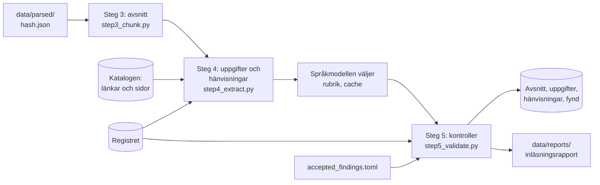

# M4 – Extraktion och avstämning mot registret

**Mål:** läsa ut vad varje dokument är och vad det säger (typ, datum, diarie-, avtals- och
organisationsnummer, parter, avtalsperiod och hänvisningar), stämma av det mot registret över
giltiga ramavtal och hålla tillbaka det som avviker. Det är steg 4 och 5 i inläsningens workflow,
och inläsningsrapporten. Förslaget som Simon godkände 2026-10-06 är
`implementering/m4-forslag.md`; där bygget skiljer sig från det står varför i
[ADR 0009](../adr/0009-extraktion-avstamning-och-karantan.md).

**Klart när:** inläsningsrapporten visar täckning och avvikelser, avvikande dokument ligger i
karantän och andelen upplösta hänvisningar är mätt.

## Resultat

Körningen 2026-10-06 på alla 207 filer i urvalet, med registret från 2026-10-05 och de fyra
ramavtalsområdena från M2. Steg 3–5 tar 19 sekunder. Siffrorna kommer från samma funktion som
kommandot `process` kör (`pipeline.process`), utan databasen.

**Dokumenten.** Reglerna gav typ åt alla 207 filer. 204 typas av länktexten, filnamnet eller
leverantörskortet och 3 bara av rubriken som länken står under (en reservregel, som noteras).

| Typ | Filer | | Typ | Filer |
|---|---:|---|---|---:|
| Leverantörsavtal | 25 | | Upphandlingsdokument | 19 |
| Huvuddokument | 12 | | Frågor och svar | 13 |
| Allmänna villkor | 11 | | Avropsstöd | 18 |
| Bilaga | 8 | | Kravredovisning | 18 |
| Prisbilaga | 8 | | Mall | 31 |
| Kravkatalog | 10 | | | |
| Kravspecifikation | 5 | | | |
| Ändring | 8 | | | |
| Licensvillkor | 21 | | | |

51 filer räknas som mallar eller utkast: de 31 av typen Mall och 20 med ett tomt datumfält
(`[DATUM (dag-mån-år)]`) som inte anger någon avtalsperiod. 149 filer fick ett versionsdatum
(mallens version 22, TendSigns publiceringsdatum eller försättsblad 53, brevhuvudet 36,
e-signaturen 25, filnamnet 13); 58 anger inget.

**Uppgifterna.** 3 981 uppgifter ur 176 filer:

| Uppgift | Antal | Regel |
|---|---:|---|
| Diarienummer | 3 200 | PROC 3 195, OLD 3, OLDKK 2 |
| Avtalsnummer med löpnummer | 62 | PROC |
| Organisationsnummer | 254 | ORG |
| Part i partsklausulen | 26 | E1 (och 25 tomma leverantörsfält) |
| Avtalsperiodens start och slut | 58 och 38 | P1–P6 |
| Avtalsperiodens längd | 66 | P7 |
| Förlängning | 33 | P8, P1 |
| Planerad start | 14 | P9 |
| Underskrift | 52 | P11 |
| Tomma fält i mallar | 178 | PH 98, P10 55, E1 25 |

**Stämmer med registret.** Varje fils egna diarie- och avtalsnummer jämförs med upphandlingarna på
de sidor som länkar till filen:

| Utfall | Filer |
|---|---:|
| Numren hör till upphandlingen på filens sidor | 143 |
| Inget nummer i texten | 47 |
| Bara ett ärendenummer (23.5-serien, `96-15-2015`) | 13 |
| Avviker | 4 |

**Avvikelserna.**

| Kontroll | Karantän | Rapport | Notering |
|---|---:|---:|---:|
| Diarienummer | 3 | | 1 |
| Avtalsnummer | 1 | | |
| Organisationsnummer | 2 | | |
| Leverantören i partsklausulen | 4 | | 1 |
| Avtalsperiod | | 2 | |
| Dokumenttyp | | | 3 |
| Text som saknas | 5 | | 2 |
| Inte längre publicerad | | | |
| Täckning | | 3 | 4 |
| **Totalt** | **15** | **5** | **11** |

**I karantän: 12 filer och 3 avsnitt.** Varje fil har en avvikelse som en person bör titta på. Är
den rätt skrivs den in i `accepted_findings.toml` (se nedan), och filen släpps.

| Fil | Varför |
|---|---|
| Upphandlingsdokument `18309f4961d3` (IT-drift Större) | anger också diarienumret för IT-drift Mindre, 23.3-5890-2023, på s. 47 |
| Prisbilaga - sammanställning Delområde 3 `185c8246e536` (IT-konsulttjänster 3. IT-säkerhet) | har rubriken "23.3-1688-2024 IT-konsulttjänster - IT-säkerhet" på s. 1, men 23.3-1688-2024 är upphandlingen för delområde 1 och 5; IT-säkerhet är 23.3-8321-2024 |
| Avropsmall `adcd1c5ed90e` (Informationsförsörjning) | anger ramavtalet 23.3-2283-22, som inte finns i registret, och inte sidans 23.3-2649-2022 |
| Ramavtalets huvuddokument `65d611d12eab` (IT-konsulttjänster 3. IT-säkerhet) | sidhuvudet anger avtalsnumret 23.3-8321-2024-001, en enskild leverantörs avtal, fast dokumentet är områdets mall med `23.3-8321-2024-XXX` |
| Volymavtalets huvudavtal 1.0 `171a3cacf5fd` (Microsoft) | organisationsnumret 502052-1307 (Microsoft Ireland Operations Ltd) finns inte i registret, som har Microsoft AB |
| Prisbilaga - sammanställning Delområde 1 `8d679cb2ebef` (IT-konsulttjänster 1) | organisationsnumret 556866-4444 (ÅF Digital Solutions AB) finns inte i registret |
| Ramavtal 23.3-2940-20:018 `ee6107229c37` och :033 `7a49e1a61b31` | tecknade av ÅF Digital Solutions AB 556866-4444; registret har AFRY Sweden AB 556224-8012 |
| Ramavtal 23.3-2940-20:017 `a09791e460a4` och :032 `f5823eb88227` | tecknade av Tieto Sweden AB 556052-7466; registret har Tieto AB 559435-9001 |
| Volymavtal `21dd4fde89d5` och `5c9b05f2cc79` (IBM) | skannade, utan textlager, så de gav inget avsnitt |

De tre avsnitten är i Allmänna villkor för Systemutveckling (`e04bad6a0ced`): texten före första
rubriken (s. 2–14), 7.16 Prismodeller (s. 14–22) och 7.25 Uppföljning (s. 23–31). De omfattar
skannade sidor, så deras text är ofullständig. Filens övriga avsnitt läses in.

**Täckning.** Av registrets 121 avtal i de fyra områdena har 61 ett inläst huvuddokument som
indexeras: 21 genom leverantörens eget ramavtal i leverantörskortet och 40 genom huvuddokumentet
för sitt delområde.

| Ramavtalsområde | Avtal | Täckta | Bara upphandlingens version | Bara i karantän | Inte täckta |
|---|---:|---:|---:|---:|---:|
| IT-drift | 15 | 15 | | | |
| Bemanningstjänster | 33 | | 33 | | |
| IT-konsulttjänster Resurskonsulter | 44 | 32 | 4 | 8 | |
| Programvaror och tjänster | 29 | 14 | 13 | 1 | 1 |
| **Totalt** | **121** | **61** | **50** | **9** | **1** |

50 avtal har bara upphandlingens version av huvuddokumentet, utskriven från TendSign med
försättsbladet "Upphandlingsdokument" (`34d71a7e4da0` för alla 33 i Bemanningstjänster,
`80578a77ea47` och `64204ca73ffb` för 13 i Programvaror och tjänster, och `cbe12fd30683` för 4 avtal
i 23.3-2940-20 vars egna leverantörsavtal ligger i karantän). Den undertecknade versionen
publiceras inte på avropa.se, så det är upphandlingens version som indexeras; rapporten noterar
det. 9 avtal täcks bara av dokument i karantän: de 8 för IT-säkerhet av `65d611d12eab` och
Microsofts volymavtal av `171a3cacf5fd`. IBM:s volymavtal 6765/05 har inget inläst huvuddokument.
Täckningen ger ett fynd per grupp av avtal som täcks av samma filer, så de 33 avtalen i
Bemanningstjänster är en notering och inte 33.

**Hänvisningar.** Steg 4 hittade 14 759 hänvisningar i avsnitten och följde dem till fil och
avsnitt bland filerna på samma avtalssidor.

| | Upplösta | I måttet | Andel |
|---|---:|---:|---:|
| Med språkmodellen | 7 632 | 10 253 | **74,4 %** |
| Bara med regler | 7 523 | 10 253 | 73,4 % |

Måttet är upplösta delat med alla hänvisningar utom lagar och standarder (2 456), "fråga N" i en
frågelogg (303), listpunkter (472) och självhänvisningar (1 275). Av de 2 621 som inte löses är
1 201 hänvisningar till filer som inte publiceras på avtalssidan (mest anbudsblanketter som
"bilaga Kvalitet i utförande"), 1 203 flertydiga (mest "Säkerhetsskyddsavtal" där sidan har tre
nivåer, och hela anbudspaketet "upphandlingsdokumenten"), 98 rubriker och 97 nummer som inte finns
i måldokumentet, och 27 mallfält.

| Form | I måttet | Upplösta |
|---|---:|---:|
| Avsnittsrubrik ("enligt avsnitt Avtalsbrott och påföljder") | 3 870 | 91,4 % |
| Avsnittsnummer ("punkt 6.21.9", "enligt 10.4") | 2 064 | 83,5 % |
| Dokumentnamn ("Allmänna villkor") | 2 933 | 70,1 % |
| Bilaga med nummer ("bilaga 3") | 118 | 46,6 % |
| Bilaga med namn ("bilaga Priser") | 1 268 | 20,4 % |

Kartläggningen före bygget mätte 78,2 % med prototypregler (7 676 av 9 814). Skillnaden, 4,8
procentenheter, har fyra orsaker:

- **En frågelogg, 220 hänvisningar.** Frågorna i `3a316e27aadf` pekar på punkter i både
  ansöknings- och anbudsinbjudan, och frågans datum avgör vilken. Anbudsinbjudan `b2bf8baefe48`
  säger "Version 3: publicerad 2024-11-19", så dess första publiceringsdatum är okänt. Hänvisningarna
  blir flertydiga i stället för att gissas.
- **Regler som inte byggdes** (var och en under 50 hänvisningar, tillsammans 85): en rubrik följd av
  ett dokument ("avsnitt X i Allmänna villkor") och "kapitel <Dokument>".
- **Dokumentnamn:** fler blir flertydiga eller ej publicerade (R2: 764 och 113 mot 671 och 67).
  Kartläggningen räknade inte dokumentnamn med liten bokstav som saknas på sidan.
- **Avsnittsrubriker:** mönstren hittar 572 fler än kartläggningen, och de flesta löses (+403).

**Språkmodellen** fick 219 frågor och valde en rubrik i 132 (109 rubriker som skrivs annorlunda än
i dokumentet och 23 ämnen efter ett dokumentnamn). 45 svar kontrollerades för hand; 2 var fel (3
hänvisningar). Svaren ligger i `data/llm_cache/`, så en omkörning gör inga anrop.

## Flödet



```bash
uv run alembic upgrade head                       # skapar tabellerna för M4
uv run python -m avtalsagent.ingestion process    # steg 3–5 och rapporten
uv run python -m avtalsagent.ingestion run        # fetch, parse och process i ett svep
uv run python -m avtalsagent.ingestion process --area IT-drift   # bara ett område
```

`process` sparar avsnitt, uppgifter, hänvisningar och fynd i en transaktion. Rapporten skrivs som
Markdown och JSON i `data/reports/<tid>-inlasning.md` och `.json`. Utan `OPENAI_API_KEY` hoppas
språkmodellen över, och rapporten säger det.

## Vad som byggdes, fil för fil

Varje regel har ett id ("P3", "R4") som sparas med det den hittat. I varje moduls inledning står
regeln, ett exempel ur dokumenten och hur många gånger den slog till i urvalet.

### 1. `domain/extracted.py`, `domain/identifiers.py` – modellerna

| Modell | Vad den är |
|---|---|
| `DocumentMetadata` | Filens typ och typregel, titel, avtalsnummer (leverantörskort), bilagenummer, första kapitel, TendSigns försättsblad, om den är en mall, versions- och publiceringsdatum |
| `Fact` | En uppgift: sort, värde, texten den lästes ur, regel, block och sida; för en period också delområde och vilken mening den hör till |
| `ReferenceMention` och `Reference` | En hänvisning i ett avsnitt, och vart den leder: status, regel och mål (fil, avsnitt, sida) |
| `Finding` | Ett fynd i steg 5: kontroll, allvarlighetsgrad, vad som avviker, meddelande på svenska, underlag, och nyckeln `kontroll:fil:ämne` |
| `Quarantine` | Filerna och avsnitten som inte ska indexeras |

`domain/identifiers.py` läser diarie- och avtalsnummer i alla stavningar och ger var och en en
nyckel (`procurement_key`, `agreement_key`), så att `23.3.2940-20:018` och `23.3-2940-20:018` är
samma avtal. Organisationsnummer kontrolleras med kontrollsiffran (Luhn), och momsnummer
(`SE556677889901`) läses som organisationsnumret.

### 2. `ingestion/extract/` – steg 4, en sorts uppgift per modul

| Modul | Vad den läser | Regler |
|---|---|---|
| `document_type.py` | Typ ur länken; bilagenummer, första kapitel, TendSigns försättsblad, versions- och publiceringsdatum ur texten | R01–R14, F1–F3 |
| `identifiers.py` | Diarie-, avtals- och organisationsnummer, och tomma nummerfält. Ett nummer inom parentes är en hänvisning till ett annat avtal, annars dokumentets eget | PROC, OLD, OLDKK, ORG, PH |
| `parties.py` | Partsklausulen "mellan … organisationsnummer … nedan … och …" | E1 |
| `dates.py` | Avtalsperiodens start, slut, längd och förlängning, planerad start, underskrifternas datum och tomma datumfält | P1–P11 |
| `document_names.py` | De 39 dokumentnamnen som hänvisningar använder ("Allmänna villkor", "Kravkatalogen") och deras alias | |
| `reference_patterns.py` | Hänvisningarna i avsnitten: lagar, mallfält, nummer, rubriker, bilagor, dokumentnamn, frågor | LAW, PH, R1, R1x, R2–R5, RQ |
| `reference_resolver.py`, `resolve_in_document.py`, `resolve_on_page.py`, `resolve_questions.py` | Vart varje hänvisning leder: samma fil, de andra filerna på avtalssidan, eller upphandlingsdokumentet en fråga gäller | R1–R5, R1x, R1q, R4q, RQ |
| `title_matcher.py` | Språkmodellens val av rubrik bland filens rubriker, för en rubrik som inte stämmer exakt och ett ämne efter ett dokumentnamn | R4-llm, R2-llm |

`ingestion/llm_title_matcher.py` är den enda modulen som anropar OpenAI (`gpt-6-luna` med
strukturerat svar). Den sparar varje svar i `data/llm_cache/title_matcher.jsonl` med en nyckel av
modell, promptversion, fras och kandidater.

### 3. `ingestion/step4_extract.py` – steg 4

`extract_document` sätter ihop modulerna för en fil. Typen bestäms först, eftersom hänvisningarna
beror på den. Uppgifterna läses ur alla block, också sidhuvuden och sidfötter: 34 filer har sitt
diarienummer bara i sidhuvudet, och Microsofts volymavtal anger sin period bara i en sidfot.
Hänvisningarna läses ur avsnitten. Ett nummer sparas som registret skriver det när registret har
nyckeln (`RegisterSpelling`). `extract_corpus` gör det för alla filer, löser hänvisningarna och
frågar till sist språkmodellen.

### 4. `ingestion/checks/` och `ingestion/step5_validate.py` – steg 5

En kontroll per modul. `checks/context.py` ger dem samma uppslag: registrets rader för ett nummer
(på nyckel), upphandlingarna på sidorna som länkar till en fil och sidans delområde.

| Kontroll | Vad den kontrollerar | Allvar |
|---|---|---|
| `procurement_number` | Filens egna diarienummer hör till upphandlingen på dess sidor. Ett citerat nummer (inom parentes) som inte gör det noteras | Karantän / notering |
| `agreement_number` | Ett leverantörskorts avtalsnummer är länkens; en fil som inte är ett kort anger inget enskilt avtal som sitt | Karantän |
| `org_numbers` | Varje organisationsnummer utom Kammarkollegiets tillhör en leverantör i filens upphandling | Karantän |
| `supplier_party` | Leverantören i ett korts partsklausul har registrets organisationsnummer för avtalet; ett annat namn med samma nummer noteras | Karantän / notering |
| `agreement_period` | Den period dokumentet anger stämmer med registret, eller med en förlängning det anger. Sidans egen period jämförs också | Karantän / rapport |
| `document_type` | Ingen fil saknar typ; en typ från en reservregel noteras | Rapport / notering |
| `missing_text` | Ett avsnitt på skannade sidor, en fil utan avsnitt eller en fil som inte tolkats hålls tillbaka; en fil med några skannade sidor noteras | Karantän / notering |
| `still_published` | Någon sida på avropa.se länkar fortfarande till filen | Karantän |
| `coverage` | Varje avtal i körningens områden har ett inläst huvuddokument som indexeras. Bara upphandlingens version noteras; bara dokument i karantän eller inget rapporteras. Ett fynd per grupp av avtal med samma filer | Rapport / notering |

`step5_validate.validate` kör dokumentkontrollerna först och täckningen sist, eftersom ett
huvuddokument i karantän inte täcker sina avtal. Därefter markeras de fynd som en person godkänt.

### 5. `accepted_findings.toml` – godkända avvikelser

En avvikelse kan vara rätt: en leverantör har bytt namn, eller avropa.se länkar ett dokument från
fel sida. Den som har granskat den skriver in fyndets nyckel (rapporten skriver ut den under
Karantän), ett skäl, sitt namn och ett datum:

```toml
[[accepted]]
key = "supplier_party:7a49e1a61b31…:556866-4444"
reason = "ÅF Digital Solutions AB har gått upp i AFRY Sweden AB; avtalet är detsamma."
reviewer = "Simon"
date = 2026-10-07
```

Ett godkänt fynd står kvar i rapporten men håller inte tillbaka något. En post som inte matchar
något fynd i körningen listas, så att gamla poster syns. Filen är tom tills Simon beslutar.

### 6. `ingestion/pipeline.py` och `ingestion/report.py`

`pipeline.process` kör steg 3–5 på vanliga värden, utan databas och nätverk (språkmodellen kommer
in som en funktion). Kommandona, testerna och mätningen ovan använder den. `report.py` bygger
rapporten (`build_report`) och skriver den som Markdown och JSON (`write_report`). Rapportens delar:
Sammanfattning, Körning, Dokument, Avsnitt och chunkar, Stämmer med registret, Täckning,
Hänvisningar, Avvikelser, Karantän och Godkända avvikelser.

### 7. `ingestion/extraction_store.py`, `db/models.py` och migreringen `0004`

| Tabell | Nyckel | Innehåll |
|---|---|---|
| `document_metadata` | filens hash | typ, grupp, om den är bindande, datum, mall |
| `document_fact` | id | uppgifterna med regel, block och sida |
| `document_reference` | id | hänvisningarna med avsnitt, position, form, regel och status |
| `reference_target` | hänvisning + position | målfil, målavsnitt och sida |
| `validation_finding` | id | fynden, med skälet när ett fynd är godkänt |

`agreement_page.missing_since` sätts av `fetch` när en sida inte längre listas på avropa.se.
`extraction_store.quarantine` ger det som inte ska indexeras. Den är stängd som standard: en tolkad
fil som inte gått igenom steg 4 och 5 räknas som i karantän. Tabellerna ersätts i varje körning.

### 8. `ingestion/step3_chunk.py` – e-signaturens certifikat

Undertecknade leverantörsavtal har ett certifikat sist (Adobe CDS, "juridiskt bindande") med namn
och id för dem som skrivit under. Steg 3 tar bort den sidan och alla efter den, så att namnen inte
hamnar i avsnitten. Det gäller 25 filer. Underskriftens datum sparas, men bara "datum klockslag".

### 9. `ingestion/__main__.py` och `config.py`

`process` ersätter `chunk` och `run` kör alla steg. Båda tar `--area`, som `fetch`, eftersom
täckningen gäller körningens områden. Varje steg skriver en rad i loggen (`LOG_LEVEL`) med sina
siffror. Nya inställningar: `ACCEPTED_FINDINGS_FILE` och rapportmappen `data/reports/`.

## Tester

| Fil | Vad den visar |
|---|---|
| `tests/unit/domain/test_identifiers.py` | Alla 79 diarienummer och 2 361 avtalsnummer i registret får en nyckel; stavningar som ger samma nyckel; kontrollsiffran; momsnummer |
| `tests/unit/ingestion/extract/test_extract_*.py` | Varje regel i steg 4 med riktiga rader ur dokumenten, och närliggande text som regeln inte ska ta |
| `tests/unit/ingestion/checks/test_check_*.py` | Varje kontroll med fall från urvalet: de avvikande filerna, och fall som inte är avvikelser |
| `tests/unit/ingestion/test_step4_extract.py`, `test_step5_validate.py` | Registrets stavning, mall eller inte, versionsdatum, godkända avvikelser och karantänen |
| `tests/unit/ingestion/test_report.py` | Rapportens delar och siffror, svenska namn på alla typer och utfall |
| `tests/unit/ingestion/test_pipeline.py` | En PDF med ett okänt organisationsnummer och en hänvisning, från Docling till rapport: filen ligger i karantän, täckningen har en rad och andelen står där. Samma sak utan Docling, och godkända avvikelser |
| `tests/unit/ingestion/test_llm_title_matcher.py` | Adaptern mot OpenAI med en låtsasmodell: cachen, svar som inte är en kandidat |
| `tests/unit/ingestion/test_ingestion_main.py` | Kommandona utan databas: loggraderna, okända områden |
| `tests/integration/test_extraction_store.py` | Tabellerna mot riktig Postgres: spara och läsa tillbaka, karantänen (också efter bara steg 3) och `missing_since` |

Varje regel har ett test som slår fel när regeln tas bort; det prövades genom att ta bort reglerna
en i taget.

## Kända begränsningar

- **Det som inte byggdes** (var och en under 50 hänvisningar i urvalet): en rubrik följd av ett
  dokument ("avsnitt X i Allmänna villkor"), "kapitel <Dokument>" när filen saknar ett sådant
  kapitel, en unik rubrik som börjar med hänvisningens fras och steget nummer + rubrik i
  frågeloggarna.
- **Leverantörsnamn utan organisationsnummer** (i prislistor och vägledningar) kontrolleras inte.
  Varje organisationsnummer kontrolleras.
- **Vad ett tillägg ersätter** ("ersätter avsnitt 7.19.1.3") markeras på 33 hänvisningar, men 7 av
  dem är ingen ändring ("Kammarkollegiet ändrar inte avtalsvillkoret i 7.19.11"). Vilket dokument
  ett tillägg gäller läses inte ut ur dess titel.
- **IBM:s volymavtal** är en .doc-fil som steg 1 inte hämtar, så avtalet 6765/05 har inget
  huvuddokument.
- **Språkmodellens svar** kan variera mellan körningar utan cache. Cachen gör dem fasta, och 2 av
  45 kontrollerade svar var fel.
- **Databasdelen** av `process` och `run` har bara körts i CI:s integrationstester, inte mot hela
  urvalet.

## Så verifierar du M4 själv

```bash
uv run pytest
docker compose up -d postgres --wait
uv run alembic upgrade head
uv run python -m avtalsagent.ingestion process   # skriver data/reports/<tid>-inlasning.md
uv run alembic upgrade head --sql                # migreringarna som SQL, utan databas
```

Öppna rapporten och jämför ett fynd i Karantän med dokumentet: underlaget är texten fyndet bygger
på, och nyckeln är det som skrivs in i `accepted_findings.toml` för att godkänna det.
