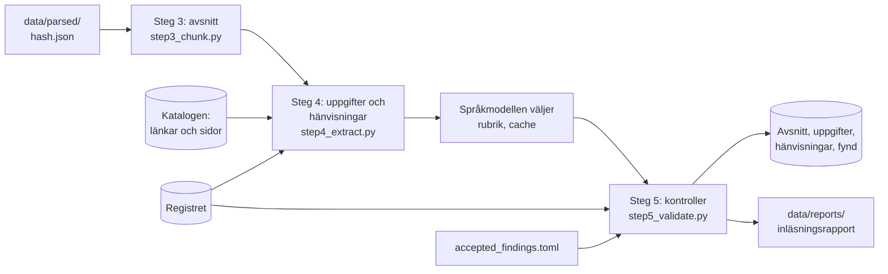

# M4 – Extraktion och avstämning mot registret

**Mål:** läsa ut vad varje dokument är och vad det säger (typ, datum, diarie-, avtals- och
organisationsnummer, parter, avtalsperiod och hänvisningar), stämma av det mot registret över
giltiga ramavtal och hålla tillbaka det som avviker. Det är steg 4 och 5 i inläsningens workflow,
och inläsningsrapporten. Förslaget som Simon godkände 2026-10-06 är
`implementering/m4-forslag.md`; där bygget skiljer sig från det står varför i
[ADR 0009](../adr/0009-extraktion-avstamning-och-karantan.md).

**Klart när:** inläsningsrapporten visar täckning och avvikelser, avvikande dokument ligger i
karantän och andelen upplösta hänvisningar är mätt.

## Resultat

Körningen 2026-10-06 på alla 207 filer i urvalet, med registret från 2026-10-05 och de fyra
ramavtalsområdena från M2. Steg 3–5 tar 22 sekunder. Siffrorna kommer från samma funktion som
kommandot `process` kör (`pipeline.process`), utan databasen.

**Dokumenten.** Reglerna gav typ åt alla 207 filer. 204 typas av länktexten, filnamnet eller
leverantörskortet och 3 bara av rubriken som länken står under (en reservregel, som noteras).

| Typ | Filer | | Typ | Filer |
|---|---:|---|---|---:|
| Leverantörsavtal | 25 | | Upphandlingsdokument | 19 |
| Huvuddokument | 12 | | Frågor och svar | 13 |
| Allmänna villkor | 11 | | Avropsstöd | 18 |
| Bilaga | 8 | | Kravredovisning | 18 |
| Prisbilaga | 8 | | Mall | 31 |
| Kravkatalog | 10 | | | |
| Kravspecifikation | 5 | | | |
| Ändring | 8 | | | |
| Licensvillkor | 21 | | | |

51 filer räknas som mallar eller utkast: de 31 av typen Mall och 20 med ett tomt datumfält som
inte anger någon avtalsperiod. Fältet är `[DATUM (dag-mån-år)]` i 17 av dem, `20xx-xx-xx` i
`5b38873c2b7a` och `insert date` i Microsofts formulär `a16f04246875` och `d54ed0900be5`.

149 filer fick ett versionsdatum (mallens version 22, TendSigns publiceringsdatum eller
försättsblad 53, brevhuvudet 36, e-signaturen 25, filnamnet 13); 58 anger inget.

**Uppgifterna.** 3 981 uppgifter ur 176 filer:

| Uppgift | Antal | Regel |
|---|---:|---|
| Diarienummer | 3 200 | PROC 3 195, OLD 3, OLDKK 2 |
| Avtalsnummer med löpnummer | 62 | PROC |
| Organisationsnummer | 254 | ORG |
| Part i partsklausulen | 26 | E1 (och 25 tomma leverantörsfält) |
| Avtalsperiodens start och slut | 58 och 38 | P1–P6 |
| Avtalsperiodens längd | 66 | P7 |
| Förlängning | 33 | P8, P1 |
| Planerad start | 14 | P9 |
| Underskrift | 52 | P11 |
| Tomma fält i mallar | 178 | PH 98, P10 55, E1 25 |

**Stämmer med registret.** Varje fils egna diarie- och avtalsnummer jämförs med upphandlingarna på
de sidor som länkar till filen. Ett nummer som filen citerar inom parentes ändrar inte utfallet:

| Utfall | Filer |
|---|---:|
| Numren hör till upphandlingen på filens sidor | 144 |
| Inget eget nummer i texten | 47 |
| Bara ett ärendenummer (23.5-serien, `96-15-2015`) | 13 |
| Avviker | 3 |

**Fynden.** 32 fynd, med kontrollernas namn som i rapporten:

| Kontroll | Karantän | Rapport | Notering |
|---|---:|---:|---:|
| Diarienummer | 3 | | 1 |
| Avtalsnummer | 1 | | |
| Organisationsnummer | 2 | | |
| Leverantör i avtalet | 4 | | 1 |
| Avtalsperiod | | 2 | |
| Dokumenttyp | | | 3 |
| Text saknas | 6 | | 2 |
| Fortfarande publicerad | | | |
| Täckning | | 3 | 4 |
| **Totalt** | **16** | **5** | **11** |

**I karantän: 12 filer och 4 avsnitt.** Varje fil har en avvikelse som en person bör titta på. Är
den rätt skrivs den in i `accepted_findings.toml` (se nedan), och filen släpps. Simon godkände nio
av dem 2026-10-07; sedan dess ligger 3 filer och 4 avsnitt i karantän (se Täckning nedan).

| Fil | Varför |
|---|---|
| Upphandlingsdokument `18309f4961d3` (IT-drift Större) | anger också diarienumret för IT-drift Mindre, 23.3-5890-2023, på s. 47 |
| Prisbilaga - sammanställning Delområde 3 `185c8246e536` (IT-konsulttjänster 3. IT-säkerhet) | har rubriken "23.3-1688-2024 IT-konsulttjänster - IT-säkerhet" på s. 1, men 23.3-1688-2024 är upphandlingen för delområde 1 och 5; IT-säkerhet är 23.3-8321-2024 |
| Avropsmall `adcd1c5ed90e` (Informationsförsörjning) | anger ramavtalet 23.3-2283-22, som inte finns i registret, och inte sidans 23.3-2649-2022 |
| Ramavtalets huvuddokument `65d611d12eab` (IT-konsulttjänster 3. IT-säkerhet) | sidhuvudet anger avtalsnumret 23.3-8321-2024-001, en enskild leverantörs avtal, fast dokumentet är områdets mall med `23.3-8321-2024-XXX` |
| Volymavtalets huvudavtal 1.0 `171a3cacf5fd` (Microsoft) | organisationsnumret 502052-1307 (Microsoft Ireland Operations Ltd) finns inte i registret, som har Microsoft AB |
| Prisbilaga - sammanställning Delområde 1 `8d679cb2ebef` (IT-konsulttjänster 1) | organisationsnumret 556866-4444 (ÅF Digital Solutions AB) finns inte i registret |
| Ramavtal 23.3-2940-20:018 `ee6107229c37` och :033 `7a49e1a61b31` | tecknade av ÅF Digital Solutions AB 556866-4444; registret har AFRY Sweden AB 556224-8012 |
| Ramavtal 23.3-2940-20:017 `a09791e460a4` och :032 `f5823eb88227` | tecknade av Tieto Sweden AB 556052-7466; registret har Tieto AB 559435-9001 |
| Volymavtal `21dd4fde89d5` och `5c9b05f2cc79` (IBM) | skannade, utan textlager, så de gav inget avsnitt |

Tre av avsnitten är i Allmänna villkor för Systemutveckling (`e04bad6a0ced`): texten före första
rubriken (s. 2–14), 7.16 Prismodeller (s. 14–22) och 7.25 Uppföljning (s. 23–31). De omfattar
skannade sidor, så deras text är ofullständig. Det fjärde är det sista avsnittet i Kravkatalog för
Systemutveckling (`124261dc2ad4`), Utbildning på s. 10: meningen fortsätter på den skannade s. 11,
som steg 3 inte ser. Filernas övriga avsnitt läses in.

**Täckning.** Av registrets 121 avtal i de fyra områdena har 61 ett inläst huvuddokument som
indexeras: 21 genom leverantörens eget ramavtal i leverantörskortet och 40 genom huvuddokumentet
för sitt delområde.

| Ramavtalsområde | Avtal | Täckta | Bara upphandlingens version | Bara i karantän | Inte täckta |
|---|---:|---:|---:|---:|---:|
| IT-drift | 15 | 15 | | | |
| Bemanningstjänster | 33 | | 33 | | |
| IT-konsulttjänster Resurskonsulter | 44 | 32 | 4 | 8 | |
| Programvaror och tjänster | 29 | 14 | 13 | 1 | 1 |
| **Totalt** | **121** | **61** | **50** | **9** | **1** |

50 avtal har bara upphandlingens version av huvuddokumentet, utskriven från TendSign med
försättsbladet "Upphandlingsdokument" (`34d71a7e4da0` för alla 33 i Bemanningstjänster,
`80578a77ea47` och `64204ca73ffb` för 13 i Programvaror och tjänster, och `cbe12fd30683` för 4 avtal
i 23.3-2940-20 vars egna leverantörsavtal ligger i karantän). Den undertecknade versionen
publiceras inte på avropa.se, så det är upphandlingens version som indexeras; rapporten noterar
det. 9 avtal täcks bara av dokument i karantän: de 8 för IT-säkerhet av `65d611d12eab` och
Microsofts volymavtal av `171a3cacf5fd`. IBM:s volymavtal 6765/05 har inget inläst huvuddokument.
Täckningen ger ett fynd per grupp av avtal som täcks av samma filer, så de 33 avtalen i
Bemanningstjänster är en notering och inte 33.

**Efter Simons godkännanden** (avsnitt 5) och med registret från 2026-10-07 gav samma körning
2026-10-07: 3 filer och 4 avsnitt i karantän (avropsmallen och IBM:s två skannade volymavtal), och
66 av 121 avtal täckta (25 genom leverantörens eget ramavtal, 41 genom huvuddokumentet), 54 med
bara upphandlingens version, 0 bara i karantän och 1 inte täckt (IBM). Hänvisningarna är
oförändrade.

| Ramavtalsområde | Avtal | Täckta | Bara upphandlingens version | Bara i karantän | Inte täckta |
|---|---:|---:|---:|---:|---:|
| IT-drift | 15 | 15 | | | |
| Bemanningstjänster | 33 | | 33 | | |
| IT-konsulttjänster Resurskonsulter | 44 | 36 | 8 | | |
| Programvaror och tjänster | 29 | 15 | 13 | | 1 |
| **Totalt** | **121** | **66** | **54** | **0** | **1** |

**Hänvisningar.** Steg 4 hittade 14 757 hänvisningar i avsnitten och följde dem till fil och
avsnitt bland filerna på samma avtalssidor.

| | Upplösta | I måttet | Andel |
|---|---:|---:|---:|
| Med språkmodellen | 7 519 | 10 080 | **74,6 %** |
| Bara med regler | 7 410 | 10 080 | 73,5 % |

Måttet är upplösta delat med alla hänvisningar utom lagar och standarder (2 456), "fråga N" i en
frågelogg (303), listpunkter (643) och självhänvisningar (1 275). En listpunkt är ett helt tal efter
"punkt" som numrerar en punkt i en lista: en rad börjar med det, "ovan" eller "nedan" följer, eller
ett avsnitt står bredvid ("punkterna 1-3 i avsnitt 7.17.3"). I en frågelogg är ett sådant tal
alltid en listpunkt (218 av de 643). En självhänvisning är ett dokument som nämner sig självt
("dessa Allmänna villkor"). En hänvisning som leder till sitt eget avsnitt ("gäller detta avsnitt
Leverans och leveranskontroll", 73 i urvalet) räknas som upplöst, eftersom den hittade avsnittet
den nämner. Av de 2 561 som inte löses är 1 201 hänvisningar till filer som inte publiceras på
avtalssidan (mest anbudsblanketter som "bilaga Kvalitet i utförande"), 1 152 flertydiga (mest
"Säkerhetsskyddsavtal" där sidan har tre nivåer, och hela anbudspaketet "upphandlingsdokumenten"),
98 rubriker och 83 nummer som inte finns i måldokumentet, och 27 mallfält.

| Form | I måttet | Upplösta |
|---|---:|---:|
| Avsnittsrubrik ("enligt avsnitt Avtalsbrott och påföljder") | 3 870 | 91,6 % |
| Avsnittsnummer ("punkt 6.21.9", "enligt 10.4") | 1 891 | 85,1 % |
| Dokumentnamn ("Allmänna villkor") | 2 933 | 70,0 % |
| Bilaga med nummer ("bilaga 3") | 118 | 46,6 % |
| Bilaga med namn ("bilaga Priser") | 1 268 | 20,4 % |

Kartläggningen före bygget mätte 78,2 % med prototypregler (7 676 av 9 814). Skillnaden mot 73,5 %
bara med regler, 4,7 procentenheter, har fyra orsaker:

- **En frågelogg, 169 hänvisningar.** Frågorna i `3a316e27aadf` pekar på punkter i både
  ansöknings- och anbudsinbjudan, och frågans datum avgör vilken. Anbudsinbjudan `b2bf8baefe48`
  säger "Version 3: publicerad 2024-11-19", så dess första publiceringsdatum är okänt. Hänvisningarna
  blir flertydiga i stället för att gissas.
- **Regler som inte byggdes** (var och en under 50 hänvisningar, tillsammans 85): en rubrik följd av
  ett dokument ("avsnitt X i Allmänna villkor") och "kapitel <Dokument>".
- **Dokumentnamn:** fler blir flertydiga eller ej publicerade (R2: 767 och 113 mot 671 och 67).
  Kartläggningen räknade inte dokumentnamn med liten bokstav som saknas på sidan.
- **Avsnittsrubriker:** mönstren hittar 572 fler än kartläggningen, och de flesta löses (+403).

**Språkmodellen** fick 219 frågor och valde en rubrik i 132 (109 rubriker som skrivs annorlunda än
i dokumentet och 23 ämnen efter ett dokumentnamn). 45 svar kontrollerades för hand; 2 var fel (3
hänvisningar). Svaren sparas i `data/llm_cache/title_matcher.jsonl`, och körningen tog alla 219 ur
den, utan anrop. Mappen `data/` är inte med i repot: andelen med språkmodellen kräver
`OPENAI_API_KEY` och den cachen (eller nya anrop, vars svar kan skilja sig). Utan nyckel ger
rapporten bara andelen med regler.

**Ändringar.** En hänvisning i ett tillägg, eller där Kammarkollegiet skriver i en frågelogg,
markeras (`replaces`) när meningen ändrar det den pekar på. I en logg är det svaret efter "Publikt
svar" och hela "Publikt informationsmeddelande", som saknar fråga. Meningen har ett ord för ändring
("ersätter", "utgår i sin helhet", "strykas", "justerar", "gör följande tillägg", "texten som
gäller", "utgår" sist i meningen eller "Tillägg till" först i den) och ingen negation ("ändrar
inte", "gäller utan ändringar"). "ändras" efter "om" är ett villkor och "tas bort" efter "kan" en
möjlighet, inte en ändring; "utgår" inne i en mening är oftast ett vite som ska betalas ("utgår vite
med 2 500 SEK"). En punkt före liten bokstav eller citattecken avslutar ett nummer, inte meningen
("Punkt 2a. i Registreringen ersätts"). I ett svar eller meddelande räknas också nästa mening, fram
till nästa hänvisning, eftersom Kammarkollegiet ofta först anger avsnittet och sedan ändringen. Av
de 2 978 hänvisningarna i urvalets tillägg och frågeloggar (utom lagar) markeras 60: 16 i tillägg,
27 i svar och 17 i meddelanden. Alla 60 lästes ([ADR 0017](../adr/0017-andringar.md) och
[ADR 0018](../adr/0018-andringar-efter-granskningen.md)).

Microsofts tillägg anger i titeln vilka bilagor de ändrar ("Bilaga 5 Tillägg och förtydligande till
bilagorna 5.1-5.4"), och bara filerna på samma avtalssida räknas. Ett avsnittsnummer i ett sådant
tillägg slås upp i de bilagorna först, utan bokstaven i slutet ("Punkt 2a" är punkt a i avsnitt 2;
R1a), och en rubrik som tillägget inte har söks i dem före sidans andra filer (R4a). Det ändrade 7
hänvisningar: 'Punkten "Övrigt"' leder till avsnittet Övrigt i bilaga 4.1 och 7.1 (4, tidigare
flertydiga mellan fyra bilagor), och "Punkt 2a" och "Punkten 3" i bilaga 5 är flertydiga mellan
bilagorna 5.1–5.4 i stället för att saknas eller leda till tilläggets egen listpunkt 3.

En fråga kan inte gälla ett dokument som publicerades efter den. Loggen `20c753d88340` heter
"Frågor och svar - Upphandlingsdokument", men frågorna från mars 2022 gäller Ansökningsinbjudan
(publicerad 2022-02-25): Upphandlingsdokumentet kom 2022-06-14. R1q och R4q hoppar därför över
filen som loggens titel anger när den publicerades efter frågans datum, och 28 hänvisningar i
loggen leder nu till Ansökningsinbjudan. Ett nummer efter "justerar" läses som ett avsnittsnummer
("Kammarkollegiet justerar 4.1.2, punkt 9", 1 hänvisning). I körningen 2026-10-07 gick andelen bara
med regler från 7 406 till 7 410 upplösta.

## Flödet



```bash
uv run alembic upgrade head                       # skapar tabellerna för M4
uv run python -m avtalsagent.ingestion process    # steg 3–5 och rapporten
uv run python -m avtalsagent.ingestion run        # fetch, parse och process i ett svep
uv run python -m avtalsagent.ingestion process --area IT-drift   # täckningen bara för IT-drift
```

`process` läser och kontrollerar alla hämtade filer; `--area` avgör bara vilka avtal täckningen
gäller. Kommandot sparar avsnitt, uppgifter, hänvisningar och fynd i en transaktion. Rapporten
byggs före transaktionen, så en rapport som inte går att bygga sparar inget, och skrivs efter den,
som Markdown och JSON i `data/reports/<tid>-inlasning.md` och `.json`. Utan `OPENAI_API_KEY` hoppas
språkmodellen över, och rapporten säger det.

## Vad som byggdes, fil för fil

Varje regel har ett id ("P3", "R4") som sparas med det den hittat. I varje moduls inledning står
regeln, ett exempel ur dokumenten och hur många gånger den slog till i urvalet.

### 1. `domain/extracted.py`, `domain/identifiers.py` – modellerna

| Modell | Vad den är |
|---|---|
| `DocumentMetadata` | Filens typ och typregel, titel, avtalsnummer (leverantörskort), bilagenummer, första kapitel, TendSigns försättsblad, om den är en mall, versions- och publiceringsdatum |
| `Fact` | En uppgift: sort, värde, texten den lästes ur, regel, block och sida; för en period också delområde och vilken mening den hör till |
| `ReferenceMention` och `Reference` | En hänvisning i ett avsnitt, och vart den leder: status, regel och mål (fil, avsnitt, sida) |
| `Finding` | Ett fynd i steg 5: kontroll, allvarlighetsgrad, vad som avviker, meddelande på svenska, underlag, och nyckeln `kontroll:allvarlighetsgrad:fil:ämne` |
| `Quarantine` | Filerna och avsnitten som inte ska indexeras |

`domain/identifiers.py` läser diarie- och avtalsnummer i alla stavningar och ger var och en en
nyckel (`procurement_key`, `agreement_key`), så att `23.3.2940-20:018`, `23.3-2940-20:018` och
`23.3-2940-20-18` är samma avtal. Organisationsnummer kontrolleras med kontrollsiffran (Luhn), och
momsnummer (`SE556677889901`) läses som organisationsnumret. I löpande text läses ett nummer bara
när det inte börjar med 0 och dess tredje siffra är 2 eller högre, som för en juridisk person, så
att personnummer och telefonnummer (`850101-1236`, `0731234563`) inte tas för organisationsnummer.

### 2. `ingestion/extract/` – steg 4, en sorts uppgift per modul

| Modul | Vad den läser | Regler |
|---|---|---|
| `document_type.py` | Typ ur länken; bilagenummer, första kapitel, TendSigns försättsblad, versions- och publiceringsdatum ur texten | R01–R14, F1–F3 |
| `identifiers.py` | Diarie-, avtals- och organisationsnummer, och tomma nummerfält. Ett nummer inom parentes är en hänvisning till ett annat avtal, annars dokumentets eget | PROC, OLD, OLDKK, ORG, PH |
| `parties.py` | Partsklausulen "mellan … organisationsnummer … nedan … och …" | E1 |
| `dates.py` | Avtalsperiodens start, slut, längd och förlängning, planerad start, underskrifternas datum och tomma datumfält | P1–P11 |
| `document_names.py` | De 39 dokumentnamnen som hänvisningar använder ("Allmänna villkor", "Kravkatalogen") och deras alias | |
| `reference_patterns.py` | Hänvisningarna i avsnitten: lagar, mallfält, nummer, rubriker, bilagor, dokumentnamn, frågor; och om meningen ändrar det hänvisningen pekar på (`replaces`) | LAW, PH, R1, R1x, R2–R5, RQ |
| `reference_resolver.py`, `resolve_in_document.py`, `resolve_on_page.py`, `resolve_questions.py`, `resolve_amendments.py` | Vart varje hänvisning leder: samma fil, de andra filerna på avtalssidan, upphandlingsdokumentet en fråga gäller, eller bilagorna ett tillägg ändrar | R1–R5, R1x, R1q, R1a, R4q, R4a, RQ |
| `title_matcher.py` | Språkmodellens val av rubrik bland filens rubriker, för en rubrik som inte stämmer exakt och ett ämne efter ett dokumentnamn | R4-llm, R2-llm |

`ingestion/llm_title_matcher.py` är den enda modulen som anropar OpenAI (`gpt-6-luna` med
strukturerat svar). Den sparar varje svar i `data/llm_cache/title_matcher.jsonl` med en nyckel av
modell, promptversion, fras, meningen den står i och kandidater, så samma fras i en annan mening
är en ny fråga. En rad i cachen som inte går att läsa hoppas över med en varning. Ett fel från
OpenAI stoppar körningen med `LanguageModelError`, som bara anger felets typ; svaren i cachen
finns kvar till nästa körning.

### 3. `ingestion/step4_extract.py` – steg 4

`extract_document` sätter ihop modulerna för en fil. Typen bestäms först, eftersom hänvisningarna
beror på den. Uppgifterna läses ur alla block, också sidhuvuden och sidfötter: 39 filer har alla
sina diarienummer i sidhuvuden (24 av dem ett nummer i 23.3-serien), och Microsofts volymavtal
anger sin period bara i en sidfot. Hänvisningarna läses ur avsnitten. Ett nummer sparas som
registret skriver det när registret har nyckeln (`RegisterSpelling`). `extract_corpus` gör det för
alla filer, löser hänvisningarna och frågar till sist språkmodellen.

### 4. `ingestion/checks/` och `ingestion/step5_validate.py` – steg 5

En kontroll per modul. `checks/context.py` ger dem samma uppslag: registrets rader för ett nummer
(på nyckel), upphandlingarna på sidorna som länkar till en fil och sidans delområde.

| Kontroll | Vad den kontrollerar | Allvar |
|---|---|---|
| `procurement_number` | Filens egna diarienummer hör till upphandlingen på dess sidor. Ett citerat nummer (inom parentes) som inte gör det noteras, och det ändrar inte filens utfall i Stämmer med registret | Karantän / notering |
| `agreement_number` | Ett leverantörskorts avtalsnummer är länkens; en fil som inte är ett kort anger inget enskilt avtal som sitt | Karantän |
| `org_numbers` | Varje organisationsnummer utom Kammarkollegiets tillhör en leverantör i filens upphandling | Karantän |
| `supplier_party` | Leverantören i ett korts partsklausul har registrets organisationsnummer för avtalet, och fältet för leverantörens nummer är ifyllt; ett annat namn med samma nummer noteras | Karantän / notering |
| `agreement_period` | Den period dokumentet anger stämmer med registret, eller med en förlängning det anger. Ett avtal som enligt registret började senare än dokumentet anger, med samma slut, noteras, liksom en avvikande period i ett dokument från upphandlingen (den planerade). Sidans egen period jämförs också, och en sida vars titel inte är ett delområde i registret rapporteras: genom den jämförs ingenting | Karantän / rapport / notering |
| `document_type` | Ingen fil saknar typ; en typ från en reservregel noteras | Rapport / notering |
| `missing_text` | Ett avsnitt på skannade sidor eller som följs av skannade sidor före nästa avsnitt, en fil utan avsnitt eller en fil som inte tolkats hålls tillbaka; en fil med några skannade sidor noteras | Karantän / notering |
| `still_published` | Någon sida på avropa.se länkar fortfarande till filen | Karantän |
| `coverage` | Varje avtal i körningens områden har ett inläst huvuddokument som indexeras. Bara upphandlingens version noteras; bara dokument i karantän eller inget rapporteras. Ett fynd per grupp av avtal med samma filer | Rapport / notering |

`step5_validate.validate` kör dokumentkontrollerna först och täckningen sist, eftersom ett
huvuddokument i karantän inte täcker sina avtal. De godkända fynden markeras innan karantänen och
täckningen räknas, så ett godkänt huvuddokument täcker sina avtal i samma körning.

### 5. `accepted_findings.toml` – godkända avvikelser

En avvikelse kan vara rätt: en leverantör har bytt namn, eller avropa.se länkar ett dokument från
fel sida. Den som har granskat den skriver in fyndets nyckel (rapporten skriver ut den under
Karantän), ett skäl, sitt namn och ett datum:

```toml
[[accepted]]
key = "supplier_party:quarantine:7a49e1a61b31…:556866-4444"
reason = "ÅF Digital Solutions AB har gått upp i AFRY Sweden AB; avtalet är detsamma."
reviewer = "Simon"
date = 2026-10-07
```

Nyckeln är kontroll, allvarlighetsgrad, filens hash (eller sidans adress) och det som avviker. Ett
godkännande gäller bara fyndet med den allvarlighetsgraden: blir en notering karantän i en senare
körning hålls dokumentet tillbaka igen. Skäl och granskare får inte vara tomma, och filen får inga
andra tabeller än `[[accepted]]`; annars stoppar `load_accepted` körningen. Ett godkänt fynd står
kvar i rapporten men håller inte tillbaka något. En post som inte matchar något fynd i körningen
listas, så att gamla poster syns. Simon godkände 2026-10-07 nio avvikelser, med skäl i filen:
fyra leverantörskort och en prisbilaga med ÅF Digital Solutions AB eller Tieto Sweden AB där
registret har AFRY Sweden AB och Tieto AB, Microsofts irländska bolag i volymavtalet, en
leverantörs avtalsnummer i sidhuvudet på IT-säkerhets huvuddokument, ett felskrivet diarienummer i
en prisbilaga och IT-drift Mindres nummer citerat i IT-drift Störres upphandlingsdokument.
Avropsmallen med ett okänt diarienummer och IBM:s skannade volymavtal ligger kvar i karantän.

### 6. `ingestion/pipeline.py` och `ingestion/report.py`

`pipeline.process` kör steg 3–5 på vanliga värden, utan databas och nätverk (språkmodellen kommer
in som en funktion). Kommandona, testerna och mätningen ovan använder den. `report.py` bygger
rapporten (`build_report`), gör Markdown och JSON av den (`render_report`) och skriver filerna
(`write_report`). Rapportens delar: Sammanfattning, Körning, Dokument, Avsnitt och chunkar, Stämmer
med registret, Täckning, Hänvisningar, Fynd, Karantän och Godkända fynd.

### 7. `ingestion/extraction_store.py`, `db/models.py` och migreringen `0004`

| Tabell | Nyckel | Innehåll |
|---|---|---|
| `document_metadata` | filens hash | typ, grupp, om den är bindande, datum, mall |
| `document_fact` | id | uppgifterna med regel, block och sida |
| `document_reference` | id | hänvisningarna med avsnitt, position, form, regel och status |
| `reference_target` | hänvisning + position | målfil, målavsnitt och sida |
| `validation_finding` | id | fynden, med skälet när ett fynd är godkänt |

`agreement_page.missing_since` sätts av `fetch` när en sida inte längre listas på avropa.se.
`extraction_store.quarantine` ger det som inte ska indexeras. Den är stängd som standard: en tolkad
fil som inte gått igenom steg 4 och 5 räknas som i karantän. Tabellerna ersätts i varje körning.

### 8. `ingestion/step3_chunk.py` – e-signaturens certifikat

Undertecknade leverantörsavtal har ett certifikat sist (Adobe CDS, "juridiskt bindande") med namn
och id för dem som skrivit under. Certifikatet börjar på den första sida som nämner båda och har
en underskrifts "datum klockslag" (`2023-02-22 15:14`); ett avtal som bara nämner certifikatet i
sin text behåller därför sina sidor. Steg 3 tar bort den sidan och alla efter den, så att namnen inte
hamnar i avsnitten. Det gäller 25 filer och 38 sidor, och `process` loggar antalet. Underskriftens
datum sparas, men bara "datum klockslag".

### 9. `ingestion/__main__.py` och `config.py`

`process` ersätter `chunk` och `run` kör alla steg. Båda tar `--area`, som `fetch`, eftersom
täckningen gäller körningens områden; `process` läser och kontrollerar ändå alla hämtade filer.
Varje steg skriver en rad i loggen (`LOG_LEVEL`) med sina siffror. Nya inställningar:
`ACCEPTED_FINDINGS_FILE` (en relativ sökväg läses från arbetskatalogen, och `process` varnar när
filen saknas, eftersom inget godkänns då) och rapportmappen `data/reports/`.

## Tester

| Fil | Vad den visar |
|---|---|
| `tests/unit/domain/test_identifiers.py` | Alla 79 diarienummer och 2 361 avtalsnummer i registret får en nyckel (körs när registret är nedladdat, alltså inte i CI; registrets former testas alltid); stavningar som ger samma nyckel; kontrollsiffran; momsnummer; personnummer och mobilnummer som inte är organisationsnummer |
| `tests/unit/ingestion/extract/test_extract_*.py` | Varje regel i steg 4 med riktiga rader ur dokumenten, och närliggande text som regeln inte ska ta |
| `tests/unit/ingestion/checks/test_check_*.py` | Varje kontroll med fall från urvalet: de avvikande filerna, och fall som inte är avvikelser |
| `tests/unit/ingestion/test_step4_extract.py`, `test_step5_validate.py` | Registrets stavning, mall eller inte, versionsdatum, godkända avvikelser och karantänen |
| `tests/unit/ingestion/test_report.py` | Rapportens delar och siffror, svenska namn på alla typer och utfall |
| `tests/unit/ingestion/test_pipeline.py` | En PDF med ett okänt organisationsnummer och en hänvisning, från Docling till rapport: filen ligger i karantän, täckningen har en rad och andelen står där. Samma sak utan Docling, och godkända avvikelser |
| `tests/unit/ingestion/test_llm_title_matcher.py` | Adaptern mot OpenAI med en låtsasmodell: cachen, svar som inte är en kandidat, en avhuggen rad i cachen, ett fel från OpenAI |
| `tests/unit/ingestion/test_ingestion_main.py` | Kommandona utan databas: loggraderna, okända områden. `process` med påhittade databasfunktioner: rapporten byggs före sparandet och skrivs efter, och en saknad fil med godkännanden loggas |
| `tests/integration/test_extraction_store.py` | Tabellerna mot riktig Postgres: spara och läsa tillbaka, också datumet då en sida slutade listas, och karantänen (också efter bara steg 3) |
| `tests/integration/test_section_store.py` | En fil med 7 000 avsnitt och 14 000 chunkar sparas, fler än en enda INSERT rymmer |
| `tests/integration/test_document_catalog.py` | En sida som inte längre listas får `missing_since` tills den listas igen |

Varje regel har ett test som slår fel när regeln tas bort; det prövades genom att ta bort reglerna
en i taget, och för mönstren i steg 4 också alternativen i dem.

## Kända begränsningar

- **Det som inte byggdes** (var och en under 50 hänvisningar i urvalet): en rubrik följd av ett
  dokument ("avsnitt X i Allmänna villkor"), "kapitel <Dokument>" när filen saknar ett sådant
  kapitel, en unik rubrik som börjar med hänvisningens fras och steget nummer + rubrik i
  frågeloggarna.
- **Leverantörsnamn utan organisationsnummer** (i prislistor och vägledningar) kontrolleras inte.
  Varje organisationsnummer kontrolleras.
- **Vad ett tillägg ändrar** hittas inte alltid. En underrubrik inne i ett avsnitt
  ("Tvistlösning" och "Tillämplig lag" i Övrigt, 4 hänvisningar) är ingen rubrik i bilagan och
  saknas. Campus-avtalet (bilaga 7.1) numrerar inte sina avsnitt, så "Punkt 8.a" saknas. "Punkt
  2a. i Registreringen" förblir flertydig mellan bilagorna 5.1–5.4, eftersom ordet
  "Registreringen" inte läses. Ett tillägg vars titel inte anger bilagor (IBM:s "Volymavtal")
  kopplas inte till dem.
- **En fråga utan tidsstämpel** (36 avsnitt i loggarna) kan inte dateras, så filen som loggens
  titel anger gäller också när den kom senare. Svaret i `20c753d88340` §21 ändrar 4.2.4
  bokstaven L i Ansökningsinbjudan men leder till 4.2.4 i Upphandlingsdokumentet, ett annat
  avsnitt.
- **IBM:s volymavtal** är en .doc-fil som steg 1 inte hämtar, så avtalet 6765/05 har inget
  huvuddokument.
- **Språkmodellens svar** kan variera mellan körningar utan cache. Cachen gör dem fasta, och 2 av
  45 kontrollerade svar var fel. Cachen ligger i `data/`, som inte är med i repot, så den som
  saknar den eller nyckeln får andelen med regler, 73,5 %.
- **Databasdelen:** inget test kör `process` eller `run` mot Postgres. Lagringsfunktionerna testas
  var för sig i CI med små handgjorda filer, och `process` testas med påhittade databasfunktioner.
  Inget har sparats för hela urvalet.
- **En lista utanför en frågelogg** ("se punkt 1-5" i `68506333be6e`) läses som avsnittsnummer
  (R1) när inget i texten visar att det är en lista.
- **En hänvisning till det egna avsnittet** räknas som upplöst (73 i urvalet). Några av dem har
  fel mål: en vägledning som har samma rubriker som dokumentet den beskriver hittar sin egen rubrik
  i stället för dokumentets.
- **Registret skriver ett avtal på två sätt**, 23.3-12000-2020-001 och 23.3-12000-2020-01
  (Tolkförmedlingstjänster, utanför urvalet). De får samma nyckel, så de är ett avtal.
- **Ett leverantörskort utan partsklausul** ger inget fynd i `supplier_party`; dess
  organisationsnummer kontrolleras ändå av `org_numbers`. Alla 25 kort i urvalet har klausulen.

## Så verifierar du M4 själv

```bash
uv run pytest
docker compose up -d postgres --wait
uv run alembic upgrade head
uv run python -m avtalsagent.ingestion process   # skriver data/reports/<tid>-inlasning.md
uv run alembic upgrade head --sql                # migreringarna som SQL, utan databas
```

Öppna rapporten och jämför ett fynd i Karantän med dokumentet: underlaget är texten fyndet bygger
på, och nyckeln är det som skrivs in i `accepted_findings.toml` för att godkänna det.
