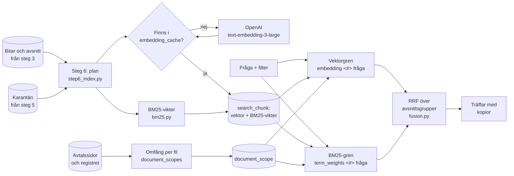

# M5 – Sökning och första mätning

**Mål:** göra avsnitten sökbara (steg 6 i inläsningen) och bygga sökningen som agentens verktyg
`sok_dokument` ska använda: embeddings och BM25 i samma Postgres, sammanslagna med Reciprocal
Rank Fusion, med filter på ramavtalsområde, upphandling, avtal och dokumenttyp. Mäta den på en
svensk testsamling, så att valet av modell och metod vilar på siffror. Besluten och varför står
i [ADR 0011](../adr/0011-hybridsokning.md).

**Klart när:** sökningen fungerar på urvalet, och träffsäkerheten är mätt på testsamlingen för
vektorsökning, BM25 och hybriden.

## Resultat

Mätt 2026-10-06 på urvalet från M4 (207 filer, fyra ramavtalsområden), med samma karantän som M4
gav: 12 filer och 4 avsnitt hölls tillbaka. Mätningen gjordes före 2026-10-07, då Simon godkände
nio av avvikelserna i `accepted_findings.toml`; sedan dess hålls 3 filer och 4 avsnitt tillbaka,
och indexet byggs som i den högra kolumnen nedan.

**Indexet.**

| | Vid mätningen | Med de nio godkända |
|---|---:|---:|
| Bitar som indexeras | 13 178 | 13 935 |
| Bitar i karantän | 801 | 44 |
| Filer med bitar i indexet | 195 | 204 |
| Unika texter som bäddas in | 13 046 | 13 803 |
| Ordstammar i BM25-indexet | 15 097 | 15 162 |
| Stammar per bit i medel | 77 | 76 |
| Avsnitt i indexet | 10 773 | 11 448 |
| Avsnittsgrupper (avsnitt med samma text är en grupp) | 5 741 | 5 813 |
| Grupper med kopior | 1 333 | 1 377 |
| Grupper där kopiorna har olika nummer | 464 | 479 |

Att bädda in urvalet med `text-embedding-3-large` tar omkring en halv minut med fyra anrop
samtidigt och kostar under 1 USD. Steg 6 skickar ett anrop i taget, så det tar några minuter.
BM25-vikterna räknas ut på en sekund.

**Testsamlingen.** `evals/datasets/gold_sv.jsonl` har 30 frågor som en upphandlare kunde ställa,
skrivna utifrån dokumenten i urvalet. Varje fråga har svaret, källan (fil, avsnitt, sidor och ett
ordagrant citat) och varför den är svår. Simon granskar frågorna; listan att granska är
`implementering/testfragor-v1.md` i projektets filer.

| Kategori | Frågor | Sökfrågor |
|---|---:|---:|
| Enkel uppslagning | 9 | 9 |
| Flerstegshänvisning | 7 | 7 |
| Ändring ersätter klausul | 3 | 3 |
| Jämförelse mellan leverantörer eller delområden | 3 | 3 |
| Registerfråga | 4 | 0 |
| Fråga utan svar i avtalen | 4 | 0 |

22 frågor har minst ett avsnitt som källa och mäts här. Registerfrågorna besvaras ur registret och
frågorna utan svar ska få svaret att avtalen inte säger det; båda mäts när agenten finns (M7).
En källa kan ha flera godtagbara avsnitt (samma klausul i två dokument), och en fråga kan ha flera
källor som alla behövs.

**Mätningen.** Måtten räknas på avsnittsgrupper, eftersom sökningen ger en träff per grupp:

- *träff@k*: andelen av frågornas källor som finns bland de k första träffarna, i medel över
  frågorna;
- *MRR@10*: 1 delat med platsen för den första rätta träffen, 0 om den inte finns bland de tio
  första;
- *nDCG@10*: som träff@10 men med mer poäng ju högre upp källorna kommer;
- *alla@10*: andelen frågor där alla källor finns bland de tio första.

Frågorna har sina filter (ramavtalsområde eller avtal), som agenten kommer att sätta.
Embeddings med API:ets egna dimensioner, på de 13 178 bitarna före godkännandet.

| Sökning | träff@1 | träff@3 | träff@5 | träff@10 | träff@20 | träff@50 | MRR@10 | nDCG@10 | alla@10 |
|---|---:|---:|---:|---:|---:|---:|---:|---:|---:|
| BM25 | 0,30 | 0,55 | 0,62 | 0,73 | 0,85 | 0,95 | 0,57 | 0,56 | 0,59 |
| Vektor, 1 536 dim | 0,42 | 0,53 | 0,81 | 0,81 | 0,89 | 0,97 | 0,65 | 0,65 | 0,68 |
| Vektor, 3 072 dim | 0,42 | 0,60 | 0,73 | 0,86 | 0,89 | 0,97 | 0,64 | 0,66 | 0,73 |
| **Hybrid, 1 536 dim** | **0,52** | **0,65** | **0,74** | **0,86** | **0,93** | **0,97** | **0,81** | **0,73** | **0,77** |
| Hybrid, 1 024 dim | 0,43 | 0,64 | 0,76 | 0,88 | 0,93 | 0,97 | 0,73 | 0,70 | 0,82 |
| Hybrid, 3 072 dim | 0,49 | 0,67 | 0,76 | 0,83 | 0,93 | 0,97 | 0,78 | 0,71 | 0,73 |

Skillnaderna med 95 % intervall (parad bootstrap över frågorna, 10 000 omdragningar):

| Jämförelse | Mått | Skillnad | Intervall |
|---|---|---:|---|
| Hybrid mot BM25 (1 536) | nDCG@10 | +0,18 | +0,07 till +0,29 |
| Hybrid mot vektor (1 536) | nDCG@10 | +0,08 | −0,02 till +0,18 |
| 1 536 mot 1 024 dim (hybrid) | MRR@10 | +0,08 | +0,01 till +0,16 |
| 1 536 mot 1 024 dim (hybrid) | nDCG@10 | +0,03 | −0,01 till +0,09 |
| 1 536 mot 3 072 dim (hybrid) | nDCG@10 | +0,02 | 0,00 till +0,05 |

Hybriden med 1 536 dimensioner valdes ([ADR 0011](../adr/0011-hybridsokning.md) beslut 9): den
ger den första rätta träffen högst upp, och agenten läser de första träffarna.

**Per kategori** (hybrid, 1 536 dim):

| Kategori | Frågor | träff@10 BM25 | träff@10 vektor | träff@10 hybrid | nDCG@10 hybrid |
|---|---:|---:|---:|---:|---:|
| Enkel uppslagning | 9 | 0,78 | 0,89 | 1,00 | 0,90 |
| Flerstegshänvisning | 7 | 0,64 | 0,76 | 0,76 | 0,70 |
| Ändring ersätter klausul | 3 | 1,00 | 0,83 | 0,83 | 0,57 |
| Jämförelse | 3 | 0,50 | 0,67 | 0,67 | 0,48 |

**Där sökningen inte räcker.** Alla enkla uppslagningar hittas bland de tio första. Det som
missas är det agenten ska klara med fler steg:

- *Flerstegshänvisningar* (q14, q15, q19): den första källan hittas överst, men nästa källa nås
  bara genom att följa en hänvisning i den, till exempel "avsnitt Särskild ersättning i Allmänna
  villkor" eller kartbilagan som visar att Visby ligger i Småland med öarna. Det gör verktyget som
  följer hänvisningar (M6).
- *Jämförelser* (q25): frågan gäller två delområden, och avsnitt om delområdena i vägledningen
  och i den förra upphandlingen (23.3-2940-20), med nästan samma rubriker, kommer före. Agenten
  söker en gång per delområde och med avtalets filter.
- *Ändringar* (q21): den gamla lydelsen kommer på plats 6 och rättelsen i frågeloggen på plats
  11. Agenten ska leta efter ändringar och ge dem företräde (verktyget som hittar ändringar, efter M7).

**Andra varianter** (hybrid, 1 536 dim):

| Variant | träff@10 | MRR@10 | nDCG@10 |
|---|---:|---:|---:|
| Som ovan | 0,86 | 0,81 | 0,73 |
| Utan filtren | 0,82 | 0,71 | 0,67 |
| RRF k = 10 (i stället för 60) | 0,88 | 0,81 | 0,75 |
| RRF k = 30 eller 100 | 0,86 | 0,81 | 0,73 |
| De nio avvikelserna i beslutskortet godkända (13 935 bitar) | 0,84 | 0,77 | 0,71 |

- Filtren betyder mest: utan dem kommer andra ramavtals text med samma ord före.
- k = 10 flyttar upp en källa i en fråga. Skillnaden är för liten för att byta bort standardvärdet
  60.
- Simon godkände de nio avvikelserna 2026-10-07, så 757 bitar till blev sökbara och indexet byggs
  nu med 13 935 bitar. Sökningen blev något sämre på de här frågorna, eftersom fler kopior och
  liknande texter konkurrerar; ingen av frågorna har sin källa i de nio filerna. Med de nio
  godkända har hybriden med 1 536 dimensioner fortfarande högst MRR@10 (0,77, lika med
  3 072-hybriden, mot 0,72 för 1 024-hybriden, 0,63 för vektorsökningen med 1 536 och 0,62 för
  BM25), men 1 024-hybriden och vektorsökningen med 3 072 dimensioner hittar fler källor bland de
  tio första (träff@10 0,86 mot 0,84; före godkännandet var det bara 1 024-hybriden). Valet står
  kvar på samma grund som förut.
- Den första mätningen gjordes med 3 072-vektorer som kortades till 1 024 och 1 536. Det gav
  nästan samma vektorer (cosinus 0,996–0,999 mot API:ets egna) men en annan ordning i några
  frågor, så siffrorna ovan kommer från API:ets egna dimensioner, som produktionen använder.

**En lokal modell** (BGE-M3, 1 024 dim, körd på processorn i samma miljö):

| Sökning | träff@1 | träff@10 | MRR@10 | nDCG@10 | alla@10 |
|---|---:|---:|---:|---:|---:|
| Vektor, OpenAI 1 536 | 0,42 | 0,81 | 0,65 | 0,65 | 0,68 |
| Vektor, BGE-M3 | 0,45 | 0,83 | 0,72 | 0,70 | 0,68 |
| Hybrid, OpenAI 1 536 | 0,52 | 0,86 | 0,81 | 0,73 | 0,77 |
| Hybrid, BGE-M3 | 0,45 | 0,87 | 0,75 | 0,71 | 0,77 |

- Ensam rankar BGE-M3 bättre än OpenAI, men med BM25 vinner OpenAI på träff@1, MRR och nDCG.
  Det är hybriden som körs, så OpenAI behålls. Skillnaderna ligger inom testsamlingens brus.
- BGE-M3 tog drygt två timmar att bädda in de 13 847 bitarna på processorn, mot några minuter
  via API:et. Den kan bytas in bakom `Embedder` om data inte får lämna egna servrar.

## Flödet



```bash
uv run alembic upgrade head                     # skapar söktabellerna (migrering 0005)
uv run python -m avtalsagent.ingestion index    # steg 6: bygger sökindexet
uv run python -m avtalsagent.ingestion run      # steg 1–6 i ett svep
uv run python -m avtalsagent.ingestion search "Hur stort är vitet om konsulten byts ut?" \
    --area "IT-konsulttjänster Resurskonsulter"
uv run python -m evals.run_retrieval_eval       # mätningen på det byggda indexet
```

`index`, `run` och `search` behöver `OPENAI_API_KEY`. `process` tömmer indexet i samma transaktion som
den sparar nya avsnitt, så efter `process` måste `index` köras igen; embeddings som redan finns
hämtas ur cachen.

## Vad som byggdes, fil för fil

### 1. `domain/search.py` – modellerna

Värden utan databas: en bits nyckel (`ChunkKey`: fil, avsnitt, bit), en fils omfång
(`DocumentScope`), en bit som den indexeras (`IndexedChunk`: texten som bäddas in, dess hash,
avsnittsgruppen och stammarna), planen för hela indexet (`IndexPlan`), sökningens filter
(`SearchFilters`) och grenarnas och fusionens resultat (`RankedChunk`, `FusedSection`).

### 2. `retrieval/swedish_text.py` – texten till ordstammar

Analysen som BM25 räknar på, för både bitarna och frågorna. Texten normaliseras (NFC) och görs
till gemener. Ett reguljärt uttryck tar diarie- och avtalsnummer, datum, organisationsnummer och
punktnummer hela, och annars ord av bokstäver och siffror. Stoppord är PostgreSQL 17:s svenska
lista plus "ska" och "skall", och ord med bara bokstäver stammas med Snowballs svenska stemmer.
Postgres egen `to_tsvector('swedish')` används inte: dess stemmer håller isär "avtalet" och "avtal",
den behåller "ska", och den delar "leverantör/underleverantör" fel. `ANALYSER` namnger analysen med
stemmerns version och sparas med indexet.

### 3. `retrieval/bm25.py` – vikterna

`build_term_index` ger varje stam ett id och räknar i hur många bitar den finns.
`document_weights` ger en bits BM25-vikt för varje stam: IDF gånger en mättad termfrekvens som
väger in bitens längd (k1 = 1,2, b = 0,75). En fråga får vikten 1 för varje stam, så produkten
av frågan och bitens vikter är bitens BM25-poäng.

### 4. `retrieval/embedder.py` – embeddings

`Embedder` är gränssnittet (namn, `embed_documents`, `embed_query`), så en annan modell kan bytas in
och testerna kan använda en påhittad. `OpenAIEmbedder` skickar omgångar om
`EMBEDDING_BATCH_SIZE` texter med `dimensions` från inställningarna och normaliserar vektorerna.
Namnet är modell och dimension (`text-embedding-3-large:1536`), och det är nyckeln i cachen och i
indexet. Ett fel från OpenAI blir `EmbeddingError` med feltypen, aldrig nyckeln.

### 5. `ingestion/step6_index.py` – steg 6 utan databas

`plan_index` tar de bitar som karantänen släpper igenom, i nyckelordning, och ger varje bit dess
text att bädda in (kontextrubriken, en tom rad, biten), textens hash, avsnittsgruppen och
stammarna. `section_hash` tar bort avsnittets inledande nummer ("6.17", också "6.17."), men bara
när det står ensamt, så "6.1" inte tas från "6.17", och slår ihop blanktecken innan texten
hashas. `document_scopes` ger varje fil ramavtalsområden, diarie- och avtalsnummer och
avtalssidornas titlar, från alla avtalssidor som länkar till filen (numren skrivs som registret
skriver dem), och dokumenttypen från steg 4. Samma funktioner används av `index` och av mätningen.

### 6. `ingestion/index_store.py`, `db/models.py` och migreringen `0005`

Fem tabeller. `search_chunk` har en rad per indexerad bit med avsnittsgrupp, embedding (`vector`)
och BM25-vikter (`sparsevec`). `search_term` har stammarna med id. `document_scope` har filernas
omfång, med GIN-index på områden, diarie- och avtalsnummer och ett index på dokumenttypen.
`index_build` har en enda rad om indexet: modell, analys och antal. `embedding_cache` sparar
embeddings per modell och texthash och överlever en ombyggnad. `search_chunk` och
`document_scope` tas bort med sin bit eller fil (`ON DELETE CASCADE`); `search_term` och
`index_build` töms av `clear_index`, som `process` kör. `save_index` ersätter hela indexet i en
transaktion. `lock_index` tar ett lås i databasen (advisory lock) först i de transaktioner där
`process` och `index` skriver, så de väntar på varandra. Migreringen skapar tillägget `vector`.

### 7. `retrieval/fusion.py` och `retrieval/hybrid_search.py` – sökningen

`vector_candidates` och `text_candidates` är grenarna, en SQL-fråga var med filtren i WHERE och
exakt rangordning, där lika avstånd avgörs av bitens nyckel. `fusion.section_ranking` gör en grens
bitar till avsnittsgrupper, och `fusion.fuse` slår ihop grupperna med RRF. `search` kontrollerar
först att indexet är byggt med samma modell och analys (annars `IndexNotReadyError`), kör grenarna
och fusionen och läser sedan in de bästa träffarna med fil, nummer, rubrik, sidor, omfång, den
bästa bitens text och kopiorna inom filtret.

### 8. `ingestion/__main__.py` och `config.py`

Nya kommandon: `index` (steg 6) och `search` (skriver ut träffarna, för kontroll och som reserv
i demon, med filtren `--area`, `--agreement` och `--type`, till exempel `--type general_terms`).
En blank fråga eller `--limit 0` stoppas med ett tydligt fel. `run` slutar med `index` och
behöver därför `OPENAI_API_KEY`, som den kontrollerar innan den hämtar något. `process` tömmer
indexet. `index` bäddar in det som saknas i cachen i omgångar och sparar cachen efter varje
omgång, så en avbruten körning behåller det den gjort. Om bitarna, karantänen eller avtalssidorna
har ändrats under tiden sparas inget. `index` stoppar också när en fil har förlorat sin sista
avtalssida efter senaste `process` (steg 5 skulle hålla tillbaka den men har inte sett det). Nya
inställningar: `EMBEDDING_MODEL`, `EMBEDDING_DIMENSIONS` (1536), `EMBEDDING_BATCH_SIZE`,
`SEARCH_CANDIDATES` (100 per gren), `RRF_K` (60) och `SEARCH_LIMIT` (8 träffar).

### 9. `evals/` – mätningen

- `datasets/gold_sv.jsonl`: testsamlingen. Citaten är korta utdrag ur publika dokument.
- `gold.py`: läser frågorna och hittar varje källas avsnitt i databasen. Citatet måste finnas
  ordagrant i avsnittet, annars stoppas mätningen, så en fråga kan inte tyst peka fel efter en ny
  tolkning.
- `offline.py`: samma index i minnet (numpy), byggt av samma `plan_index`, och samma två grenar
  och fusion. Med den kan en annan modell eller dimension mätas utan att produktionsindexet byggs
  om.
- `metrics.py`: träff@k, alla@k, MRR, nDCG och parad bootstrap.
- `run_retrieval_eval.py`: kör mätningen och skriver en rapport i Markdown och JSON till
  `evals/reports/`. Utan flaggor mäts det byggda indexet med produktionens SQL; med `--offline`
  byggs indexet i minnet, och `--model` och `--dimensions` väljer en annan embedding.

## Tester

| Fil | Vad den visar |
|---|---|
| `tests/unit/retrieval/test_swedish_text.py` | Stammar och identifierare med meningar ur urvalet; stoppord; att frågor och bitar analyseras lika |
| `tests/unit/retrieval/test_bm25.py` | IDF, vikterna räknade för hand, längdnormaliseringen |
| `tests/unit/retrieval/test_fusion.py` | Avsnittsgrupperna, RRF-poängen, att lika poäng alltid ger samma ordning |
| `tests/unit/retrieval/test_embedder.py` | Omgångar, ordningen i svaret, normaliseringen, tomma texter och fel från OpenAI, med en påhittad klient |
| `tests/unit/ingestion/test_step6_index.py` | Karantänen, texten som bäddas in, avsnittsgrupper med och utan nummer, omfånget i registrets stavning |
| `tests/unit/evals/` | Mätningens index, måtten, testsamlingen och rapporten |
| `tests/unit/ingestion/test_ingestion_main.py` | `index` och `search` utan databas: loggraderna, utskriften, en saknad nyckel, en blank fråga |
| `tests/integration/test_index_store.py` | Tabellerna mot riktig Postgres: spara och ersätta indexet, cachen, kaskaden när en fil tas bort |
| `tests/integration/test_hybrid_search.py` | Sökningen mot Postgres med en påhittad embedder: filtren, kopiorna, `IndexNotReadyError`, och att SQL-sökningen ger exakt samma bitar i samma ordning som mätningens index |
| `tests/integration/test_migrations.py` | Migreringarna ger samma schema som modellerna |

## Kända begränsningar

- **Bitarnas storlek** (högst 1 500 tecken, [ADR 0008](../adr/0008-tolkning-och-uppdelning.md))
  är inte mätt mot andra storlekar. Det kräver en ny `process` med en annan storlek och en ny
  mätning.

- **Testsamlingen är liten.** 22 sökfrågor räcker för att se att hybriden slår BM25, men inte för
  att skilja 1 024 från 1 536 dimensioner eller hybriden från vektorsökningen med säkerhet.
  Samlingen ska växa med fler frågor och fler ramavtalsområden.
- **Frågorna är skrivna av oss**, utifrån dokumenten, och granskas av Simon. Ingen upphandlare
  har ställt dem.
- **Ingen omrankning.** En omrankare på processorn tar 25–80 sekunder per fråga. Den kan läggas
  efter fusionen och mätas på samma frågor.
- **Hela indexet byggs om** när något ändras, eftersom BM25:s IDF och medellängd beror på alla
  bitar. Embeddings som redan finns hämtas ur cachen, så det tar några sekunder plus de nya
  texterna.
- **En sökning under en ombyggnad** kan läsa det gamla indexets termer och det nya indexets bitar,
  eftersom grenarna är två frågor. Ombyggnaden görs när ingen söker; i drift ska sökningen köras
  i en transaktion med `REPEATABLE READ`.
- **Databasdelen** testas bara i CI. Ingen körning av `index` mot hela urvalet i Postgres har gjorts
  ännu; siffrorna ovan kommer från mätningens index, som integrationstestet visar ger samma
  ordning som SQL-sökningen.

## Så verifierar du M5 själv

```bash
uv run pytest
docker compose up -d postgres --wait
uv run alembic upgrade head
uv run python -m avtalsagent.ingestion run          # eller bara index om process redan körts
uv run python -m avtalsagent.ingestion search "Vilken uppsägningstid gäller för avropsavtalet?"
uv run python -m evals.run_retrieval_eval           # skriver evals/reports/retrieval-*.md
```

Jämför rapportens tabell med tabellen ovan. Med `--offline --dimensions 1024` mäts 1 024
dimensioner utan att indexet byggs om.
