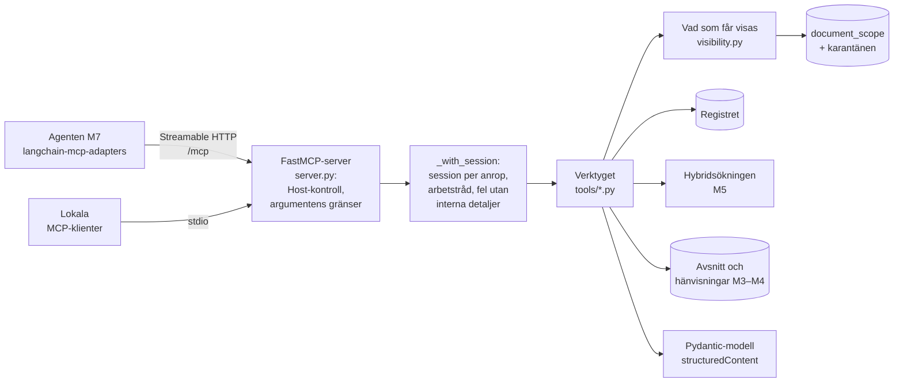

# M6 – Verktygslagret avtal-mcp

**Mål:** bygga verktygslagret som agenten (M7) hämtar all sin data genom: MCP-servern `avtal-mcp`
([ADR 0003](../adr/0003-mcp-som-verktygslager.md)) med sex läsande verktyg ovanpå registret (M1),
avsnitten och hänvisningarna (M3–M4) och sökningen (M5). Verktygen ska bara kunna läsa, aldrig
visa något som inläsningen håller tillbaka, och ge svar med de fält som svarets citat behöver.
Besluten och varför står i [ADR 0012](../adr/0012-avtal-mcp.md).

**Klart när:** de sex verktygen svarar genom MCP, varje verktyg har tester utan språkmodell
(enhetstester utan databas och integrationstester mot Postgres), och servern startar över HTTP och
stdio och listar verktygen. En egen container i Docker Compose och ett prov med MCP Inspector
återstår (se Kända begränsningar).

## Resultat

Verktygen heter som i kontraktet med webbappen (`webbapp-kontrakt.md`), inte som i
arkitekturplanen: `sok_dokument` heter `search_documents`, `las_avsnitt` `read_section`,
`visa_innehall` `get_outline`, `folj_hanvisning` `resolve_reference`, `lista_dokument`
`list_documents` och `sok_register` `search_register`. `find_amendments` och `calculate_date`
kommer senare, och `ask_user` ligger i agentens graf (M7).

| Verktyg | Argument (? = valfritt) | Svar |
|---|---|---|
| `search_documents` | `query`, `framework_area?`, `agreement_number?`, `document_type?`, `limit` (8, högst 20) | `hits`: de bästa avsnitten med citatfälten, omfånget (ramavtalsområden, avtalsnummer), rubrikstigen, den bästa bitens text (`snippet`), poäng och plats i båda grenarna, och kopiorna (`copies`): andra dokument i filtret med samma text |
| `read_section` | `sha256`, `section_number?`, `section_position?` | Ett helt avsnitt: citatfälten, rubrikstigen, hela texten som den är sparad, hänvisningarna i avsnittet med de mål som får visas, och `held_back_targets` |
| `get_outline` | `sha256` | Filens titel, typ och avtalssidor, och alla avsnitt i ordning (plats, nummer, rubrik, nivå, första sida), utan de som hålls tillbaka; `held_back` räknar dem |
| `resolve_reference` | `sha256`, `section_number?`, `section_position?`, `reference?` | Avsnittets citatfält och dess hänvisningar, eller bara de vars text innehåller `reference`: text, slag, status och de mål som får visas (avsnitt eller hel fil), och hur många mål som hålls tillbaka |
| `list_documents` | `framework_area?`, `agreement_number?`, `document_type?` (minst ett), `limit` (50, högst 200) | `documents`: filerna i filtret med sha256, titel, typ, avtalssidor, ramavtalsområden, avtalsnummer, versionsdatum och antalet avsnitt som `get_outline` visar; avtalets dokument först, sedan upphandlingens och sist stöd för avrop; `total` räknar alla träffar |
| `search_register` | `supplier?`, `agreement_number?`, `framework_area?`, `sub_area?`, `org_number?` (minst ett), `valid_on?`, `limit` (20, högst 20), `offset` (0) | `rows`: ett avtal i ett delområde per rad, med avtals- och upphandlingsnummer, leverantör, organisationsnummer, leverantörens tidigare namn (`former_names`), ramavtalsområde, delområde och datumen från, till och längsta förlängning; `total` räknar alla rader, och med `offset` bläddrar modellen vidare |

**Citatfälten** finns på varje avsnitt som ett verktyg ger: `sha256`, `file_title`,
`document_type`, `page_titles` (avtalssidorna som länkar till filen), `section_position`,
`section_number`, `section_title`, `page_start` och `page_end`. Svarssteget i M7 kan kopiera dem
till svarets citat (`file_title`, `page_title`, `section_number`, `section_title`, `page`).

**Vad verktygen får visa** är samma som sökindexet: en fil när den har en rad i `document_scope`
(steg 6 skriver den bara för filer med indexerade bitar) och karantänen inte håller den, och ett
avsnitt när dessutom karantänen inte håller avsnittet. Regeln läses vid varje anrop, så ett fynd
som sparas efter att indexet byggdes gäller direkt. Ett avsnitt som hålls tillbaka saknas i
innehållsförteckningen och bland hänvisningarnas mål och räknas i stället. Att läsa det ger ett fel
som säger att det hålls tillbaka. Mellan `process` och `index` visar verktygen ingenting:
`search_documents` och `list_documents` säger att sökindexet inte är byggt, i stället för en tom
lista, och de andra att dokumentet inte är indexerat.

**Filtren kontrolleras mot registret.** Ett ramavtalsområde jämförs utan hänsyn till versaler och
ett avtalsnummer med sin nyckel, så `bemanningstjänster` och `23.3.5890-23-003` fungerar. Registret
kan skriva ett avtal på två sätt på olika rader (`23.3-12000-2020-001` och `23.3-12000-2020-01`):
`search_register` ger då raderna för båda stavningarna, och dokumentverktygen använder den stavning
som indexet sparade, så att leverantörens avtal kommer med. Ett nummer utan leverantörens
löpnummer, som `23.3-5890-2023`, betyder hela upphandlingen. Ett värde som registret inte har ger
ett fel som säger vad modellen kan göra (ett okänt område listar alla områden), i stället för en
tom lista som modellen skulle tolka som att avtalen inte säger något.

**Felen** är skrivna för modellen och säger vad den ska göra härnäst:

| Fel | När | Exempel på meddelande |
|---|---|---|
| `NotFoundError` | Filen, avsnittet eller värdet finns inte, hålls tillbaka eller är inte indexerat | "Det finns inget avsnitt med nummer 9.9 i dokumentet … Kontrollera numret med get_outline." |
| `AmbiguousError` | Två avsnitt har samma nummer, eller numret och platsen gäller olika avsnitt | "Numret 6.21.4 finns på flera avsnitt i dokumentet …: plats 0 (…), plats 1 (…). Ange section_position för det avsnitt du menar." |
| `MissingArgumentError` | Inget av de argument som verktyget behöver ett av | "Ange minst ett av framework_area, agreement_number och document_type. …" |
| `UnavailableError` | Sökningen saknar embeddingmodell eller index, eller OpenAI svarar inte; `list_documents` utan index | "Sökindexet är inte byggt, eller byggt med en annan inbäddningsmodell, … Säg det till användaren i stället för att svara utan källor." |
| Databasfel | Databasen svarar inte, eller en fråga misslyckas | "Databasen kunde inte svara just nu. Försök igen om en stund; …" (SQL och anslutning loggas, men når aldrig modellen) |

Ett argument utanför sina gränser (`limit` 500, en sha256 med versaler, en blank fråga, tecknet NUL
i en text) stoppas av servern innan någon session öppnas. Det gör också ett argumentnamn som
verktyget inte har, till exempel `supplier` till `search_documents`: varje schema har
`additionalProperties: false`, och felet räknar upp verktygets argument ("search_documents har inget
argument som heter supplier. Verktyget tar bara query, …"). SDK:t skulle annars tyst släppa
argumentet och svara utan filtret. "Sökte och hittade inget" är en tom lista, inte ett fel.

**Servern startad på riktigt**, utan databas, 2026-10-06: `/health` svarade 200 och `tools/list`
gav de sex verktygen i kontraktets ordning, alla med `readOnlyHint: true`, en beskrivning på
varje argument och ett `outputSchema` (`SearchResult`, `Section`, `Outline`, `ReferenceResult`,
`DocumentList`, `RegisterResult`). Med Host `mcp:9999` svarade `/mcp` 421, och ett anrop av
`get_outline` gav databasfelets fasta meddelande.

## Flödet



```bash
uv run python -m avtalsagent.mcp_server http        # http://127.0.0.1:8001/mcp och /health
uv run python -m avtalsagent.mcp_server http --host 0.0.0.0 --port 8001   # i en container
uv run uvicorn --factory avtalsagent.mcp_server.server:create_app --port 8001   # samma app
uv run python -m avtalsagent.mcp_server stdio       # över stdin och stdout
```

Servern läser `DATABASE_URL` och `OPENAI_API_KEY` från miljön eller `.env`. Utan nyckel startar
den ändå: `search_documents` svarar med ett fel som pekar på `list_documents` och `get_outline`,
och de andra verktygen fungerar. `MCP_ALLOWED_HOSTS` är de Host-huvuden som servern tar emot
(standard `localhost:*`, `127.0.0.1:*` och `mcp:8001`, tjänstens planerade namn i Docker
Compose).

## Vad som byggdes, fil för fil

### 1. `mcp_server/server.py` och `__main__.py` – servern

`build_server` gör en FastMCP-server av verktygen i `tools.TOOLS`. Den är en liten underklass,
`AvtalMCP`, som publicerar varje argumentschema med `additionalProperties: false` och avvisar ett
anrop med ett okänt argumentnamn med ett svenskt fel, innan någon session öppnas. Den ger också
modellen svaret som kompakt JSON: FastMCP skriver textversionen av ett strukturerat svar med
indrag, och indragen var en sjättedel av tecknen i verktygssvaren när agenten provkördes live
(M7, fem frågor).
`_with_session` gör varje verktyg till ett asynkront MCP-verktyg vars signatur saknar `session`
(och `embedder`, när den är andra parametern), så att SDK:t bygger argumentens schema av resten
och kontrollerar varje anrop mot det. Vid ett anrop öppnas en session, verktyget körs i en
arbetstråd (SDK:t 1.x skulle annars blockera sin händelseloop med den synkrona frågan) och
sessionen stängs. Ett `ToolError` från
verktyget går igenom; ett databasfel och alla andra undantag ersätts med ett fast svenskt
meddelande och loggas. Varje verktyg registreras med sin docstring som beskrivning, de läsande
annoteringarna (`READ_ONLY`) och strukturerat svar. Servern är tillståndslös
(`stateless_http=True`), svarar med JSON (`json_response=True`) och kontrollerar Host och Origin.
`/health` svarar utan att fråga databasen. `create_app` och `main` använder en skrivskyddad
anslutning och den inställda embeddingmodellen, med 15 sekunders timeout och ett nytt försök
(`QUERY_TIMEOUT`, `QUERY_RETRIES`): sökningen håller en databasanslutning och en arbetstråd medan
frågan bäddas in, och OpenAI-klienten skulle annars vänta 600 sekunder tre gånger.
`INSTRUCTIONS` säger modellen vilket verktyg den ska börja med och att den anger en källa med
dokumentets `sha256` och avsnittets `section_position`.

### 2. `mcp_server/arguments.py` – argumenten

En `Annotated`-typ per slags argument, med gränser och en svensk beskrivning som modellen läser.
Namnen är kontraktets där dess punkt 5 har ett (`query`, `framework_area`, `agreement_number`,
`sha256`, `section_number`, `reference` och `limit`); `document_type`, `section_position`,
`supplier`, `sub_area`, `org_number`, `valid_on` och `offset` är nya namn som ska skickas till
webbappstråden. De valfria argumentens typer har `None` i sig (`framework_area: FrameworkArea =
None`), så att beskrivningen hamnar på argumentet i JSON-schemat och inte inuti `anyOf`, där alla
klienter inte letar. Dokumenttyperna listas som strängar, utan enumens engelska docstring. En
fråga trimmas, så en blank fråga är för kort. Varje texttyp avvisar tecknet NUL, som Postgres inte
kan spara: annars skulle frågan misslyckas och modellen få höra att databasen inte svarar.

### 3. `mcp_server/errors.py` – felen

`NotFoundError`, `AmbiguousError`, `MissingArgumentError` och `UnavailableError`, underklasser
till SDK:ts `ToolError`, så att servern släpper igenom dem till modellen.

### 4. `mcp_server/visibility.py` – vad verktygen får visa

`load_visibility` läser de indexerade filerna (`document_scope`) och karantänen
(`extraction_store.quarantine`) en gång per anrop; `Visibility.shows_file` och `shows_section`
är regeln ovan. `register_area`, `register_agreements` och `register_procurements` slår upp ett
område, ett avtalsnummer och ett upphandlingsnummer i registret och ger registrets stavning;
`register_agreements` ger alla stavningar med samma nyckel. `document_filters` gör om filtren i
`search_documents` och `list_documents` till sökningens `SearchFilters`, med den av avtalets
stavningar som indexet sparade i `document_scope` (steg 6 sparar en per nyckel).

### 5. `mcp_server/results.py` och `references.py` – citatfälten och hänvisningarna

`SectionRef` är citatfälten och `section_refs` läser dem för flera avsnitt i en fråga.
`section_references` läser ett avsnitts hänvisningar i den ordning de står i texten
(`document_reference`) och deras mål (`reference_target`). Varje mål kontrolleras mot regeln;
de som får visas får sina citatfält, ett mål som är en hel fil har avsnittsfälten tomma, och de
andra räknas. Ett mål som sparats en gång per avtalssida visas, eller räknas, en gång.

### 6. `tools/search_documents.py`

Kör M5:s `hybrid_search.search` med filtren i registrets stavning och inställningarnas antal
kandidater och k, och tar bort träffar och kopior som regeln inte visar (indexet saknar redan det
som var i karantän när det byggdes). Saknas embeddingmodellen, är indexet inte byggt eller byggt
med en annan modell, eller svarar OpenAI inte (inom 15 sekunder, två försök), blir det ett
`UnavailableError` på svenska.

### 7. `tools/read_section.py`, `get_outline.py` och `resolve_reference.py`

`read_section` hittar avsnittet med `find_section`: på plats (`section_position`) eller med
nummer, där mellanslag runt numret och en avslutande punkt inte räknas. Anges båda måste de gälla
samma avsnitt; en sökträff har båda, så modellen kan skicka dem vidare. `require_file` säger om en
fil saknas, hålls tillbaka eller inte är indexerad. Texten är exakt den sparade, eftersom
citatkontrollen (M8) jämför citaten med den. `get_outline` ger filens avsnitt utan de som hålls
tillbaka. `resolve_reference` ger ett avsnitts hänvisningar, eller de som innehåller `reference`
(utan hänsyn till versaler); beskrivningen förklarar de nio statusarna från M4.

### 8. `tools/list_documents.py` och `search_register.py`

`list_documents` använder sökningens egna villkor på `document_scope`
(`hybrid_search.scope_conditions`, som blev publik), så en lista och en sökning med samma filter
gäller samma filer. Antalet avsnitt räknas utan de som hålls tillbaka. Utan index
(`current_build`) svarar den med samma slags `UnavailableError` som sökningen. `search_register`
frågar registrets tabeller (`agreement`, `agreement_sub_area`, `sub_area` och `supplier_name`) med
ett villkor per argument, sorterar raderna och hoppar sedan över `offset` av dem; `total` räknar
alla. Ett avtalsnummer ger raderna för alla registrets stavningar av avtalet.
En leverantör är en del av avtalets leverantörsnamn eller av något namn eller tidigare namn som
registret har för organisationsnumret, utan hänsyn till versaler och med `%` och `_` som vanliga
tecken. Ett organisationsnummer skrivs om som M1 sparar det (`5562149996` och
`SE556214999601` blir `556214-9996`). `valid_on` behåller rader där datumet ligger mellan från och
till; längsta förlängning räknas inte. En tredje fråga läser de tidigare namn ("f.d." i
registret) som sidans organisationsnummer har, så att modellen kan svara på "har bolaget hetat
något annat?" ur raden. Provkörningen av agenten (M7) hittade den luckan: utan fältet kunde
leverantören hittas på sitt gamla namn, men modellen fick aldrig se namnet.

`sub_area` (tillagt efter M8) begränsar till delområden och regioner. Registrets delområde är en
väg i upp till fem nivåer, i Bemanningstjänster till exempel "Bemanningstjänster /
Bemanningstjänster - IT-tjänster upp till 1000 timmar / Övre Norrland". Argumentet delas vid
"/", och vägen ska innehålla varje del, i vilken ordning som helst och utan hänsyn till versaler
(ILIKE med `%` och `_` som vanliga tecken). Modellen skriver då de delar den vet, "IT-tjänster /
Övre Norrland", och får 14 rader: de sju avtalen i båda delområdena för IT-tjänster i regionen.
En enda delsträng av hela vägen hade gett noll rader för just den texten, och bara den sista
nivån hade missat tjänstegruppen, som står på nivå två. `sub_area` räcker som enda filter.
Finns ingen rad, frågar verktyget om något delområde alls har delarna (inom området, om det är
angivet). Har inget det, är det ett fel, så att en felstavad region inte läses som "inga
leverantörer där". Med `framework_area` räknar felet upp områdets delområden (högst 40 namn,
annars ett råd att söka med en kortare del); utan det ber felet om `framework_area` eller en
kortare del. Nivå 1 är oftast områdets eget namn, men i Hotelltjänster, Hotelltjänster Longstay
och Konferenser och möten ett län, så felet räknar upp alla nivåer utom områdets eget namn. Ett
delområde som finns men som de andra filtren utesluter ger en tom lista.
Filtret kom till efter provkörningen av M8: utan det fick agenten bläddra igenom alla 224 rader
i Bemanningstjänster för att räkna upp leverantörerna i en region, och den slutade efter 60.
Filtret ersätter inte bläddrandet: "IT-tjänster / Övre Norrland" ryms på en sida (14 rader),
men regionen i hela Bemanningstjänster är 28 rader och ett län i Konferenser och möten flera
hundra. Prompten säger därför åt agenten att hämta sidor tills den har läst `total` rader.

### 9. Utanför paketet

- `db/session.py`: `create_db_engine(read_only=True)` sätter `default_transaction_read_only=on`
  på varje anslutning och isoleringsnivån `REPEATABLE READ`, så ett verktygsanrop läser en
  ögonblicksbild och inte kan skriva.
- `config.py`: `MCP_URL`, `MCP_PORT` (8001) och `MCP_ALLOWED_HOSTS`.
- `retrieval/hybrid_search.py`: `scope_conditions` är publik, för `list_documents`.
- `retrieval/embedder.py`: `openai_embedder` tar `timeout` och `max_retries`; utan dem behåller
  klienten SDK:ts standard, som `index` använder.
- `pyproject.toml`: `mcp>=1.30,<2` (1.x-linjen, eftersom `langchain-mcp-adapters` kräver det)
  och `uvicorn>=0.54`.

## Tester

| Fil | Vad den visar |
|---|---|
| `tests/unit/mcp_server/test_mcp_server.py` | Verktygslistan i kontraktets ordning, läsande annoteringar, inga `session` eller `embedder` i schemat, slutna scheman (`additionalProperties: false`), svar som är modeller, svenska beskrivningar på verktyg och argument, inga `$defs`; argument utanför gränserna, tecknet NUL i varje texttyp och okända argumentnamn stoppas före sessionen, och kända namn går igenom; svaret som kompakt JSON med å, ä och ö som de är; databasfel och andra fel når modellen utan SQL eller lösenord; embeddern, dess timeout och arbetstråden; `/health` och Host-kontrollen över HTTP; kommandoraden |
| `tests/unit/mcp_server/test_mcp_document_checks.py` | Nummer, plats eller båda; felet när avsnittet inte anges; sökningen utan embeddingmodell |
| `tests/unit/mcp_server/test_mcp_register_checks.py` | Att ett filter krävs (också att ett tomt `sub_area` inte räcker), organisationsnumrens former, `list_documents` utan index, gränserna, NUL, `offset` och standardvärdena i schemat, att varje dokumenttyp har en plats i ordningen |
| `tests/unit/mcp_server/test_mcp_register_sql.py` | Med en påhittad session: ett avtal som registret skriver på två sätt hittas med båda stavningarna, dokumentfiltret tar den stavning som indexet sparade, och `search_register` frågar efter båda; `offset` och `limit` kommer efter sorteringen men inte i totalen; `sub_area` delas i delar som var och en blir ett villkor på vägen, med `%` och `_` som tecken, och ett delområde som inget delområde har är ett fel |
| `tests/integration/test_mcp_documents.py` | De fyra dokumentverktygen på M5:s korpus med fyra påhittade hänvisningar: träffarna med kopior, filtren (också ett upphandlingsnummer), att läsa med nummer, plats eller båda, tvetydiga nummer, innehållsförteckningen, hänvisningarna i textordning, att det som hålls tillbaka inte visas och räknas (en gång, också via två avtalssidor), att inget visas mellan `process` och `index`, att serverns anslutning inte kan skriva, och ett anrop per verktyg genom SDK:ts klient i minnet |
| `tests/integration/test_mcp_register.py` | `list_documents` och `search_register` på samma korpus plus en påhittad registerrad: varje filter för sig och tillsammans, tidigare namn på raderna, registrets stavning, ett avtal som registret skriver på två sätt, upphandlingsnummer, okända värden, gränsen, `offset` och totalen, `%` och `_`, filer som hålls tillbaka, `list_documents` utan index, och ett anrop per verktyg genom MCP; med påhittade rader i tre nivåer: `sub_area` med delarna i båda ordningarna och med gemener, en del på valfri nivå, tillsammans med de andra filtren, och felet som räknar upp områdets delområden, också i ett område där nivå 1 är ett län |

98 enhetstester och 103 integrationstester (M6 hade 84 och 87). Integrationstesterna använder samma korpus och samma
påhittade embedder (`TopicEmbedder`) som M5:s tester, och läser genom en skrivskyddad anslutning
som servern gör.

## Kända begränsningar

- **Integrationstesterna** körs bara i CI, där Postgres startas med Docker. De har inte körts mot
  urvalet.
- **Ingen container ännu.** `docker-compose.yml` har bara Postgres; tjänsten för avtal-mcp kommer
  med API:t. Verktygen är inte provade i MCP Inspector.
- **Engelska framför felen.** SDK:t 1.x skriver "Error executing tool <namn>: " före varje
  felmeddelande, också våra svenska. Pydantics meddelanden om argument utanför gränserna är också
  på engelska ("String should have at least 2 characters").
- **Skrivskyddet är en inställning per anslutning**, inte en egen databasroll. Verktygen skickar
  bara sina egna frågor, men en databasroll med bara SELECT är det säkra skyddet.
- **`list_documents` räknar inte filer som hålls tillbaka hela.** En fil som var i karantän när
  indexet byggdes har inget omfång, så det går inte att säga vilka filter den skulle matcha.
  Avsnitt som hålls tillbaka räknas i `get_outline` och i hänvisningarna.
- **`get_outline` ger alla avsnitt.** Ett dokument med mycket stor innehållsförteckning ger ett
  långt svar; Microsofts produktvillkor har omkring 1 500 rubriker (steg 3, `step3_chunk.py`).
- **Färre träffar än `limit`.** När något hålls tillbaka efter att indexet byggdes tar
  `search_documents` bort det efter sökningen, så svaret kan bli kortare än `limit`, tills `index`
  körs igen.
- **Kopiorna i en sökträff** har bara fil, plats och avsnittsnummer. Modellen läser kopian med
  `read_section` för att få dess sidor.
- **Nya argumentnamn** (`document_type`, `section_position`, `supplier`, `sub_area`,
  `org_number`, `valid_on`, `offset`) ska skickas till webbappstråden enligt kontraktets punkt 5.
- **`sub_area` viker inte accenter.** "ovre norrland" hittar inte "Övre Norrland" (databasen har
  inte tillägget `unaccent`); felet räknar då upp områdets delområden, om `framework_area` är
  angivet. Tre vägar utanför piloten
  har dubbla mellanslag i en nivå och hittas bara med en del utan dem.

## Så verifierar du M6 själv

```bash
uv run pytest tests/unit/mcp_server
uv run pytest tests/integration/test_mcp_documents.py tests/integration/test_mcp_register.py
docker compose up -d postgres --wait
uv run alembic upgrade head
uv run python -m avtalsagent.ingestion run          # eller bara index om process redan körts
uv run python -m avtalsagent.mcp_server http
```

I en annan terminal:

```bash
curl http://127.0.0.1:8001/health
curl -X POST http://127.0.0.1:8001/mcp \
  -H 'Content-Type: application/json' -H 'Accept: application/json, text/event-stream' \
  -d '{"jsonrpc":"2.0","id":1,"method":"tools/list","params":{}}'
curl -X POST http://127.0.0.1:8001/mcp \
  -H 'Content-Type: application/json' -H 'Accept: application/json, text/event-stream' \
  -d '{"jsonrpc":"2.0","id":2,"method":"tools/call",
       "params":{"name":"search_register","arguments":{"supplier":"Advania"}}}'
```

Svaret på `tools/call` har raderna i `structuredContent`. Ett anrop med `"supplier": "A"` ger ett
felsvar (`isError: true`) innan databasen frågas.
