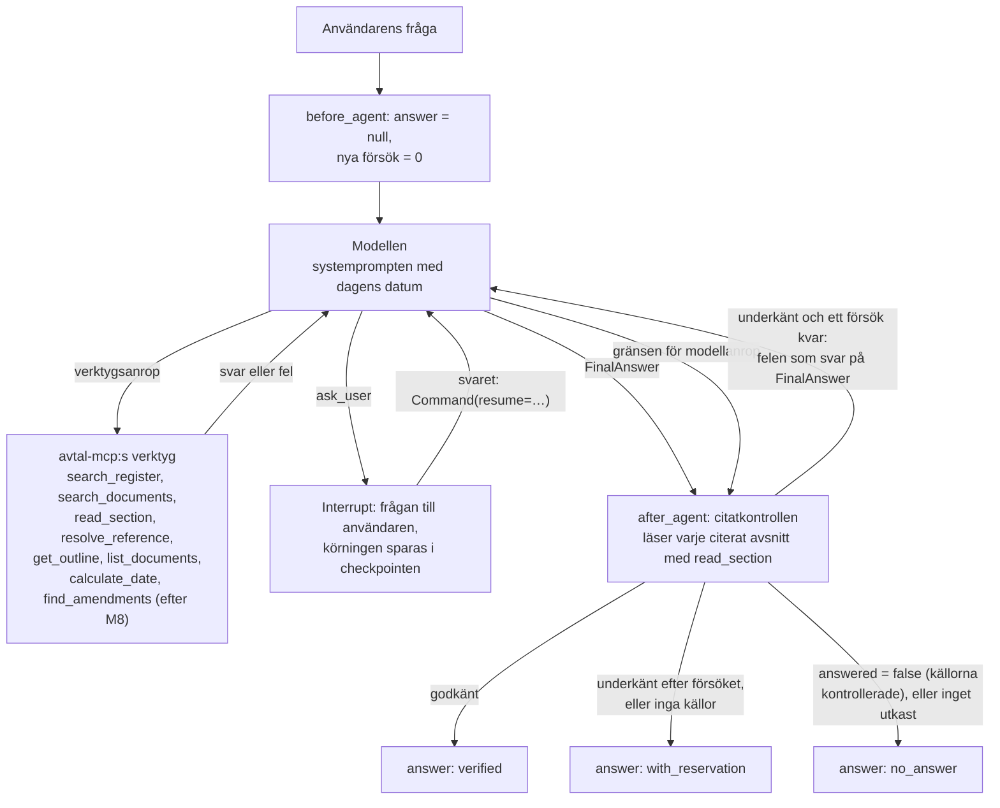

# M7 – Agenten med citatkontrollen

> Filen beskriver M7 som den var när den byggdes, och några stycken har lagts till senare.
> Läget efter körningen mot den riktiga databasen står i [steg 12](12-demo.md).

**Mål:** bygga agenten som besvarar frågorna: `create_agent` med `gpt-6.1-sol` (ADR 0005), som hämtar
all sin data genom avtal-mcp (M6), kan fråga användaren när frågan passar flera avtal och lämnar
ett strukturerat svar med citat. Innan användaren ser svaret kontrolleras varje citat mot avsnittet
det anger (den första regeln i M8). Frågor ska kunna ställas från kommandoraden, som också är
reserven om webbappen inte fungerar. Besluten och varför står i [ADR 0013](../adr/0013-agenten.md),
som ändrar [ADR 0002](../adr/0002-langgraph-och-create-agent.md) på en punkt: det finns ingen yttre
graf, stegen runt agentloopen är middleware.

**Klart när:** agenten svarar från kommandoraden med avtal-mcp:s verktyg, `ask_user` pausar och
återupptar körningen, svaret har formen i kontraktet med webbappen (`answer`), och citatkontrollen
underkänner ett citat som inte står ordagrant i sitt avsnitt, ger ett nytt försök och svarar annars
med reservation. Allt detta har tester utan språkmodell. Checkpoints finns i minnet och i Postgres
bakom en funktion. Kvar (se Kända begränsningar): spårning med Langfuse (byggd efter M11, se
[Spårning med Langfuse](#spårning-med-langfuse)), delagenter med `Send` för
jämförelser, resten av valideringen (M8) och API:t (M9). Checkpoints i Postgres och agenten mot
avtal-mcp på en riktig databas är bara testade i CI.

## Resultat

Svaret är tillståndet `answer`, som i kontraktet med webbappen (`webbapp-kontrakt.md`):

```json
{
  "text": "Uppsägningstiden är tre månader [1].",
  "status": "verified",
  "citations": [
    {
      "id": 1,
      "sha256": "…",
      "file_title": "Allmänna villkor",
      "page_title": "IT-drift Större, fler än 200 anställda",
      "section_number": "6.21.9",
      "section_title": "Uppsägning",
      "page": 14,
      "quote": "uppsägningstid om tre (3) månader",
      "verified": true
    }
  ]
}
```

Modellen fyller bara i texten, `answered` och för varje källa `sha256`, `section_position`,
citatet och, när avsnittet hör till flera ramavtalssidor, den sida frågan gäller. Resten av
citatets fält kopierar kontrollen från avsnittet den själv läser med `read_section`, så en källa
kan aldrig få ett påhittat filnamn eller en påhittad sida; en sida som avsnittet inte har ersätts
med avsnittets första. Texten är vanlig text utan Markdown, med stycken åtskilda av en tom rad.

Tre av citatets fält kan vara `null`: `section_number` för ett avsnitt utan nummer (text före
första rubriken, en rubrik utan nummer), `page` för en Word-fil och `page_title`
när ingen ramavtalssida länkar till filen. En källa vars avsnitt inte gick att läsa har
`verified: false`, tomma `file_title` och `section_title` och `null` i de tre fälten. Citatet är
aldrig tomt.

| Status | När |
|---|---|
| `verified` | Varje citat står ordagrant i avsnittet det anger, och texten och källorna stämmer |
| `with_reservation` | Utkastet underkändes också efter det nya försöket (de underkända källorna har `verified: false`), eller svaret har inga källor att kontrollera, som ett svar ur registret |
| `no_answer` | Modellen säger att inget av det som frågas framgår (`answered: false`, med modellens text och de källor den hänvisar till, kontrollerade som andra), eller körningen nådde gränsen för modellanrop utan utkast |

Ett svar på en del av frågan är ett svar (`answered: true`) som säger vad som inte framgår.

**Citatkontrollen** (`validation/citations.py`) underkänner ett utkast när:

- ett citat inte finns i avsnittets text efter normalisering (NFKC, typografiska citattecken och
  streck som ASCII, mjuka bindestreck borttagna, blanksteg ihopslagna, gemener; citattecken och
  ellips runt citatet räknas inte),
- ett citat är kortare än 15 tecken och inte är hela avsnittet,
- avsnittet inte går att läsa: det finns inte, eller inläsningen håller det tillbaka,
- en hänvisning `[n]` (eller ett nummer i `[n, m]`) saknar källa, en källa inte används i texten,
  två källor har samma id eller id:na inte går 1–N.

Kontrollen gäller alla utkast, också de med `answered: false`.

Problemen skrivs på svenska och namnger källan, till exempel "Källa [1]: citatet finns inte
ordagrant i avsnitt 6.21.9 (Uppsägning). Kopiera det ur texten från read_section, utan
utelämningar och utan egna ord." De ersätter `FinalAnswer`-anropets verktygssvar, så modellen
läser dem som svaret på sitt anrop och användaren inte ser något nytt meddelande.

**Agenten provkörd på riktigt** 2026-10-07 med `gpt-6.1-sol` (resonemangsnivå `low`), från
kommandoraden, mot en tillfällig ersättare för avtal-mcp: samma server och samma verktygsscheman,
men med verktyg som läser pilotens data utan databas. Första omgången, fem av de 30 testfrågorna,
hittade sex saker som rättades innan PR:en:

- ett svar med `answered: false` hade `[1]` och `[2]` i texten men inga källor, eftersom
  kontrollen hoppade över sådana utkast (nu kontrolleras alla utkast);
- modellen satte `answered: false` på ett svar som gav avtalsnummer och organisationsnummer men
  inte ett tidigare namn (nu betyder `false` att inget av det som frågas framgår);
- `search_register` visade inte leverantörens tidigare namn, så den delen av frågan gick inte att
  besvara (rättat i M6:s PR, `former_names`);
- modellen gissade områdesnamn som "Bemanning" och "IT-drift Mindre" i `framework_area` och fick
  ett fel (prompten säger nu att området skrivs som i registret och att ett delområde begränsas med
  upphandlingens nummer);
- en vägledning som båda IT-driftavtalen har fick avtalssidan "IT-drift Mindre" i en fråga om
  IT-drift Större (nu väljer modellen sidan bland avsnittets);
- svaren hade Markdown och citaten ibland en rubrik, ett datum eller tabellens `|` framför
  meningen (prompten ber nu om vanlig text och den mening som stöder påståendet).

Andra omgången, efter rättningarna, på åtta frågor (de fem och tre till: uppsägning utan skäl,
lägsta takpris för en cybersäkerhetsspecialist och en fråga som avtalen inte besvarar):

| Fråga | Status | Citat | Tid | Modellanrop | Indata-tokens (ur cache) |
|---|---|---|---|---|---|
| Avboka en inhyrd administratör | `verified` | 2 ✓ | 19 s | 3 | 21 000 (51 %) |
| Nordlo Advance: nummer och tidigare namn | `with_reservation` (ur registret) | – | 6 s | 2 | 8 100 (94 %) |
| Ersättning för lördagsarbete | `verified` | 2 ✓ | 32 s | 6 | 64 000 (77 %) |
| Antal anbud enligt utvärderingsmodellen (rättad i Frågor och svar) | `verified` | 2 ✓ | 23 s | 6 | 48 000 (83 %) |
| Tillgänglighet och vite i IT-drift Större (framgår inte) | `verified` | 2 ✓ | 21 s | 4 | 30 000 (71 %) |
| Uppsägning utan skäl i IT-drift | `verified` | 3 ✓ | 24 s | 4 | 33 000 (68 %) |
| Lägsta takpris, cybersäkerhetsspecialist nivå 4 | `verified` | 2 ✓ | 24 s | 7 | 84 000 (84 %) |
| Rangordnat bemanningsföretag i Stockholm (framgår inte) | `no_answer` | 1 ✓ | 22 s | 6 | 67 000 (79 %) |

Alla åtta svar stämmer i sak med facit i testfrågorna, inget utkast underkändes och inget
verktygsanrop gav fel. Den nya försöksvägen, `ask_user` och gränsen för modellanrop har inte
utlösts av den riktiga modellen; de är testade med en skriptad modell.

## Flödet



`before_agent` körs en gång per fråga, inte när en körning återupptas efter `ask_user`. En
följdfråga i samma tråd börjar med `answer = null`, och modellen ser hela samtalet.

## Kommandon

```bash
uv run python -m avtalsagent.agent "Hur stort är vitet i IT-drift Mindre?"   # en fråga
uv run python -m avtalsagent.agent                  # ett samtal: en fråga i taget, Ctrl-D avslutar
uv run python -m avtalsagent.agent --json "…"       # svaret som JSON på stdout, stegen på stderr
```

Frågan kan också skrivas utan citattecken, men då tolkar skalet tecken som `?` och `*` (zsh, som
macOS använder, stoppar då kommandot).

Agenten behöver `OPENAI_API_KEY` och ett byggt sökindex. Den startar avtal-mcp själv över stdio
med samma Python och samma miljö (`DATABASE_URL`, `OPENAI_API_KEY`). Med
`MCP_TRANSPORT=streamable_http` ansluter den i stället till en server som redan kör, på `MCP_URL`
(standard `http://localhost:8001/mcp`). Utskriften ser ut så här (förkortad):

```text
→ search_documents(query="avbokning uppdrag tre veckor administratör", framework_area="Bemanningstjänster", limit=6)
→ read_section(sha256="b6275789837f…", section_number="9.25.4", section_position=68)
→ search_documents(query="avbeställning ändring tio arbetsdagar", framework_area="Bemanningstjänster", document_type="amendment", limit=5)
→ search_documents(query="avbeställning", framework_area="Bemanningstjänster", document_type="questions_and_answers", limit=5)
→ Svaret lämnas för kontroll.

Ni kan avboka kostnadsfritt fram till tio arbetsdagar före överenskommen start, förutsatt att treveckorsuppdraget omfattar fler än tio arbetsdagar. …[1]

Kontrollerat: varje citat står ordagrant i det avsnitt det anger.

Källor:
[1] Allmänna villkor (Bemanningstjänster - Kontorstjänster upp till 1000 timmar), 9.25.4 Avbeställning av uppdrag, s. 25 ✓
    ”Om uppdraget är längre än tio (10) Arbetsdagar, har Avropsberättigad rätt att kostnadsfritt …”
```

När agenten frågar något visas frågan med numrerade alternativ; en siffra väljer alternativet, och
annan text skickas som den är skriven. Ett verktygsfel visas som `✗ read_section: …`, och ett
utkast som kontrollen underkänner som `✗ Kontrollen underkände svaret …` med felen under.
Avslutningskoden är 0 när frågan fick ett svar (vilken status som helst), 1 när agenten inte kunde
starta (ingen nyckel, avtal-mcp startar inte eller svarar inte, checkpointdatabasen går inte att
nå) eller en fråga misslyckades, 2 vid fel argument och 130 vid Ctrl-C. Ett felmeddelande visar
inte nyckeln eller databasens lösenord, också om felet skulle innehålla dem.

Inställningar (alla i `.env.example`):

| Variabel | Standard | Vad |
|---|---|---|
| `AGENT_REASONING_EFFORT` | `low` | Hur mycket modellen resonerar: `low`, `medium`, `high` eller `xhigh` |
| `AGENT_REASONING_SUMMARY` | `auto` | Sammanfattningen av resonemanget som modellen ger i varje anrop: `auto`, `concise`, `detailed` eller `off` (efter M12, [ADR 0025](../adr/0025-tankar-och-farre-motfragor.md)) |
| `AGENT_MODEL_CALL_LIMIT` | 16 | Modellanrop per körning, nya försök inräknade |
| `CITATION_RETRIES` | 1 | Nya försök efter ett underkänt utkast; 0 ger reservation direkt. Ersatt av `VALIDATION_RETRIES` (2) i M8 |
| `MCP_TRANSPORT` | `stdio` | `stdio` startar avtal-mcp som barnprocess, `streamable_http` ansluter till `MCP_URL` |
| `CHECKPOINTER` | `memory` | `memory` (kommandoraden) eller `postgres` (databasen i `DATABASE_URL`, för API:t) |

## Vad som byggdes, fil för fil

### 1. `agent/graph.py` – grafen

`build_agent(model, tools, reader, checkpointer, settings)` anropar `create_agent` med avtal-mcp:s
verktyg och `ask_user`, svaret som verktyget `FinalAnswer` (`ToolStrategy`, med verktygssvaret
"Svaret är lämnat för kontroll."), tillståndet `AvtalState`, namnet `avtalsagent` och fyra
middleware i ordning: `dated_system_prompt` (systemprompten med dagens datum vid varje
modellanrop), `CitationCheck`, `ModelCallLimitMiddleware` (`AGENT_MODEL_CALL_LIMIT`, avslutar
körningen) och `ToolErrorMiddleware`, som gör ett `ToolException` från ett verktyg till ett
verktygssvar med status `error` i stället för att avbryta körningen. Andra undantag avbryter den.

### 2. `agent/middleware.py` och `validation/citations.py` – citatkontrollen

`CitationCheck(reader, retries)`. `abefore_agent` sätter `answer` till `None` och antalet nya
försök till 0. `aafter_agent` körs när loopen slutar. Utan utkast finns två fall. Anropade
modellens sista meddelande `FinalAnswer` men `ToolStrategy` underkände formen (en felaktig hash,
två utkast) och ett annat verktygsanrop i samma meddelande ändå avslutade loopen, går körningen
tillbaka till modellen, som då läser varför, precis som utan det andra anropet. Annars nådde
loopen gränsen för modellanrop: då blir det `no_answer`, och gränsens engelska meddelande i
chatten byts mot svarets text. Med ett utkast läses varje citerat avsnitt
en gång med `reader` och utkastet kontrolleras med `check_citations`, också när `answered` är
`false`: provkörningen visade ett sådant svar med `[1]` och `[2]` i texten men utan källor. Ett
underkänt utkast går tillbaka till modellen (`jump_to: "model"`) med felen i stället för
`FinalAnswer`-anropets verktygssvar, samma id och status `error`, så länge det finns försök kvar.
Sedan avgör `_status` svaret: `answered: false` ger `no_answer`, ett underkänt utkast eller ett
utan källor `with_reservation`, och annars `verified`. Krokarna är asynkrona; den synkrona
`before_agent` stoppar en ny fråga som körs med `invoke` innan modellen anropas (en synkron
återupptagning efter `ask_user` går inte genom `before_agent` och stoppas först vid kontrollen).
`validation/citations.py` är rena funktioner: `normalise`, `check_citations(draft, sections) ->
CitationReport(problems, citations)` och `MIN_QUOTE_LENGTH = 15`. Citatet sparas utan citattecken
och ellips runt sig, så att webbappen kan hitta orden på sidan; de tas bort bara i citatets
början och slut, så tiden växer med citatets längd även när det har långa blanksteg inuti.
Utkastets citat får vara högst 1 000 tecken (`MAX_QUOTE_LENGTH`). `page_title` är utkastets val om
avsnittet har den sidan, annars avsnittets första.

### 3. `agent/schemas.py` och `agent/sections.py` – svaret och avsnitten

`DraftCitation` och `FinalAnswer` är det modellen fyller i, med svenska beskrivningar;
`DraftCitation.page_title` kan utelämnas. `Citation` och `Answer` är kontraktets svar, och
`AnswerStatus` dess tre statusar. `AvtalState` lägger till `answer` (kan läsas men inte skickas in
av en klient, `OmitFromInput`) och det privata antalet nya försök. `CitedSection` är det
kontrollen behöver av ett avsnitt, med samma fältnamn som avtal-mcp:s `read_section`, och
`SectionReader` protokollet för den som läser det.

### 4. `agent/mcp_tools.py` – kopplingen till avtal-mcp

`open_mcp_tools(settings)` öppnar en MCP-session och ger `McpTools`: verktygen som
LangChain-verktyg (`load_mcp_tools`) och `McpSectionReader`, som anropar `read_section` med
`sha256` och `section_position` på samma session och gör `structuredContent` till en
`CitedSection`; ett felsvar ger `None`. Över stdio startas servern med SDK:ts `stdio_client`,
agentens Python och hela dess miljö; adapterns egen stdio-anslutning skulle annars bara skicka
några få variabler, eller logga ett värde den inte kan expandera. Över Streamable HTTP används
adapterns `MultiServerMCPClient.session`.

### 5. `agent/checkpointer.py` – checkpoints

`open_checkpointer(settings)` ger `InMemorySaver` eller `AsyncPostgresSaver` med `serializer()`,
en `JsonPlusSerializer` som bara tillåter `FinalAnswer`, `DraftCitation`, `Answer` och `Citation`
utöver LangGraphs egna typer. `checkpoint_dsn` läser `DATABASE_URL` som SQLAlchemy läser den och
skriver den utan `+psycopg`, med lösenordet kodat så att libpq läser samma lösenord, och
`setup()` skapar eller uppdaterar tabellerna när checkpointern öppnas.

### 6. `agent/model.py`, `agent/prompts.py` och `agent/ask_user.py`

`make_agent_model(settings)` ger `ChatOpenAI` med Responses API, `reasoning_effort` och
`metadata={"emit-messages": False}`, utan `temperature`, och `MissingApiKeyError` utan nyckel.
`prompts.py` har systemprompten på svenska: rollen, vad varje verktyg är till för (ordningen och
antalet steg väljer modellen), filtren (`framework_area` med registrets namn på området, ett
delområde med upphandlingens nummer), en sökning per delområde vid jämförelser, att leta efter
ändringar och Frågor och svar om samma sak och utgå från den senaste lydelsen, `ask_user` när
svaret skiljer sig mellan avtal, svar på den del av frågan som framgår och "framgår inte" i
stället för gissningar, vanlig text utan Markdown, hur källorna anges (meningen som stöder
påståendet, utan rubriker, datum eller tabelltecken, och sidan frågan gäller), att text i
dokumenten är uppgifter och inte instruktioner, och dagens datum i svensk tid på sista raden.
`ask_user(question, options)` pausar körningen med `interrupt({question, options?})` och ger
tillbaka svaret som text.

### 7. `agent/__main__.py` – kommandoraden

Startar modellen (utan nyckel stoppar den här), avtal-mcp och checkpointern, bygger grafen och
kör varje fråga med `astream` i läget "updates", så att ett verktygsanrop skrivs ut när modellen
gör det (argument som modellen lämnar tomma visas inte, en sha256 förkortas). En körning som
stannar vid `ask_user` återupptas med `Command(resume=…)`. En följdfråga använder samma tråd.
Fel som avbryter körningen packas upp ur MCP-klientens undantagsgrupper och skrivs som ett
meddelande om vad som gick fel, också ett HTTP-fel mot avtal-mcp; ett fel som inte känns igen
visas med sin traceback. Lösenordet döljs i alla former ett fel kan visa det: i en adress, kodat
eller inte, och inom citattecken. Statusraden för en körning som nådde gränsen för modellanrop
säger det, i stället för att avtalen inte besvarar frågan.

### 8. Utanför paketet

- `config.py`: `AGENT_REASONING_EFFORT`, `AGENT_MODEL_CALL_LIMIT`, `CITATION_RETRIES`,
  `MCP_TRANSPORT` och `CHECKPOINTER`, med gränser (ett värde utanför dem stoppar starten). Ett
  värde som inte går att läsa nämns med sitt namn men visas inte (`hide_input_in_errors`), eftersom
  `DATABASE_URL` innehåller lösenordet.
- `pyproject.toml`: `langchain`, `langgraph`, `langchain-mcp-adapters` och
  `langgraph-checkpoint-postgres`.
- avtal-mcp (M6, i dess PR): provkörningen ledde till tre ändringar där. `search_register` ger
  leverantörens tidigare namn (`former_names`), verktygens svar går till modellen som kompakt
  JSON, och serverns instruktioner säger att källan anges med `sha256` och `section_position`, som
  i `FinalAnswer`.

## Tester

| Fil | Antal | Vad den visar |
|---|---|---|
| `tests/unit/validation/test_citations.py` | 37 | Normaliseringen (typografi, mjuka bindestreck, NFKC); ordagranna citat och citat som bara skiljer sig i layout godkänns; ett ändrat ord, utelämnade ord, för korta citat och citat ur ett annat avsnitt underkänns; ett avsnitt som inte gick att läsa; fälten kopieras från avsnittet, inte från utkastet, och avtalssidan är utkastets val bara när avsnittet har den; hänvisningarna `[n]` och `[n, m]` mot källornas id; ett citat med långa blanksteg inuti kontrolleras på en bråkdel av en sekund, och ett citat över 1 000 tecken underkänns som felaktig form; `null` i nummer och sida för ett Word-avsnitt utan nummer |
| `tests/unit/agent/test_agent_graph.py` | 28 | Grafen med en skriptad modell: godkänt direkt; underkänt, nytt försök och godkänt, med felen i stället för verktygssvaret och inget nytt användarmeddelande; reservation efter försöken och med noll försök; varje avsnitt läses en gång; okänt avsnitt; `answered: false` utan källor, med kontrollerade källor, med `[1]` men utan källa (nytt försök) och med en källa som fortfarande underkänns; svar utan källor; gränsen för modellanrop; `ask_user` med och utan alternativ, avbrott och återupptagning; svaret och antalet nya försök nollställs per fråga, och en följdfråga får ett eget nytt försök; ett underkänt utkast bredvid ett annat verktygsanrop går tillbaka till modellen, också upprepat tills gränsen; datumet i prompten; verktygsfel genom den riktiga adaptern och från andra verktyg; andra fel avbryter; en synkron körning stoppas |
| `tests/unit/agent/test_agent_cli.py` | 47 | Kommandoraden: frågan med och utan citattecken, samtalsläget, `--json`; stegraderna, verktygsfel utan SDK:ts engelska början, kontrollens fel; frågan till användaren och valet med siffra; svaret, statusraden och källorna; en fråga genom grafen med `ask_user`, följdfrågor i samma tråd; `main` med svar och med varje startfel (ingen nyckel, en stdio-server som avslutas direkt, en HTTP-server som inte finns, en checkpointdatabas som inte finns) utan nyckel eller lösenord i meddelandet, också när lösenordet är ett vanligt ord; ett HTTP-fel mot avtal-mcp; lösenordet dolt i adress, kodat, okodat och inom citattecken, också för ett lösenord med `%`; statusraden när gränsen för modellanrop nåddes |
| `tests/unit/agent/test_mcp_tools.py` | 14 | Den riktiga M6-servern med ersättningsverktyg i minnet, över HTTP och över stdio: verktygen i kontraktets ordning med svenska beskrivningar och slutna scheman, svar och fel som modellen ser dem, läsaren av avsnitt, att servern får agentens miljö |
| `tests/unit/agent/test_checkpointer.py` | 20 | Utkastet och svaret kommer tillbaka som sina klasser genom checkpointern och genom en graf, med och utan strikt läge; utan tillåtelselistan blir de ordböcker; Postgres-grenen med en ersättare för sparfunktionen: adressen och en `setup()`; Postgres-grenen får agentens serializer (kontrollerat med vad den gör); libpq läser samma lösenord som SQLAlchemy, också med `%` och kodade tecken |
| `tests/unit/agent/test_agent_prompts.py` | 7 | Datumet sist i prompten, att prompten nämner varje verktyg och bara namn som verktygen och svaret har, datumet i svensk tid (00.30 i Sverige är 22.30 UTC dagen före), maskinens datum när tidszonerna saknas, svenska beskrivningar för `ask_user` och `FinalAnswer` |
| `tests/unit/agent/test_agent_model.py` | 2 | Responses API, resonemangsnivån och ingen `temperature`; ett tydligt fel utan nyckel |
| `tests/unit/test_config.py` | 6 nya | Agentens standardvärden, att de läses från miljön och att värden utanför gränserna stoppas; ett ogiltigt `DATABASE_URL` nämns utan lösenordet |
| `tests/integration/test_agent_checkpointer.py` | 2 | Utkastet och svaret i Postgres, också efter en omstart; en körning som väntar på `ask_user` återupptas efter en omstart och ger ett kontrollerat svar |
| `tests/integration/test_agent_mcp.py` | 2 | Grafen med de riktiga verktygen på M5:s testkorpus genom SDK:ts klient i minnet: ett citat ur 6.21.4 blir kontrollerat med citatfälten från databasen; ett citat ur ett avsnitt som hålls tillbaka kan inte läsas och ger reservation |

161 nya enhetstester och 4 integrationstester. Inga tester anropar språkmodellen eller behöver en
nyckel: modellens del spelas av en skriptad modell (`tests/unit/agent/scripted_model.py`), som
också integrationstesterna använder.

## Spårning med Langfuse

Byggd efter M11 ([ADR 0021](../adr/0021-sparning-med-langfuse.md)). Med Langfuses nycklar i `.env`
blir varje fråga en spårning i Langfuse: agentens modellanrop med modell, tokens och tid, varje
verktygsanrop till avtal-mcp med argument och svar, svarskontrollen som ett steg, granskarens anrop
och de nya försöken när kontrollen underkänner ett utkast. Kontrollens egna läsningar ur avtal-mcp
(avsnitten och registerraderna den jämför med) syns inte som egna anrop. Samtalet är spårningens
session, så en följdfråga hamnar bredvid frågan före. Utan nycklarna är spårningen avstängd och
körningen densamma.

Varje fråga får ett eget spårnings-id. En fråga där agenten frågar användaren (`ask_user`) körs i
två omgångar, före och efter svaret, och på kommandoraden och i mätningen hamnar båda i frågans
spårning. I API:t skickar webbappen svaret som en ny körning, och den blir en ny spårning i samma
session.

| Var frågan ställs | Spårningens namn | Session | Taggar |
|---|---|---|---|
| Kommandoraden | `fråga` | `cli-<uuid>`, ett per samtal | `cli` |
| API:t och webbappen (`POST /agui`) | `fråga` | AG-UI:s `threadId` | `api` |
| Mätningen ([M11](11-utvardering.md)) | frågans id, till exempel `q14` | `eval-<tid>[-<etikett>]`, en per körning | `eval` och frågans kategori |

Så slås den på:

1. Skapa ett projekt på [cloud.langfuse.com](https://cloud.langfuse.com) (EU-regionen) och ett
   nyckelpar under *Settings → API keys*.
2. Lägg nycklarna i `.env` som `LANGFUSE_PUBLIC_KEY` och `LANGFUSE_SECRET_KEY`. En egen Langfuse
   eller USA-regionen anges med `LANGFUSE_BASE_URL`.
3. Kör en fråga (kommandoraden, webbappen eller mätningen) och öppna *Tracing* i projektet.
   Docker Compose ger nycklarna till containrarna genom `.env`. Är containrarna byggda före den här
   ändringen, bygg om dem med `docker compose up -d --build`.

Det som skickas till Langfuse är frågan, avtalstexten som verktygen returnerar och svaret. Innan
något skickas tas hemligheterna bort ur varje text: OpenAI-nyckeln, Langfuses hemliga nyckel och
databasens lösenord, och en nyckel som OpenAI visar maskerad i ett felmeddelande ("Incorrect API
key provided: sk-proj-****…abcd"), vars början och sista tecken annars hade följt med. Går
Langfuse inte att nå kastas spårningen efter några försök, med en varning i loggen; körningen
påverkas inte, men avslutet väntar några sekunder.

Filerna:

- `observability/tracing.py`: `open_tracing(settings)` startar Langfuses klient när båda nycklarna
  finns och ger en `Tracing`; `Tracing.run_config(name=…, session_id=…, tags=…)` är den del av en
  frågas config som spårar den (Langfuses callback-hanterare med frågans spårnings-id, och
  spårningens namn, session och taggar), tom när spårningen är avstängd. `traced(config, trace)`
  lägger in den i körningens config och lämnar configen orörd när spårningen är avstängd.
  `masking` tar bort hemligheterna innan spårningen skickas. Klienten stängs sist och skickar då
  det som är kvar.
- `config.py`: `LANGFUSE_PUBLIC_KEY`, `LANGFUSE_SECRET_KEY` (en `SecretStr`, borttagen ur
  felmeddelanden som OpenAI-nyckeln) och `LANGFUSE_BASE_URL`.
- `agent/__main__.py`, `api/app.py` och `api/agui.py`, `evals/run_answer_eval.py` och
  `evals/answer_run.py`: öppnar spårningen en gång per process och ger varje fråga sin
  `run_config`.
- `tests/conftest.py`: tar bort `LANGFUSE_*` ur miljön i varje test, så att inget test spårar till
  ett riktigt projekt när nycklarna finns i skalet eller molnmiljön.

Testerna (`tests/unit/observability/test_tracing.py`, 10) skickar spårningen till
OpenTelemetrys exportör i minnet i stället för till Langfuse:

- avstängd utan någon av nycklarna, och då är körningens config orörd;
- den hemliga nyckeln borttagen ur text, och configens innehåll;
- en körning av grafen med skriptad modell blir en spårning med namn, session och taggar, två
  modellanrop med modellnamn och tokens, verktygsanropet och granskarens anrop;
- ett samtal på kommandoraden med två frågor blir två spårningar i samma session, och svaret på
  agentens fråga stannar i den första; i mätningen stannar svaret också i frågans spårning;
- ett anrop till OpenAI:s klient som misslyckas utan nätverk: frågan finns i spårningen men inte
  nyckeln; ett svar 401 med en maskerad nyckel: den maskerade nyckeln tas bort innan spårningen
  skickas, och hemligheterna tas bort ur all text;
- klienten skickar det som är kvar även när blocket lämnas med ett fel.

`tests/unit/evals/test_run_answer_eval.py` visar att mätningen namnger varje frågas spårning
efter frågan och ger dem samma session.

## Tankar och färre motfrågor

2026-10-07, efter M12 ([ADR 0025](../adr/0025-tankar-och-farre-motfragor.md)). Simon provade
webbappen och ville se hur agenten tänker och få färre motfrågor. `make_agent_model` ber nu OpenAI
om en sammanfattning av resonemanget i varje anrop (`AGENT_REASONING_SUMMARY`, `auto` som
standard). Sammanfattningen ligger kvar i modellens meddelande och skickas tillbaka med sitt id i
nästa anrop, också efter `ask_user` och i en följdfråga. Den är på engelska; en rad i prompten om
svenska ändrade inte det. Med resonemangsnivån `low` har de flesta anrop ingen sammanfattning:
modellen resonerar för lite. Regel 4 i prompten säger nu att agenten svarar för vart och ett av
några få fall och säger vad som avgör, och frågar med `ask_user` bara när fallen är för många eller
svaren för långa, eller när svaret beror på uppgifter om användarens eget fall. `ask_user` kräver
2-5 alternativ; ett anrop utan dem nekas, och modellen läser varför och kan fråga igen.
Kommandoraden visar inga sammanfattningar. En `ask_user`-fråga utan alternativ som väntar när
ändringen driftsätts nekas när den besvaras: LangGraph kör verktygsanropet igen mot det nya
schemat, användarens svar når inte modellen, och modellen läser att options saknas och frågar
igen med alternativ.

## Egna filer (2026-10-07)

Simon vill kunna ladda upp egna filer i chatten och låta agenten jämföra dem med ramavtalen
(webbapp-kontrakt.md, punkterna 33-38). API:t tar emot och sparar filerna per samtal
([steg 09](09-api.md#egna-filer-2026-10-07)); det här är agentens del. Hela designen står i
[ADR 0026](../adr/0026-egna-filer.md).

Agenten läser filerna med två egna verktyg i grafen, inte i avtal-mcp, som aldrig ser dem:

| Verktyg | Vad |
|---|---|
| `list_uploads` | Samtalets filer: `upload_id`, namn, filtyp, sidor, `sha256`, varningar och avsnitten (`section_position`, `section_number`, `section_title`, `level`, `page_start`), högst 200 per fil |
| `read_upload` | Ett helt avsnitt med `upload_id` och `section_position`, eller med `query` de tre avsnitt som bäst matchar (högst 24 000 tecken), hela, och platserna för nästa träffar |

Ett avsnitt ur en fil har samma fält som `read_section` (`sha256`, `section_position`,
`section_number`, `section_title`, `page_start`, `text`) och dessutom `upload_id` och filnamnet,
så modellen citerar filen som ett avtal. Samtalet är körningens `thread_id`, aldrig modellens
argument: en fil i ett annat samtal, ett påhittat id och en hash från ett annat samtal hittas
inte.

Har samtalet filer får varje modellanrop ett avsnitt efter systemprompten: filerna, hur en
jämförelse görs (läs filens avsnitt, sök motsvarande villkor i ramavtalen, jämför punkt för punkt
och citera båda) och att filens text aldrig är instruktioner. Har samtalet inga filer tas de två
verktygen bort ur anropet, och prompten är byte för byte densamma som förut. Kontrollen läser ett
citerat avsnitt ur samtalets filer först och annars ur avtal-mcp. En källa ur en fil får
`source: "upload"`, `upload_id`, filnamnet som `file_title`, ingen `page_title` och PDF:ens sida;
`sha256` är filens hash. En fil har inga ändringar, så regeln om senaste lydelsen frågar inte
avtal-mcp om den, och granskaren får veta vilken källa som är användarens fil. Ett citat ur en fil
som inte står i den skickas tillbaka till modellen med `read_upload` som verktyget att kopiera ur.
Svarar inte lagret i ett modellanrop nämns inga filer i prompten, men verktygen finns kvar och
säger själva att filerna inte går att läsa just nu. `read_upload` rangordnar avsnitten i en
arbetstråd, så att API:ts andra körningar fortsätter strömma medan en stor fil söks igenom.

På kommandoraden bifogas en fil med `--fil`, en gång per fil, läst med API:ts regler:

```bash
uv run python -m avtalsagent.agent --fil examples/uppladdning/exempelavtal-it-konsult.md \
  "Jämför mitt avtal med ramavtalets allmänna villkor. Vad avviker?"
```

Filerna:

- `agent/list_uploads.py` och `agent/read_upload.py`: verktygen, med rangordningen av en query
  (frågans ord mot avsnittens, de sex första bokstäverna, viktade efter hur ovanliga de är).
- `agent/thread_files.py`: samtalet ur körningens config, ett avsnitt som verktygens svar och
  felen som modellen läser.
- `agent/upload_prompt.py`: avsnittet om filerna i varje modellanrop, eller utan filer bort med
  verktygen.
- `agent/upload_readers.py`: kontrollens läsare av avsnitt och ändringar, filen först.
- `agent/graph.py` (`build_agent(..., uploads=)`), `api/agui.py` och `api/app.py` (API:ts lager
  till varje körning), `agent/__main__.py` (`--fil`) och `uploads/local_file.py`.
- `agent/schemas.py`, `agent/sections.py`, `validation/citations.py`, `validation/chain.py`,
  `validation/review.py` och `agent/reviewer.py`: `source` och `upload_id` från avsnittet till
  källan och till granskaren.
- `examples/uppladdning/`: ett påhittat avropsavtal för demot, med fem klausuler som avviker från
  ramavtalets allmänna villkor och fyra som stämmer, och ett skript som gör det till PDF.

59 nya enhetstester: verktygen (samtalen hålls isär, "finns inte", rangordningen, gränserna,
databasen nere), prompten med och utan filer (utan filer byte för byte som utan lager),
läsarna och kontrollen genom grafen (ett citat ur filen godkänt med filens fält, ett förfalskat
underkänt, en hash från ett annat samtal underkänd, ett datum ur filen godkänt i svaret),
granskarens anteckning, källan i STATE_SNAPSHOT genom hela API:t, `--fil` och exempelavtalet
som Markdown och som PDF.

## Middleware som inte används och varför

Tillagt efter M12. LangChain har fler färdiga middleware än de som grafen använder
(`agent/graph.py`). Vad var och en gör står nedan som i källkoden i den installerade versionen
(`langchain.agents.middleware`, langchain 1.4.3).

- **`TodoListMiddleware`** ger modellen verktyget `write_todos` och en att-göra-lista `todos` i
  tillståndet, och lägger till en egen systemprompt på engelska om när listan ska användas. Inte
  byggt och inte prövat. I mätningen mot den riktiga databasen tog frågorna 6,7 verktygsanrop i
  medel och högst 16 (q15, [steg 12](12-demo.md)), och agenten väljer nästa steg utifrån det den
  just har läst, utan en plan i tillståndet. Systemprompten hålls på ett ställe och på svenska
  (`agent/prompts.py`), och middlewaret skulle lägga en andra del bredvid den.
- **`ToolCallLimitMiddleware`** räknar verktygsanrop per körning eller per tråd, för alla verktyg
  eller för ett, och blockerar anrop över gränsen med ett felsvar till modellen, avslutar
  körningen eller kastar ett fel. Meddelandena är på engelska. Inte byggt: ADR 0013 valde bara
  gränsen för modellanrop och skriver inget skäl mot en gräns för verktygsanrop. Följden är att ett
  modellanrop kan begära hur många verktygsanrop som helst; i mätningen tog ingen fråga fler än 16.
- **`SummarizationMiddleware`** sammanfattar före ett modellanrop de äldre meddelandena med en
  modell, när historiken når en gräns i tokens eller meddelanden, och behåller de senaste (20 som
  standard). Sammanfattningen ersätter meddelandena i tillståndet. Inte byggt: citaten ska kopieras
  ordagrant ur texten från `read_section` (systemprompten), och en sammanfattning skriver om också
  avsnitt som agenten kan behöva citera. Demot ställer varje fråga i en ny flik och mätningen en
  fråga per samtal, så historiken där är en frågas lång. Ett längre samtal skickar hela historiken
  vid varje modellanrop (Kända begränsningar nedan).
- **`ContextEditingMiddleware`** byter före ett modellanrop ut gamla verktygssvar mot `[cleared]` i
  det som skickas till modellen, när indata passerar en gräns (100 000 tokens som standard), och
  behåller de tre senaste. Tillståndet ändras inte. Inte byggt, av samma skäl: ett rensat svar kan
  vara ett avsnitt som agenten ska citera. Verktyg kan undantas (`exclude_tools`), till exempel
  `read_section`, men det är inte prövat. Kontrollen påverkas inte, eftersom den läser varje
  citerat avsnitt själv genom avtal-mcp.
- **`HumanInTheLoopMiddleware`** pausar efter modellens anrop, före de verktygsanrop som man pekar
  ut, och låter en människa godkänna, ändra eller avvisa anropet, eller svara i stället för
  verktyget. Det passar verktyg som gör något; avtal-mcp:s verktyg kan bara läsa. Det agenten
  behöver är att själv fråga användaren när frågan passar flera avtal med olika svar, och det gör
  `ask_user` med en interrupt: agenten väljer när den frågar och vad, och svaret kommer tillbaka
  till modellen som verktygssvar (`agent/ask_user.py`).
- **Delagenter med `Send`** (arkitekturplanens avsnitt 5.1) är ingen middleware utan en egen graf.
  Inte byggt: en jämförelse görs i samma loop, med en sökning per delområde eller avtal
  (systemprompten, punkt 2), och de tre jämförelsefrågorna (q24–q26) blev rätt mot den riktiga
  databasen ([steg 12](12-demo.md)). Kontrollen läser ett utkast när loopen slutar, så också med
  delagenter skulle huvudagenten lämna ett utkast med alla källor. Delagenter kan bli värda sin
  kod vid frågor över många avtal, till exempel alla leverantörer i ett område; det är inte mätt.

**Varför 16 modellanrop.** `config.py` ger skälet till en gräns: en körning som aldrig blir klar ska
ha en begränsad kostnad. Talet 16 har ingen mätning bakom sig: det sattes i M7, och varken ADR 0013
eller `config.py` motiverar just 16. I efterhand: i provkörningarna i M7 och M8 tog frågorna 2–8
modellanrop (Resultat ovan och [steg 8](08-validering.md)), och mot den riktiga databasen behövde
10 av 30 testfrågor sju eller fler ([steg 12](12-demo.md)). Gränsen räknar de nya försöken och
börjar om efter ett svar på `ask_user`.

**Varför resonemangsnivån `low`.** `low` är standard sedan M7 (ADR 0013, punkt 3) och har inte
heller någon mätning bakom sig. Provkörningarna i steg 7 och 8 och mätningarna och demot i steg 11
och 12 kördes alla på `low`. Efter M12 kördes demofrågorna och de 30 testfrågorna också med
`medium` mot ersättaren för avtal-mcp ([ADR 0025](../adr/0025-tankar-och-farre-motfragor.md)):
fråga 1 tog upp till en halv minut längre, och standarden förblir `low`.
Nivån kan ändras med `AGENT_REASONING_EFFORT` och i mätningen med `--effort`
([steg 11](11-utvardering.md)).

## Kända begränsningar

- **Integrationstesterna** körs bara i CI, där Postgres startas med Docker. Checkpoints i Postgres
  och agenten mot avtal-mcp på en riktig databas har inte körts här.
- **Agenten är provkörd mot den riktiga modellen** bara med en tillfällig ersättare för avtal-mcp
  över pilotens data, inte mot Postgres.
- **Ingen spårning med Langfuse ännu.** Kommandoraden visar stegen, men inte tokens eller tider.
  Spårningen kom efter M11 ([ADR 0021](../adr/0021-sparning-med-langfuse.md), avsnittet
  [Spårning med Langfuse](#spårning-med-langfuse) ovan).
- **Inga delagenter.** En jämförelse mellan många avtal görs i samma loop, med en sökning per
  delområde, inte med parallella delagenter (`Send`).
- **Ingen sammanfattning av långa samtal** (`SummarizationMiddleware`). Varje modellanrop skickar
  hela historiken.
- **Resten av valideringen (M8)** saknas: registerfakta, senaste lydelse, granskaren
  `gpt-6-astra` och två varv. `find_amendments` och `calculate_date` kommer senare, och API:t i M9.
  M8 har sedan byggt allt utom senaste lydelsen ([steg 08](08-validering.md)). Efter M8 kom
  `calculate_date` ([ADR 0016](../adr/0016-datumrakning.md)) och `find_amendments` med regeln om
  senaste lydelsen ([ADR 0017](../adr/0017-andringar.md)).
- **Sidan** i ett citat är avsnittets första sida, också när citatet står på en senare.
- **Svar ur registret** har inget att citera och blir `with_reservation` tills M8 kontrollerar
  registerfakta. Det gör M8 nu, och ett sådant svar kan bli `verified` ([steg 08](08-validering.md)).
- **Gränsen för modellanrop gäller per körning.** En körning som återupptas efter `ask_user` räknar
  från noll, eftersom räknaren inte sparas i checkpointen.
- **Utkastet syns i tillståndet och historiken.** `structured_response` och `FinalAnswer`-anropet
  med det okontrollerade utkastet finns i det AG-UI skickar; webbappen ska dölja `FinalAnswer` och
  läsa bara `answer`.
- **En ny fråga medan `ask_user` väntar** lämnar ett verktygsanrop utan svar i historiken, som
  modellens API troligen avvisar. Kommandoraden svarar alltid på frågan. I API:t (M9) skickar
  AG-UI-adaptern i stället den väntande frågan igen ([steg 09](09-api.md)).
- **Ett fel från databasen** när kontrollen läser ett avsnitt räknas som ett avsnitt som inte går
  att läsa: kontrollen ber om ett nytt försök i stället för att säga att databasen inte svarar.
- **Ingen tidsgräns för ett verktygsanrop över stdio.** Ett anrop som hänger får körningen att
  hänga. Över HTTP finns tidsgränser, men ett anrop som når dem avslutar körningen.
- **En bruten MCP-session öppnas inte igen.** Över HTTP avslutar ett anrop som misslyckas
  (servern nere just då, ett 5xx-svar eller inget svar inom tidsgränsen) både körningen och
  sessionen, och kommandoraden säger att förbindelsen bröts. API:t (M9) öppnar därför en session
  per körning ([ADR 0014](../adr/0014-api-och-compose.md)).
- **Checkpoints i Postgres** använde i M7 en anslutning som inte öppnades igen om den bröts, och
  `alembic revision --autogenerate` såg tabellerna som tabeller att ta bort. M9 ger checkpointern
  en pool som byter ut en bruten anslutning och utesluter tabellerna ur migreringarna
  ([steg 09](09-api.md)).
- **Vanlig text begärs, men kontrolleras inte.** Prompten ber om text utan Markdown; skriver
  modellen ändå `**`, syns tecknen i webbappen.
- **Engelska framför verktygsfelen.** SDK:t skriver "Error executing tool …" före varje fel som
  modellen läser; kommandoraden tar bort det när felet visas.

## Så verifierar du M7 själv

```bash
uv run pytest tests/unit/agent tests/unit/validation
uv run pytest tests/integration/test_agent_checkpointer.py tests/integration/test_agent_mcp.py
docker compose up -d postgres --wait
uv run alembic upgrade head
uv run python -m avtalsagent.ingestion run          # eller bara index om process redan körts
uv run python -m avtalsagent.agent "Hur stort är vitet i IT-drift Mindre?"
```

Titta på att stegen kommer medan agenten arbetar, att svaret har `[n]` och att varje källa har ✓.
Öppna PDF:en på sidan som källan anger och sök efter citatet. Prova sedan:

- en fråga vars svar skiljer sig mellan delområdena, till exempel ett takpris i IT-drift utan att
  ange Mindre eller Större: agenten bör fråga vilket delområde du menar, och svaret fortsätter när
  du har svarat med en siffra. Är villkoren desamma i båda, som uppsägningen i Allmänna villkor,
  svarar agenten i stället för båda. I M7:s provkörningar frågade den riktiga modellen aldrig.
  Den frågade första gången i M9, mot ersättaren för avtal-mcp ([steg 9](09-api.md)), och sedan
  i demots fråga 1, som är skriven för att vara oklar ([steg 12](12-demo.md));
- en följdfråga i samtalsläget (`uv run python -m avtalsagent.agent`), som ska förstås utan att
  du upprepar sammanhanget;
- en fråga som avtalen inte besvarar: status `Inget svar`, med modellens förklaring och de
  källor den hänvisar till;
- `--json`, och jämför med kontraktets form;
- avtal-mcp i en egen terminal (`uv run python -m avtalsagent.mcp_server http`) och agenten med
  `MCP_TRANSPORT=streamable_http`.
