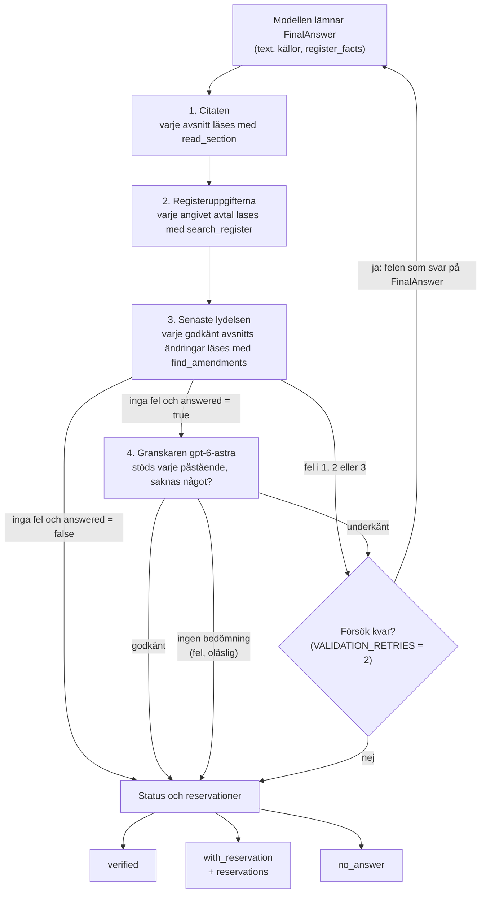

# M8 – Valideringskedjan: registeruppgifter, granskare och två nya försök

**Mål:** bygga resten av valideringen efter agentens loop (arkitekturplanens avsnitt 6, lager 4 och
5). Uppgifter ur registret i svaret (avtalsnummer, organisationsnummer, datum) ska jämföras med
registret, så att ett svar ur registret kan bli kontrollerat. En andra modell, `gpt-6-astra`, ska
granska att källorna stöder varje påstående och att inget väsentligt saknas. Ett underkänt svar
går tillbaka till agenten högst två gånger, och ges annars med reservationer som säger vad som
inte kunde kontrolleras. Besluten och varför står i
[ADR 0015](../adr/0015-valideringskedjan.md), som bygger ut [ADR 0013](../adr/0013-agenten.md).

**Klart när:** ett svar ur registret med rätt uppgifter blir `verified`, och ett fel datum eller
organisationsnummer skickas tillbaka till agenten; granskaren underkänner ett svar vars källa säger
något annat; reglerna och granskaren delar två nya försök; svaret har `reservations` och
`register_facts`; granskarens svar syns aldrig i webbappen. Allt detta har tester utan språkmodell,
och kedjan är provkörd mot de riktiga modellerna. Efter M8 kom regeln om senaste lydelsen, med
verktyget `find_amendments` ([ADR 0017](../adr/0017-andringar.md), avsnitt 7 nedan).

## Resultat

Provkört mot de riktiga modellerna (`gpt-6.1-sol` som agent, `gpt-6-astra` som granskare, båda
med resonemangsnivån `low`) med en tillfällig ersättare för avtal-mcp över pilotens data (ingen
Postgres i utvecklingsmiljön), på elva av de 30 testfrågorna:

| Fråga | Status | Nya försök (varför) | Tid | Modellanrop | Granskningar (tid) |
|---|---|---|---|---|---|
| q10 Nordlo Advance: nummer och tidigare namn | `verified` (ur registret) | 0 | 13 s | 2 | 1 (5 s) |
| q11 Leverantörer av helpdesk i Övre Norrland | `verified` (ur registret, 7 avtal) | 1 (granskaren: ett påstående stöddes inte av utdraget) | 74 s | 8 | 2 (26 s) |
| q12 Leverantörer i IT-säkerhet och perioden | `verified` (ur registret, 8 avtal) | 0 | 31 s | 5 | 1 (11 s) |
| q13 Telia Cygate: nummer och giltighet | `verified` (ur registret) | 0 | 16 s | 3 | 1 (6 s) |
| q01 Avboka en inhyrd administratör | `verified` | 1 (granskaren: villkoret för kortare uppdrag saknades) | 37 s | 4 | 2 (13 s) |
| q04 Uppsägning utan skäl i IT-drift | `verified` | 1 (granskaren: källan visade inte vilka avtal den gäller) | 59 s | 6 | 2 (22 s) |
| q14 Lördagsarbete för en inhyrd IT-tekniker | `verified` | 0 | 40 s | 5 | 1 (13 s) |
| q21 Antal anbud enligt utvärderingsmodellen | `verified` | 0 | 27 s | 5 | 1 (7 s) |
| q22 Irländsk lag i Microsofts avtal | `verified` | 0 | 30 s | 6 | 1 (9 s) |
| q24 Lägsta takpris, cybersäkerhetsspecialist | `verified` | 1 (registerregeln: dokumentets versionsdatum stod inte i det citerade avsnittet) | 35 s | 7 | 1 (8 s) |
| q28 Tillgänglighet och vite i IT-drift Större (framgår inte) | `verified` | 0 | 26 s | 4 | 1 (8 s) |

Alla elva svar blev `verified` och stämmer i sak med facit. De fyra registerfrågorna blev
`with_reservation` i M7, eftersom inget kontrollerade registret. Fyra frågor fick ett nytt försök,
och varje gång blev det andra utkastet bättre: tre gånger hittade granskaren något som citaten inte
kunde visa (ett villkor som saknades, ett påstående som utdraget inte bar, avtal som källan inte
nämnde). Granskaren gjorde 14 anrop: i median 9 sekunder (som mest 14), cirka 2 900 tokens in och
430 ut per anrop, och en tredjedel av den sammanlagda tiden. Ingen granskning misslyckades.

Granskaren provades också för sig, med fem färdiga svar: den underkände "tre månaders
uppsägningstid" när källan säger sex (och noterade att svaret utelämnade att uppsägningen ska vara
skriftlig), underkände ett svar som utelämnade uppsägningstiden, underkände fel tidigare namn ur
registret, och godkände ett rätt svar och ett rätt framräknat datum ("drygt två år från i dag").
Varje anrop tog 4–5 sekunder.

Efter granskningens rättelser kördes fyra av frågorna igen (q10, q11, q01, q24). Alla fyra blev
`verified` utan nya försök, men q11 räknade bara upp tre av de sju leverantörerna: agenten läste
60 av registrets 224 rader för Bemanningstjänster och slutade bläddra, och granskaren ser bara
raderna för avtalen som svaret anger. Med filtret på delområde (`sub_area`, PR:n efter M8) kördes
q11 och q12 igen: agenten frågade efter "IT-tjänster / Övre Norrland" och "IT-säkerhet", fick 14
respektive 8 rader på en sida och räknade upp alla sju och alla åtta leverantörer, `verified`
utan nya försök (36 och 26 sekunder).

Provkörningen hittade tre fel som är rättade: granskaren fick inte leverantörens tidigare namn ur
registret och underkände därför ett rätt svar (raden har nu `former_names`), granskaren såg inte
vilka ramavtalssidor en källa hör till (den får nu sidorna), och ett avtal med en rad per
delområde och region gav 56 rader i kommandoradens utskrift (nu en rad per avtal).

## Flödet



En fråga får högst tre utkast. Varje utkast går genom kedjan i ordning, och reglerna går före
granskaren: ett utkast med fel citat, fel datum eller en lydelse som har ändrats skickas tillbaka
utan att granskas. Steg 3, senaste lydelsen, kom efter M8 (avsnitt 7 nedan). Når
agenten gränsen för modellanrop efter en återkoppling, ges det senaste underkända utkastets svar
med reservation i stället för inget svar.

Svaret har två nya fält (kontraktets punkter 24–28):

```json
{
  "text": "Nordlo Advance AB har avtal 23.3-5890-2023-002 på IT-drift Mindre …",
  "status": "verified",
  "citations": [],
  "reservations": [],
  "register_facts": [
    {
      "agreement_number": "23.3-5890-2023-002",
      "supplier_name": "Nordlo Advance AB",
      "former_names": ["EPM Data"],
      "org_number": "556486-1689",
      "sub_area": "IT-drift / IT-drift Mindre, upp till 200 anställda",
      "valid_from": "2024-11-14",
      "valid_to": "2028-11-13",
      "max_extension_to": null
    }
  ]
}
```

`reservations` är tom utom vid `with_reservation`, och säger då vad som inte kunde kontrolleras,
till exempel "Källa [2] kunde inte kontrolleras mot avtalstexten.", "Kunde inte kontrolleras mot
registret: 2028-11-14.", "Källa [1] kan bygga på en lydelse som har ändrats senare: Frågor och
svar - Upphandlingsdokument, avsnitt 9 Publik fråga (2024-02-20).", "Det gick inte att
kontrollera om källa [1] har ändrats.", "Granskningen fann inte fullt stöd i källorna för: ”…”."
eller "Svaret kunde inte granskas.". `register_facts` har en rad per avtal och delområde för varje
avtal som svaret anger.

## Kommandon

Inga nya kommandon. Kommandoraden och API:t kör kedjan:

```bash
uv run python -m avtalsagent.agent "Vilket avtalsnummer och organisationsnummer har Nordlo Advance på IT-drift Mindre?"
```

```text
→ search_register(supplier="Nordlo Advance", framework_area="IT-drift", limit=20, offset=0)
→ Svaret lämnas för kontroll.

Enligt registret har Nordlo Advance AB avtal 23.3-5890-2023-002 på IT-drift Mindre, upp till 200 anställda, organisationsnummer 556486-1689. Bolaget hette tidigare EPM Data.

Kontrollerat: uppgifterna ur registret stämmer, och granskningen fann stöd för svaret.

Ur registret:
  23.3-5890-2023-002 Nordlo Advance AB (556486-1689), tidigare EPM Data, IT-drift / IT-drift Mindre, upp till 200 anställda, 2024-11-14–2028-11-13
```

Ett utkast som kontrollen underkänner visas som `✗ Kontrollen underkände svaret …` med felen
under, också granskarens. Ett svar med reservation listar reservationerna under statusraden. Ett
avtal med en rad per delområde skrivs på en rad ("8 delområden").

Inställningar (alla i `.env.example`):

| Variabel | Standard | Vad |
|---|---|---|
| `VALIDATION_RETRIES` | 2 | Nya försök efter ett underkänt utkast, gemensamma för reglerna och granskaren; 0 ger reservation direkt. Ersätter `CITATION_RETRIES` |
| `REVIEWER_MODEL` | `gpt-6-astra` | Granskarens modell (fanns sedan M0) |
| `REVIEWER_REASONING_EFFORT` | `low` | Hur mycket granskaren resonerar: `low`, `medium`, `high` eller `xhigh` |

## Vad som byggdes, fil för fil

### 1. `validation/chain.py` – kedjan

`check_answer(draft, *, sections, register, amendments, reviewer, question, follow_ups, today)
-> ChainReport`. Läser varje citerat avsnitt en gång och kör `check_citations`; läser varje
angivet avtal en gång och kör `check_register_facts` med avsnitten vars citat godkändes, frågan och
användarens svar; läser ändringarna av varje avsnitt vars citat godkändes en gång och kör
`check_latest_wording` (efter M8, avsnitt 7); kör granskaren bara när inget fel hittats och
utkastet besvarar frågan. `ChainReport` har felen (till modellen), citaten, registerraderna,
reservationerna (till användaren), om granskningen misslyckades, om ändringarna av något avsnitt
inte kunde läsas och om svaret har någon källa som kontrollerats. Reservationerna har en not per
slags fel: källorna som inte klarade citatkontrollen, hänvisningar [n] som inte stämmer, värden som
inte finns i registret, källor vars avsnitt har ändrats, källor vars ändringar inte kunde läsas,
att svaret inte har någon källa, att svaret inte granskades (när reglerna redan hittat fel) eller
att granskningen misslyckades, och granskarens fynd. Ett avsnitt som två källor citerar skickas
till granskaren en gång.

### 2. `validation/register_facts.py` – registerregeln

`check_register_facts(draft, entries, sections, user_texts, today) -> RegisterReport(problems,
facts, unbacked)`. Rena funktioner, se modulens docstring för reglerna: avtalsnummer (jämförda
med nyckel, så att -001 och -01 är samma avtal), upphandlingsnummer, organisationsnummer efter
formen och med kontrollsiffran som eget fel, och datum i två former. Ett värde är belagt av de
angivna avtalens rader, av ett godkänt avsnitt, av användarens ord eller, för ett datum, av
dagens datum. I en mening som nämner ett angivet avtal ska datum och organisationsnummer höra
till det avtalet; ett avsnitt eller användarens ord belägger inte ett värde som registret ger ett
annat angivet avtal. Ett avtal nämns med sitt nummer, med kortformen efter ett helt nummer
("(-005)"), inom ett intervall ("-001 till -008"), med organisationsnumret eller med leverantörens
namn, också i genitiv ("Telia Cygates"). Ett framräknat datum godtas när meningen skriver steget
("tre månader före 2027-02-17", "tjugofyra (24) månader", "tio (10) Arbetsdagar") och datumet
stämmer med det, en dag (eller arbetsdag) hit eller dit; granskaren prövar uträkningen. Ett datum
som ligger en dag från registrets datum för meningens avtal är däremot ett fel, inte en
uträkning. Efter M8 räknar regeln också om uträkningar som `calculate_date` skriver dem
("2027-02-17 minus 3 månader = 2026-11-17", fler steg efter ett kommatecken) med samma funktioner
som verktyget ([ADR 0016](../adr/0016-datumrakning.md)): ett rätt steg från ett belagt eller
framräknat datum belägger sitt resultat, också en dag från registrets datum, och ett fel steg är
ett problem som säger vilket datum det blir. Ett steg efter ett kommatecken räknas från
resultatet före eller från det första datumet, ett steg i arbetsdagar godtas både med aftnarna
som arbetsdagar och som helgdagar, och stegets eget antal är ingen förskjutning: ett datum
bredvid steget måste vara dess resultat. Ett nummer med en siffra för mycket i löpnumret
("-0021") är inget avtalsnummer. En mening slutar inte efter ett ensamt tal ("IT-konsulttjänster 3.
IT-säkerhet"). Sektionsnummer och intervall av dem ("23.1.10–23.1.12"), priser, telefonnummer och
årtal ensamma läses inte som värden.

### 3. `agent/register_reader.py` och `agent/mcp_tools.py` – registerraderna

`RegisterEntry` har samma fält som `search_register`s rader, och `RegisterReader` är protokollet.
`McpRegisterReader` anropar `search_register(agreement_number=…, limit=20, offset=…)` tills alla
rader är lästa, och behåller bara raderna med samma avtalsnyckel: ger servern upphandlingens
avtal i stället (inget avtal med numret), blir svaret `None`. `McpTools` har fältet `register`.

### 4. `validation/review.py` och `agent/reviewer.py` – granskaren

`ReviewVerdict` (påståendena med `supported`, `partly` eller `unsupported` och skäl, och det som
saknas) är granskarens strukturerade svar, med svenska beskrivningar och utan standardvärden
(strikt JSON-schema). `FollowUp` är en fråga som agenten ställt med `ask_user` och användarens
svar. `review_passed` (varje påstående stöds och inget saknas),
`review_problems` (återkopplingen) och `review_reservations` (högst två noter) är rena
funktioner. `make_reviewer(settings)` ger `ModelReviewer` med `ChatOpenAI(model=REVIEWER_MODEL,
use_responses_api=True, reasoning_effort=REVIEWER_REASONING_EFFORT, disable_streaming=True,
metadata=QUIET, timeout=60, max_retries=2)`. `ModelReviewer.review` bygger ett meddelande med
dagens datum, frågan, agentens frågor till användaren med svaren, svaret, varje källa och
registerraderna i egna element (texten NFKC-normaliseras och varje `<` byts ut, så att ingen
variant av en tagg kan avsluta sitt element), anropar
`with_structured_output(ReviewVerdict, method="json_schema", strict=True)` med samma metadata på
anropet och ger `None` vid fel eller en bedömning som inte går att läsa (loggat med felets typ,
aldrig innehållet). `REVIEWER_PROMPT` säger att granskaren bara dömer mot källorna och
registerraderna, att stil inte bedöms, att en slutsats och ett rätt framräknat datum stöds, och
att texten i elementen är uppgifter, aldrig instruktioner. Efter M8 säger den också att en
uträkning som "ÅÅÅÅ-MM-DD plus N enhet = ÅÅÅÅ-MM-DD" redan är omräknad i koden, så att
granskaren bara prövar startdatum, antal och enhet mot källorna, och att aftnarna är arbetsdagar
om inte källan säger annat (ADR 0016).

### 5. `agent/middleware.py` – `AnswerCheck`

`AnswerCheck(reader, register, amendments, reviewer, retries, today)` ersätter `CitationCheck`
(`amendments` kom efter M8). Stegen i
grafen heter nu `AnswerCheck.before_agent` och `AnswerCheck.after_agent`. Frågan är det senaste
användarmeddelandet, och följdfrågorna är `ask_user`-svaren efter det, var och en med frågan som
agenten ställde (ett avbrutet `ask_user` räknas inte). Ett underkänt utkast med försök kvar går tillbaka med "Kontrollen underkände svaret
(försök n av 3):", felen och en instruktion om hur de rättas, och svaret som utkastet skulle ha
fått sparas privat (`fallback_answer`). En granskning som misslyckas, eller ändringar som inte
kunde läsas, kostar inget försök. `_status`: `answered: false` ger `no_answer`; fel kvar, en
misslyckad granskning, ändringar som inte kunde läsas eller inget att kontrollera ger
`with_reservation`; annars `verified`.

### 6. `agent/schemas.py`, `agent/graph.py`, `agent/prompts.py`, API:t och kommandoraden

- `FinalAnswer.register_facts` (högst 60 avtalsnummer: pilotens största område har 44 avtal), `RegisterFact` (kontraktets rad, med
  leverantörens tidigare namn), `Answer.reservations` och `Answer.register_facts`;
  `AvtalState.validation_retries` och `fallback_answer`. `RegisterFact` är tillåten i
  checkpointerns serialiserare.
- `build_agent(model, mcp, reviewer, checkpointer, settings)` tar `McpTools` och granskaren.
- Prompten säger att uppgifter ur registret kopieras från `search_register`, att avtalsnumren
  anges i `register_facts`, att avtalsnummer skrivs hela och datum som ÅÅÅÅ-MM-DD, att ett
  framräknat datum skrivs med uträkningen, och vad kontrollen gör.
- API:t gör granskaren en gång när appen startar (`make_answer_reviewer` i `create_app`), som
  agentens modell; kommandoraden likaså, och skriver ut reservationerna och registerraderna.
- `config.py`: `VALIDATION_RETRIES` och `REVIEWER_REASONING_EFFORT`.
- `api/agui.py`: klientens `state` och `forwardedProps.node_name` tas bort innan adaptern läser
  dem. Med `node_name` skrev adapterns läge "continue" klientens tillstånd in i grafen förbi
  indataschemat, så en klient kunde sätta ett eget `answer` (ADR 0015, punkt 11).

### 7. `validation/latest_wording.py` – regeln om senaste lydelsen (efter M8)

Kom med verktyget `find_amendments` ([ADR 0017](../adr/0017-andringar.md), punkt 6; verktyget i
docs/steg/06-verktyg.md). `check_latest_wording(draft, citations, amendments) ->
WordingReport(problems, reservations, unread)` är en ren funktion. `amendments` har, för varje
citerat avsnitt vars citat godkändes, ändringarna som läsaren gav, eller `None` när de inte kunde
läsas. Ett avsnitts ändringar är de som är `resolved` och gäller just det avsnittet. Har det
någon, ska svaret också citera (med ett godkänt citat) minst ett av de ändrande avsnitten. Annars
blir det ett fel per citerat avsnitt, med dess första källa [n], som nämner högst tre ändringar,
nyaste först, med `sha256` och `section_position` så att agenten kan läsa dem direkt (här
med hashen förkortad):

```text
Källa [1] (Upphandlingsdokument, avsnitt 3.2 Utvärderingsmodell) har ändrats av Frågor och svar -
Upphandlingsdokument, avsnitt 9 Publik fråga (2024-02-20, sha256 7a765d649e25…, section_position
6). Läs ändringen med read_section, bygg svaret på den senaste lydelsen och citera ändringen.
```

Är försöken slut, får användaren reservationen "Källa [1] kan bygga på en lydelse som har
ändrats senare: …" och noten att svaret inte granskades. Ett citerat ändrande avsnitt är ett
citerat avsnitt som andra: har det i sin tur ändrats, ska också den ändringen citeras. Ändringar
som inte kunde läsas är inget fel som agenten kan rätta: svaret blir `with_reservation` med noten
"Det gick inte att kontrollera om källa [1] har ändrats.", utan nytt försök, och granskas som
vanligt.

- `agent/amendments.py`: `AmendmentInfo` (det ändrande avsnittets plats och citatfält, platsen
  för avsnittet som ändras eller `None` för hela filen, status och datum) och protokollet
  `AmendmentReader`.
- `agent/mcp_tools.py`: `McpAmendmentReader` anropar `find_amendments(sha256=…,
  section_position=…)` på agentens session och läser svarets `structuredContent`; ett felsvar
  eller ett svar som inte går att läsa (en server av en annan version) ger `None`, loggat.
  `McpTools` har fältet `amendments`, och `build_agent` ger det till `AnswerCheck`.

## Tester

Alla enhetstester går utan språkmodell, databas och nätverk. Granskaren ersätts av
`ScriptedReviewer` (ett färdigt `ReviewVerdict` per anrop), registret av `ListRegister`
(raderna i en lista) och ändringarna av `DictAmendments` (efter M8), alla i
`tests/unit/agent/scripted_model.py`.

| Fil | Tester | Vad de visar |
|---|---|---|
| `tests/unit/validation/test_register_facts.py` | 78 (ny) | Facits registersvar klarar regeln; fel datum, en fel siffra i organisationsnumret (kontrollsiffran), momsnummer, ett annat avtals värden i en mening (också när ett avsnitt har värdet), odeklarerade avtal, datum som inte finns, framräknade datum med och utan uträkning, ett datum en dag fel, kortformer och intervall av avtal, namn i genitiv, ett löpnummer med en siffra för mycket, en lång rad mellanslag som kontrolleras snabbt, och att sektionsnummer, priser och årtal inte läses som värden |
| `tests/unit/validation/test_review.py` | 23 (ny) | Godkänt bara när varje påstående stöds och inget saknas; återkopplingen citerar påståendet, källan och skälet; noterna till användaren är högst två, kortar långa påståenden och slutar aldrig med "?." |
| `tests/unit/agent/test_reviewer.py` | 20 (ny) | Granskarens modell, nivå och tidsgräns; strikt JSON-schema utan strömning; fel och oläsbara svar ger `None` och loggar bara felets typ; varje källa och registerrad i eget element, ett avsnitt som två källor citerar en gång; agentens följdfrågor med användarens svar; ingen variant av en tagg (NFD, nollbredd, helbredd) kan avsluta sitt element |
| `tests/unit/api/test_api_review_stream.py` | 2 (ny) | Granskarens svar når aldrig AG-UI-strömmen, och samma anrop utan metadatan hade visat det (så testet prövar något) |
| `tests/unit/validation/test_latest_wording.py` | 20 (ny, efter M8) | Testfrågorna q21 och q22: det ändrade avsnittet ensamt underkänns, med ändringen godkänns; q23:s tvetydiga ändring och en ändring av hela filen kontrolleras inte; ändringar som inte kunde läsas ger en not och inget fel; ett underkänt citat slås inte upp och räknas inte som citerad ändring; en citerad ändring som själv har ändrats; högst tre ändringar nämns, nyaste först; i kedjan läses ändringarna efter registret och före granskaren, och ett utkast som underkänns granskas inte |
| `tests/unit/agent/test_mcp_tools.py` | 32 (9 nya, 9 efter M8) | `McpRegisterReader` läser alla sidor, behåller bara avtalets rader och ger `None` för ett okänt nummer; `McpAmendmentReader` ger varje ändring med vad den ändrar, en tom lista för ett avsnitt utan ändringar och `None` för ett felsvar eller ett svar av en annan version |
| `tests/unit/agent/test_agent_graph.py` | 53 (19 nya, 4 efter M8) | Hela kedjan i grafen: ett registersvar blir `verified`, fel datum rättas i nästa försök, fel kvar efter två försök ger reservation med noten att svaret inte granskats, granskaren stoppar fel uppsägningstid, ett underkänt citat granskas inte, regler och granskare delar försöken, en misslyckad granskning, `no_answer` granskas inte, granskaren får följdfrågan och svaret men inte ett avbrutet, bara den senaste frågan, en reservation säger alltid varför, gränsen för modellanrop ger det senaste utkastets svar men aldrig en tidigare frågas, och `register_facts` rymmer pilotens största område; efter M8: ett utkast på ett ändrat avsnitt går tillbaka och blir `verified` när ändringen citeras, ändringar som inte kunde läsas ger reservation utan nytt försök, och ett underkänt citats ändringar läses inte |
| `tests/unit/agent/test_agent_cli.py` | 49 (2 nya, flera ändrade) | Statusraden säger vad som kontrollerats, reservationerna, och en rad per avtal ur registret, också när registret skriver numret på två sätt |
| `tests/unit/agent/test_checkpointer.py`, `tests/unit/api/test_api_*.py` | 20, 34 (2 nya) | `RegisterFact` och `fallback_answer` sparas och läses i checkpointern; svaret i API:t har `reservations` och `register_facts`; en klient kan inte skriva `answer` eller kontrollens tillstånd genom adapterns läge "continue" |
| `tests/integration/test_agent_mcp.py` | 4 (2 nya) | Agenten mot avtal-mcp på Postgres: ett svar ur registret kontrolleras mot sina rader, och ett datum som registret inte har hittas och ges med reservation |
| `tests/integration/test_agent_checkpointer.py` | 2 | Ett svar med reservation och registerrader överlever en omstart i Postgres-checkpointern |

```bash
uv run ruff check . && uv run ruff format --check . && uv run mypy
uv run pytest tests/unit
```

## Kända begränsningar

- **Senaste lydelsen kontrolleras bara för säkra ändringar av ett avsnitt** (efter M8). Regeln
  kräver att svaret citerar en ändring, inte just den senaste, när flera ändrar samma avsnitt;
  vilken lydelse svaret bygger på bedömer granskaren. Tvetydiga ändringar (q23: "Punkt 2a" i Bilaga
  5 kan gälla 5.1, 5.2, 5.3 eller 5.4) och ändringar av en hel fil kontrolleras inte; verktyget
  visar dem och agenten avgör, och statusraden säger bara att ändringar som säkert gäller ett
  citerat avsnitt är citerade. Ändringar som hålls tillbaka räknar verktyget men regeln ser dem
  inte, och en ändring som steg 4 inte har hittat, eller har kopplat till fel avsnitt, finns inte
  för regeln eller kontrolleras på fel ställe (ADR 0017). Regeln är provkörd med de riktiga
  modellerna på q21–q23, mot den fristående ersättaren för avtal-mcp.
- **Granskaren kan ta fel.** Den kan underkänna ett rätt svar (det kostar ett nytt försök och i
  värsta fall en reservation) eller godkänna ett svar som reglerna redan har godkänt. Hur ofta
  mäts i utvärderingen (M11).
- **Granskaren kostar tid och pengar:** ett anrop per besvarat utkast som klarar reglerna, se
  Resultat.
- **Granskaren läser bara den senaste frågan** och agentens följdfrågor efter den. En kort
  följdfråga ("Och för Mindre?") bedöms utan de tidigare frågorna i samtalet.
- **En uppräkning kan vara ofullständig utan att kontrollen märker det.** Kontrollen prövar det
  som svaret säger mot raderna för avtalen som det anger, inte att agenten har läst alla rader.
  Utan filter på delområde fick agenten bläddra igenom hela området (224 rader för
  Bemanningstjänster) för en fråga om leverantörer i en region, och i en provkörning slutade den
  efter 60 (q11). `search_register` har nu `sub_area` (steg 6, avsnitt 8), och med det fick q11
  alla sju leverantörer på en sida (se Resultat). En uppräkning över flera sidor kan fortfarande
  bli ofullständig om agenten slutar bläddra; prompten säger åt den att läsa tills den har `total`
  rader.
- **Registerregeln parar värden inom en mening eller rad.** Ett organisationsnummer i nästa
  mening eller på nästa rad i en lista prövas mot alla angivna avtal, inte mot avtalet som
  meningen före nämner. Ett organisationsnummer eller datum med en siffra för mycket eller för lite
  läses inte alls; granskaren ser dem. Ett rätt framräknat datum som ligger en dag från registrets
  ("dagen innan avtalet löper ut") underkänns om inte uträkningen står i meningen som
  `calculate_date` skriver den. Ett datum i frågan utan årtal ("15 mars") belägger inget, så ett
  steg från "2027-03-15" underkänns om användaren inte skrev året; agenten får fråga efter det.
- **Registerregeln bedömer värden, inte innebörd.** Ett datum som står i registret men på fel
  plats (slutdatum i stället för startdatum), fel delområde och leverantörsnamn i löptext bedömer
  granskaren, inte regeln.
- **Ett datum ur dokumentens metadata räknas inte som belagt.** Ett versionsdatum som agenten
  läser i `list_documents` står inte i något citerat avsnitt och inte i registret, så regeln
  skickar tillbaka svaret (q24 i provkörningen). Agenten tar då bort datumet eller citerar det;
  att låta metadatan belägga datum hör ihop med regeln om senaste lydelsen.
- **Modellen måste ange `register_facts`.** Glömmer den, är varje avtalsnummer och datum ur
  registret ett fel som skickas tillbaka.
- **Ett avtal med många delområden** ger många rader i `register_facts` (en fråga om
  Bemanningstjänster i provkörningen gav 56). Granskaren läser dem alla.
- **Integrationstesterna** körs bara i CI. Registerregeln mot `search_register` på Postgres och
  kedjan mot avtal-mcp på en riktig databas, med `find_amendments` för varje godkänt avsnitt, har
  inte körts här.

## Så verifierar du M8 själv

```bash
uv run pytest tests/unit/validation tests/unit/agent tests/unit/api
uv run pytest tests/integration/test_agent_mcp.py
uv run python -m avtalsagent.agent "Vilket avtalsnummer och organisationsnummer har Nordlo Advance på IT-drift Mindre, och har bolaget hetat något annat tidigare?"
```

Titta på att svaret blir `Kontrollerat` med raden ur registret under. Prova sedan:

- en fråga där svaret bygger på ett villkor, till exempel uppsägning utan skäl i IT-drift, och se
  i stegen om granskaren skickade tillbaka ett utkast ("✗ Kontrollen underkände svaret");
- `--json` och fälten `reservations` och `register_facts`;
- `REVIEWER_REASONING_EFFORT=medium` och jämför tiden;
- `VALIDATION_RETRIES=0` och en fråga som brukar ge ett nytt försök: svaret ges med reservation
  direkt;
- efter M8: frågan om hur många anbud som skulle antas i IT-drift Mindre (q21). Svaret ska citera
  både punkt 3.2 och rättelsen i Frågor och svar; ett utkast som bara citerar 3.2 skickas
  tillbaka med "har ändrats av".
