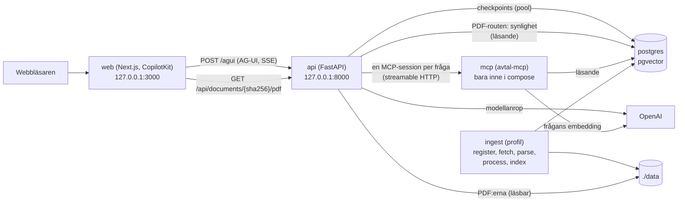

# M9 – API:t och hela systemet i Docker Compose

**Mål:** göra agenten (M7) nåbar för webbappen (M10) och starta hela systemet med ett kommando på
en Mac med Apple silicon, där demot körs. API:t kör agenten över AG-UI, protokollet som
CopilotKit talar, och ger PDF:en som ett citat pekar på. Besluten och varför står i
[ADR 0014](../adr/0014-api-och-compose.md).

**Klart när:** `POST /agui` kör en fråga till ett kontrollerat svar med kontraktets tillstånd
(`answer` och inget annat), `ask_user` avslutar körningen med AG-UI:s utfall och svaret återupptar
den, ett fel når webbläsaren utan interna detaljer, PDF-routen visar bara det verktygen visar, och
`docker compose up` startar databasen, avtal-mcp, API:t och webbappen. Allt utom compose har
tester utan språkmodell och databas; compose byggs och startas i CI på både amd64 och arm64. Kvar
(se Kända begränsningar): inloggning, en mindre image för API:t och provet mot den riktiga
webbappen, som webbappstråden gör när M9 finns.

## Resultat

Provkört mot den riktiga modellen (`gpt-6.1-sol`) genom API:t, med en tillfällig ersättare för
avtal-mcp över pilotens data (ingen Postgres i utvecklingsmiljön):

| Fråga | Vad hände | Status |
|---|---|---|
| Hur lång är uppsägningstiden för avtalet om IT-drift Mindre? | Agenten frågade med `ask_user` om det gäller det avropade kontraktet eller ramavtalet och vem som säger upp; svaret återupptog körningen | `verified`, 3 citat ur 6.21.8 |
| Vad är uppsägningstiden i IT-driftavtalet? | Frågade om Mindre eller Större och om kontrakt eller ramavtal; svaret återupptog körningen | `verified`, 2 citat |
| Vad kostar en seniorkonsult hos Iver i IT-drift Mindre? | Iver finns inte i IT-drift Mindre enligt registret, men i Större; agenten frågar om det menas | `with_reservation` (bara registret) |
| Hur stort är vitet i IT-drift Mindre? (avtal-mcp nere) | `RUN_STARTED` och `RUN_ERROR` med den fasta texten på 0,1 s | – |
| Samma fråga efter att avtal-mcp startats igen | Nästa körning öppnade en ny session | `verified`, 3 citat |

`ask_user` utlöstes här för första gången mot den riktiga modellen. Historiken som klienten
skickar tillbaka vid återupptagningen innehåller frågans verktygsanrop utan svar; adaptern lade
inte till något två gånger, och modellens API tog emot den.

## Flödet



En körning i API:t:

1. Webbappen skickar AG-UI:s `RunAgentInput`: tråd-id, körnings-id och hela meddelandehistoriken,
   och vid ett svar på `ask_user` även `resume` med svaret.
2. `AgentRuns.open()` öppnar en session till avtal-mcp och bygger grafen med den gemensamma
   modellen och checkpointern.
3. `AvtalAguiAgent.run()` strömmar händelserna: stegen, verktygsanropen och deras svar,
   ögonblicksbilder av tillståndet (`{"answer": null}` tills svaret är kontrollerat) och till sist
   `RUN_FINISHED`, med ett `interrupt`-utfall när agenten frågar något.
4. Sessionen stängs när strömmen är slut. Samtalet finns kvar i checkpointern under tråd-id:t.

## Kommandon

### Kör demot med Docker

Du behöver Docker Desktop och en OpenAI-nyckel.

```bash
cp .env.example .env               # sätt OPENAI_API_KEY i .env
mkdir -p data                      # inläsningen skriver här
tar -xzf avtalsagent-cache-2026-10-07.tar.gz   # valfritt: hoppar över tolkningen (se nedan)

docker compose --profile ingest run --rm ingest   # första gången: tabellerna, registret och dokumenten
docker compose up -d --wait --wait-timeout 300   # postgres, mcp, api och web
open http://localhost:3000         # webbappen
```

Blir en tjänst inte frisk inom fem minuter slutar `up` med ett fel i stället för att vänta för
evigt (tjänsterna startas om tills dess). `docker compose logs api` visar varför, till exempel
att `OPENAI_API_KEY` saknas eller att avtal-mcp inte svarar.

`ingest` kör `alembic upgrade head`, `register --download` och `ingestion run` (fetch, parse,
process och index). Utan cachen tar tolkningen av piloten ungefär två timmar på fyra kärnor. Med
cachen (`data/parsed` och `data/llm_cache` från utvecklingsmiljön, i projektets delade mapp,
aldrig i git) tolkas bara filer som har ändrats på avropa.se sedan dess. Hämtningen laddar ner
ungefär 130 MB, och indexet kostar embeddings för omkring 14 000 avsnittsbitar.

Övrigt:

```bash
docker compose logs -f api         # API:ts logg, också detaljerna bakom ett fel i webbläsaren
docker compose down                # stoppar allt; databasen ligger kvar i volymen postgres-data
docker compose down -v             # stoppar och tar bort databasen och Doclings modeller
```

Webbappen byggs ur `web/` (M10, ADR 0010) och är frisk när den svarar på `/`. Bara backend, utan
webbappen: `docker compose up -d --wait mcp api`.

### Utan Docker

```bash
uv run python -m avtalsagent.mcp_server http       # avtal-mcp på 127.0.0.1:8001
MCP_TRANSPORT=streamable_http uv run python -m avtalsagent.api   # API:t på 127.0.0.1:8000
curl http://127.0.0.1:8000/health
```

Med `MCP_TRANSPORT=stdio` (standard) startar API:t en avtal-mcp-process för varje fråga, vilket
fungerar men tar några sekunder extra. `CHECKPOINTER=postgres` sparar samtalen i databasen; med
`memory` försvinner de när API:t stängs.

### Routerna

| Route | Vad |
|---|---|
| `POST /agui` | En körning av agenten. Kroppen är AG-UI:s `RunAgentInput`, svaret server-sent events |
| `GET /agui/health` | `{"status": "ok", "agent": {"name": "avtalsagent"}}`, som adapterns egen |
| `GET /api/documents/{sha256}/pdf` | PDF:en, inline; 404 om dokumentet inte visas eller är en Word-fil; 422 för en felaktig hash; 503 om databasen inte svarar |
| `GET /health` | `{"status": "ok"}` utan databas och avtal-mcp, för containerns hälsokontroll |
| `GET /docs` | FastAPI:s beskrivning av routerna |

Inställningar (i `.env.example`):

| Variabel | Standard | Vad |
|---|---|---|
| `API_HOST` | `127.0.0.1` | Adressen API:t lyssnar på; `0.0.0.0` i containern |
| `API_PORT` | 8000 | Porten |

I compose sätts `DATABASE_URL`, `MCP_TRANSPORT=streamable_http`, `MCP_URL=http://mcp:8001/mcp`,
`CHECKPOINTER=postgres`, `API_HOST` och `DATA_DIR` i compose-filen och vinner över `.env`, eftersom
adresserna inne i compose skiljer sig från dem på din dator. Allt annat i `.env` når containrarna.

## Vad som byggdes, fil för fil

### 1. `api/agui.py` – agenten över AG-UI

`AvtalAguiAgent` är `ag-ui-langgraph`s `LangGraphAgent` med fyra ändringar: en ögonblicksbild av
tillståndet är bara `{"answer": ...}` (annars skickas alla meddelanden och det okontrollerade
utkastet igen vid varje steg), `RUN_ERROR` har en fast svensk text (undantagets text kan innehålla
en adress eller SQL), `ask_user` skickas bara som AG-UI:s utfall på `RUN_FINISHED` (ingen äldre
`CUSTOM on_interrupt`), och inga `RAW`-kopior. `AgentRuns` håller det som alla körningar delar
(modellen och checkpointern) och öppnar en ny MCP-session per körning. Routen är adapterns
`add_langgraph_fastapi_endpoint`, utskriven. Går sessionen inte att öppna blir körningen
`RUN_STARTED` och `RUN_ERROR`. Bryts den mitt i körningen (avtal-mcp startas om, ett 5xx-svar)
avbryter MCP-klienten körningen, och adaptern skickar då ingenting; routen avslutar strömmen med
`RUN_ERROR` själv. Webbappen visar alltså ett fel i stället för en ström som bara tar slut.

### 2. `api/documents.py` – PDF-routen

`DatabaseDocumentFiles.find(sha256)` läser på en läsande session om verktygen visar filen
(`load_visibility`, samma regel som avtal-mcp) och sedan filens rad i `source_document`: typen och
sökvägen under `DATA_DIR`, där steg 1 sparade den under sin hash. Routen är en vanlig funktion,
som FastAPI kör i en arbetstråd, så att databasfrågan inte håller upp agentens körningar. En fil
där karantänen håller tillbaka ett avsnitt visas: verktygen visar resten, och PDF:en är det
offentliga dokumentet.

### 3. `api/app.py` – appen och livscykeln

`create_app()` bygger appen. Livscykeln gör modellklienten först (utan nyckel stoppas starten
innan något öppnas), frågar avtal-mcp en gång och öppnar sedan checkpointern och PDF-routens
läsande motor. Hur varje del öppnas är en parameter, så testerna kör hela appen med en skriptad
modell, verktyg i minnet och ingen databas.

### 4. `api/__main__.py` – kommandoraden och loggen

`python -m avtalsagent.api` startar uvicorn på `API_HOST:API_PORT`. Loggen har en hanterare på
rotloggern med `RedactingFormatter`, som tar bort OpenAI-nyckeln och databasens lösenord ur varje
rad, tracebacks inräknade: adaptern loggar undantaget bakom en misslyckad körning.
`Settings.redact` (flyttad från kommandoraden i M7) gör jobbet. httpx:s rad per anrop tas bort under
WARNING. Vid `docker stop` väntar servern högst 5 sekunder på strömmar som pågår.

### 5. Ändringar i agenten

- `agent/checkpointer.py`: Postgres-checkpointern tar sin anslutning ur en pool med en anslutning,
  som kontrolleras innan den lånas ut, så att en anslutning som Postgres har stängt byts ut.
  LangGraphs checkpointer gör en läsning eller skrivning i taget (ett eget lås), så körningarna turas
  om på anslutningen och en andra anslutning skulle stå oanvänd.
- `agent/open_tool_calls.py` (ny): `AnswerOpenToolCalls` visar modellen ett felsvar för ett
  verktygsanrop som saknar svar. En körning som bryts mitt i ett anrop (sessionen bryts, ett
  oväntat fel i ett verktyg, användaren lämnar sidan) lämnar anropet utan svar i checkpointen, och
  OpenAI vägrar då varje följande fråga i samma tråd. Checkpointen ändras inte; modellen får en
  kopia av historiken med felsvaret direkt efter anropet.
- `agent/ask_user.py`: en fråga som klienten avbryter når modellen som "Användaren svarade inte
  på frågan" i stället för adapterns markering (en ordbok).
- `db/migrations/env.py`: LangGraphs checkpointtabeller utesluts ur `alembic revision
  --autogenerate`, som annars skulle föreslå att de tas bort.
- `config.py`: `API_HOST`, `API_PORT` och `Settings.redact`.

### 6. `Dockerfile`, `docker-compose.yml` och CI

En image för hela backend (`python:3.12-slim-bookworm`, uv 0.8.17, `uv sync --locked --no-dev`,
användaren `app` utan root). Compose har `postgres`, `mcp`, `api`, `web` och `ingest` (profilen
`ingest`); varje publicerad port är bunden till `127.0.0.1`, och avtal-mcp publiceras inte alls.
`.dockerignore` håller `.env` och `data/` utanför bygget, så nyckeln hamnar aldrig i imagen. CI:s
jobb `compose` bygger imagen och startar migreringarna, avtal-mcp, API:t och webbappen på
`ubuntu-24.04` och `ubuntu-24.04-arm`. Det kontrollerar hälsokontrollerna, PDF-routens 404 direkt
och genom webbappen (som visar att webbappen når API:t inne i compose) och att
checkpointtabellerna skapades. Varje `up --wait` har en tidsgräns: en tjänst som startas om gång på
gång fäller jobbet i stället för att låta det vänta i timmar.

## Tester

| Fil | Antal | Vad den visar |
|---|---|---|
| `tests/unit/api/test_api_agui.py` | 13 | Hela appen genom httpx: en fråga strömmar stegen och slutar med det kontrollerade svaret, med `null` i fälten som saknas; varje ögonblicksbild är bara `answer`, först `null`; inga `RAW`-händelser; `ask_user` slutar med utfallet och utan `CUSTOM`; svaret återupptar körningen till ett kontrollerat svar, och historiken från klienten ger varje verktygsanrop exakt ett svar; en ny fråga medan `ask_user` väntar skickar samma fråga igen utan att köra grafen; ett fel ger den fasta texten utan lösenordet och loggas; efter ett verktygsanrop som misslyckades besvaras nästa fråga i tråden; en session som bryts mitt i körningen avslutar strömmen med `RUN_ERROR`; varje körning har en egen session som stängs; en session som inte går att öppna fäller bara sin körning; en felaktig kropp ger 422; hälsokontrollerna |
| `tests/unit/api/test_api_documents.py` | 9 | PDF:en inline med rätt typ; 404 för ett dokument som inte visas, för en Word-fil och för en fil som saknas på disken (loggad); 503 med fast text när databasen inte svarar; en felaktig hash stoppas innan något slås upp |
| `tests/unit/api/test_api_app.py` | 10 | Livscykeln frågar avtal-mcp, öppnar checkpointern och PDF-routens motor och stänger dem i omvänd ordning; utan nyckel öppnas inget; en avtal-mcp som inte svarar stoppar starten; en del som inte går att öppna stänger dem som redan är öppna; en checkpointer som inte går att öppna stoppar starten; routerna finns före starten; motorn är läsande och stängs; `main` med adress och loggning; loggen visar aldrig nyckeln eller lösenordet, inte heller i en traceback |
| `tests/unit/test_config.py` | 5 nya | `API_HOST` och `API_PORT`, porten inom gränserna, `redact` för nyckeln och lösenordet i adress, kodat och inom citattecken |
| `tests/unit/agent/test_agent_graph.py` | 2 nya | En avbruten fråga når modellen som "svarade inte"; markeringen är adapterns |
| `tests/unit/agent/test_open_tool_calls.py` | 4 | Ett anrop utan svar får ett felsvar direkt efter sig; anrop med svar lämnas som de är, också när bara ett av två anrop i samma meddelande saknar svar; historiken ändras inte |
| `tests/unit/agent/test_checkpointer.py` | 1 ändrat | Postgres-grenen med en ersättare för poolen: adressen, poolens inställningar, en `setup()` och att poolen stängs |
| `tests/integration/test_api_document_lookup.py` | 5 | Uppslaget mot Postgres på M5:s testkorpus: en indexerad fil hittas med sin sökväg, också med ett avsnitt i karantän; en okänd hash och en fil i karantän hittas inte; en Word-fil kommer tillbaka som Word |

43 nya enhetstester och 5 integrationstester. Inget test anropar språkmodellen.

## Kända begränsningar

- **Ingen inloggning.** Den som når API:t och känner till ett tråd-id kan fortsätta tråden. Portarna
  är bundna till `127.0.0.1`; för något annat än ett lokalt demo behövs autentisering.
- **Felet i webbläsaren är allmänt.** Detaljerna finns bara i API:ts logg.
- **En ny fråga medan `ask_user` väntar** visar samma fråga igen; den nya frågan sparas inte.
- **Imagen är stor.** PyTorch och Docling följer med också till API:t och avtal-mcp.
- **Inläsningen skriver i `./data` som uid 1000.** På en Mac spelar det ingen roll; på Linux måste
  katalogen vara skrivbar för den användaren.
- **Ingen spårning (Langfuse)** och inga mätvärden per körning ännu. Spårningen kom efter M11
  ([ADR 0021](../adr/0021-sparning-med-langfuse.md), [steg 07](07-agent.md#spårning-med-langfuse)):
  med Langfuses nycklar i `.env` blir varje körning av `POST /agui` en spårning med AG-UI:s
  `threadId` som session. Svaret på agentens fråga är en ny körning och blir en ny spårning i
  samma session.
- **Inte provkört mot Postgres här.** Checkpoint-poolen och PDF-uppslaget mot databasen körs i CI.

## Så verifierar du M9 själv

```bash
uv run pytest tests/unit/api tests/unit/test_config.py
uv run pytest tests/integration/test_api_document_lookup.py tests/integration/test_agent_checkpointer.py
docker compose --profile ingest run --rm ingest
docker compose up -d --wait mcp api
curl http://127.0.0.1:8000/health
curl -N -H 'Accept: text/event-stream' -H 'Content-Type: application/json' \
  -d '{"threadId":"t1","runId":"r1","state":{},"tools":[],"context":[],"forwardedProps":{},
       "messages":[{"id":"u1","role":"user","content":"Hur stort är vitet i IT-drift Mindre?"}]}' \
  http://127.0.0.1:8000/agui
```

Titta på att stegen kommer som `TOOL_CALL_START` medan agenten arbetar, att varje
`STATE_SNAPSHOT` bara innehåller `answer` och att den sista har status och citat. Öppna sedan
`http://127.0.0.1:8000/api/documents/<sha256>/pdf` med en `sha256` ur ett citat. Prova också:

- en fråga som passar flera delområden, till exempel uppsägningstiden i IT-drift utan Mindre eller
  Större: körningen slutar med `"outcome": {"type": "interrupt", ...}`. Skicka sedan historiken
  från den sista `MESSAGES_SNAPSHOT` med `"resume": [{"interruptId": "<id>", "status":
  "resolved", "payload": "<ett av alternativen>"}]`;
- `docker compose stop mcp`, en fråga (ska ge `RUN_ERROR` direkt), `docker compose start mcp` och
  samma fråga igen (ska fungera);
- `docker compose logs api` efter felet: detaljerna står där, utan nyckel eller lösenord.
