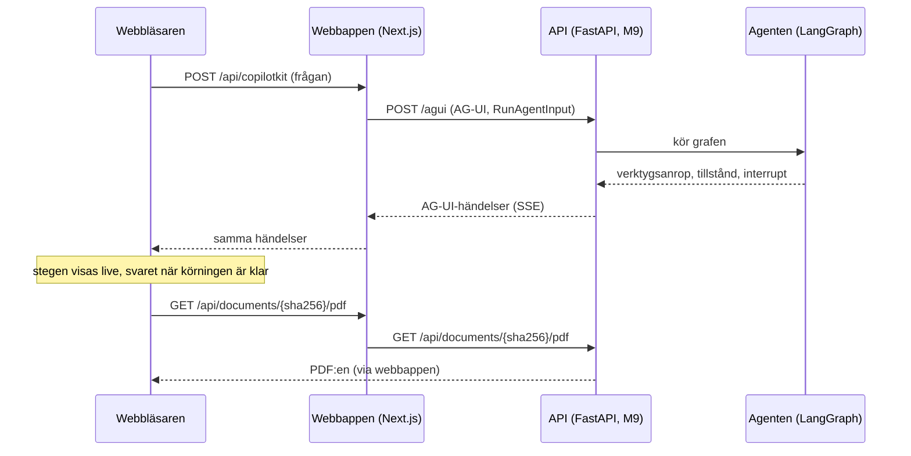

# M10 – Webbappen

**Mål:** en webbsida där man ställer en fråga om ramavtalen och ser hur agenten arbetar: vilka
verktyg den anropar, svaret med källhänvisningar och, med ett klick på en källa, PDF:en på rätt
sida med citatet markerat. När agenten behöver veta mer frågar den i en dialog.

**Klart när:** hela flödet fungerar i webbläsaren, inklusive en fråga som kräver förtydligande.

> **Läge (2026-10-07):** byggd och testad mot en mock av agenten, som skickar samma händelser som
> den riktiga agenten. Den följer kontraktet nedan, också det backend förtydligade 2026-10-07 efter
> att agenten (M7) provkörts. Den är också provad i webbläsaren mot API:t (M9) med den riktiga
> modellen, med avtal-mcp:s verktyg utbytta mot två påhittade dokument: verifierat svar med
> markerat citat, frågedialogen, en Word-fil utan PDF, ett svar ur registret och ett fel när
> avtal-mcp inte svarar fungerade som med mocken. Efter M8 visar den också reservationerna,
> registerraderna som ett svar bygger på och att svaret kontrolleras. Webbappen byggdes i en egen
> tråd, parallellt med backend.

## Vad du ser

| Del | Vad den visar |
|---|---|
| Chatten | Frågorna och svaren. Innan första frågan finns tre exempelfrågor att klicka på. |
| Agentens steg | Ett kort per verktygsanrop, live medan agenten arbetar: "Söker i dokumenten" blir "Sökte i dokumenten" när verktyget har svarat. Kortet visar huvudargumentet ("uppsägningstid") och de andra argumenten med svenska namn. Verktygets svar går att fälla ut. Agentens fråga till dig är också ett steg, "Frågar dig". När agenten lämnar in sitt svar (`FinalAnswer`) står det "Kontrollerar svaret …" tills svaret är klart. Granskningen tar i median 9 sekunder. |
| Svarskortet | Status (**Verifierat**, **Med reservation** eller **Inget svar**) med en rad om vad som kontrollerades, svarstexten där `[1]` och `[2]` är knappar, reservationerna, avtalen ur registret som svaret bygger på, och en lista med källorna: dokument, avsnitt, sida och citat. Ett citat som inte kunde kontrolleras mot avtalstexten får en varning. Svarstextens stycken och listor behåller sina radbrytningar. |
| Källpanelen | Öppnas till höger när man klickar på en källa. PDF:en visas på den citerade sidan och citatet är markerat i gult. Om citatet inte finns på sidan står det i panelen. En Word-fil har ingen PDF, och då visar panelen bara citatet. |
| Frågedialogen | När agenten anropar `ask_user` öppnas en dialog med frågan och svarsalternativen som knappar. Man kan också skriva ett eget svar. Agenten fortsätter med svaret. |
| Fel | Om agenten inte kan svara, till exempel när API:t inte svarar, står det under frågan i stället för ett svarskort. |

## Flödet



Webbläsaren pratar bara med webbappen. Webbappens server skickar vidare till API:t, både
agentens körningar och PDF:erna. Det ger tre saker:

- API:t behöver inte vara åtkomligt från webbläsaren och behöver ingen CORS-inställning.
- API:ts adress (`API_URL`) läses av servern när den kör, inte när appen byggs. Samma image
  fungerar mot mocken, på din dator och i Docker Compose.
- CopilotKits runtime ligger mellan webbläsaren och agenten. Den kopplar webbläsaren till rätt
  agent och kan senare ta emot fler agenter utan att webbläsarens kod ändras.

## Kontraktet med backend

Webbappen och backend (API:t i M9 och agenten i M7) byggdes samtidigt i två trådar. Det här är
gränssnittet mellan dem, som båda trådarna kom överens om 2026-10-06 och backend förtydligade
2026-10-07. `src/lib/contract.ts`
kontrollerar svaret och frågan mot det medan appen kör.

**Adresser.** API:t är en FastAPI-tjänst. Webbappen når den på `API_URL` (standard
`http://localhost:8000`, i Docker Compose `http://api:8000`).

| Adress | Vad |
|---|---|
| `POST /agui` | Kör LangGraph-agenten `avtalsagent` via FastAPI-adaptern i `ag-ui-langgraph` och svarar med AG-UI-händelser (SSE). |
| `GET /api/documents/{sha256}/pdf` | Ger PDF:en. |

**Händelserna** är AG-UI 1.0 som `ag-ui-langgraph` skickar dem: `RUN_STARTED`, `STEP_STARTED` per
nod, `TOOL_CALL_START`, `TOOL_CALL_ARGS`, `TOOL_CALL_END` och `TOOL_CALL_RESULT` per verktygsanrop,
`STATE_SNAPSHOT`, `MESSAGES_SNAPSHOT` och till sist `RUN_FINISHED`, eller `RUN_ERROR` om något gick
fel. CopilotKit skickar hela meddelandehistoriken i varje körning.

**Verktygen** har engelska namn i koden. `docs/arkitektur.md` (avsnitt 5.3) kallar dem vid sina
svenska namn från planen:

| I koden | I arkitekturplanen | Steg i webbappen |
|---|---|---|
| `search_documents` | `sok_dokument` | Söker i dokumenten |
| `read_section` | `las_avsnitt` | Läser avsnitt |
| `get_outline` | `visa_innehall` | Hämtar innehållsförteckning |
| `resolve_reference` | `folj_hanvisning` | Följer hänvisning |
| `list_documents` | `lista_dokument` | Listar dokument |
| `search_register` | `sok_register` | Söker i registret |
| `find_amendments` | `hitta_andringar` | Letar efter ändringar |
| `calculate_date` | `berakna_datum` | Räknar ut datum |
| `ask_user` | `fraga_anvandaren` | Frågar dig, och frågedialogen |

Argumenten `query`, `agreement_number`, `framework_area`, `document_type`, `sha256`,
`section_number`, `section_position`, `reference`, `supplier`, `org_number`, `valid_on`, `limit`,
`offset` och `options` får svenska namn i stegen. Andra argument visas under sina egna namn.

Agenten lämnar in sitt svar genom att anropa verktyget `FinalAnswer`. Kontrollen läser då varje
citerat avsnitt och registret, och en andra modell granskar att källorna stöder svaret. Under
granskningen kommer inga händelser, i median 9 sekunder. Ett underkänt utkast får ett verktygssvar
som börjar med "Kontrollen underkände svaret (försök 1 av 3):", och agenten försöker igen, högst
tre utkast per fråga. Ett utkast som formatkontrollen avvisar får svaret "Error: Failed to parse
…" och räknas inte. Det godkända utkastets svar ("Svaret är lämnat för kontroll.") kommer först
med meddelandehistoriken när körningen är klar.

Webbappen visar varken utkasten eller kontrollens svar. I stället för ett steg står det
"Kontrollerar svaret …" från att `FinalAnswer`-anropet kommer tills anropet får ett svar,
`answer` sätts, agenten anropar nästa verktyg eller körningen slutar. Kontrollens svar på ett
underkänt utkast kan också komma först i slutet, så utkastets rad försvinner när agenten gör
något nytt, och nästa utkast får en ny. Svaret läses bara ur tillståndet. Grafens steg
(`AnswerCheck.before_agent` och `AnswerCheck.after_agent`) läser webbappen inte.

**Svaret** ligger i agentens delade tillstånd under nyckeln `answer`, och bara där. Backend
strömmar inte svaret som ett chattmeddelande (metadata `emit-messages: False` på det modellanropet)
och sätter `answer` till `null` i början av varje ny fråga. Värdet är `null` tills
citatkontrollen är klar, och en ögonblicksbild mitt i körningen kan sakna nyckeln. Båda betyder att
svaret inte är klart.

```json
{
  "text": "Uppsägningstiden är tre månader [1].",
  "status": "verified | with_reservation | no_answer",
  "citations": [
    {
      "id": 1,
      "sha256": "…",
      "file_title": "Allmänna villkor",
      "page_title": "IT-drift Större, fler än 200 anställda",
      "section_number": "6.21.9",
      "section_title": "Uppsägning",
      "page": 14,
      "quote": "…",
      "verified": true
    }
  ],
  "reservations": [],
  "register_facts": [
    {
      "agreement_number": "23.3-5890-2023-002",
      "supplier_name": "Nordlo Advance AB",
      "former_names": ["EPM Data"],
      "org_number": "556486-1689",
      "sub_area": "IT-drift / IT-drift Mindre, upp till 200 anställda",
      "valid_from": "2024-11-14",
      "valid_to": "2028-11-13",
      "max_extension_to": null
    }
  ]
}
```

- `text` är vanlig text utan Markdown. Stycken skiljs med en tom rad och en lista skrivs med `- `
  först på varje rad. Svarskortet behåller radbrytningarna (`white-space: pre-line`).
- Texten hänvisar till källorna som `[1]`, `[1][2]` eller `[1, 2]`.
- `verified` säger om citatet klarade citatkontrollen. `quote` är aldrig tomt.
- `page_title` är den ramavtalssida frågan gäller, bland sidorna som länkar till filen.
- `section_number`, `page` och `page_title` kan vara `null`: för ett avsnitt utan nummer, för en
  Word-fil och för en fil som ingen ramavtalssida länkar till. En källa vars avsnitt inte gick att
  läsa har dessutom tomma `file_title` och `section_title`, och visas som "Okänt dokument".
- En Word-fil har ingen PDF: `GET /api/documents/{sha256}/pdf` svarar `404`, och källpanelen visar
  citatet utan dokumentet. Utan `page` visas dokumentet från början.
- `reservations` och `register_facts` finns alltid, som tomma listor när de inte används. Ett svar
  från före M8 saknar dem, och då läser webbappen dem som tomma.
- `register_facts` är registrets rader för avtalen som svaret tar uppgifter ur. Ett avtal har en
  rad per delområde (och region), och registret skriver ibland samma nummer på två sätt (`-001` och
  `-01`). Webbappen visar därför en rad per avtal: numret, leverantören med organisationsnummer
  och tidigare namn, delområdet eller "N delområden", och giltighetstiden med "längst till" när
  avtalet kan förlängas. Har raderna olika giltighetstider står det "olika giltighetstider". Fler
  än tre avtal fälls ihop under rubriken "Ur registret: N avtal".

Statusen betyder:

- **Verifierat**: varje citat står ordagrant i sitt avsnitt, varje uppgift ur registret stämmer
  med registret, och granskaren fann stöd för svaret. Ett svar ur registret kan vara Verifierat
  utan citat. Raden under statusen säger vad som kontrollerades: citaten, registret eller båda.
- **Med reservation**: något kunde inte kontrolleras, granskningen misslyckades eller svaret har
  ingen källa. `reservations` har då minst en mening om vad, och svarskortet visar dem under
  svaret.
- **Inget svar** kan ha källor, som visar var frågan regleras i stället (till exempel en bilaga som
  kunden fyller i själv). Raden under statusen säger det.

Formatet skiljer sig från agentens strukturerade output i `docs/arkitektur.md`
(avsnitt 6, med påståenden och källor per påstående). Det är backend som lägger svaret i den här
formen i `answer`.

**Frågan till användaren** ställer agenten med verktyget `ask_user`. Verktyget stoppar körningen
med en LangGraph-interrupt med värdet `{question, options?}`, där
`options` är en lista med strängar eller saknas (`null` räknas som saknas). Backend skapar agenten
med `LangGraphAgent(..., emit_interrupt_outcome=True)`. Då skickar `ag-ui-langgraph` frågan på två
sätt, och webbappen klarar vart och ett för sig:

- AG-UI:s standardform: `RUN_FINISHED` har `outcome: {type: "interrupt", interrupts: [...]}` och
  värdet ligger i `metadata.langgraph.raw`;
- den äldre formen: en `CUSTOM`-händelse `on_interrupt` vars värde är `{question, options}` som
  JSON-text. Den är `ag-ui-langgraph`s standard.

En interrupt som inte har den formen öppnar ingen dialog. Svaret skickas tillbaka som en vanlig
sträng, alternativet eller det man skrev, och körningen fortsätter med det. Svaret blir också
verktygets resultat, så steget "Frågar dig" blir klart när körningen fortsätter.

## Vad som byggdes, fil för fil

Allt ligger i `web/`. Kod och identifierare är på engelska, texten i gränssnittet på svenska.

### 1. `src/lib/contract.ts` – kontraktet som scheman

Zod-scheman för svaret och för frågan till användaren, och två rena funktioner. `parseAnswer`
läser `answer` ur tillståndet och ger "inget svar än", ett svar eller ett fel med fältets sökväg.
`parseAskUser` provar de två formerna av interrupt i tur och ordning och ger `null` om ingen passar,
så att webbappen inte öppnar dialogen för en interrupt som inte är `ask_user`.

### 2. `src/lib/tools.ts` – svenska namn på verktygen

En tabell med två etiketter per verktyg (pågår och klart), svenska namn på argumenten och vilket
argument som är huvudsaken för varje verktyg. `describeToolCall` gör ett verktygsanrop till rubrik,
huvudargument och övriga argument. SHA-256 kortas till åtta tecken. Ett verktyg eller argument som
inte finns i tabellen visas med sitt eget namn, så ett nytt verktyg i backend syns direkt.
`ANSWER_TOOL` är namnet på anropet som inte är ett steg, `FinalAnswer`. Argument som inte säger
något visas inte: `offset` när det är 0, och avsnittets plats i filen när avsnittets nummer finns.

### 3. `src/lib/answerText.ts` och `src/lib/citation.ts` – källorna

`answerText.ts` delar svarstexten i textbitar och hänvisningar. `[1]`, `[1][2]` och `[1, 2]` blir
hänvisningar om källan finns i svaret. En hänvisning till en källa som saknas lämnas som text i
stället för att bli en trasig knapp.

`citation.ts` skriver källans namn, till exempel "Allmänna villkor, avsnitt 6.21.9 Uppsägning,
s. 14", och hoppar över de delar som är `null` eller tomma. En källa utan sida eller
avsnittsnummer visar alltså aldrig "null", och en källa utan filnamn heter "Okänt dokument".

### 4. `src/lib/highlight.ts` – hitta citatet på sidan

Det svåraste i webbappen. PDF.js delar en sida i många små textbitar, ofta en per rad, och ett
citat sträcker sig oftast över flera. Därför:

1. Alla bitar på sidan slås ihop till en lång text där varje tecken minns vilken bit och vilken
   position det kom från.
2. Både sidans text och citatet normaliseras: blanksteg tas bort, olika bindestreck och
   citattecken görs lika, ligaturer som `fi` skrivs ut, mjuka bindestreck försvinner och `ä` skrivs
   som `a` med prickar, den form en del PDF:er lagrar. Agentens citat och PDF:ens text skiljer sig
   ofta just där.
3. Citatet söks i den normaliserade texten. Hittas det inte görs ett nytt försök där bindestreck i
   slutet av en rad tas bort (`upp-` + `sägning`).
4. Hittas det fortfarande inte kan citatet fortsätta på nästa sida, eller ha börjat på sidan före.
   Då markeras den längsta början av citatet som slutar en rad nära sidans slut, eller det längsta
   slutet som börjar en rad nära sidans början, minst 24 tecken. Panelen säger att bara en del av
   citatet finns på sidan. En början eller ett slut mitt på sidan markeras inte. Det skulle få ett
   felcitat ("sex månader" där avtalet säger "tre") att se delvis bekräftat ut.
5. Positionerna räknas tillbaka till textbitarna, och `markItem` gör varje bit till HTML med
   `<mark>` runt de träffade tecknen.

### 5. `src/lib/answerAnchors.ts` – var svarskortet hamnar

Varje fråga får sitt svarskort efter det sista meddelandet som hör till frågan, alltså före nästa
fråga. Funktionen räknar ut det från meddelandelistan, så korten hamnar rätt även när en fråga
pausats av en dialog och fortsatt i en ny körning. `isLatestToolCall` säger om ett verktygsanrop
är det senaste i den senaste frågan, så att "Kontrollerar svaret …" bara visas för det utkast som
kontrolleras nu.

### 5b. `src/lib/registerFacts.ts` och `src/lib/answerStatus.ts` – registret och statusen

`registerFacts.ts` grupperar `register_facts` per avtal. `agreementKey` skriver leverantörens
löpnummer med tre siffror, som backendens `domain/identifiers.py`, så `-01` och `-001` blir samma
avtal. `describeAgreement` gör raden som svarskortet visar, med samma delar som kommandoradens
`register_lines` (`agent/__main__.py`).

`answerStatus.ts` har statusarnas namn och raden under statusen, som beror på vad svaret har:
citat, registerrader eller reservationer.

### 6. `src/app/api/copilotkit/[[...slug]]/route.ts` – vägen till agenten

CopilotKits runtime (v2-API:t) i en route i Next.js. Den har en agent, `avtalsagent`, som är en
`HttpAgent` mot `${API_URL}/agui`. Adressen läses i `src/lib/backend.ts`, som bara kan importeras på
servern.

### 7. `src/app/api/documents/[sha256]/pdf/route.ts` – PDF:en

Kontrollerar att `sha256` är 64 hexadecimala tecken, hämtar filen från API:t och strömmar den
vidare. Om API:t inte svarar blir det `502`, och en fil som saknas blir `404`.

### 8. `src/components/` – gränssnittet

| Fil | Del |
|---|---|
| `AgentApp.tsx` | Sidan: CopilotKit, rubriken, chatten och källpanelen bredvid varandra (under varandra på smala skärmar). |
| `Chat.tsx` | CopilotKits chatt med svenska texter, exempelfrågorna och `useRenderTool` som ritar varje verktygsanrop som ett steg, utom `FinalAnswer`. |
| `AnswerCheck.tsx` | Raden "Kontrollerar svaret …" för ett `FinalAnswer`-anrop. CopilotKit ger ett verktyg i backend samma status medan argumenten strömmar och medan det väntar på svar, så raden kan inte skilja på att agenten skriver och att svaret kontrolleras. |
| `AgentSteps.tsx` | Ett steg: etikett, argument, en snurra medan verktyget arbetar och verktygets svar. |
| `Answers.tsx` | Sparar varje frågas svar när körningen är klar och placerar svarskortet i chatten. Svaret sparas bara om körningen lyckades och skickade tillstånd, annars skulle en misslyckad fråga få förra frågans svar. En misslyckad körning får ett felmeddelande. |
| `AnswerCard.tsx` | Svarskortet: status med en förklarande rad, text med hänvisningar, reservationerna, avtalen ur registret och källistan. |
| `SourcePanel.tsx` | Källpanelen: källans uppgifter, citatet och PDF:en. |
| `PdfViewer.tsx` | PDF:en med `react-pdf` (PDF.js). Sidan ritas med sitt textlager, citatet markeras och panelen rullar till markeringen. Svarar API:t `404` (en Word-fil) säger den att det inte finns någon PDF. |
| `ClarifyDialog.tsx` | Frågedialogen, med `useInterrupt`. Den kan inte stängas utan svar, eftersom agenten väntar på det: Escape är avstängt (`closedby="none"`), och dialogen öppnas igen om den ändå stängs. |
| `SourceContext.tsx` | Låter en hänvisning i ett svarskort öppna källpanelen. |

### 9. `mock/` – en låtsasagent

En liten server (`mock/server.ts`) med samma adresser som API:t: `POST /agui` och
`GET /api/documents/{sha256}/pdf`. Den svarar med skriptade körningar (`mock/scenarios.ts`) i
samma ordning som `ag-ui-langgraph` skickar händelserna:

| Fråga som innehåller | Vad mocken gör |
|---|---|
| uppsägning och ett område (IT-drift, Programvaror, Bemanningstjänster) | Söker, läser avsnittet och svarar **Verifierat** med två källor. |
| uppsägning utan område | Söker och anropar `ask_user`, som frågar vilket ramavtalsområde som menas, med båda händelserna. Fortsätter sedan med svaret. Med `[legacy]` i frågan kommer bara den äldre händelsen, med `[outcome]` bara standardformen. |
| vite | Kontrollen underkänner första utkastet, och skälet kommer först med meddelandehistoriken i slutet. Mocken läser avsnittet och svarar **Med reservation** med två reservationer. Den andra källans citat finns inte i PDF:en. |
| bilaga | Svarar **Inget svar** med en källa i en Word-fil: utan sida, utan avsnittsnummer och utan PDF. Texten har stycken och en lista. |
| avtalsnummer | Söker i registret och svarar **Verifierat** utan citat, med tre registerrader för två påhittade avtal. Det första har två delområden och sitt nummer skrivet på två sätt. |
| `[fel]` | Gör ett steg och avslutar med `RUN_ERROR`, som när backend fallerar. |
| allt annat | Svarar **Inget svar**. |

Mocken lämnar in varje svar med `FinalAnswer` och sätter `answer` efter en paus för granskningen,
utan händelser och utan svar på anropet, som den riktiga agenten gör. Pausen är 3 sekunder, och
0,8 sekunder med `MOCK_FAST=1` i testerna, så att de hinner se "Kontrollerar svaret …".

PDF:en som mocken citerar skapas av `mock/fixture-pdf.ts`. Den är påhittad, säger på varje sida att
den inte är ett avtal från avropa.se, och har alltid samma SHA-256. Inga dokument från avropa.se
finns i repot.

### 10. Docker

`web/Dockerfile` har fyra steg. `deps` installerar paketen, `build` bygger Next.js till en
fristående server (`output: "standalone"`) som bara tar med de filer ur `node_modules` som servern
använder, och `runner` är den image som körs (480 MB). `mock` är
en egen liten image för mocken, med bara de tre paket den behöver. Node-imagen finns för både
`linux/arm64` och `linux/amd64`, så samma fil fungerar på en Mac med M1 eller M2 och i CI.

- `web/compose.mock.yaml` startar mocken och webbappen tillsammans.
- `docker-compose.yml` i roten har en tjänst `web` som pekar på `http://api:8000`. Tjänsten `api`
  läggs till med API:t.

### 11. CI

Två nya jobb i `.github/workflows/ci.yml`:

- `web` kör formatering, lint, typkontroll, enhetstesterna, bygget och webbläsartesterna.
- `web-docker` bygger båda imagarna med `compose.mock.yaml` och kör webbläsartesterna mot
  containrarna, så som demot körs.

## Medvetna val

- **CopilotKits v2-API** (`@copilotkit/react-core/v2`, version 1.77). Det är byggt direkt på AG-UI.
  v1-API:t finns kvar för äldre appar.
- **Svaret ritas av webbappen, inte av CopilotKit.** CopilotKit kan rita tillståndet i chatten, men
  i våra tester med version 1.77 knöt den ibland samma tillstånd till flera körningar, så
  svarskortet visades flera gånger. Webbappen sparar i stället svaret när körningen är klar
  (`RUN_FINISHED`) och bestämmer själv var kortet hamnar.
- **PDF.js äldre bygge (`legacy`).** PDF.js 6 använder nya JavaScript-funktioner som inte alla
  webbläsare har ännu. Chromium 141 saknar till exempel `Map.getOrInsertComputed`, och PDF:en
  kunde inte visas där. Det äldre bygget har ersättningar för funktionerna.
- **Mocken är TypeScript som Node kör direkt.** Node 22.18 och senare tar bort typerna när filen
  laddas, så mocken behöver inget byggsteg. Samma sak gäller enhetstesterna, som körs med Nodes
  egen testkörare i stället för ett testramverk.
- **Exakta versioner** av alla paket i `package.json`, och `package-lock.json` i repot, så att alla
  bygger samma sak.
- **Svaren sparas bara i webbläsaren.** Laddar man om sidan är tidigare frågor borta. Det räcker
  för demot. Att spara trådar kräver lagring i backend.

## Tester

| Var | Vad | Antal |
|---|---|---|
| `src/lib/*.test.ts` | Kontraktet (också fälten som kan vara `null` och svar utan M8:s fält), verktygens etiketter, hänvisningarna i texten, källornas namn, var korten hamnar, raden under statusen, registerraderna per avtal och markeringen av citat (radbrytningar, bindestreck, ligaturer, accenter, delvis träff vid sidans kant, felcitat mitt på sidan) | 49 |
| `mock/scenarios.test.ts` | Mockens händelser: ordningen, att svaren följer kontraktet, att bara det inlämnade `FinalAnswer` saknar svar, pausen för granskningen, det underkända utkastet, att varje verifierat citat finns på sin sida i test-PDF:en, de tre formerna av interrupt, att `ask_user` får svaret som resultat, båda sätten att svara och en körning som misslyckas | 12 |
| `e2e/app.spec.ts` | Hela flödet i Chromium mot mocken: exempelfråga, steg, "Kontrollerar svaret …", svarskort, källpanel med markerat citat över två rader, dialogen i alla tre formerna, att Escape inte stänger den, eget svar, reservationer och ett dolt underkänt utkast, flera frågor efter varandra, en fråga vars körning misslyckas, en källa i en Word-fil utan sida och PDF, och ett svar ur registret med en rad per avtal | 11 |

## Så verifierar du M10 själv

Med Docker, utan Node på datorn:

```bash
docker compose -f web/compose.mock.yaml up --build
```

Öppna http://localhost:3000 och prova:

1. Klicka på exempelfrågan **Uppsägning i IT-drift**. Två steg visas, sedan "Kontrollerar svaret
   …" och ett verifierat svar.
   Klicka på `[1]` och se citatet markerat på sidan 2 i PDF:en.
2. Skriv *Vilken uppsägningstid gäller för ett kontrakt?* Dialogen frågar vilket område som menas.
   Välj ett, eller skriv ett eget svar.
3. Skriv *Vilket vite gäller vid försenad leverans?* Kontrollen underkänner första utkastet, men
   det syns bara som en längre väntan. Svaret har två reservationer, och källa 2 hittas inte i
   PDF:en.
4. Skriv *Står säkerhetsnivån i en bilaga?* Inget svar, men källan visar var frågan regleras. Den
   är en Word-fil, så panelen visar citatet utan PDF.
5. Skriv *Vilket avtalsnummer har IT-drift?* Ett verifierat svar ur registret utan citat, med två
   avtal under "Ur registret". Det första har två delområden.

Med Node 22.18 eller senare:

```bash
cd web
npm ci
npm run mock      # mocken på port 8000, i ett eget fönster
npm run dev       # webbappen på http://localhost:3000
```

Testerna:

```bash
cd web
npm test                                   # enhetstester
npm run build && npm run test:e2e          # webbläsartester (npx playwright install chromium första gången)
```
