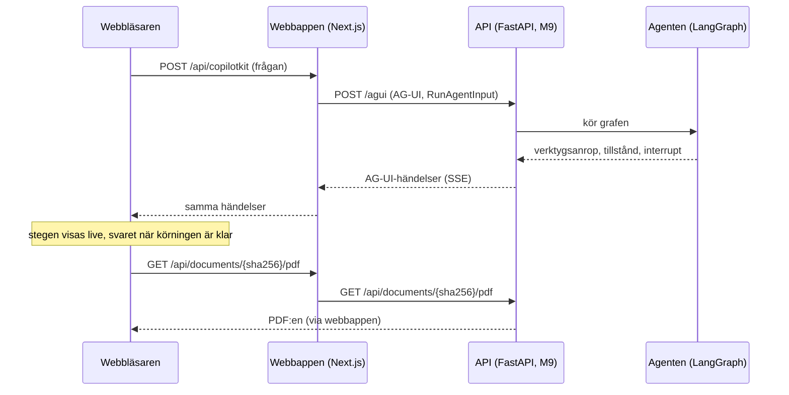

# M10 – Webbappen

> Filen beskriver M10 som den var när den byggdes, och några stycken har lagts till senare.
> Läget efter körningen mot den riktiga databasen står i [steg 12](12-demo.md).

**Mål:** en webbsida där man ställer en fråga om ramavtalen och ser hur agenten arbetar: vilka
verktyg den anropar, svaret med källhänvisningar och, med ett klick på en källa, PDF:en på rätt
sida med citatet markerat. När agenten behöver veta mer frågar den i chatten.

**Klart när:** hela flödet fungerar i webbläsaren, inklusive en fråga som kräver förtydligande.

> **Läge (2026-10-07):** byggd och testad mot en mock av agenten, som skickar samma händelser som
> den riktiga agenten. Den följer kontraktet nedan, också det backend förtydligade 2026-10-07 efter
> att agenten (M7) provkörts. Den är också provad i webbläsaren mot API:t (M9) med den riktiga
> modellen, med avtal-mcp:s verktyg utbytta mot två påhittade dokument: verifierat svar med
> markerat citat, frågedialogen, en Word-fil utan PDF, ett svar ur registret och ett fel när
> avtal-mcp inte svarar fungerade som med mocken. Efter M8 visar den också reservationerna,
> registerraderna som ett svar bygger på och att svaret kontrolleras. Webbappen byggdes i en egen
> tråd, parallellt med backend.
>
> Efter Simons provkörning 2026-10-07 fick webbappen ett nytt gränssnitt: egna färger som går att
> läsa i både ljust och mörkt läge, en chatt där agentens tankar och steg syns i en tidslinje
> under frågan, ungefär som i Claude, och agentens frågor i chatten i stället för i en ruta ovanpå.
> Tankarna visas när backend skickar dem (kontraktets punkt 29). Man kan också bifoga egna filer
> och be agenten jämföra dem med ramavtalen (punkterna 33-38). Det är byggt och testat mot mocken,
> före backendens del.

## Vad du ser

| Del | Vad den visar |
|---|---|
| Chatten | En fråga i taget med agentens arbete och svaret under, och ett chattfält längst ner. Enter skickar och Skift+Enter ger en ny rad. Medan agenten arbetar blir knappen "Stoppa". Innan första frågan finns fyra exempelfrågor att klicka på. "Ny konversation" börjar om. |
| Tidslinjen | Hur agenten arbetade med frågan, live. Överst står vad den gör just nu ("Söker i dokumenten …", "Tänker …", "Kontrollerar svaret …"). Under den kommer agentens tankar och steg i den ordning de kom. Ett steg är ett verktygsanrop: "Söker i dokumenten" blir "Sökte i dokumenten" när verktyget har svarat, med huvudargumentet ("uppsägningstid") och de andra argumenten med svenska namn. En datumuträkning visar uträkningen ("2027-02-17 minus 3 månader = 2026-11-17 (tisdag)") och en sökning efter ändringar antalet ändringar. Verktygets hela svar går att fälla ut. Varje utkast som agenten lämnar in (`FinalAnswer`) är också ett steg: "Kontrollerar svaret …" under kontrollen, "Kontrollen skickade tillbaka utkastet" med skälet, eller "Kontrollerade svaret". När svaret har kommit fälls tidslinjen ihop till en rad ("Arbetade i 12 s · 3 steg") som öppnas med ett klick. |
| Agentens tankar | En tanke är modellens sammanfattning av sitt resonemang. Den strömmar in ord för ord, och en första rad i fetstil blir tankens rubrik. Ett tomt resonemang visas inte. |
| Svarskortet | Status (**Verifierat**, **Med reservation** eller **Inget svar**) med en rad om vad som kontrollerades, svarstexten där `[1]` och `[2]` är knappar, reservationerna, avtalen ur registret som svaret bygger på, och källorna som kort: dokument, avsnitt, sida och citat. Ett citat som inte kunde kontrolleras mot avtalstexten får en varning. Svarstextens stycken och listor behåller sina radbrytningar. |
| Källpanelen | Öppnas till höger när man klickar på en källa. PDF:en visas på sidan med citatet och citatet är markerat i gult. Källans sida är sidan där avsnittet börjar, så ett citat längre ner i ett avsnitt över flera sidor kan stå på en senare sida. Då visar panelen den sidan och säger det ("Citatet står på sida 4. Avsnittet börjar på sida 3."). Om citatet inte finns på någon av sidorna står det i panelen. En Word-fil har ingen PDF, och då visar panelen bara citatet. |
| Agentens fråga | När agenten anropar `ask_user` kommer frågan i chatten, under stegen som ledde dit, med svarsalternativen som knappar. Ett eget svar skrivs i chattfältet, som då säger "Skriv ett eget svar…". Frågan är också ett steg, och den visar svaret ("Du svarade: IT-drift"). Agenten fortsätter med svaret. |
| Fel | Om agenten inte kan svara, till exempel när API:t inte svarar, står det under frågan i stället för ett svarskort. |
| Egna filer | Gemet i chattfältet bifogar en fil: PDF, Word (.docx) eller text, högst 10 MB. Man kan också släppa filen på fältet. Filen laddas upp direkt och syns som en bricka med namnet och antalet sidor, eller med skälet när den inte gick att ladda upp (till exempel en inskannad PDF). Krysset tar bort den. När frågan skickas följer filerna med och syns ovanför frågan. Agentens steg nämner filen vid namn ("Läste din fil"), och en källa ur filen är märkt "Din fil" och öppnar filen på rätt sida med citatet markerat. |
| Tema | Appen följer datorns ljusa eller mörka läge. Knappen uppe till höger byter, till exempel till ljust läge för en projektor, och webbläsaren minns valet. All text har minst kontrasten 4,5:1 mot sin bakgrund i båda lägena (WCAG AA). |

## Flödet



Webbläsaren pratar bara med webbappen. Webbappens server skickar vidare till API:t, både
agentens körningar och PDF:erna. Det ger tre saker:

- API:t behöver inte vara åtkomligt från webbläsaren och behöver ingen CORS-inställning.
- API:ts adress (`API_URL`) läses av servern när den kör, inte när appen byggs. Samma image
  fungerar mot mocken, på din dator och i Docker Compose.
- CopilotKits runtime ligger mellan webbläsaren och agenten. Den kopplar webbläsaren till rätt
  agent och kan senare ta emot fler agenter utan att webbläsarens kod ändras.

## Kontraktet med backend

Webbappen och backend (API:t i M9 och agenten i M7) byggdes samtidigt i två trådar. Det här är
gränssnittet mellan dem, som båda trådarna kom överens om 2026-10-06 och backend förtydligade
2026-10-07. `src/lib/contract.ts`
kontrollerar svaret och frågan mot det medan appen kör.

**Adresser.** API:t är en FastAPI-tjänst. Webbappen når den på `API_URL` (standard
`http://localhost:8000`, i Docker Compose `http://api:8000`).

| Adress | Vad |
|---|---|
| `POST /agui` | Kör LangGraph-agenten `avtalsagent` via FastAPI-adaptern i `ag-ui-langgraph` och svarar med AG-UI-händelser (SSE). |
| `GET /api/documents/{sha256}/pdf` | Ger PDF:en. |

**Händelserna** är AG-UI 1.0 som `ag-ui-langgraph` skickar dem: `RUN_STARTED`, `STEP_STARTED` per
nod, `TOOL_CALL_START`, `TOOL_CALL_ARGS`, `TOOL_CALL_END` och `TOOL_CALL_RESULT` per verktygsanrop,
`STATE_SNAPSHOT`, `MESSAGES_SNAPSHOT` och till sist `RUN_FINISHED`, eller `RUN_ERROR` om något gick
fel. CopilotKit skickar hela meddelandehistoriken i varje körning.

**Verktygen** har engelska namn i koden. `docs/arkitektur.md` (avsnitt 5.3) kallar dem vid sina
svenska namn från planen:

| I koden | I arkitekturplanen | Steg i webbappen |
|---|---|---|
| `search_documents` | `sok_dokument` | Söker i dokumenten |
| `read_section` | `las_avsnitt` | Läser avsnitt |
| `get_outline` | `visa_innehall` | Hämtar innehållsförteckning |
| `resolve_reference` | `folj_hanvisning` | Följer hänvisning |
| `list_documents` | `lista_dokument` | Listar dokument |
| `search_register` | `sok_register` | Söker i registret |
| `find_amendments` | `hitta_andringar` | Letar efter ändringar |
| `calculate_date` | `berakna_datum` | Räknar ut datum |
| `ask_user` | `fraga_anvandaren` | Frågar dig, och frågan i chatten |
| `list_uploads` | – | Listar dina filer |
| `read_upload` | – | Läser din fil |

Argumenten `query`, `agreement_number`, `framework_area`, `sub_area`, `document_type`, `sha256`,
`section_number`, `section_position`, `reference`, `supplier`, `org_number`, `valid_on`, `limit`,
`offset`, `options` och `calculate_date`s `start`, `amount`, `unit`, `direction` och
`include_start` får svenska namn i stegen. Värdena för `unit` (`days`, `working_days`, `weeks`,
`months`, `years`) och `direction` (`after`, `before`) skrivs på svenska, och `include_start`
som ja eller nej. Andra argument visas under sina egna namn. `find_amendments` har bara argument
som redan har namn.

Svaret från `calculate_date` har `result`, `weekday`, `step`, `skipped` och `notes`. Steget visar
`step` och veckodagen på en rad. Svaret från `find_amendments` har `target`, `amendments` och
`held_back`, och steget visar hur många ändringar det fann.

Agenten lämnar in sitt svar genom att anropa verktyget `FinalAnswer`. Kontrollen läser då varje
citerat avsnitt och registret, och en andra modell granskar att källorna stöder svaret. Under
granskningen kommer inga händelser, i median 9 sekunder. Ett underkänt utkast får ett verktygssvar
som börjar med "Kontrollen underkände svaret (försök 1 av 3):", och agenten försöker igen, högst
tre utkast per fråga. Ett utkast som formatkontrollen avvisar får svaret "Error: Failed to parse
…" och räknas inte. Det godkända utkastets svar ("Svaret är lämnat för kontroll.") kommer först
med meddelandehistoriken när körningen är klar.

Webbappen visar varje utkast som ett steg i tidslinjen, men inte utkastets text. Steget säger
"Kontrollerar svaret …" från att `FinalAnswer`-anropet kommer tills anropet får ett svar,
`answer` sätts, agenten anropar nästa verktyg eller körningen slutar. Ett underkänt utkast blir
"Kontrollen skickade tillbaka utkastet" med kontrollens skäl, texten efter kolonet. Kontrollens
svar kan komma först i slutet, så ett utkast utan svar som följs av mer arbete räknas som
underkänt, och skälet visas när det kommer. Ett utkast med formatfel visas inte. Svaret läses bara
ur tillståndet. Grafens steg (`AnswerCheck.before_agent` och `AnswerCheck.after_agent`) läser
webbappen inte.

**Agentens tankar** kommer som AG-UI:s `REASONING_*`-händelser före verktygsanropen från samma
modellanrop (kontraktets punkter 29-30). AG-UI-klienten gör dem till meddelanden med rollen
`reasoning`. Webbappen visar dem i tidslinjen i den ordning de kom, med rubriken i fetstil som
tankens rubrik. Sammanfattningarna är på engelska, och med `AGENT_REASONING_EFFORT=low` har bara
ungefär vart tjugonde modellanrop en. En sammanfattning i flera delar kommer som flera tankar
medan den strömmar. `MESSAGES_SNAPSHOT` har den som ett meddelande med delarna ihop, och då byter
AG-UI-klienten de strömmade delarna mot det. Tomma tankar visas inte. I dag ber agenten inte
OpenAI om sammanfattningen, så tidslinjen visar bara stegen. Webbappen behöver ingen ändring när
backend börjar skicka tankarna.

**Egna filer** (kontraktets punkter 33-38 och preciseringarna efter bygget). En fil hör till
AG-UI-tråden, alltså konversationen, och webbappen använder samma `threadId` som agentens
körningar. Webbappen skickar filen till `POST /api/uploads` med fälten `file` och `thread_id` och
får `{upload_id, filename, kind, pages, sections, characters, warnings, size, created_at}`, med
`201` för en ny fil och `200` när samma fil redan finns i tråden. Fel har en svensk `detail`, som
brickan visar: till exempel `409` när tråden redan har fem filer och `507` när lagringen är full.
`DELETE /api/uploads/{upload_id}?thread_id=…` tar bort en fil och
`GET /api/uploads/{upload_id}/file?thread_id=…` ger filen till källpanelen. Agenten läser filerna
med verktygen `list_uploads` och `read_upload`. En källa i `answer.citations` har fältet `source`:
`"framework"` för ramavtalen och `"upload"` för en egen fil, som då har `upload_id` och filnamnet i
`file_title`. Webbappen väljer länken efter `source`, eftersom en egen fils källa också har en
`sha256` (filens). En källa utan `source` kommer från ett svar före uppladdningen och räknas som
ramavtalens. En källa utan `sha256` visas ändå, bara utan PDF, i stället för att hela svaret faller.
En egen PDF har sidor; Word och text har `page: null`, och då visar källpanelen bara citatet.

**Svaret** ligger i agentens delade tillstånd under nyckeln `answer`, och bara där. Backend
strömmar inte svaret som ett chattmeddelande (metadata `emit-messages: False` på det modellanropet)
och sätter `answer` till `null` i början av varje ny fråga. Värdet är `null` tills
citatkontrollen är klar, och en ögonblicksbild mitt i körningen kan sakna nyckeln. Båda betyder att
svaret inte är klart.

```json
{
  "text": "Uppsägningstiden är tre månader [1].",
  "status": "verified | with_reservation | no_answer",
  "citations": [
    {
      "id": 1,
      "sha256": "…",
      "file_title": "Allmänna villkor",
      "page_title": "IT-drift Större, fler än 200 anställda",
      "section_number": "6.21.9",
      "section_title": "Uppsägning",
      "page": 14,
      "quote": "…",
      "verified": true
    }
  ],
  "reservations": [],
  "register_facts": [
    {
      "agreement_number": "23.3-5890-2023-002",
      "supplier_name": "Nordlo Advance AB",
      "former_names": ["EPM Data"],
      "org_number": "556486-1689",
      "sub_area": "IT-drift / IT-drift Mindre, upp till 200 anställda",
      "valid_from": "2024-11-14",
      "valid_to": "2028-11-13",
      "max_extension_to": null
    }
  ]
}
```

- `text` är vanlig text utan Markdown. Stycken skiljs med en tom rad och en lista skrivs med `- `
  först på varje rad. Svarskortet behåller radbrytningarna (`white-space: pre-line`).
- Texten hänvisar till källorna som `[1]`, `[1][2]` eller `[1, 2]`.
- `verified` säger om citatet klarade citatkontrollen. `quote` är aldrig tomt.
- `page_title` är den ramavtalssida frågan gäller, bland sidorna som länkar till filen.
- `section_number`, `page` och `page_title` kan vara `null`: för ett avsnitt utan nummer, för en
  Word-fil och för en fil som ingen ramavtalssida länkar till. En källa vars avsnitt inte gick att
  läsa har dessutom tomma `file_title` och `section_title`, och visas som "Okänt dokument".
- En Word-fil har ingen PDF: `GET /api/documents/{sha256}/pdf` svarar `404`, och källpanelen visar
  citatet utan dokumentet. Utan `page` visas dokumentet från början.
- `reservations` och `register_facts` finns alltid, som tomma listor när de inte används. Ett svar
  från före M8 saknar dem, och då läser webbappen dem som tomma.
- `register_facts` är registrets rader för avtalen som svaret tar uppgifter ur. Ett avtal har en
  rad per delområde (och region), och registret skriver ibland samma nummer på två sätt (`-001` och
  `-01`). Webbappen visar därför en rad per avtal: numret, leverantören med organisationsnummer
  och tidigare namn, delområdet eller "N delområden", och giltighetstiden med "längst till" när
  avtalet kan förlängas. Har raderna olika giltighetstider står det "olika giltighetstider". Fler
  än tre avtal fälls ihop under rubriken "Ur registret: N avtal".

Statusen betyder:

- **Verifierat**: varje citat står ordagrant i sitt avsnitt, varje uppgift ur registret stämmer
  med registret, och granskaren fann stöd för svaret. Ett svar ur registret kan vara Verifierat
  utan citat. Raden under statusen säger vad som kontrollerades: citaten, registret eller båda.
- **Med reservation**: något kunde inte kontrolleras, granskningen misslyckades eller svaret har
  ingen källa. `reservations` har då minst en mening om vad, och svarskortet visar dem under
  svaret.
- **Inget svar** kan ha källor, som visar var frågan regleras i stället (till exempel en bilaga som
  kunden fyller i själv). Raden under statusen säger det.

Formatet skiljer sig från agentens strukturerade output i `docs/arkitektur.md`
(avsnitt 6, med påståenden och källor per påstående). Det är backend som lägger svaret i den här
formen i `answer`.

**Frågan till användaren** ställer agenten med verktyget `ask_user`. Verktyget stoppar körningen
med en LangGraph-interrupt med värdet `{question, options?}`, där
`options` är en lista med strängar eller saknas (`null` räknas som saknas). Backend skapar agenten
med `LangGraphAgent(..., emit_interrupt_outcome=True)`. Då skickar `ag-ui-langgraph` frågan på två
sätt, och webbappen klarar vart och ett för sig:

- AG-UI:s standardform: `RUN_FINISHED` har `outcome: {type: "interrupt", interrupts: [...]}` och
  värdet ligger i `metadata.langgraph.raw`;
- den äldre formen: en `CUSTOM`-händelse `on_interrupt` vars värde är `{question, options}` som
  JSON-text. Den är `ag-ui-langgraph`s standard.

En interrupt som inte har den formen visas inte som en fråga. Svaret skickas tillbaka som en vanlig
sträng, alternativet eller det man skrev, och körningen fortsätter med det. Svaret blir också
verktygets resultat, så steget "Frågar dig" blir klart när körningen fortsätter.

Ett `ask_user`-anrop utan alternativ eller med fler än fem avvisar backend innan något frågas
(kontraktets punkt 32). Anropet strömmar som ett steg men får inget svar och ingen interrupt, och
i `MESSAGES_SNAPSHOT` har dess verktygsmeddelande `error`. Modellen frågar då igen. Webbappen visar
inte det avvisade anropet: det försvinner när meddelandet med `error` kommer, eller när agenten
fortsätter med annat. Bara en interrupt är en fråga till användaren.

När körningen fortsätter efter svaret skickar `ag-ui-langgraph` `ask_user`-anropet en gång till,
med samma id, före resultatet. AG-UI-klienten behåller ett steg per id men lägger de nya
argumenten efter de gamla, så `parsePartialJson` läser det första hela objektet och frågan står
kvar i steget.

## Vad som byggdes, fil för fil

Allt ligger i `web/`. Kod och identifierare är på engelska, texten i gränssnittet på svenska.

### 1. `src/lib/contract.ts` – kontraktet som scheman

Zod-scheman för svaret och för frågan till användaren, och två rena funktioner. `parseAnswer`
läser `answer` ur tillståndet och ger "inget svar än", ett svar eller ett fel med fältets sökväg.
`parseAskUser` provar de två formerna av interrupt i tur och ordning och ger `null` om ingen passar,
så att webbappen inte visar en interrupt som inte är `ask_user` som en fråga.

### 2. `src/lib/tools.ts` – svenska namn på verktygen

En tabell med två etiketter per verktyg (pågår och klart), svenska namn på argumenten och vilket
argument som är huvudsaken för varje verktyg. `describeToolCall` gör ett verktygsanrop till rubrik,
huvudargument och övriga argument. SHA-256 kortas till åtta tecken. Ett verktyg eller argument som
inte finns i tabellen visas med sitt eget namn, så ett nytt verktyg i backend syns direkt.
`ANSWER_TOOL` är namnet på anropet som inte är ett steg, `FinalAnswer`. Argument som inte säger
något visas inte: `offset` när det är 0, `include_start` när det är falskt, och avsnittets plats
i filen när avsnittets nummer finns. `summarizeResult` ger steget en rad om vad verktyget fann,
för de verktyg vars svar har en sådan: uträkningen från `calculate_date` och antalet ändringar
från `find_amendments`. Ett felmeddelande från verktyget ger ingen rad.

### 3. `src/lib/answerText.ts` och `src/lib/citation.ts` – källorna

`answerText.ts` delar svarstexten i textbitar och hänvisningar. `[1]`, `[1][2]` och `[1, 2]` blir
hänvisningar om källan finns i svaret. En hänvisning till en källa som saknas lämnas som text i
stället för att bli en trasig knapp.

`citation.ts` skriver källans namn, till exempel "Allmänna villkor, avsnitt 6.21.9 Uppsägning,
s. 14", och hoppar över de delar som är `null` eller tomma. En källa utan sida eller
avsnittsnummer visar alltså aldrig "null", och en källa utan filnamn heter "Okänt dokument".

### 4. `src/lib/highlight.ts` – hitta citatet på sidan

Det svåraste i webbappen. PDF.js delar en sida i många små textbitar, ofta en per rad, och ett
citat sträcker sig oftast över flera. Därför:

1. Alla bitar på sidan slås ihop till en lång text där varje tecken minns vilken bit och vilken
   position det kom från.
2. Både sidans text och citatet normaliseras: blanksteg tas bort, olika bindestreck och
   citattecken görs lika, ligaturer som `fi` skrivs ut, mjuka bindestreck försvinner och `ä` skrivs
   som `a` med prickar, den form en del PDF:er lagrar. Agentens citat och PDF:ens text skiljer sig
   ofta just där.
3. Citatet söks i den normaliserade texten. Hittas det inte görs ett nytt försök där bindestreck i
   slutet av en rad tas bort (`upp-` + `sägning`).
4. Hittas det fortfarande inte kan citatet fortsätta på nästa sida, eller ha börjat på sidan före.
   Då markeras den längsta början av citatet som slutar en rad nära sidans slut, eller det längsta
   slutet som börjar en rad nära sidans början, minst 24 tecken. Panelen säger att bara en del av
   citatet finns på sidan. En början eller ett slut mitt på sidan markeras inte. Det skulle få ett
   felcitat ("sex månader" där avtalet säger "tre") att se delvis bekräftat ut. En rad slutar där
   PDF.js satt `hasEOL`, på radens sista bit eller på en tom bit efter den. Den tomma biten är
   vanlig i PDF:er som delar orden i många bitar, som de allmänna villkoren för IT-drift, där
   varje å, ä och ö är en egen bit.
5. Positionerna räknas tillbaka till textbitarna, och `markItem` gör varje bit till HTML med
   `<mark>` runt de träffade tecknen.

Källans `page` är sidan där avsnittet börjar. `src/lib/quotePage.ts` väljer därför sidan som
visas: `locateQuote` läser den sidan och upp till tio sidor efter, och tar den första som har hela
citatet. Finns det ingen tar den den första sidan med en del av citatet (ett citat över en
sidbrytning), och annars den citerade sidan, där panelen säger att citatet inte hittades.

### 5. `src/lib/turns.ts` och `src/lib/partialJson.ts` – frågorna och tidslinjen

AG-UI ger en platt lista med meddelanden: frågan, agentens tankar, dess verktygsanrop och
verktygens svar. `buildTurns` gör listan till en fråga i taget med dess tidslinje. Varje
användarmeddelande börjar en ny fråga, och tankar, verktygsanrop och utkast hamnar under den i den
ordning de kom. Ett verktygsanrop får svaret från verktygsmeddelandet med samma id. Det fungerar
också när en fråga pausats av `ask_user` och fortsatt i en ny körning, eftersom båda körningarna
hör till samma fråga. `currentActivity` ger raden överst i tidslinjen, `stepCount` antalet steg och
`splitThought` en tankes rubrik.

Ett verktygs argument strömmar in som JSON-text i delar. `parsePartialJson` läser en halv
JSON-text genom att stänga strängar och klamrar som är öppna och släppa en nyckel utan värde, så
steget visar argumenten medan de skrivs.

### 5a. `src/lib/theme.ts` – ljust och mörkt läge

Färgerna är variabler i `src/app/globals.css`, med ett värde för ljust och ett för mörkt läge.
Utan val följer appen datorns läge (`prefers-color-scheme`). Ett val i knappen sparas i
`localStorage` och sätts som `data-theme` på `<html>`. Ett litet skript i sidans `<head>` sätter
det innan sidan ritas, så att den inte blinkar i fel läge.

### 5b. `src/lib/registerFacts.ts` och `src/lib/answerStatus.ts` – registret och statusen

`registerFacts.ts` grupperar `register_facts` per avtal. `agreementKey` skriver leverantörens
löpnummer med tre siffror, som backendens `domain/identifiers.py`, så `-01` och `-001` blir samma
avtal. `describeAgreement` gör raden som svarskortet visar, med samma delar som kommandoradens
`register_lines` (`agent/__main__.py`).

`answerStatus.ts` har statusarnas namn och raden under statusen, som beror på vad svaret har:
citat, registerrader eller reservationer.

### 6. `src/app/api/copilotkit/[[...slug]]/route.ts` – vägen till agenten

CopilotKits runtime (v2-API:t) i en route i Next.js. Den har en agent, `avtalsagent`, som är en
`HttpAgent` mot `${API_URL}/agui`. Adressen läses i `src/lib/backend.ts`, som bara kan importeras på
servern.

### 7. `src/app/api/documents/[sha256]/pdf/route.ts` – PDF:en

Kontrollerar att `sha256` är 64 hexadecimala tecken, hämtar filen från API:t och strömmar den
vidare. Om API:t inte svarar blir det `502`, och en fil som saknas blir `404`.

### 7b. `src/app/api/uploads/` och `src/lib/uploads.ts` – egna filer

Tre routes skickar uppladdningarna vidare till API:t, som PDF:erna: `route.ts` (`POST` och `GET`),
`[uploadId]/route.ts` (`DELETE`) och `[uploadId]/file/route.ts` (filen). `src/lib/uploadProxy.ts`
kontrollerar först att filens och trådens id bara har bokstäver, siffror, `_` och `-`, så att de
inte kan peka på andra adresser i API:t. API:ts svar och felmeddelanden går vidare som de är. Om
API:t inte svarar blir det `502`.

`src/lib/uploads.ts` säger vilka filer som går att ladda upp (filtyp och storlek kontrolleras i
webbläsaren först, så ett fel syns direkt), vilket felmeddelande som visas, raden på brickan
("1 sida", "3 avsnitt") och var källpanelen hämtar en källas PDF.

### 8. `src/components/` – gränssnittet

| Fil | Del |
|---|---|
| `AgentApp.tsx` | Sidan: CopilotKit, rubriken med "Ny konversation" och temaknappen, chatten och källpanelen bredvid varandra (under varandra på smala skärmar). |
| `Conversation.tsx` | Chatten: välkomstvyn med exempelfrågorna, en fråga i taget med tidslinje, agentens fråga och svar, och chattfältet längst ner. Den skickar frågan med CopilotKits `runAgent` och följer meddelandena med `useAgent`. Vyn följer med nedåt medan agenten skriver, så länge man inte själv har rullat upp. |
| `Composer.tsx` | Chattfältet: växer med texten, Enter skickar och knappen stoppar en körning som pågår. |
| `Timeline.tsx` | Tidslinjen för en fråga: raden med vad agenten gör nu eller hur länge den arbetade, tankarna, stegen och utkasten. Ett steg har ikon, etikett, argument, en snurra medan verktyget arbetar, en rad om vad verktyget fann och verktygets hela svar. |
| `AskUser.tsx` | Agentens fråga, med `useInterrupt`: ett kort i chatten per fråga, med en knapp per alternativ. Det första obesvarade kortet säger till chattfältet att det som skrivs där är svaret. |
| `Answers.tsx` | Sparar varje frågas svar när körningen är klar, och hur länge agenten arbetade. Svaret sparas bara om körningen lyckades och skickade tillstånd, annars skulle en misslyckad fråga få förra frågans svar. En misslyckad körning får ett felmeddelande. |
| `AnswerCard.tsx` | Svarskortet: status med ikon och en förklarande rad, text med hänvisningar, reservationerna, avtalen ur registret och källorna. |
| `SourcePanel.tsx` | Källpanelen: källans uppgifter, citatet och PDF:en, och vilken sida citatet står på när det inte är avsnittets första. |
| `PdfViewer.tsx` | PDF:en med `react-pdf` (PDF.js). När dokumentet har laddats väljer `locateQuote` sidan med citatet. Sidan ritas med sitt textlager, citatet markeras och panelen rullar till markeringen. Svarar API:t `404` (en Word-fil) säger den att det inte finns någon PDF. |
| `ThemeToggle.tsx` | Knappen som byter mellan ljust och mörkt läge. |
| `icons.tsx` | Appens ikoner som små SVG:er i textens färg, så att de syns i båda lägena. |
| `Uploads.tsx` | De egna filerna: laddar upp en fil så fort den bifogas, tar bort den, flyttar filerna till frågan när den skickas och känner filernas namn, så att stegen och källorna kan visa dem. |
| `FileChip.tsx` | Brickan för en fil: namn, sidor eller felet, och krysset i chattfältet. |
| `SourceContext.tsx` | Låter en hänvisning i ett svarskort öppna källpanelen. |

### 9. `mock/` – en låtsasagent

En liten server (`mock/server.ts`) med samma adresser som API:t: `POST /agui` och
`GET /api/documents/{sha256}/pdf`. Den svarar med skriptade körningar (`mock/scenarios.ts`) i
samma ordning som `ag-ui-langgraph` skickar händelserna:

| Fråga som innehåller | Vad mocken gör |
|---|---|
| uppsägning och ett område (IT-drift, Programvaror, Bemanningstjänster) | Tänker före varje steg, med tankar som strömmar ord för ord, söker, läser avsnittet och svarar **Verifierat** med två källor. Med ett datum i frågan (2027-02-17) räknar mocken också ut sista dagen för uppsägning med `calculate_date`. |
| uppsägning utan område | Söker, anropar `ask_user` en gång utan alternativ (backend avvisar det) och sedan rätt, och frågar vilket ramavtalsområde som menas, med båda händelserna. Fortsätter sedan med svaret och skickar då `ask_user`-anropet en gång till före resultatet, som backend. Med `[legacy]` i frågan kommer bara den äldre händelsen, med `[outcome]` bara standardformen. |
| vite | Resonerar utan text, som dagens backend. Kontrollen underkänner första utkastet, och skälet kommer först med meddelandehistoriken i slutet. Mocken läser avsnittet och svarar **Med reservation** med två reservationer. Den andra källans citat finns inte i PDF:en, och den tredje källans citat står på sidan efter den där avsnittet börjar. |
| bilaga | Svarar **Inget svar** med en källa i en Word-fil: utan sida, utan avsnittsnummer och utan PDF. Texten har stycken och en lista. |
| avtalsnummer | Söker i registret och svarar **Verifierat** utan citat, med tre registerrader för två påhittade avtal. Det första har två delområden och sitt nummer skrivet på två sätt. |
| `[fel]` | Gör ett steg och avslutar med `RUN_ERROR`, som när backend fallerar. |
| jämför, fil eller bifoga, när konversationen har en uppladdad fil | Tänker, listar filerna, läser den senaste filen, söker och läser avsnittet i ramavtalet, och svarar **Verifierat** med en källa i filen och en i ramavtalet. Citatet ur filen står i `buildOwnContractPdf` i `mock/fixture-pdf.ts`, ett påhittat kontrakt med en månads uppsägningstid. |
| allt annat | Svarar **Inget svar**. |

Mocken tar emot filer som API:t (`mock/uploads.ts`) och håller dem i minnet per tråd. Den följer
kontraktet: PDF, Word och text upp till 10 MB, högst fem filer per tråd, och samma fil två gånger
ger den första med `200`. En fil med "inskannad" i namnet saknar text, så mocken avvisar den som
API:t avvisar en inskannad PDF. API:ts andra gränser (sidor, tecken, total lagring) finns inte i
mocken, eftersom webbappen visar deras `detail` på samma sätt.

Mocken lämnar in varje svar med `FinalAnswer` och sätter `answer` efter en paus för granskningen,
utan händelser och utan svar på anropet, som den riktiga agenten gör. Pausen är 3 sekunder, och
0,8 sekunder med `MOCK_FAST=1` i testerna, så att de hinner se "Kontrollerar svaret …".

PDF:en som mocken citerar skapas av `mock/fixture-pdf.ts`. Den har fyra sidor, och avsnitt 7.2
fortsätter från sidan 3 till sidan 4. Den är påhittad, säger på varje sida att
den inte är ett avtal från avropa.se, och har alltid samma SHA-256. Inga dokument från avropa.se
finns i repot.

### 10. Docker

`web/Dockerfile` har fyra steg. `deps` installerar paketen, `build` bygger Next.js till en
fristående server (`output: "standalone"`) som bara tar med de filer ur `node_modules` som servern
använder, och `runner` är den image som körs (480 MB). `mock` är
en egen liten image för mocken, med bara de tre paket den behöver. Node-imagen finns för både
`linux/arm64` och `linux/amd64`, så samma fil fungerar på en Mac med M1 eller M2 och i CI.

- `web/compose.mock.yaml` startar mocken och webbappen tillsammans.
- `docker-compose.yml` i roten har en tjänst `web` som pekar på `http://api:8000`. Tjänsten `api`
  läggs till med API:t.

### 11. CI

Två nya jobb i `.github/workflows/ci.yml`:

- `web` kör formatering, lint, typkontroll, enhetstesterna, bygget och webbläsartesterna.
- `web-docker` bygger båda imagarna med `compose.mock.yaml` och kör webbläsartesterna mot
  containrarna, så som demot körs.

## Medvetna val

- **CopilotKits v2-API** (`@copilotkit/react-core/v2`, version 1.77). Det är byggt direkt på AG-UI.
  v1-API:t finns kvar för äldre appar.
- **Svaret ritas av webbappen, inte av CopilotKit.** CopilotKit kan rita tillståndet i chatten, men
  i våra tester med version 1.77 knöt den ibland samma tillstånd till flera körningar, så
  svarskortet visades flera gånger. Webbappen sparar i stället svaret när körningen är klar
  (`RUN_FINISHED`) och bestämmer själv var kortet hamnar.
- **Egen chatt, CopilotKit utan gränssnitt.** CopilotKits färdiga chatt bytte till mörka färger
  bara med en klass `.dark` på sidan, inte efter datorns läge, och i mörkt läge blev texten svår
  att läsa. Den visade också varje verktygsanrop som ett eget meddelande och frågan som en ruta
  ovanpå. Webbappen använder nu bara CopilotKits hooks (`useAgent`, `useInterrupt` och `runAgent`)
  och ritar chatten själv med egna färger. Kopplingen till agenten över AG-UI är densamma.
- **PDF.js äldre bygge (`legacy`).** PDF.js 6 använder nya JavaScript-funktioner som inte alla
  webbläsare har ännu. Chromium 141 saknar till exempel `Map.getOrInsertComputed`, och PDF:en
  kunde inte visas där. Det äldre bygget har ersättningar för funktionerna.
- **Mocken är TypeScript som Node kör direkt.** Node 22.18 och senare tar bort typerna när filen
  laddas, så mocken behöver inget byggsteg. Samma sak gäller enhetstesterna, som körs med Nodes
  egen testkörare i stället för ett testramverk.
- **Exakta versioner** av alla paket i `package.json`, och `package-lock.json` i repot, så att alla
  bygger samma sak.
- **Svaren sparas bara i webbläsaren.** Laddar man om sidan är tidigare frågor borta. Det räcker
  för demot. Att spara trådar kräver lagring i backend.

## Tester

| Var | Vad | Antal |
|---|---|---|
| `src/lib/*.test.ts` | Kontraktet (också fälten som kan vara `null` och svar utan M8:s fält), verktygens etiketter och raden om vad de fann, hänvisningarna i texten, källornas namn, frågorna och deras tidslinjer (tankar, steg, argument som strömmar, godkända, underkända och felformaterade utkast, avvisade frågor), halva och dubblerade JSON-texter, tankarnas rubriker, raden under statusen (också för en egen fil), de egna filerna (filtyp och storlek, felmeddelanden, raden på brickan, länken till filen, källor med `source`), registerraderna per avtal, markeringen av citat (radbrytningar, bindestreck, ligaturer, accenter, delvis träff vid sidans kant, felcitat mitt på sidan, radslut i en tom bit) och sidan med citatet | 91 |
| `mock/scenarios.test.ts` | Mockens händelser: ordningen, att svaren följer kontraktet, att bara det inlämnade `FinalAnswer` saknar svar, pausen för granskningen, det underkända utkastet, att varje verifierat citat finns i test-PDF:en från sin sida och framåt, de tre formerna av interrupt, det avvisade `ask_user`-anropet, att `ask_user` får svaret som resultat, båda sätten att svara, datumuträkningen, en körning som misslyckas, och jämförelsen med en uppladdad PDF eller textfil | 16 |
| `e2e/app.spec.ts` | Hela flödet i Chromium mot mocken: exempelfråga, tankar och steg live, en datumuträkning, "Kontrollerar svaret …", tidslinjen som fälls ihop och öppnas, svarskort, källpanel med markerat citat över två rader, agentens fråga i chatten i alla tre formerna, eget svar i chattfältet, reservationer och ett underkänt utkast med skälet, flera frågor efter varandra, en fråga vars körning misslyckas, ett citat på sidan efter avsnittets första, en källa i en Word-fil utan sida och PDF, ett svar ur registret med en rad per avtal, en egen PDF som laddas upp och jämförs med citatet markerat i filen, filer som inte går att ladda upp och en fil som tas bort, en egen textfil utan PDF, och kontrasten på all text i mörkt och ljust läge | 17 |

## Så verifierar du M10 själv

Med Docker, utan Node på datorn:

```bash
docker compose -f web/compose.mock.yaml up --build
```

Öppna http://localhost:3000 och prova:

1. Klicka på exempelfrågan **Uppsägning i IT-drift**. Tidslinjen visar agentens tankar och två
   steg medan de kommer, sedan "Kontrollerar svaret …" och ett verifierat svar. Då fälls
   tidslinjen ihop till en rad, som öppnas med ett klick.
   Klicka på `[1]` och se citatet markerat på sidan 2 i PDF:en.
2. Skriv *Vilken uppsägningstid gäller för ett kontrakt?* Agenten frågar i chatten vilket område
   som menas. Klicka på ett, eller skriv ett eget svar i chattfältet.
3. Skriv *Vilket vite gäller vid försenad leverans?* Kontrollen underkänner första utkastet, och
   tidslinjen visar varför. Svaret har två reservationer, och källa 2 hittas inte i
   PDF:en. Källa 3 öppnas på sidan 4, där citatet står, fast avsnittet börjar på sidan 3.
4. Skriv *Står säkerhetsnivån i en bilaga?* Inget svar, men källan visar var frågan regleras. Den
   är en Word-fil, så panelen visar citatet utan PDF.
5. Skriv *Vilket avtalsnummer har IT-drift?* Ett verifierat svar ur registret utan citat, med två
   avtal under "Ur registret". Det första har två delområden.
6. Skriv *Kontraktet inom IT-drift ska upphöra 2027-02-17. När måste kunden säga upp det?* Ett
   tredje steg räknar ut datumet och visar uträkningen.
7. Byt mellan ljust och mörkt läge med knappen uppe till höger. All text ska gå att läsa i båda.
8. Bifoga en PDF med gemet och skriv *Jämför min fil med ramavtalet.* Svaret har en källa märkt
   "Din fil" och en i ramavtalet. Med en annan PDF än mockens påhittade kontrakt hittas citatet inte
   i filen, eftersom mocken alltid citerar samma rader.

Med Node 22.18 eller senare:

```bash
cd web
npm ci
npm run mock      # mocken på port 8000, i ett eget fönster
npm run dev       # webbappen på http://localhost:3000
```

Testerna:

```bash
cd web
npm test                                   # enhetstester
npm run build && npm run test:e2e          # webbläsartester (npx playwright install chromium första gången)
```
