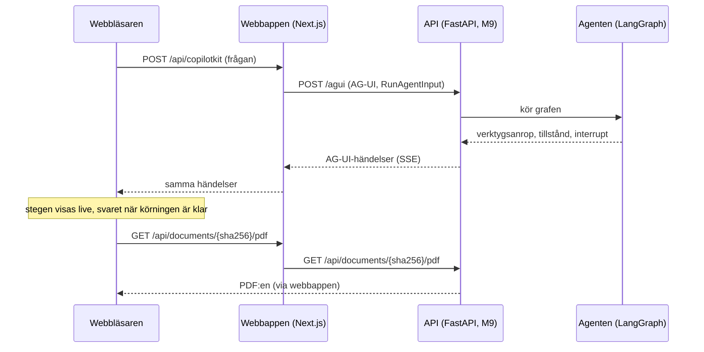

# M10 – Webbappen

**Mål:** en webbsida där man ställer en fråga om ramavtalen och ser hur agenten arbetar: vilka
verktyg den anropar, svaret med källhänvisningar och, med ett klick på en källa, PDF:en på rätt
sida med citatet markerat. När agenten behöver veta mer frågar den i en dialog.

**Klart när:** hela flödet fungerar i webbläsaren, inklusive en fråga som kräver förtydligande.

> **Läge (2026-10-06):** byggd och testad mot en mock av agenten, som skickar samma händelser som
> den riktiga agenten ska skicka. Mot den riktiga agenten fungerar den när API:t (M9) svarar enligt
> kontraktet nedan. Webbappen byggdes i en egen tråd, parallellt med backend.

## Vad du ser

| Del | Vad den visar |
|---|---|
| Chatten | Frågorna och svaren. Innan första frågan finns tre exempelfrågor att klicka på. |
| Agentens steg | Ett kort per verktygsanrop, live medan agenten arbetar: "Söker i dokumenten" blir "Sökte i dokumenten" när verktyget har svarat. Kortet visar huvudargumentet ("uppsägningstid") och de andra argumenten med svenska namn. Verktygets svar går att fälla ut. |
| Svarskortet | Status (**Verifierat**, **Med reservation** eller **Inget svar**), svarstexten där `[1]` och `[2]` är knappar, och en lista med källorna: dokument, avsnitt, sida och citat. Ett citat som inte kunde kontrolleras mot avtalstexten får en varning. |
| Källpanelen | Öppnas till höger när man klickar på en källa. PDF:en visas på den citerade sidan och citatet är markerat i gult. Om citatet inte finns på sidan står det i panelen. |
| Frågedialogen | När agenten anropar `ask_user` öppnas en dialog med frågan och svarsalternativen som knappar. Man kan också skriva ett eget svar. Agenten fortsätter med svaret. |

## Flödet



Webbläsaren pratar bara med webbappen. Webbappens server skickar vidare till API:t, både
agentens körningar och PDF:erna. Det ger tre saker:

- API:t behöver inte vara åtkomligt från webbläsaren och behöver ingen CORS-inställning.
- API:ts adress (`API_URL`) läses av servern när den kör, inte när appen byggs. Samma image
  fungerar mot mocken, på din dator och i Docker Compose.
- CopilotKits runtime ligger mellan webbläsaren och agenten. Den kopplar webbläsaren till rätt
  agent och kan senare ta emot fler agenter utan att webbläsarens kod ändras.

## Kontraktet med backend

Kontraktet ägs av tråden som bygger backend
(`case-tokentek/implementering/webbapp-kontrakt.md` i projektets filer). Webbappen läser det så här:

- **Händelserna** är AG-UI 1.0, som `ag-ui-langgraph` skickar dem: `RUN_STARTED`, `STEP_STARTED`
  per nod, `TOOL_CALL_START`, `TOOL_CALL_ARGS`, `TOOL_CALL_END` och `TOOL_CALL_RESULT` per
  verktygsanrop, `STATE_SNAPSHOT`, `MESSAGES_SNAPSHOT` och `RUN_FINISHED`.
- **Svaret** läses ur det delade tillståndets nyckel `answer` när körningen är klar. Det kontrolleras
  mot schemat i `src/lib/contract.ts`. Ett svar som inte följer schemat visas som ett fel som säger
  vilket fält som är fel, till exempel `citations.0.page`.
- **Frågan till användaren** kan komma i två former, och webbappen klarar båda:
  - AG-UI:s standardform, där `RUN_FINISHED` har `outcome: {type: "interrupt", interrupts: [...]}`
    och värdet `{question, options}` ligger i `metadata.langgraph.raw`;
  - den äldre formen, en `CUSTOM`-händelse `on_interrupt` vars värde är `{question, options}` som
    JSON-text. Det är vad `ag-ui-langgraph` skickar om inget annat anges.
- **Svaret på frågan** skickas tillbaka som en vanlig sträng, alternativet eller det man skrev.
- **PDF:en** hämtas från `GET /api/documents/{sha256}/pdf`.

Förslag på förtydliganden har skickats till backend-tråden, se [Förslag till backend](#förslag-till-backend).

## Vad som byggdes, fil för fil

Allt ligger i `web/`. Kod och identifierare är på engelska, texten i gränssnittet på svenska.

### 1. `src/lib/contract.ts` – kontraktet som scheman

Zod-scheman för svaret och för frågan till användaren, och två rena funktioner. `parseAnswer`
läser `answer` ur tillståndet och ger "inget svar än", ett svar eller ett fel med fältets sökväg.
`parseAskUser` provar de två formerna av interrupt i tur och ordning och ger `null` om ingen passar,
så att webbappen inte öppnar dialogen för en interrupt som inte är `ask_user`.

### 2. `src/lib/tools.ts` – svenska namn på verktygen

En tabell med två etiketter per verktyg (pågår och klart), svenska namn på argumenten och vilket
argument som är huvudsaken för varje verktyg. `describeToolCall` gör ett verktygsanrop till rubrik,
huvudargument och övriga argument. SHA-256 kortas till åtta tecken. Ett verktyg eller argument som
inte finns i tabellen visas med sitt eget namn, så ett nytt verktyg i backend syns direkt.

### 3. `src/lib/answerText.ts` – källhänvisningarna i texten

Delar svarstexten i textbitar och hänvisningar. `[1]` och `[1, 2]` blir hänvisningar om källan
finns i svaret. En hänvisning till en källa som saknas lämnas som text i stället för att bli en
trasig knapp.

### 4. `src/lib/highlight.ts` – hitta citatet på sidan

Det svåraste i webbappen. PDF.js delar en sida i många små textbitar, ofta en per rad, och ett
citat sträcker sig oftast över flera. Därför:

1. Alla bitar på sidan slås ihop till en lång text där varje tecken minns vilken bit och vilken
   position det kom från.
2. Både sidans text och citatet normaliseras: blanksteg tas bort, olika bindestreck och
   citattecken görs lika, ligaturer som `fi` skrivs ut och mjuka bindestreck försvinner. Agentens
   citat och PDF:ens text skiljer sig ofta just där.
3. Citatet söks i den normaliserade texten. Hittas det inte görs ett nytt försök där bindestreck i
   slutet av en rad tas bort (`upp-` + `sägning`).
4. Hittas det fortfarande inte markeras den längsta början eller det längsta slutet av citatet som
   finns på sidan, minst 24 tecken. Ett citat kan fortsätta på nästa sida. Panelen säger då att bara
   en del av citatet finns på sidan.
5. Positionerna räknas tillbaka till textbitarna, och `markItem` gör varje bit till HTML med
   `<mark>` runt de träffade tecknen.

### 5. `src/lib/answerAnchors.ts` – var svarskortet hamnar

Varje fråga får sitt svarskort efter det sista meddelandet som hör till frågan, alltså före nästa
fråga. Funktionen räknar ut det från meddelandelistan, så korten hamnar rätt även när en fråga
pausats av en dialog och fortsatt i en ny körning.

### 6. `src/app/api/copilotkit/[[...slug]]/route.ts` – vägen till agenten

CopilotKits runtime (v2-API:t) i en route i Next.js. Den har en agent, `avtalsagent`, som är en
`HttpAgent` mot `${API_URL}/agui`. Adressen läses i `src/lib/backend.ts`, som bara kan importeras på
servern.

### 7. `src/app/api/documents/[sha256]/pdf/route.ts` – PDF:en

Kontrollerar att `sha256` är 64 hexadecimala tecken, hämtar filen från API:t och strömmar den
vidare. Om API:t inte svarar blir det `502`, och en fil som saknas blir `404`.

### 8. `src/components/` – gränssnittet

| Fil | Del |
|---|---|
| `AgentApp.tsx` | Sidan: CopilotKit, rubriken, chatten och källpanelen bredvid varandra (under varandra på smala skärmar). |
| `Chat.tsx` | CopilotKits chatt med svenska texter, exempelfrågorna och `useRenderTool` som ritar varje verktygsanrop som ett steg. |
| `AgentSteps.tsx` | Ett steg: etikett, argument, en snurra medan verktyget arbetar och verktygets svar. |
| `Answers.tsx` | Sparar varje frågas svar när körningen är klar och placerar svarskortet i chatten. |
| `AnswerCard.tsx` | Svarskortet: status, text med hänvisningar och källistan. |
| `SourcePanel.tsx` | Källpanelen: källans uppgifter, citatet och PDF:en. |
| `PdfViewer.tsx` | PDF:en med `react-pdf` (PDF.js). Sidan ritas med sitt textlager, citatet markeras och panelen rullar till markeringen. |
| `ClarifyDialog.tsx` | Frågedialogen, med `useInterrupt`. Den kan inte stängas utan svar, eftersom agenten väntar på det. |
| `SourceContext.tsx` | Låter en hänvisning i ett svarskort öppna källpanelen. |

### 9. `mock/` – en låtsasagent

En liten server (`mock/server.ts`) med samma adresser som API:t: `POST /agui` och
`GET /api/documents/{sha256}/pdf`. Den svarar med skriptade körningar (`mock/scenarios.ts`) i
samma ordning som `ag-ui-langgraph` skickar händelserna:

| Fråga som innehåller | Vad mocken gör |
|---|---|
| uppsägning och ett område (IT-drift, Programvaror, Bemanningstjänster) | Söker, läser avsnittet och svarar **Verifierat** med två källor. |
| uppsägning utan område | Söker i registret och frågar vilket ramavtalsområde som menas. Fortsätter sedan med svaret. Med `[legacy]` i frågan kommer frågan i den äldre formen. |
| vite | Svarar **Med reservation**. Den andra källans citat finns inte i PDF:en. |
| allt annat | Svarar **Inget svar**. |

PDF:en som mocken citerar skapas av `mock/fixture-pdf.ts`. Den är påhittad, säger på varje sida att
den inte är ett avtal från avropa.se, och har alltid samma SHA-256. Inga dokument från avropa.se
finns i repot.

### 10. Docker

`web/Dockerfile` har fyra steg. `deps` installerar paketen, `build` bygger Next.js till en server
utan `node_modules` (`output: "standalone"`) och `runner` är den image som körs (480 MB). `mock` är
en egen liten image för mocken, med bara de tre paket den behöver. Node-imagen finns för både
`linux/arm64` och `linux/amd64`, så samma fil fungerar på en Mac med M1 eller M2 och i CI.

- `web/compose.mock.yaml` startar mocken och webbappen tillsammans.
- `docker-compose.yml` i roten har en tjänst `web` som pekar på `http://api:8000`. Tjänsten `api`
  läggs till med API:t.

### 11. CI

Två nya jobb i `.github/workflows/ci.yml`:

- `web` kör formatering, lint, typkontroll, enhetstesterna, bygget och webbläsartesterna.
- `web-docker` bygger båda imagarna med `compose.mock.yaml` och kör webbläsartesterna mot
  containrarna, så som demot körs.

## Medvetna val

- **CopilotKits v2-API** (`@copilotkit/react-core/v2`, version 1.77). Det är byggt direkt på AG-UI.
  v1-API:t finns kvar för äldre appar.
- **Svaret ritas av webbappen, inte av CopilotKit.** CopilotKit kan rita tillståndet i chatten, men
  i våra tester med version 1.77 knöt den ibland samma tillstånd till flera körningar, så
  svarskortet visades flera gånger. Webbappen sparar i stället svaret när körningen är klar (`onRunFinalized`) och bestämmer
  själv var kortet hamnar.
- **PDF.js äldre bygge (`legacy`).** PDF.js 6 använder nya JavaScript-funktioner som inte alla
  webbläsare har ännu. Chromium 141, som testerna kör, saknar `Map.getOrInsertComputed`. Det
  äldre bygget har ersättningar för dem.
- **Mocken är TypeScript som Node kör direkt.** Node 22.18 och senare tar bort typerna när filen
  laddas, så mocken behöver inget byggsteg. Samma sak gäller enhetstesterna, som körs med Nodes
  egen testkörare i stället för ett testramverk.
- **Exakta versioner** av alla paket i `package.json`, och `package-lock.json` i repot, så att alla
  bygger samma sak.
- **Svaren sparas bara i webbläsaren.** Laddar man om sidan är tidigare frågor borta. Det räcker
  för demot. Att spara trådar kräver lagring i backend.

## Förslag till backend

Det här behöver backend för att webbappen ska fungera fullt ut. Förslagen är skickade till
backend-tråden via koordinatorn.

1. Skapa agenten med `LangGraphAgent(..., emit_interrupt_outcome=True)` så att frågan till
   användaren kommer i AG-UI:s standardform. Den äldre formen fungerar också.
2. Lägg det slutliga svaret bara i tillståndets `answer`. Strömma inte JSON-svaret som ett
   chattmeddelande (metadata `emit-messages: False` på det modellanropet), annars syns rå JSON i
   chatten.
3. Sätt `answer` till `null` i början av varje ny fråga, så att ett gammalt svar inte visas för en
   ny fråga.
4. Ta emot svaret på `ask_user` som en vanlig sträng.
5. Argumentnamnen i `src/lib/tools.ts` (`query`, `agreement_number`, `framework_area`, `sha256`,
   `section_number`, `reference`) är gissningar tills verktygen finns. Andra namn visas ändå, men
   utan svensk etikett.
6. Webbappen läser `API_URL` (standard `http://localhost:8000`, i Docker Compose
   `http://api:8000`). När tjänsten `api` finns i `docker-compose.yml` bör `web` få
   `depends_on: api`.
7. CopilotKit skickar hela meddelandehistoriken i varje körning. Agenten kan använda den eller sina
   egna checkpoints.

## Tester

| Var | Vad | Antal |
|---|---|---|
| `src/lib/*.test.ts` | Kontraktet, verktygens etiketter, hänvisningarna i texten, var korten hamnar och markeringen av citat (radbrytningar, bindestreck, ligaturer, delvis träff) | 27 |
| `mock/scenarios.test.ts` | Mockens händelser: ordningen, att varje verifierat citat finns på sin sida i test-PDF:en, båda formerna av interrupt och båda sätten att svara | 6 |
| `e2e/app.spec.ts` | Hela flödet i Chromium mot mocken: exempelfråga, steg, svarskort, källpanel med markerat citat över två rader, dialogen i båda formerna, eget svar, reservation och flera frågor efter varandra | 7 |

## Så verifierar du M10 själv

Med Docker, utan Node på datorn:

```bash
docker compose -f web/compose.mock.yaml up --build
```

Öppna http://localhost:3000 och prova:

1. Klicka på exempelfrågan **Uppsägning i IT-drift**. Två steg visas, sedan ett verifierat svar.
   Klicka på `[1]` och se citatet markerat på sidan 2 i PDF:en.
2. Skriv *Vilken uppsägningstid gäller för ett kontrakt?* Dialogen frågar vilket område som menas.
   Välj ett, eller skriv ett eget svar.
3. Skriv *Vilket vite gäller vid försenad leverans?* Svaret har reservation, och källa 2 hittas
   inte i PDF:en.

Med Node 22.18 eller senare:

```bash
cd web
npm ci
npm run mock      # mocken på port 8000, i ett eget fönster
npm run dev       # webbappen på http://localhost:3000
```

Testerna:

```bash
cd web
npm test                                   # enhetstester
npm run build && npm run test:e2e          # webbläsartester (npx playwright install chromium första gången)
```
